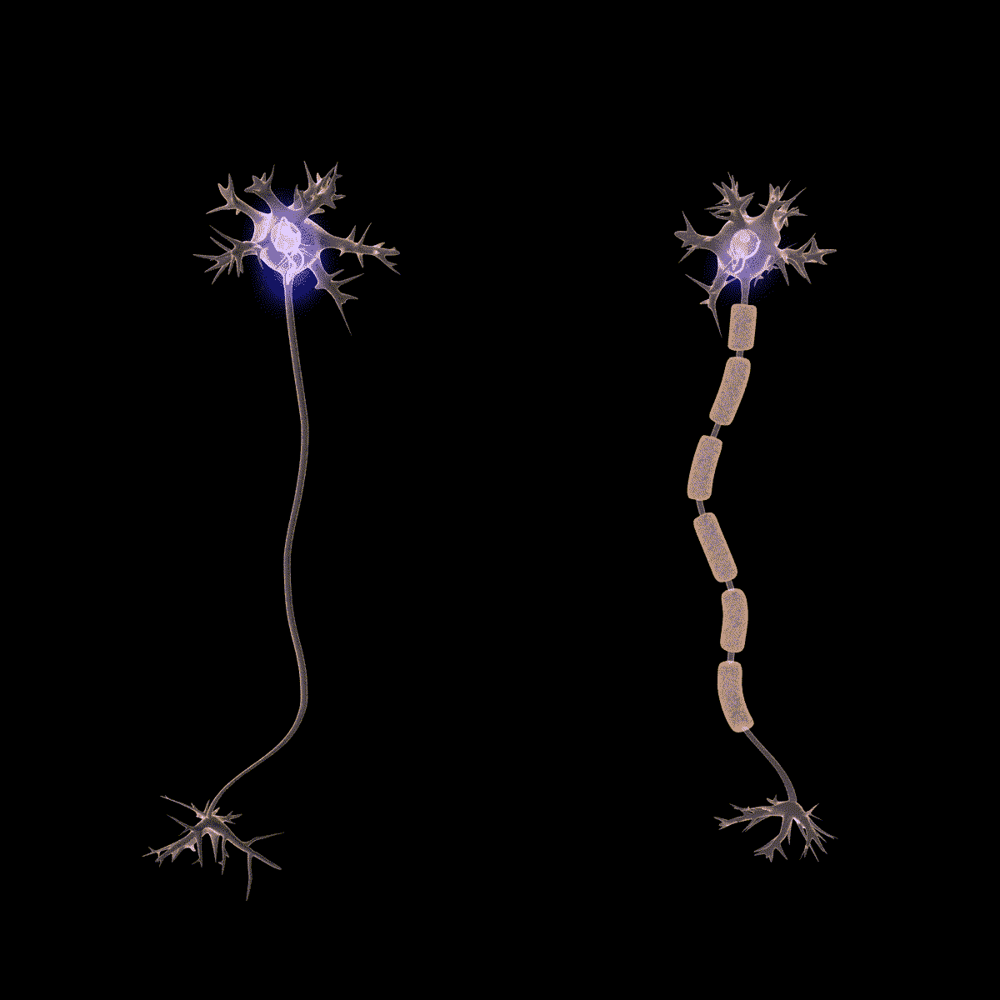
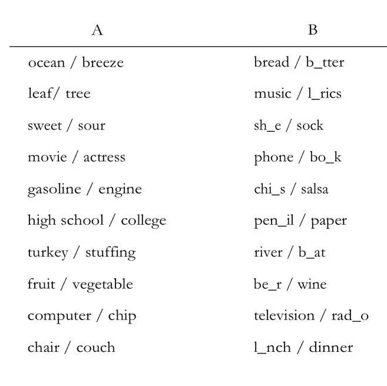

# 天才法则:伟大不是天生的。它长大了，这是怎么回事

> 原文：<https://medium.com/swlh/the-talent-code-greatness-isnt-born-it-s-grown-and-here-s-how-86a8dd67d81e>

Talent by [obsidianphotography](http://obsidianphotography) at [Pixabay](https://pixabay.com)

存在一个加速学习区，在这里你学得非常快，并且能记住更多。像莫扎特、达芬奇等神童。我们只是幸运地知道如何有意识地进入那个区域。换句话说，他们已经破解了天赋密码。在这篇文章中，我将与你分享这个改变人生的秘密。

# 您将学到的内容:

*   什么是真正的天才，它是如何成长的？
*   如何通过深度练习快速获得人才？
*   你如何创造推动你前进的动力。
*   一种[的新心态](https://livelikepros.com/mindset-the-new-psychology-of-success/)，它真的改变了你，让你相信如果这是人类力所能及的，那也是你力所能及的。

在无意中发现《T4 天赋代码》这本书之前，我相信天赋一直是成功和非凡成就的主要因素。从那个做出准确快速判断的果断而聪明的领导者，到那些在 10 秒钟内解开魔方的孩子，我总是想，天哪，他们真幸运，这么有天赋。但我错了，大错特错。

以这种方式来看待技能和成就是非常有限的，甚至阻止我们去尝试。

幸运的是，我读了这本神奇的书，它揭穿了许多关于天赋和成就的危险和自我限制的神话。

# 什么是真正的天赋？

正如科学家发现的那样，我们所说的天赋涉及一种叫做髓磷脂的神经绝缘体，现在被认为是培养技能的圣杯。

从最简单的技能，如抛硬币、骑自行车，到复杂的技能，如编程、证明数学公式、弹钢琴等。每一项人类技能都涉及携带微小电脉冲的神经纤维链和神经回路。

简而言之，每项技能都涉及到信号在特定的神经元回路中的传播。

髓鞘的关键作用是包裹那些神经纤维和电路。想象一下橡胶缠绕在铜线上的样子。

髓鞘包裹在这些纤维周围的越多，这些微小的信号在电路中传播的就越快、越强。因此，你会更快更好地完成任务。

此外，纤维的髓鞘形成和绝缘通过防止电信号泄漏出来使你更加准确。

Fig -1 Action potential travels much faster in a myelinated neuron (the right one) than unmyelinated neurons (the left one) — [Wikipedia](https://en.wikipedia.org/wiki/Myelin)

# 但是这些髓磷脂是如何产生的呢？

如果更多的髓鞘形成意味着变得更快、更好和更准确，你肯定会想知道它是如何产生的，以及我们如何影响它。

首先，我们来看看它是如何创建的。

想象你想试着挥动球棒或弹奏一个音符；如果你做得正确，你的大脑会通过将髓磷脂包裹在相关回路(成功导致你想要的结果的回路)周围来做出反应。

每次你重复这项任务，都会有一层薄薄的梅林增加到相关的回路中，让你变得更快更好。

有几个关键事实使 mayelin 变得重要:

*   这是普遍现象:每个人都可以在一生中种植它。
*   它是不分青红皂白的:它的成长允许各种技能，精神的或身体的。
*   最重要的是，现在你知道髓磷脂是什么，它是如何产生的，你将经历一个关于技能和天赋的思维的彻底转变。(这正是我的遭遇。)
*   所有技能的获得，以及所有天赋的温床，都在同样的原则下运作，不管它们看起来多么神奇。

虽然每个人都可以生长髓磷脂，但练习有一定的规则，这使得它的生长速度更快。你看到的那些神童(从米开朗基罗到迈克尔·乔丹)在练习时都遵循着那些特定的规则。

**其实成功还是平庸，最取决于你练习的方式，而不是已经内置的脑力。**

# 如何通过遵循深度练习规则来更快地培养技能

> 你会从错误中变得聪明

学习深度实践的最好方法是通过一个真实的例子。然后你会亲眼看到你练习的方式有多重要。

花几秒钟看 a 列，然后花同样的时间看 b 列。

Fig — 2 Deep practice in action

现在不看表，尽可能多的记住几对。

你能从哪一栏回忆起更多的单词？

如果你和大多数人一样，那就差远了。你会从 B 栏比 a 栏记得更多。

科学家测量过，平均来说，你会从 b 列多保留 300%。

当你看着 b 列时，你的智商并没有提高。但是，当你看着它的片段和空白时，你的大脑中发生了一些深刻的事情:

*   你会短暂地跌倒
*   你自己想办法
*   你经历了微妙的挣扎

正是这些微妙的斗争造就了所有的不同。你没有把*练得更硬*，你把*练得更深*。

从本质上来说，那些你被迫放慢速度、犯错误并改正它们的练习，最终会让你变得敏捷优雅，而你甚至都没有意识到。

正如罗伯特·比约克(这个例子的创造者)所说:

> 我们认为毫不费力的表现是可取的，但这真的是一种可怕的学习方式。

现在是深度练习的三大法则。

# 规则 1:分块

在成长的过程中，我们听过无数次:“走一步算一步”。这种简单而直观的技巧对深度练习至关重要，但这还不是全部。

组块本身包括三个步骤:

**首先**，一定要整体看任务。例如，如果你想学习用钢琴演奏一段旋律，你必须用心去听它，去感受它的整体声音。或者你想学习乒乓球的反手，你必须首先在动作中看到并吸收这个动作。这一大块是你最终想要建造的巨型电路。

**第二个**，你必须把它分成它的最小分量。在梅多蒙特音乐学院，孩子们在短短七周内学会一年的知识是出了名的。[学习速度提高了 5 倍](https://livelikepros.com/make-it-stick-the-science-of-successful-learning/)。

梅多蒙特的老师们将组块的理念发挥到了极致。

学生将乐谱的每一小节剪成横条，放入信封，随机取出一条。此外，他们通过改变节奏将这些旅行分成更小的片段。这样，他们就专注于一个子电路。

**第三个**，慢下来:你必须放慢动作，和时间玩。放慢速度，然后加快速度，去了解它的内部结构。

根据经验，在梅多蒙特，老师们说:如果一个过路人能认出正在演奏的歌曲，那就是没有正确地练习。

## 为什么慢下来会有效果？

有两个原因:

放慢速度可以让你更关注错误，打造更高的精确度。说到髓磷脂，精确就是一切。

慢慢来有助于你对技能的内部蓝图和架构有更深的理解。

# 规则 2:重复

> 重复是技能之母。—托尼·罗宾斯

从生物学上来说，没有什么可以替代专注的重复。它是无价的，不可替代的。不过，有一些注意事项。

传统的想法可能会认为:越多越好:每天打 200 个正手拍被认为是每天打 100 个正手拍的两倍。

深练，不守同数。

根据爱立信的研究(提出 10000 小时法则理论的那个)，任何领域的世界级专家(钢琴家、棋手等。)每天练习三到五个小时。

深度练习往往会让你在几个小时后筋疲力尽。

# 规则 3:学会感受它

这里的要点是找到一个平衡点，当错误出现时，你可以感觉到它。为了避免错误，首先，你必须立即感觉到它们。

这是[深度学习](https://livelikepros.com/make-it-stick-the-science-of-successful-learning/)的关键阶段。获得反馈，并纠正课程。

到目前为止，我们已经了解了深度练习。但是，深度练习不是小菜一碟。你可能已经注意到了，这需要大量的精神能量，这本身就很痛苦。

换句话说，深度练习往往需要背后有另一种驱动力。你猜对了！是动力和热情。

激励是人才准则的第二个要素。在下一节中，我们将通过一个叫做“点燃”的过程来学习如何创造和保持动机。

# 点火:通过激励推动深度实践

> 世界编年史上每一个伟大而威严的时刻都是某种热情的胜利。——拉尔夫·瓦尔多·爱默生

点火提供能量，而深度练习随着时间的推移将能量转化为进步，也就是髓鞘的包裹。

虽然深度练习都是关于婴儿步，点火是关于创造我们身份的一系列信号和潜意识力量。那些让我们说这就是我想要成为的人的时刻。

如果你已经喜欢上了一项特殊技能(音乐、运动、编程等等)。)，你可以采取一些具体的步骤来为你提供所需的燃料。

一些想法来自我写这篇评论的天才书籍。但是我也从诸如罗伯特·格林的《掌握》和爱立信的《选择》等书中学到了其他一些技巧。

因此，让我们检查一些有效的技术

**1。曝光:**一个有效的方法是不断与你崇拜的人物接触。例如，如果你渴望成为一名钢琴家，你必须让自己周围充满这一领域的天才。

不断聆听他们的杰作，让热情在你内心滋长。

阅读他们的传记，观看他们的表演，拥抱你内心迸发的激情。

安装不断提醒你理想自我的提示。这种技巧非常关键，因为它能让激情之火持续燃烧。

**2。** **可视化**:第二个强大的技术是用你心灵的眼睛旅行到未来，在挑选表演时看到你自己。想象你理想中未来的自己。

**3。** **加速周期回报:**罗伯特·格林(Robert Greene)在他的著作《掌握》(mastery)中阐述了加速周期回报的概念。

它指出，通过保持练习和专注练习，你的大脑会达到一种叫做“加速循环回归”的状态。

在这种状态下，你不仅不会把练习视为负担，还会一直渴望回去工作，继续培养你的技能，无论是数学、演奏乐器等等。

因此，如果最初你只是喜欢一个主题，并寻求巨大的动力去达到更高的水平，那么继续用心练习，并记住你最终会达到这个神圣的加速循环回报。

# 摘要

天赋仅仅是神经元的髓鞘形成。

做深度练习可以让髓鞘长得更快。

深度练习有三个规则:

1.  组块
2.  重复
3.  放慢速度

深度练习对精神要求很高，除非我们没有激情和动力，否则我们的大脑不会喜欢它。

为了激发动力，你必须:

*   不断地让自己接触那些激励你的人物，你会钦佩他们。
*   想象你未来的理想自我。
*   专注地练习，直到你达到加速循环返回。

我希望你喜欢这篇评论。请在评论中分享你的想法。我很想知道你是否知道帮助你学得更快的技巧。

另外，我想知道你会在哪些领域使用深度练习技术？与我分享。

*最初发表于*[*【livelikepros.com】*](https://livelikepros.com/the-talent-code-greatness-isnt-born-its-grown-and-heres-how/)*。*

## 这篇文章发表在 [The Startup](https://medium.com/swlh) 上，这是 Medium 最大的创业刊物，拥有+397，714 名读者。

## 在这里订阅接收[我们的头条新闻](http://growthsupply.com/the-startup-newsletter/)。

