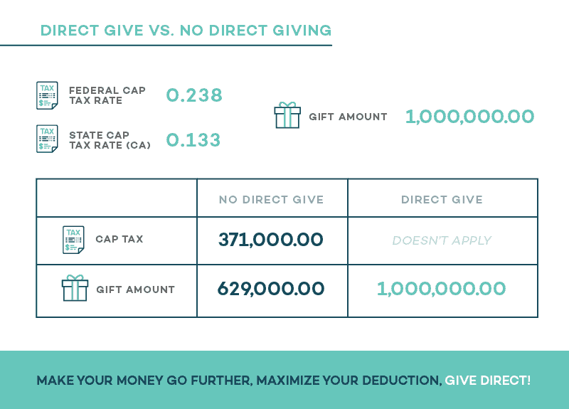

# 直接捐赠加密货币的税收优惠

> 原文：<https://medium.com/swlh/the-tax-benefits-of-donating-cryptocurrency-directly-539d51eaa70>

过去几年，加密货币激增，尽管这是一件好事，但个人不能忘记纳税的义务。纳税遵从非常重要，不遵从可能会导致[巨额罚款](https://www.irs.gov/newsroom/irs-reminds-taxpayers-to-report-virtual-currency-transactions)，例如 25 万美元的罚款和最高 5 年的联邦监禁。正如本杰明·富兰克林(Benjamin Franklin)的名言:“在这个世界上，没有什么可以说是确定的，除了死亡和税收。”

对于那些更无私的人来说，向慈善机构捐款可以让你支持你最喜欢的事业，同时支付你的一些税务负担。在出售您的加密货币之前，务必与您的接收组织联系，看他们是否直接接受加密货币。直接接受加密货币的能力是巨大的，因为美国国税局已经[裁定](https://www.irs.gov/pub/irs-drop/n-14-21.pdf)(在 2014-21 年的通知中)虚拟货币被视为财产——类似于你的房子、汽车或钻石。我们在出售加密货币并盈利的任何时候都要纳税。同样重要的是要记住，为了有资格获得长期资本利得待遇，硬币必须持有至少一年，因为如果你捐赠持有短期(少于一年)的硬币，你的扣除额可能会大大降低。

作为财产，加密货币现在对你的税收减免和接收你的资金的慈善机构有两个重要的潜在好处:

*   您的加密捐赠将在捐赠时按照捐赠的加密货币的公平市场价值进行估价。对于低于 5000 美元的金额，从 [CoinMarketCap](https://coinmarketcap.com/) 中提取平均利率可能是合适的；但是，对于超过 5000 美元的金额，需要由[认证评估师](http://charitablesolutionsllc.com/)进行评估。
*   从慈善机构的角度来看，你的捐赠会更大，因为慈善机构可以获得全部捐赠，而不是支付资本利得税。由于慈善机构是 501(c)(3)，因此**可能**免税(一些私人基金会的资本利得税为 1%或 2%)，他们出售你捐赠的加密货币是不征税的。

这为捐赠者和慈善机构带来了双赢的局面。一方面，捐赠者获得了更大的税收优惠，因为捐赠的全部 FMV 可以被扣除，他们不必担心他们的代币的清算。另一方面，慈善机构会收到全部的加密货币，并最终收到一份更大的礼物。

给予加密货币之所以会产生如此巨大的好处，是因为美国国税局将任何加密货币交易视为两个独立的交易:出售和购买交易。例如，如果我们使用加密货币购买任何服务或产品，那么 IRS 会将该交易视为出售加密货币，然后购买另一项资产，这可能是一杯咖啡或不同的加密货币。正是这个事实使得直接捐赠如此强大。由于 501(c)(3)组织是免税的，在大多数情况下，当非营利组织出售您捐赠的加密货币时，不需要缴纳资本利得税。

直接给予加密货币有可能产生显著的税收优惠；然而，大多数慈善机构往往没有这个选项。大多数组织不具备专业知识和基础设施来接受市场上的各种硬币。

*作为免责声明，美国税法尚未更新以反映加密货币市场的现状。进一步的指导有望很快公布。上述规则和解释旨在作为一般指导，不应被解释为税务建议。具体情况请咨询您的税务顾问。*

如需了解更多信息，请访问 [spring.wetrust.io](http://spring.wetrust.io)

## 这篇文章发表在[《创业](https://medium.com/swlh)》上，这是 Medium 最大的创业刊物，有+ 370，437 人关注。

## 在这里订阅接收[我们的头条新闻](http://growthsupply.com/the-startup-newsletter/)。

