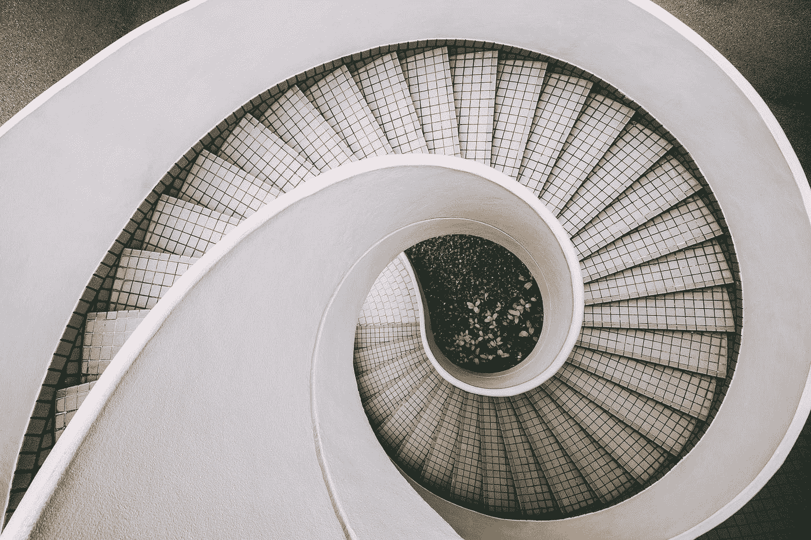

# 阻止你赚一百万美元的原因

> 原文：<https://medium.com/swlh/the-thing-thats-stopping-you-from-making-a-million-dollars-d71824e710d3>

Photo by [Dan Freeman](https://unsplash.com/@danfreemanphoto?utm_source=medium&utm_medium=referral) on [Unsplash](https://unsplash.com?utm_source=medium&utm_medium=referral)

## 停止假设，开始尝试

"你为什么一直认为事情不会有结果？"我妻子问。

“那是我的天性。我总是为最坏的事情做准备。至少当它不成功时，我不会感到惊讶。”我说。

“但如果真的发生了呢？这种对事情失败的持续假设有其缺点，我们无法前进。我们整天理论，却不采取行动。我们试图找到完美的路径，却以决策疲劳而告终。停止假设，让我们开始尝试。”

这对我打击很大。我是一个修补匠，我可以整天思考一个完美的解决方案。那是我的强项，也是我的弱项。

这就是像我这样的 INTJs 的氪星。我们被描述为建筑师，他们可以创造完美的蓝图，但不能执行我们的想法。很高兴我有我的妻子，当我飞得很高的时候，她让我回到现实。

我把事情往最坏的方面想。如果这样不行呢？如果他们拒绝我们的申请怎么办？如果这次没有成功呢？

我哪来的这种想法？

我能想到的最接近的人是马可·奥勒留，他在日记中写道。

> 从告诉自己开始每一天:今天我将遇到干涉、忘恩负义、傲慢、不忠、恶意和自私。

上面的引用是不完整的。你可能认为马库斯是一个脾气暴躁的老人，对别人没有耐心。但他恰恰相反。

他以皇帝的身份统治罗马，并作为最后的好皇帝之一被人们铭记。他被公认为斯多葛派的核心哲学家之一。他的作品激励了数百万人以一种坚忍的方式生活。

这是引用的延续。

> 所有这些都是由于犯罪者对善恶的无知。但就我而言，我早就察觉到善的本质及其高贵，恶的本质及其卑鄙，以及罪犯本人的本质，他是我的兄弟(不是在物理意义上，而是作为一个同样被赋予理性和神圣的一部分的生物)；
> 
> 因此，这些东西都不能伤害我，因为没有人能把我牵连到什么有辱人格的事情中去。我不能生我兄弟的气，也不能和他发生冲突；因为我和他生来就是一起工作的，就像一个人的两只手，脚或眼皮，或上下两排牙齿。
> 
> 互相阻碍是违反自然法则的——而恼怒或厌恶不过是阻碍的一种形式。

想想我们生活中或创业中可能发生的最糟糕的事情是正常的。一个不能按照我们的标准生产我们产品的制造商。一名虚拟助理在一周的繁忙工作中中途辞职，一周内有成千上万的订单。到达亚马逊仓库时已经损坏的产品。

墨菲定律。

任何可能出错的事情都会出错。

但这并不是故事的全部。这是开始。当你遇到问题或障碍时，你会怎么做？你克服了它。你与它搏斗，你赢得了战斗。

我对我的商业冒险持悲观态度。我想到了我的冒险会失败的所有原因，是的，它们有它们的优点。我可以努力让我的产品或服务不被愚弄。

你也这样吗？你总是在想可能发生的最坏的事情吗？它可能在过去对我们很有用，但我们需要面对它的远亲——乐观主义。

我们需要开始扪心自问。

## 这将如何工作？

无论是关于生活还是商业，这个问题都采取了积极主动的态度。

当我没有以前的制造经验时，我如何建立一个亚马逊业务？不知道怎么健身，不知道怎么做饭，怎么减肥？如何在环游世界的同时赚钱？

与乐观主义相比，悲观主义是一条更容易走的路。所以要花更多的精力去思考如何让事情运转起来。这将帮助你采取行动，而不是几个月来修修补补。

停止假设可能发生的最糟糕的事情，开始尝试寻找如何让它发生的方法。

回头见，我的朋友。

## 这个故事发表在[的创业](https://medium.com/swlh)上，这是 Medium 最大的创业刊物，拥有 335，210 多名读者。

## 订阅接收[我们的头条新闻](http://growthsupply.com/the-startup-newsletter/)。

