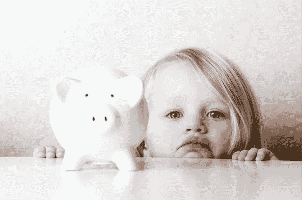

# 我在创业中浪费金钱的事情以及我从中学到的东西

> 原文：<https://medium.com/swlh/the-things-ive-wasted-money-on-in-my-startup-and-what-i-learned-from-them-a430852fd486>

From [mirror.co.uk](https://www.mirror.co.uk/money/find-lost-child-trust-fund-5385355)

在回顾我公司的财务状况时，我很痛心地看到我花钱买的东西从来没有用过，或者根本没有回报。它们包括:

*   测试协议
*   保密协议
*   糟糕的雇佣
*   没有结果的事件/旅行