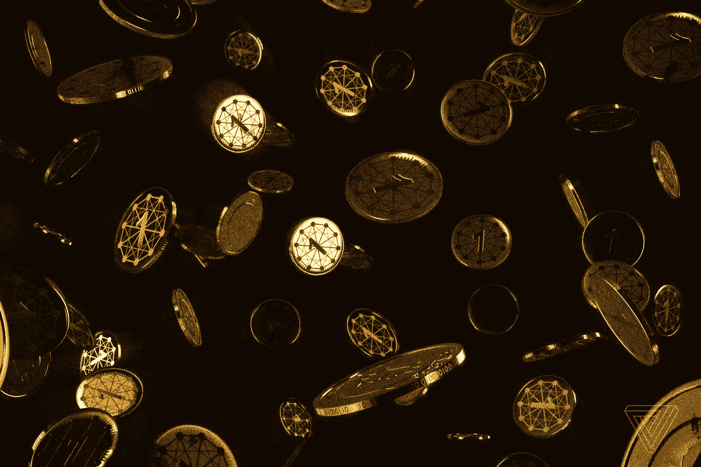

# 第三次比特币浪潮

> 原文：<https://medium.com/swlh/the-third-bitcoin-wave-24102f24143>

和斯卡曲风一样，所有酷小孩都听了[**【Op Ivy】**](https://www.youtube.com/watch?v=-ey6upK4OSg)，所有的呆子都在争论哪一波更好。

简而言之，如果你从比特币中赚了钱，你就赚了钱。但是，如果你仍然完全投资，你是霍德勒，而不是兰博 cryponaire。那笔钱还不是真的。

下面是关于比特币和所有其他加密货币的真相。如果任何一个成功了，只要总供应量保持在低位，它就会变得*无比*有价值**。如果任何一个失败了，你的投资就会变得微不足道，或者更糟，变成债务(取决于你如何为你的购买融资)。)**

这个想法很重要。我可以告诉你这是真的(因为这个世界是复杂的)。)从 1+1 是数学的基本解释这个意义上来说，它是基本的。你必须从投资的基本理念出发，才能理解这个主题的深层含义。

**比特币出现了三个严肃的投资点**:

在第一波浪潮中，比特币和市场上的其他替代货币一样不值钱。

第二波是在比特币价值超过 1000 美元后，随后暴跌至远低于这一价值。

第三波，也就是现在。第三波是我的朋友和家人问我为什么不卖掉我的大量比特币储备来支付大学债务。

> 旁注:我并不拥有比特币，但我理解比特币的基本理念，这一事实让普通人的目光转向了美元符号。

在第三波浪潮中，人们可以告诉我谁在投资，他们赚了多少钱，但永远不要告诉我 T21 为什么投资。

第三次浪潮是那些不理解他们所投资的想法的基本原理的人，他们仍然愿意为了 5-10 倍的投资回报率而投入数千美元。

[比特币不像其他货币或投资那样受到严格监管](https://en.wikipedia.org/wiki/Legality_of_bitcoin_by_country_or_territory#North_America)。市场上充斥着骗局。如果监管政府不承认加密货币是一种有价值的资产，那么建立 ico 然后立即倒闭的公司没有什么影响。这个骗局是政府在 2017 年才开始补上的。嘿，如果你最喜欢的密码受到管制，只需在更新的密码上运行 ICO 骗局。

你可以毫不夸张地说[任何你想说的事情](https://cointelegraph.com/news/keiser-envisions-100000-bitcoin-high)而不用担心监管打击，比如那些发生在[的泵送和倾倒诈骗](https://www.investopedia.com/ask/answers/05/061205.asp)上的事情。老实说，可能不是你想要的任何东西，但报告似乎比市场上任何其他商品或货币更具流动性。

随着互联网新闻的发展，认为那些从比特币中赚了数百万或数十亿美元的人有资源支付媒体公司，甚至可能是参与美国总统选举的同一家公司，以产生和促进虚假预测，无法核实的报告，以及对任何特定加密货币的积极可核实的压力，以夸大其价值，这是不是很疯狂？

这是真的吗？我不能告诉你。可能吗？是的。

[**沃伦巴菲特本人曾表示，很难找到比特币的内在价值。**](https://www.cnbc.com/2017/12/08/where-warren-buffett-thinks-you-should-invest-your-money.html)

截至本周，[兑换比特币的费用高得惊人](https://www.cnbc.com/2017/12/19/big-transactions-fees-are-a-problem-for-bitcoin.html)。从 15-50 美元/笔不等。链接文章中的一个用户支付 15 美元发送 100 美元，另一个用户支付 16 美元发送 25 美元。

以下是最初的投机浪潮所基于的比特币的根本内在价值:比特币将是未来的主流货币。

**沃伦·巴菲特的观点**是比特币不会以股息的形式回报你投入的价值。如果你投资一只像微软这样有股息回报的股票，你不仅是在赌股票价值会随着时间的推移而上涨，你还在赌它会保持稳定，而且在那段时间里，你的钱被锁定在那项投资上，微软会帮你一个忙，把他们季度或年度收益的一定比例返还给你，然后你可以用这笔钱投资更多的微软股票。

沃伦·巴菲特的观点是，由于你无法从比特币中获得股息，因此很难对其进行准确估值，因此当前市场每枚比特币 11，000-17，000 美元的估值与比特币创造的基本面价值无关，如果比特币创造了任何基本面价值的话。人们可以肯定地说，它目前创造的价值微乎其微，主要限于市场投机、非法赌博、毒品、性交易和其他形式的洗钱。

# 从比特币中赚了数百万的人？他们从你身上得到的。

> 如果你正在读这篇文章，而你不是自己挖掘的，你可能是从一个百万富翁那里买的比特币。

与巴菲特的观点相反的是，比特币预计将成为未来的主流货币，随着它获得更多的主流认可，它将变得越来越有价值，特别是因为供应*永远不会*与需求成比例增长。

[比特币诞生一年后(2014 年)，市场上的比特币数量刚刚超过 150 万。截至目前，市场上大约有 1674 万台。](https://blockchain.info/charts/total-Bitcoins?timespan=all)这个数量开始以对数方式增加，这意味着随着时间的推移，比特币的数量将越来越少，因此，即使你看到数量在 5 年内增加了 10 倍，你也可能在未来 5 年内增加 5 倍或更少。

这种“随着时间的推移，比特币创造的数量会减少”的想法是由用于生成货币本身的基础加密技术和网络驱动的。基本思想是，随着市场上货币数量的增加，挖掘货币的难度也在增加。目标是确保稳定的增长，这可能会在某一点结束，创造一个相对固定的货币量。

与沃伦·巴菲特相反论点基本上是这样的:如果我现在以任何价格购买货币，而需求持续增加，但供给与需求不成比例地增加，我就可以轻松增加我的个人财富。

最重要的是，每次价格上涨或下跌，你都会感到投资恐慌(提示:市场是非理性的。)

困难就在这里。自助餐是对的，自助餐是错的。这就是为什么我认为比特币和加密技术在投资领域的赌博端占很大比重。

**如果:**

> 比特币的交易费用和价格降低
> 
> 围绕比特币的开发者社区不会决定将比特币的全球供应量增加 10 倍
> 
> 另一个更好的是，迄今无法想象的加密货币没有被发明出来
> 
> 政府不会刻意让比特币的使用或拥有成本变得昂贵
> 
> 比特币的应用变得无处不在(如果上述四种情况都发生了，这就没那么疯狂了)
> 
> 每枚硬币的当前价格并没有极度高估其未来的预测价值

**然后:**

> 你会在比特币上赚钱

**其他:**

> 未来是未知的
> 
> *或*
> 
> 比特币变得一文不值

**除此之外，还有市场上** [**鲸鱼**](https://news.bitcoin.com/bitcoin-whales-and-how-they-make-market-waves/) 的问题，这是一个很有意思的概念。 [40%的比特币由 1000 人拥有](http://time.com/money/5056346/bitcoin-ownership/)，在此之后[，分配仍然不那么公平](/@BambouClub/are-you-in-the-bitcoin-1-a-new-model-of-the-distribution-of-bitcoin-wealth-6adb0d4a6a95)。从短期来看，你的交易估值可能是基于可用比特币的 20 %- 50 %,而不是 100%,这些大股东能够利用他们不成比例的持股进行货币操纵。

**在这一代人中，已经有人预测他们的一生会比上一代人穷得多**，**沉迷于有抱负的媒体**而不是提供真实价值的媒体，比特币财富快速攫取的心态对我来说一点也不奇怪。

疯狂？是的。

引发情绪反应。是的。

在这种情况下很惊讶吗？不会吧。

我唯一能说的是，我希望美国政府在为其公民提供稳定的生活方面做得更好，而不是削减税收、监管和福利项目，制造助长这种分离投资的漩涡。

**如果你 30 岁了**，银行里有 20，000-50，000 美元存款，有一个家庭，稳定的未来在望，*你还会把所有钱都押在比特币上吗*？

## 这个故事发表在 [The Startup](https://medium.com/swlh) 上，这是 Medium 最大的企业家出版物，拥有 277，994+人。

## 在这里订阅接收[我们的头条新闻](http://growthsupply.com/the-startup-newsletter/)。

