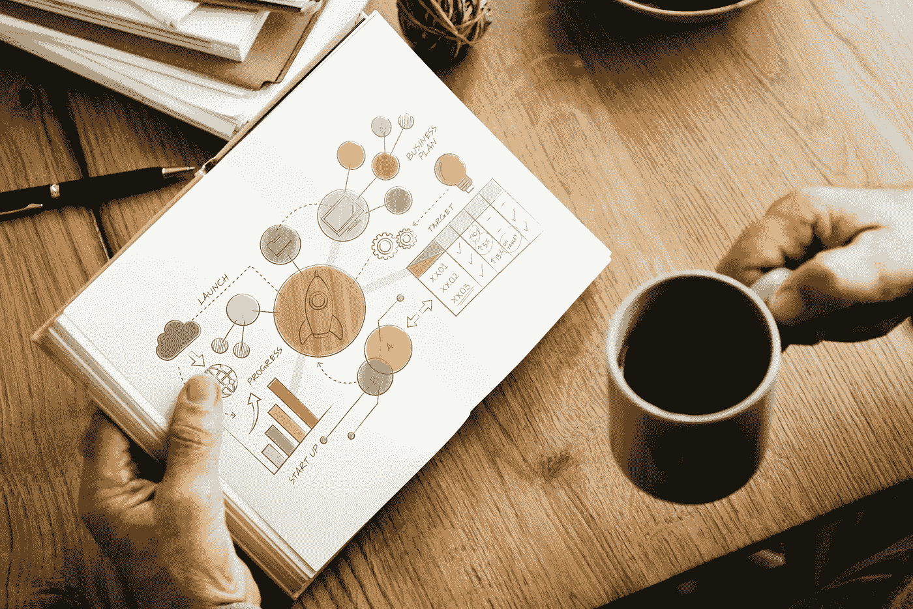

# 作为一个非技术人员，我必须学会的三件重要的技术事情

> 原文：<https://medium.com/swlh/the-three-essential-techie-things-i-had-to-learn-to-build-my-startup-as-a-non-techie-21421a329774>

stocksnap.io Rawpixel.com

## 当即使是单口相声演员也必须精通技术时，你知道你需要学习一些东西

许多人认为有技术人员和非技术人员。

但如今，我们大多数人，尤其是企业家和自由职业者，都在虚度光阴…