# 三个 T——心灵感应、心灵遥控、心灵运输——还有你的大脑？

> 原文：<https://medium.com/swlh/the-three-ts-telepathy-telekinesis-teleportation-and-your-brain-5e471378fac1>

## 大未来的小指南——脑机接口

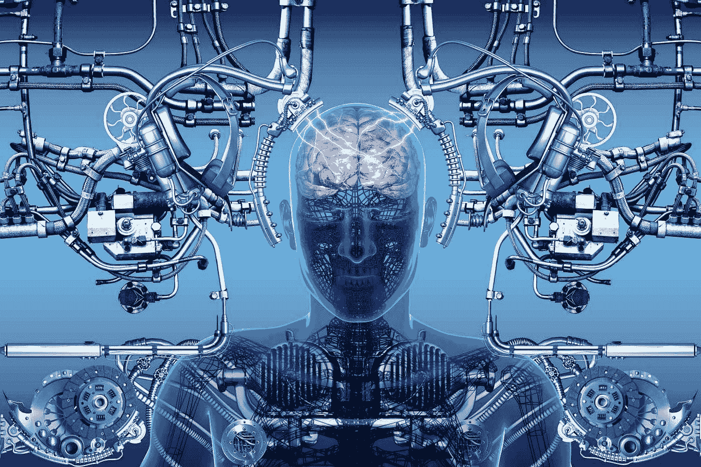

Image credits: [Convergent science network.](http://csnblog.specs-lab.com/2014/05/25/neuroprosthetics-wearable-tech-inside-the-brain/)

这是该系列的第一部分，敬请期待下一部分！

# 介绍

因此，您完成了这篇文章，但是您是如何做到的呢？你的运动皮层是否激活了你手臂上的肌肉纤维来移动鼠标，使用键盘在屏幕上打字并按下回车键，推动你电脑中的高科技处理器来读取这一页？

离现在不远，这一切似乎都过时了。这是因为许多聪明的发明家正在投入大量的时间和金钱到可以实时读取你的想法的计算机上。最终目标是创造出超级机器，在你搞清楚自己之前就知道你想要什么。

> **未来的三个 T——心灵感应、心灵遥控和心灵运输**

> **心灵感应**是将文字、情感或图像传送到他人头脑中的能力。
> 
> 心灵遥控是通过意念移动物体的能力。
> 
> 瞬间移动指的是在几秒钟内将你自己或你的思想传送到离你几英里远的地方。

尽管许多人相信这种精神能力，但其存在的科学证据仍然非常难以捉摸。

> 无知的最高形式是拒绝你一无所知的东西。
> 
> 韦恩·戴尔

2017 年初是脑机接口(BCI)发展的激动人心的时刻。科技行业的主要参与者已经宣布涉足该领域——埃隆·马斯克(Elon Musk)宣布了他的新项目 **Neuralink** ，这是由对人类被人工智能甩在后面的恐惧推动的，几周后，脸书宣布了由 DARPA 的雷吉娜·杜根(Regina Dugan)领导的他们自己的努力，目标是让用户能够用大脑每分钟键入 100 个单词。

但是这样的未来会有多远呢？让我们来看看这些脑机接口的现状，以及让它们进入我们大脑所面临的挑战。

但是等等！在进入这个虚构却又真实的脑机接口世界之前，让我们先了解一下到底什么是大脑！

# 神经元和大脑:

> 人脑有 1000 亿个神经元，每个神经元都与 1 万个其他神经元相连。坐在你的肩膀上是已知宇宙中最复杂的物体。

> 大约 6 亿年前，没有人真的做任何事情，因为没有事情可做，而且，实际上什么都没有！

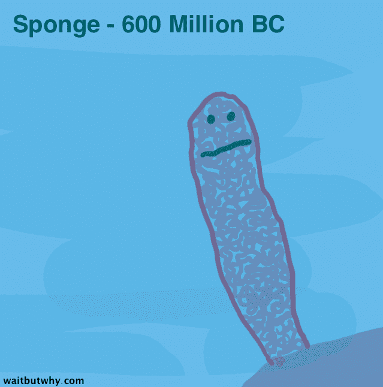

Image Credits : waitbutwhy.com

> 问题是没有人有勇气。没有神经，你就不能移动、思考或行动。所以你只需要存在，而不是活着，在那里等待，直到你死去。
> 
> 然后水母出现了。

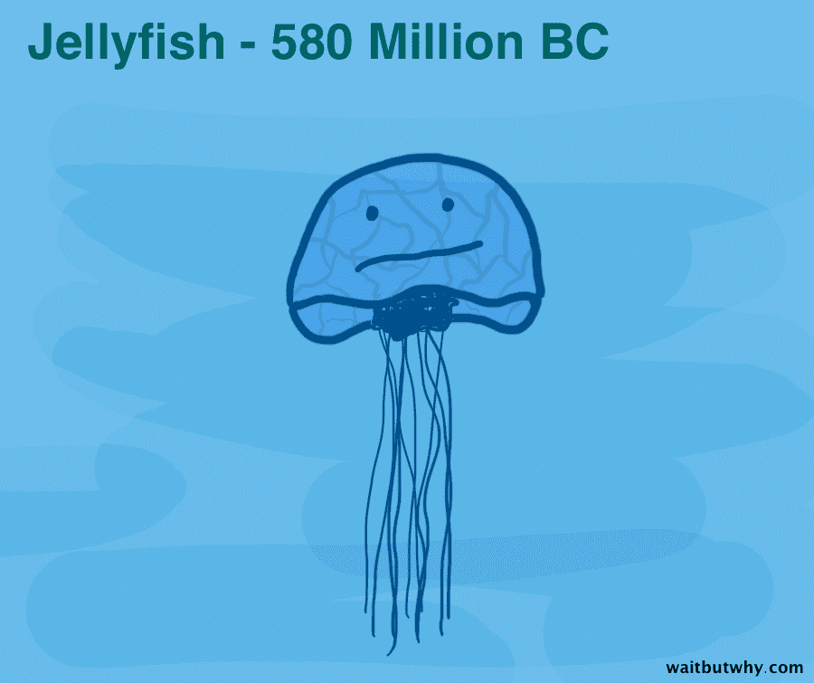

Image Credits : waitbutwhy.com

> 水母是第一个发现神经对确保你有神经很重要的生物。它拥有世界上第一个神经系统——神经网络。

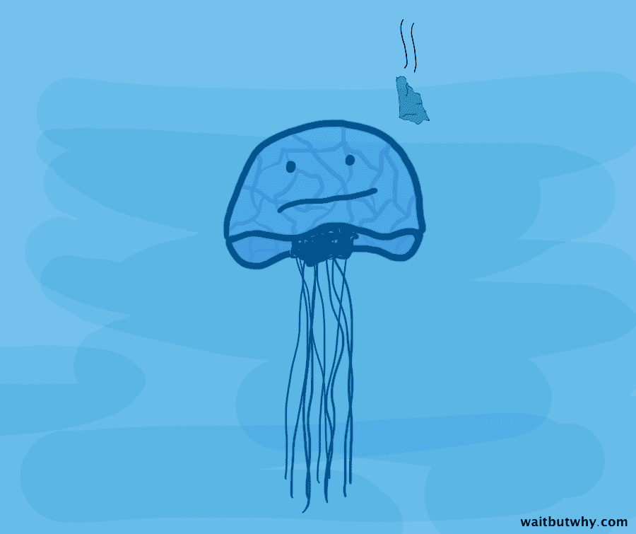

Image Credits : waitbutwhy.com

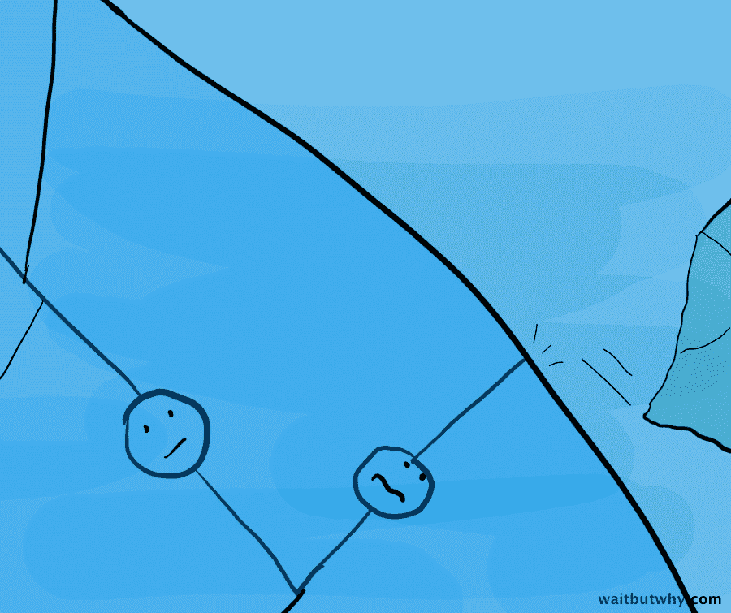

Image Credits : waitbutwhy.com

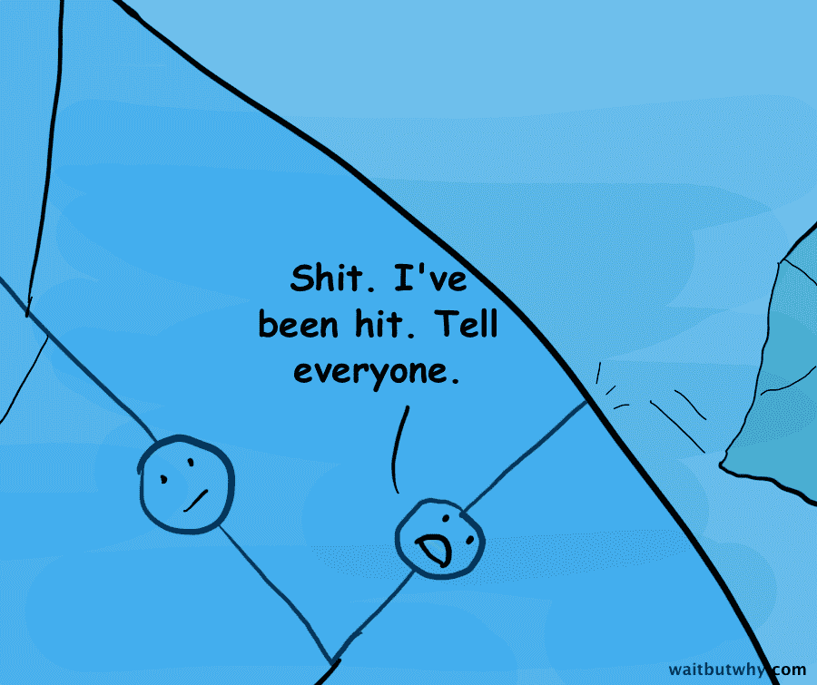

Image Credits : waitbutwhy.com

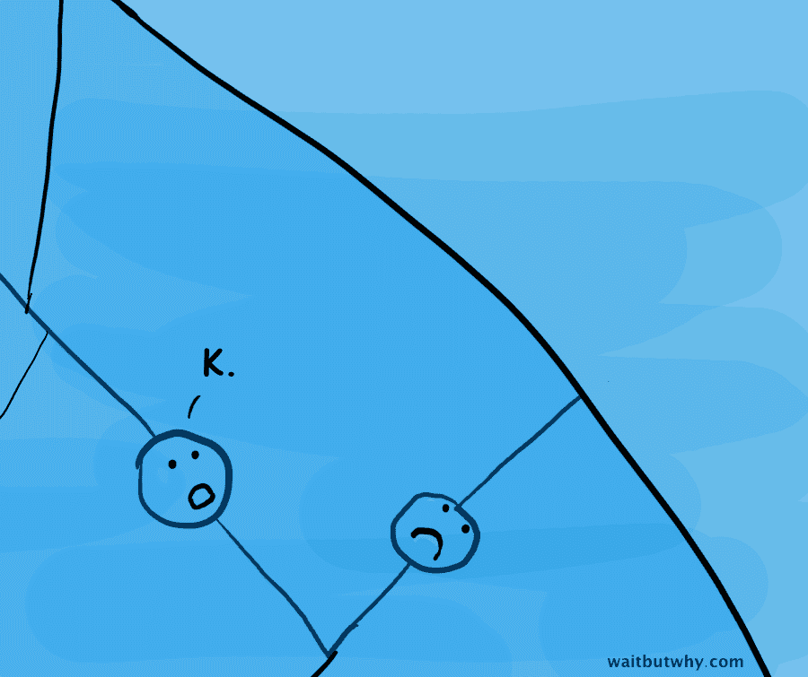

Image Credits : waitbutwhy.com

> 水母的神经网络允许它从周围的世界收集重要信息——比如哪里有物体、捕食者或食物——并通过一个大型的电话游戏将这些信息传递给身体的各个部分。能够接收和处理信息意味着水母实际上可以对其环境的变化做出反应，以增加生命顺利发展的几率，而不是漫无目的地漂浮，等待死亡。

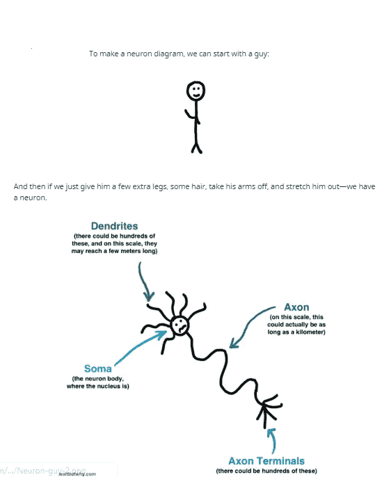

Image Credits : waitbutwhy.com

# 大脑

我们的大脑是我们身体中最复杂的器官之一，也是我们了解最少的一个。

> “如果人脑简单到我们能理解它，我们也会简单到我们不能理解它”

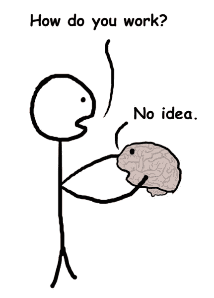

Image Credits : waitbutwhy.com

**对我们大脑知识的准确表述(图片由 Wait But Why 提供)**

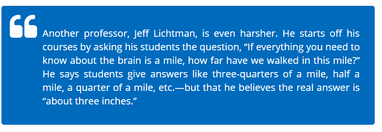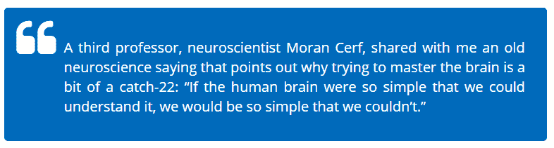

> 人脑是一个奇妙的器官。你一出生它就开始工作，直到你起来发表演讲才停止。

**无论如何，理解我们的大脑如此复杂的实际原因是:**

*   它由**1000 亿**个神经元组成；
*   在一个复杂的网络中，每个神经元都与**1000–10000**个其他神经元相连，通过它们交换信息来创造我们所有的记忆、感觉、行为等……将这个连接的数量乘以 1000 亿个神经元，你就会获得一个超级复杂的网络，以便完全理解；
*   这团混乱中不仅有神经元，还有其他种类的细胞帮助神经元实现它们的目标。即使在一立方厘米的大脑中，也有亿万个微观元素；
*   神经元之间的连接会随着时间的推移而改变:如果不会，我们一生都会是一样的。但是我们学习，适应，改变行为，这要归功于我们神经网络的微小变化:新的连接出现，旧的连接断开。
*   每个人的大脑都是不同的，例如“人”这个词在大脑中的记忆方式就因人而异。不幸的是，大脑中没有 UTF-8 标准。

# 什么是脑机接口？

简单地说，脑机接口是一种将大脑连接到外部设备的方式，以便直接从外部设备发送和/或接收信息。它们不是什么新东西，因为研究始于 70 年代初，那么为什么它们最近获得了如此多的关注呢？是什么让他们如此激动人心？

你的大脑中大约有 860 亿个神经元，它们控制着你的整个身体，并在你的大脑中产生思想。这些神经元以一定的频率放电。脑电图耳机通过读取神经元产生的电活动来读取这些频率。科学家们同意将这些频率分成不同的频段。所有频段都经过了深入研究，并与几种精神状态相关联:

*   **δ波**(1–3 赫兹):最深的冥想和深度睡眠
*   **θ波**(4–7hz):正常睡眠和正常冥想
*   **阿尔法波**(8–12hz):弛豫/反射
*   **贝塔波**(13–30 赫兹):思维活跃，注意力集中，喜警觉，焦虑
*   伽马波(31-50 赫兹):意识感知

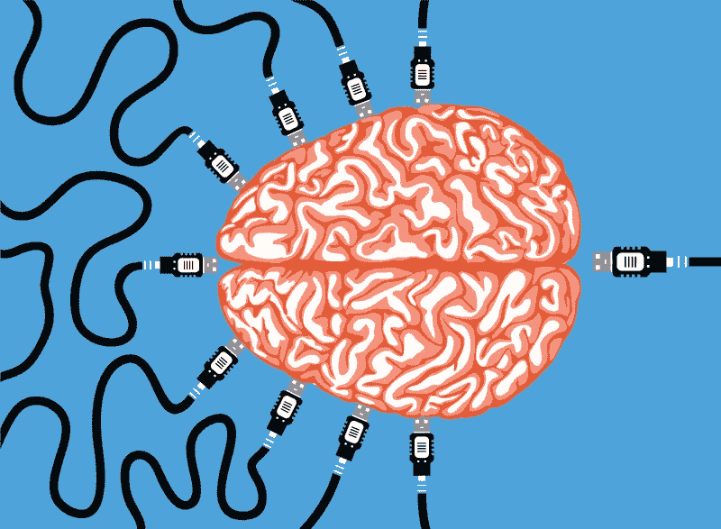

Image Credits : [http://bcihub.com](http://bcihub.com)

# BCI 改变世界的潜力

这项技术的成功实施有可能改变技术世界。使用这项技术，无线控制计算机和设备将成为可能。因此，用户将能够像移动他们的手和脚一样指挥和控制这项技术。无线通信，不仅仅是人与机器之间的通信，也包括人与人之间的通信，将被重新定义。随着电极处理人类大脑功能，技术将更能感知人类的情感。因此，这将使机器人助手和人工智能更具洞察力和适应性。全球玩家的游戏体验将经历一场革命。直接与人脑集成的计算机所能提供的体验将远远大于任何游戏模块。

这项技术将极大地推动残疾人假肢的发展。由于大脑和机器人肢体之间的连接，这种感觉会更加“自然”。这种联系甚至可能引发与真实肢体相当的感觉。

# 而最后的未来呢？

我们的大脑比我们的身体运行得更快:它就像一个 CPU，发现 PC 的所有其他组件都非常慢。身体是我们大脑的局限。它可以**通过大脑接口释放其所有潜力，就像在梦里一样，就像在虚拟现实中一样**。

> 为什么我们还需要一具尸体？

Image credits : Futurama Wikia

《未来》曾预言:我们只能用脑袋生活

全潜 VR 的最后阶段是母体。我们可以全身心地投入到一个模拟场景中，将它视为真实的生活，在这个模拟场景中，我们可以随心所欲。我们可以有无限的可能性，因为在模拟中没有规则可循。所以它也可以不仅仅是矩阵:在矩阵中人们只是物理世界中的人们…为什么我们要有它？我们可以飞…我们可以有六条腿… **只要大脑+人工智能可以思考一些事情，那件事情就可以发生。**最终，BCI 将使没有耳机的虚拟现实成为可能……仅仅通过在我们的大脑中注入感觉。**虚拟现实可能成为我们的生活**。或者我们的生活……作为一台电脑，我们可以平行地过着不同的生活，谁知道呢。这完全取决于这个超级大脑能处理什么。也许由于智能人工智能将通过我们的第四大脑层次协调我们，我们将开始思考如何在爱中生活，这样我们就不会像那些年那样互相残杀。这是一个令人费解的想法，但它可能是人类的最终进化。费米悖论说**我们仍然没有遇到外星人，因为他们不再需要生活在物理世界**:他们进化得如此之快，以至于他们一直生活在全潜水 VR 中。对我们来说也是如此。

也许这将是一个令人惊叹的未来。谁知道呢，但是**我还是太爱这个简单而疯狂的世界**。当[在《杀出重围》中，我有机会将人类的完全控制权交给一个智慧的人工智能](http://deusex.wikia.com/wiki/Deus_Ex_endings)，这可以让地球成为一个完美而和平的地方，我更喜欢让人类回到中世纪，激活一次技术封锁(这也摧毁了人工智能)。我喜欢如此深入人心，自由自在地做自己。

**这是系列的第 1 部分，敬请期待下一部分！**

## 这篇文章发表在 [The Startup](https://medium.com/swlh) 上，这是 Medium 最大的创业刊物，拥有+402，714 名读者。

## 在这里订阅接收[我们的头条新闻](http://growthsupply.com/the-startup-newsletter/)。

