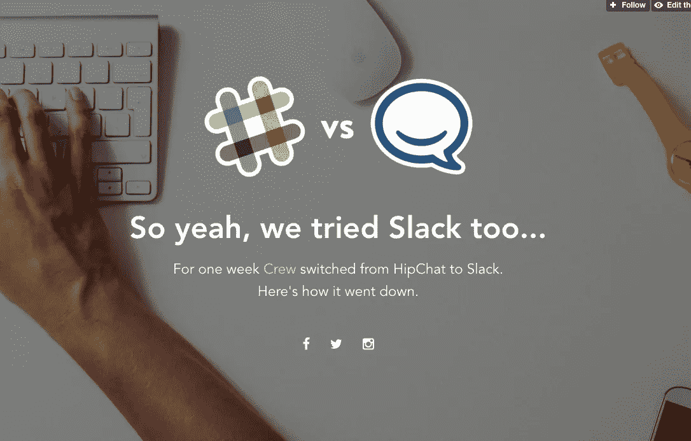
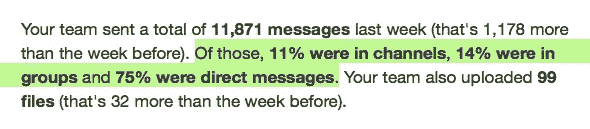
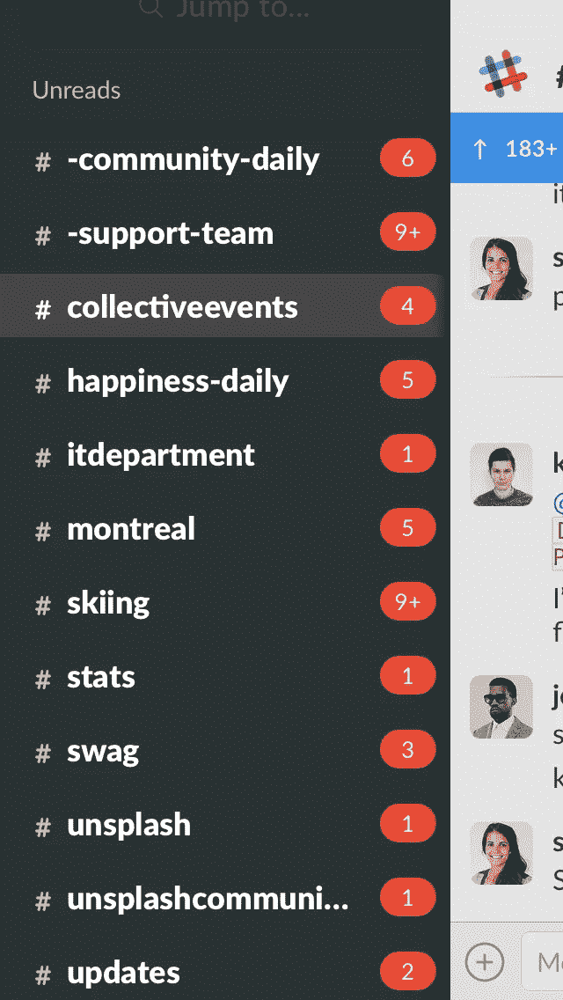

# 工具不是问题…

> 原文：<https://medium.com/swlh/the-tool-isn-t-the-problem-5e19b6857e56>

## 不是懈怠。是你。

自从我们经历了将整个团队从 HipChat 转变为 Slack 的过程后，已经过去了将近一年。当时，这个决定并没有多大分量。

两个工具。解决几乎相同的问题。只是方式不同。

这是个人喜好的问题。我们更喜欢哪个？为什么？

我们花了一周时间试用 Slack，每天都投票选出我们喜欢或不喜欢的功能。

(我们甚至为此制作了一个名为 SlackvsHipchat.com[的网站，并从中获得了一些甜美的弹力袜。这就是写作的力量！)](http://slackvshipchat.com/)

最后，我们喜欢 Slack 的可靠性。我们更喜欢它的通知系统。我们更喜欢它的移动应用。所以我们选择了懈怠。

简单。完成了。

但是 11 个月后，随着一个更大的团队和更多*人的喋喋不休，我开始想我们应该问另一个更普遍的问题:*

> 这真的是我们应该讨论的工具吗？或者我们真的喜欢这样交流吗？

如果你关注技术社区，我敢肯定你已经看到了至少一个反对 Slack 的争论，以及群聊的想法。

在过去的一年半时间里，故事慢慢从“Slack 如何扼杀了电子邮件”转变为“Slack 如何扼杀了我的生产力”。

那些带头呐喊的人表达了最初被认为是将我们从收件箱的暴政中解放出来的东西实际上已经变成了一个更加苛刻的主人。

作家和 UX 大师 Samuel Hulick，引导媒体的本土戒烟文学流派，公开了他与 Slack 的分手，引用它的持续需求和能力将你的一天变成“一个漫长的 Franken-meeting”。

而 Basecamp 创始人 Jason Fried 问[群聊是否让我们出汗](https://m.signalvnoise.com/is-group-chat-making-you-sweat-744659addf7d#.k4yt00vk3)(然后告诉我们是的)。

在所有松散的攻击中，我发现杰森的观点是最清晰的。Jason 没有对不接受暗示的专横的合作伙伴进行愤怒的咆哮，而是深入到工具之外，深入到我们在这里真正谈论的东西:

> “我相信注意力是你最宝贵的资源之一。如果是别的东西控制了我的注意力，*那就是别的东西控制了我的能力*。我也相信你需要全神贯注才能完成伟大的工作。因此，当像一堆群聊，以及随之而来的期望，系统地从我这里窃取资源时，我认为这是一个潜在的敌人。”

对我来说，这里的关键是“随之而来的期望”。

在我看来，期望和我们的想法或感觉与实际情况之间的鸿沟是所有罪恶的根源。

深入阅读任何对 Slack 或 chat 的批评，你会发现它总是归结到同一个问题:期望。

那么，工具真的是问题所在吗？

当然，使用 Slack 有助于更多的对话，但这才是重点，不是吗？让你的团队以开放的方式交流。

如果使用得当，有了*和正确的期望*(由负责人传达)，Slack 就不再是那种烦人的同事，他们会拿你还没做的事情来烦你，或者和你分享愚蠢的礼物，而更像是一个活生生的知识库。

这里有一个简单的例子:在 Crew，早期我们决定优先考虑 Slack 中的过度共享。每周，我们都会发布我们的私人与公共信息，提醒每个人在公共场合进行对话。

We didn’t start off too well keeping things public

我们看到聊天更多的是一个不断发展的知识库，而不是一个快速交流的工具(尽管它也是用来交流的！)

涨潮了。上升的船。你知道这个比喻。

当然，这意味着更多的哔哔声、bops 和小红点，但也意味着问题不会被问多次。如果做得好，知识会变得普遍和公司范围的，而不是具体和个人的。

但是，这难道不是导致了每个人似乎都抓住不放的“永远在线”问题吗？

除非你允许。

再说一次，这一切都归结于期望。

期望你什么时候会回应这个请求。对真正重要的东西的期望，以及我们如何传达这种重要性。甚至是对你何时出现的期望。

作为一名作家和编辑，我给自己设定了“宽松的办公时间”，在这段时间里，我可以回答问题，检查谈话内容，嘲笑充斥在我们#general room 的愚蠢的 gif。

不然呢？/dnd 或者干脆就别说了。

我是否因为不经常在那里而错过了一些实时对话？当然可以。但是拜托，你真的打算让 FOMO 统治你的生活吗？

这是另一个例子:我的朋友和同事 Rob 是我们的社区负责人，他几乎整天都在与我们 Crew 网络中的自由创意者一起工作和交谈，自从 Slack 实现了这个功能以来，我想我还没有见过他不带勿扰模式。

当对话对他有利时，他会选择何时参与。

他控制着交流的流程。不懈怠。

这很好。我们不期望他以任何其他方式做这件事。

我将把我最好的例子留到最后:当我上次在蒙特利尔的时候，我和我们的首席执行官 [Mikael Cho](https://medium.com/u/300c728e7d24?source=post_page-----5e19b6857e56--------------------------------) 在一起，他参与了团队的所有事情，从产品设计到市场营销，再到建造我们 12，000 平方英尺的新工作空间。他的松弛是什么样的？

他的态度呢？不是你会联想到的那种压力和焦虑，这种压力和焦虑是专为利用我们需要回应通知的基本人类本能而设计的应用程序。只是一个知道自己有事情要做的人，并且会尽可能的去做。

我不是说我们已经搞清楚了。我只是说，当问题毫无疑问地出现时，很容易责怪工具。如果我们听从斯多葛派的智慧，我们就无法控制发生了什么，只能控制我们对那种情况的反应。跟懈怠没什么区别。

新技术如何影响你的生活是你的选择。

不管通过什么媒介，总会有信息。重要的是你对他们的反应。

想想积极的一面:

有了 Slack，我们能够为世界各地的团队创造一种文化和包容性。

我们能够创建一个活生生的知识库，员工可以在其中讨论发生的问题，并就重要的问题达成共识。

最棒的是，我们能够摆脱完全无法理解的电子邮件链。

但是，只有当我们从一开始就设定了我们的期望，这一切才会发生。

这不是懈怠的问题。是关于*你*的。

如果你用锤子砸到了拇指，你就不会再去用石头了，是吗？你只是要学习如何使用锤子，而不会对你造成身体伤害。

最后，Slack，HipChat，或者其他你喜欢的方式，都只是你选择的交流方式的反映。

所有这些应用程序所做的就是获取你的习惯和公司文化，并放大它们。

那么，你需要摆脱懈怠吗？就像所有的事情一样，这是你的选择。

但是如果你被所有的声音搞得焦头烂额，试着去理解为什么。

找到适合你和你同事的方法。如果对你合适，就设定“办公时间”。或者干脆老退出！如果人们真的需要的话，还有其他方法可以和你联系。

设定期望，建立一种尊重你需要完成的事情并坚持下去的沟通文化。

因为，还有别的选择吗？你真的想偷偷回到前任身边吗(收件箱的灾难)？

每段感情都会经历起起落落。

像所有的关系问题一样，这都归结于你如何沟通。

*嘿！我是乔里。屡获殊荣的作家、编辑和内容策略师。如果你想一起工作，在***或* [*上查看更多类似的帖子。*](http://jorymackay.com/)*