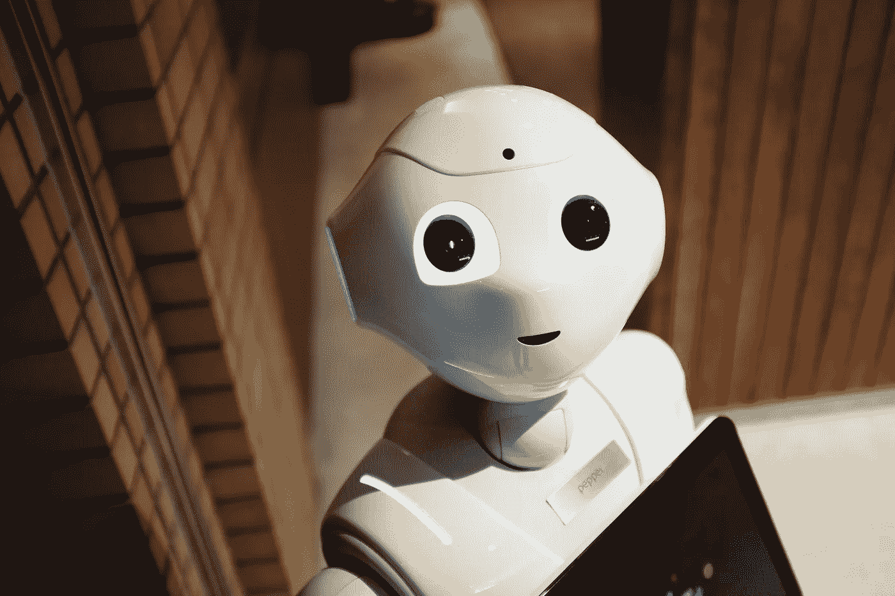

# 类人型机器人不能窃取的三大人类工作

> 原文：<https://medium.com/swlh/the-top-3-human-jobs-humanoids-cannot-steal-ee180be79a5e>

Photo by [Alex Knight](https://unsplash.com/photos/2EJCSULRwC8?utm_source=unsplash&utm_medium=referral&utm_content=creditCopyText) on [Unsplash](https://unsplash.com/search/photos/automation?utm_source=unsplash&utm_medium=referral&utm_content=creditCopyText)

几十年来，人们一直将计算机与人类相提并论。然而，很明显，这两者的运作方式完全不同。我猜是彼得·泰尔评论说，技术的未来不在于取代人类的能力，而在于补充人类的能力。

这是因为计算机真正擅长的事情往往与人类能够轻而易举处理的事情截然相反。也就是说，下面是三种被许多专家一致认为是不受自动化影响的工作。

# 1.模式识别作业

请考虑以下情况。

> 2012 年，谷歌的一台超级计算机成为头条新闻，在扫描了 1000 万个 YouTube 视频缩略图后，它学会了以 75%的准确率识别一只猫。
> 
> 马斯特斯布雷克。零到一:创业笔记，或如何建设未来(Kindle Locations 1505–1506)。埃伯里出版社。Kindle 版。

现在，将这一壮举与一个普通的四岁儿童在仅仅扫描一个缩略图后就能以 100%的准确率做到这一点进行比较。

“模式识别”之所以特殊，可以归结为人和机器在操作上的不同。如果说有什么不同的话，人脑中的神经元就像并行计算机一样。当数十亿个神经元和数万亿个突触一起在一秒钟内执行千万亿次运算时，结果与计算机用串行逻辑所能做的截然不同。

当涉及到可以分解成几行代码的纯重复性任务时，计算机比我们聪明数百万倍。但是，令人惊讶的是，将继续受到保护，甚至可能从人工智能革命中受益的人将是**垃圾收集员、园丁和水管工**。因为正如加来道雄在他的书*未来物理学*中探索的那样，这些工作每次都呈现出独特的情况。

同样，警察和建筑工人将保持安全，因为每个犯罪情况都是不同的，每个建筑项目都需要其独特的蓝图、工具和说明。

# 2.常识性工作

如果模式识别是计算机测试失败的地方，那么常识就是计算机得满分的地方。

或者，我应该换一种说法。如果工厂生产线上的汽车工人的工作需要几行代码，那么一个五岁孩子的常识需要上亿行代码。

从表面上看，这种明显的区别可能并不明显。但是计算机确实没有任何常识。因此，像组合创意这样的东西，完全是利用一个人的知识来提出新的想法，将一如既往地继续保持珍贵。

因此，需要对事物的直觉理解和模拟人性的复杂能力(如幽默、领导力和表演)的工作将保持安全。具体来说，像**小说家、创意艺术家和软件作家**这样的人将会驾驶未来的乔布斯之船。

此外，值得一提的是，在整个资本主义时代一直是可替代商品的中间商也将保持安全，只要他们的工作涉及这一常识要素。

> 对于像房子这样的重要购买，你想和一个能告诉你哪里有好学校、哪里犯罪率低、下水道系统如何工作等的人交谈。
> 
> 卡库，稻夫。未来物理学:到 2100 年科学将如何塑造人类命运和我们的日常生活(第 306 页)。企鹅图书有限公司 Kindle 版。

因此，**老练的房地产经纪人**是安全的。这同样适用于**的高级股票经纪人**。

很明显，这类问题是人类特有的，这就把我们带到了下一类也是最后一类仍不受自动化影响的工作。

# 3.高接触工作

高接触工作与高技术工作正好相反，后者需要先进的技术，而前者需要不可替代的人情味。

想想保姆、护士、同伴、保育员等。正如道格拉斯·拉什科夫在*向谷歌巴士扔石头中指出的*

> 尽管有一天计算机可能会更好地诊断和治疗病人，但对他们的护理却不会。
> 
> 道格拉斯·拉什科夫。向谷歌巴士扔石头:增长如何成为繁荣的敌人。企鹅图书有限公司 Kindle 版。

事实上，正是这些工作中的人的因素使得它们无法用于商业目的。这就是为什么他们给资本主义制造如此糟糕的机会。这就是为什么他们对自动化做出如此站不住脚的选择。

我提到那些参与农业和纺织的人了吗？对这些人来说也有很多话要说，因为未来不仅在于全球互联，也在于当地的可持续发展*。*

因此，在未来的几年甚至几十年里，这三种类型的工作可能不会受到自动化的影响。如果我遗漏了什么，请在评论中告诉我。

## 这篇文章发表在 [The Startup](https://medium.com/swlh) 上，这是 Medium 最大的创业刊物，拥有 338，320 多名读者。

## 在这里订阅接收[我们的头条新闻](http://growthsupply.com/the-startup-newsletter/)。

