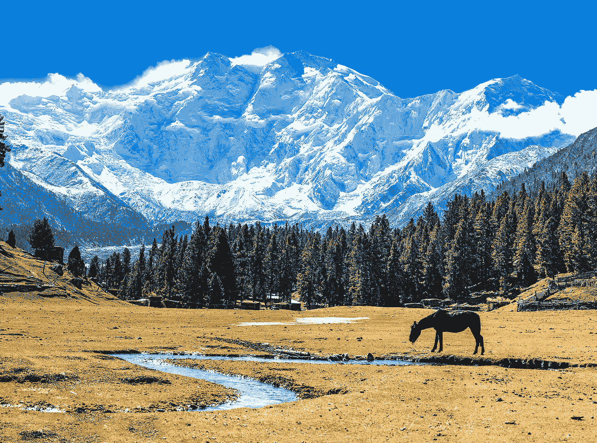

# 控制的三分法

> 原文：<https://medium.com/swlh/the-trichotomy-of-control-9ea5751a575c>

## 斯多葛派能帮助我们少担心吗？

*Nanga Parbat, nicknamed the “Killer Mountain”. Steve House and Vince Anderson won the* [*Piolet d’Or*](https://en.wikipedia.org/wiki/Piolet_d%27Or) *in 2006 for their direct ascent of the Rupal Face. It is the ninth highest mountain in the world at 8,126 meters (26,660 feet).*

# 零的总和

你是否曾经非常努力地去获得某样东西，当你无法得到它时，你会感到非常沮丧？更糟糕的是，你有没有努力去实现一些事情，然而当你做到的时候，却留下了一种空虚的感觉？