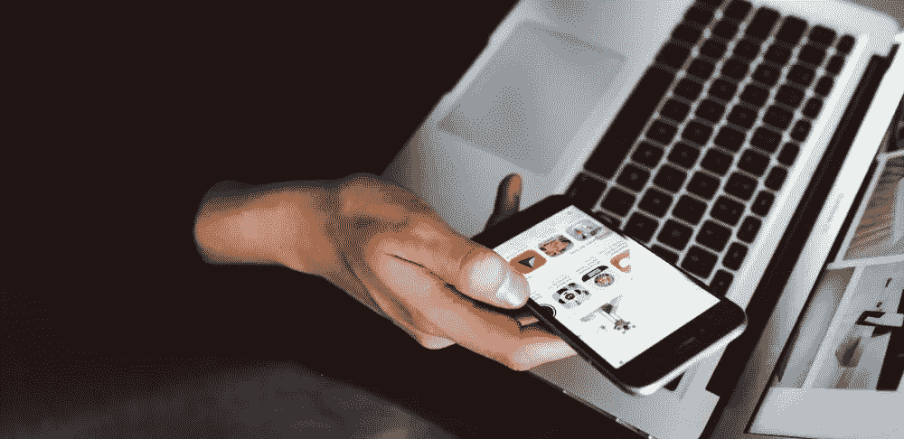

# 电子邮件的真实成本:你每天只有 1 小时 12 分钟不间断的工作时间

> 原文：<https://medium.com/swlh/the-true-cost-of-email-you-only-have-1h-12m-day-of-uninterrupted-productive-time-78dbc0723ff7>

可以肯定地说，我们在电子邮件和 Slack 等即时通讯工具上花费的时间都超过了我们的期望。他们总是在后台，迫使我们点击“快速”签到。但是这些转换累积起来，打破了我们原本应该更加专注的时间。

这就引出了一个问题:**你一天中有多少时间是在同时处理多项通讯工具上度过的？这对你的工作效率有多糟糕？**

*通过查看近 5 万名*[*rescue time*](https://www.rescuetime.com/)*用户的匿名数据，我们发现了一种比我们想象的更严重的通信多任务模式。*

# 你工作中 40%的生产时间花在了多重任务上

大量研究表明，一心多用对我们有害。事实上，研究表明这几乎是不可能的。

当我们试图“多任务处理”时，我们的大脑实际上只是在任务之间快速来回切换。多任务处理非但没有让我们变得更有效率，反而降低了我们的生产力，扼杀了我们的注意力，增加了我们的压力。

然而，我们大多数人不认为我们使用电子邮件或即时消息的方式是多任务处理。

我们高兴地让收件箱或空闲时间整天开着，同时处理其他项目，对此毫不在意。 ***但是这个*就是*一心多用。***

更糟糕的是，一心多用让我们不断受到干扰和破坏。(我的意思是，你不会希望你的[公交车司机在带你去上班的时候看报纸](https://nypost.com/2017/09/12/bus-driver-caught-reading-newspaper-behind-the-wheel/)，对吧？)

当我们观察人们花在“查看”电子邮件或即时消息上的时间时，我们发现普通的知识工作者每天花 40.1%的生产时间在通讯工具上。

这意味着，**你花在生产性任务(无论是写作、软件开发还是设计)上的近一半时间*也是*花在处理电子邮件和即时消息上的。**

现在，为什么这是一个问题？首先，我们已经沉迷于尽快回复电子邮件和通知，而牺牲了其他工作。

在一项研究中，拉夫堡大学的 Thomas W. Jackson 发现 70%收到的电子邮件在收到后的 6 秒内被打开。

一旦你检查了一封邮件，你平均要花 64 秒才能恢复原来的工作。更糟糕的是，[另一项研究](https://dl.acm.org/citation.cfm?doid=1240624.1240730)发现，当一封电子邮件涉及到我们收件箱之外的事情时，**需要超过 9 分钟才能回到原来的任务**。

# 普通知识工作者每天只有 1 小时 12 分钟的生产时间，不会被电子邮件和即时消息打断

看看在没有沟通多任务处理的情况下*花费的总时间，我们的研究发现**普通知识工作者每天只有 1 小时 12 分钟用于完全专注的工作。***

也就是说每天只有一个小时(或者一周总共 6 个小时)*而没有用通讯工具进行多任务处理的负面影响。*

虽然电子邮件和即时消息是大多数现代工作的必需品，但这个数字显示了为什么每天完成有意义的工作会如此困难。

我们可能都同意，白天花太多时间在电子邮件上是不好的。事实上，当加州大学欧文分校的格洛丽亚·马克研究电子邮件对压力和工作效率的影响时，她发现:

> “每天花在邮件上的时间越长，评估出来的工作效率越低，压力越大。”

然而，如果在沟通任务上花费太多时间会让我们压力更大、效率更低，那么多任务处理和不断“检查”的复合效应呢？

想知道你的时间到底去了哪里？ [***免费注册预约***](https://www.rescuetime.com/) *，准确了解你是如何在数码设备上度过时间的。*

# 不断的切换分散了我们的工作时间，训练我们的思维脱离聚焦模式

我们可能习惯于在电子邮件和谷歌文档、Slack 和其他工具之间来回切换。但是每次你像这样切换环境来完成一项任务，你都在分散你的工作日。这会影响你的注意力。

在一项研究中，Gloria Mark [发现](https://www.hcii.cmu.edu/news/event/2004/10/work-fragmentation-common-practice-paradox-it-support)一般来说，**的员工在转换工作前平均只花 3 分钟完成任何给定的任务，在转换工作前使用任何数字工具大约花 2 分钟。**

通过长时间不间断地不工作，我们有效地[训练我们的大脑*脱离专注模式*](https://blog.rescuetime.com/catherine-price/)，使它们更容易分心。

# 我们将自己暴露在不必要的中断风险中

当你想到是什么阻碍了专注的工作时，你可能会认为是一些外部干扰。然而，马克[向](https://www.hcii.cmu.edu/news/event/2004/10/work-fragmentation-common-practice-paradox-it-support)解释说**我们打断自己的可能性和被外部来源打断的可能性一样大。**

当我们不断地打开我们的交流工具时，我们将自己暴露在内部和外部的干扰之下。

更糟糕的是，马克发现一旦被打断，我们很少会马上回到手头的任务。相反，她发现我们不仅平均参与两个或更多的干预活动，而且**需要** [**23 分 15 秒**](https://www.fastcompany.com/944128/worker-interrupted-cost-task-switching) **才能回到我们最初的任务**。

现在，想想当你不经意地瞥一眼你的电子邮件时会发生什么。

如果你幸运的话，你会看到一些你必须在某个时候处理的任务。然而，你也可能会收到一条占据了你一天时间的信息，让你心情不好。

虽然你可能会*觉得*你需要紧急回复收到的每一封电子邮件，是吗？(你不能给 911 发邮件是有原因的。)

不断地同时处理通讯工具会让我们误以为它们是我们一天中最重要的部分。

# 杂耍任务会让所有事情花费更长时间

心理学家测量多任务处理效果的方法之一是比较我们不间断地完成一项任务和我们试图同时“处理”多项任务所花的时间。

多任务处理会降低我们的速度，这一点也不奇怪。但是围绕任务转换的研究显示了更有趣的东西:任务越复杂，浪费的时间就越多。

换句话说，当你使用通信工具进行多任务处理时——这通常需要时间来理解上下文，一定程度的深度思考，以及足够的意志力和注意力来完成它——你实际上是在踩刹车，降低你的效率。

根据[大卫·迈耶](https://www.apa.org/research/action/multitask.aspx)博士的说法，“即使是任务转换**造成的短暂精神障碍也会耗费一个人 40%的工作时间。**

# 通讯工具是必须的。但是用好它们还是要看你自己。

人们很容易忽视让沟通工具保持开放会对你的工作效率产生多大的影响。

但是，正如作家兼[首席执行官多莉·克拉克](https://hbr.org/2018/04/why-email-is-so-stressful-even-though-its-not-actually-that-time-consuming)在*哈佛商业评论*中所写的那样，是电子邮件和即时消息的本质，而不是它们有多耗时，让它们变得如此有压力:

> *“在评估你(处理一封电子邮件)的决定时，认识到下游的后果和对个人时间的影响是至关重要的。”*

我们的研究表明，我们大多数人对多任务通信工具有问题。当使用通讯工具的时候*没有一个放之四海而皆准的答案，如何使用它们*是你自己的选择。**

下一次，当你想“只花一秒钟”处理电子邮件时，花一点时间想想这样做的真正代价。

# 嘿，我是乔里！

我帮助公司和有趣的人通过巧妙而专注的写作讲述他们的故事。想一起工作吗？ ***在 hello@jorymackay.com 给我发邮件***

*这篇文章的一个版本最初发表在* [*改版博客*](https://blog.rescuetime.com/communication-multitasking/) *上。查看更多关于生产力、专注和动力的文章。*

## 这篇文章发表在 [The Startup](https://medium.com/swlh) 上，这是 Medium 最大的创业刊物，有 330，853+人关注。

## 在这里订阅接收[我们的头条新闻](http://growthsupply.com/the-startup-newsletter/)。

