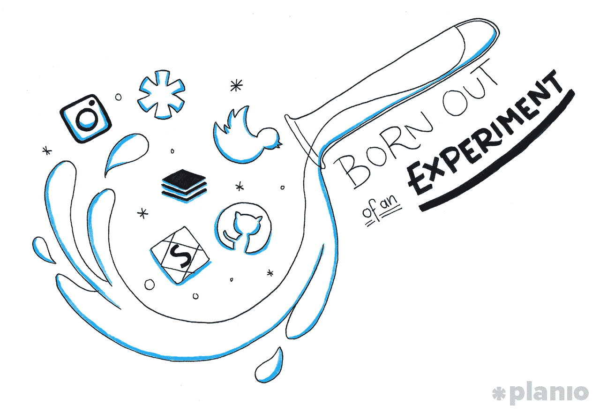
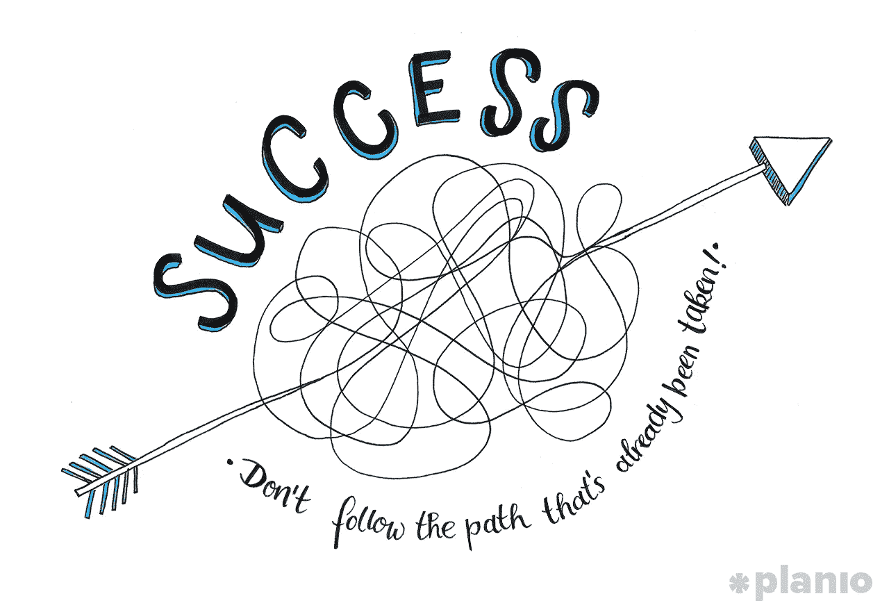
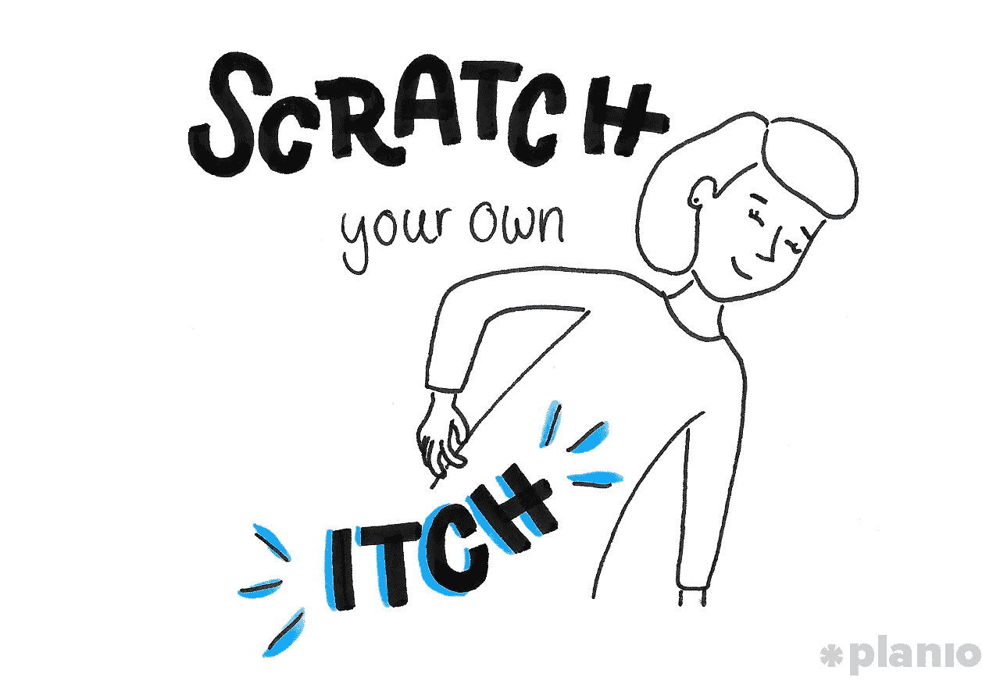

# 21 个副业项目发展成百万美元生意背后的真实故事

> 原文：<https://medium.com/swlh/the-true-stories-behind-21-side-projects-that-grew-into-million-dollar-businesses-ebd12aedc5fc>

## 通往成功的道路从来都不是一条直线。

如果你想建立一个成功的企业，你需要专注于一个单一的目标，对不对？

当然，传统观点认为我们不能一心多用，需要远离发光物体综合症。但创业公司远非常规。如果你想成功——真正的成功——你不能走已经走过的路。

想想最具创新性、行业领先的企业:苹果、脸书、谷歌、SpaceX。有多少人认为他们一开始就想好了一切？

事实是，它们都是从实验中诞生的——这些想法在当时看起来很疯狂，但他们还是尝试了。

然而，这种冒险精神在我们目前的工作环境中非常缺乏。

尽管有各种关于个人兼职的宣传，以及业余爱好和兴趣在工作之外的重要性，企业家们并不愿意把他们的钱用在他们的嘴上，并资助那些疯狂的，不切实际的想法，这些想法可能会成为数百万甚至数十亿美元的生意。

这是一个错误。兼职项目不只是分散注意力。事实上，世界上一些最成功的公司都是从副业起家的。

嘿，你好！这篇文章的一个版本最初发表在 [*Planio 博客*](https://goo.gl/NNvAyB) *上。* [*查看*](https://goo.gl/NNvAyB) *了解更多打造成功创业公司的技巧和策略。*

# 为什么副业可以成为成功的捷径

经营一家成功的创业公司并不是坐等一切都尽善尽美再去计划。它是关于进入泥里，弄脏你的手，和处理出现的事情。从统计数据来看，42%的失败创业公司称缺乏需求是他们失败的原因。这意味着超过一半的企业死亡，因为他们根本不知道他们的用户想要什么。他们害怕发现。

找出人们真正想要的可能意味着改变路线。这可能意味着从外面看你不知道你在做什么。但我们忘记了，即使是最成功的公司，也是由那些追逐他们所能找到的最佳创意的人经营的，无论这些创意在外界看来是什么样的:

> “对许多人来说，改变航向也是一种软弱的表现，等于承认自己不知道自己在做什么。这让我觉得特别奇怪——就我个人而言，**我认为不能改变自己想法的人是危险的。**众所周知，史蒂夫·乔布斯会根据新的事实立即改变主意，我不知道有谁认为他软弱。”-艾德·卡姆尔创新公司

苹果的创始人(以及下面我们将看到的其他 21 位)并不害怕追逐创意。即使是 Y Combinator——有史以来最成功的创业孵化器——在申请时也会要求申请人提供一个副业项目的想法(许多人最终被选中去追求这个想法，而不是他们最初的想法！)

所以，如果你想从一些以副业起家的顶级创业公司那里获得灵感和学习，让我们开始吧…

# 21 个以副业起家的成功创业公司

# 1. [ProductHunt](http://t.umblr.com/redirect?z=http%3A%2F%2Fproducthunt.com%2F&t=YjJhOGI4ZDVlOTllYjMwMTIzYmVhNjNmNjEyZDhiYzY1MTNhZTI5Zix6bEdySW8xNw%3D%3D&b=t%3ApQ2a-qOmXaD0GPirQeUI-Q&p=https%3A%2F%2Fplan.io/blog%2Fpost%2F167355249623%2F21-side-projects-that-grew-into-million-dollar-startups&m=1)

创业需要技术吗？一个以发现最新科技工具为基础的怎么样？对于 ProductHunt 的创始人兼首席执行官瑞安·胡佛来说，这从来都不是问题。product hunt 是一个平台和社区，帮助人们发现新的技术产品并与他们的团队互动。他没有为他的副业想法的技术方面而苦恼，[他决定做他知道他能做的事情](http://t.umblr.com/redirect?z=https%3A%2F%2Fwww.groovehq.com%2Fblog%2Fryan-hoover-product-hunt&t=Yjg4NDNmN2VlODg5ZmZhNDAzZjgyMWVlNTAyMTMxYmFkZmM5ZGFjNix6bEdySW8xNw%3D%3D&b=t%3ApQ2a-qOmXaD0GPirQeUI-Q&p=https%3A%2F%2Fplan.io/blog%2Fpost%2F167355249623%2F21-side-projects-that-grew-into-million-dollar-startups&m=1):

> “我不是工程师，所以我不打算从一开始就投入时间或金钱来建立一个完整的网站，但我可以非常容易地建立一个电子邮件列表。我创办了一个网站，并邀请了几十名投资者、创始人和我的其他朋友，我认为他们可能会喜欢这个网站，他们对什么样的科技产品很酷有深入的了解。”

在推出后的几年里，ProductHunt 已经发展成为一个拥有数十万月用户的社区，最近以 2000 万美元的价格卖给了 AngelList。

# 2. [Groupon](http://t.umblr.com/redirect?z=https%3A%2F%2Fwww.groupon.com%2F&t=YTRjNzgzMjhjNWIxYTBlYWRmZGRmMzdmYzFiZmQ3OWVlMDNhNjY2Zix6bEdySW8xNw%3D%3D&b=t%3ApQ2a-qOmXaD0GPirQeUI-Q&p=https%3A%2F%2Fplan.io/blog%2Fpost%2F167355249623%2F21-side-projects-that-grew-into-million-dollar-startups&m=1)

一个活跃分子的社交网络如何在推出两年内变成一个覆盖 45 个国家、估值 10 亿美元的每日交易网站？ [Groupon 的成功之旅](http://t.umblr.com/redirect?z=https%3A%2F%2Fmedium.com%2F%40dareobasanjo%2Fthe-top-5-side-projects-that-became-billion-dollar-tech-companies-and-what-you-can-learn-from-them-7ce2fc90b6e0&t=YjFmNmU2ZmZhNTEzMzI3OGU1OTllNjU3OGEyNDZiMzMwZmRkZjQwMyx6bEdySW8xNw%3D%3D&b=t%3ApQ2a-qOmXaD0GPirQeUI-Q&p=https%3A%2F%2Fplan.io/blog%2Fpost%2F167355249623%2F21-side-projects-that-grew-into-million-dollar-startups&m=1)是那种定义了创业心态的怪异而曲折的道路。

Groupon 最初名为 The Point，是一个社交网络，它将希望团结起来支持某个特定事业的用户联系在一起，当创始人埃里克·莱夫科夫斯基看到用户聚集在一起购买一件商品并获得折扣时，Groupon 的种子就埋下了。被 2008 年的经济崩溃所抛弃，他们决定在芝加哥本地推出 Groupon，剩下的就是历史了。

# 3.[推特](https://twitter.com/)

虽然现在无处不在，Twitter 曾经是播客平台 Odeo 在公司黑客马拉松期间创建的一个小项目。它只不过是少数员工的发泄途径，尽管首席执行官 Ev Williams 支持它，但投资者和媒体根本不在乎。看看这个十年前的 TechCrunch 评论:

> “这家公司做了什么来使他们的核心产品引人注目？当他们的主要产品线除了出色的设计之外，还是一个彻头彻尾的探听者时，他们的股东对 Twttr 这样的次要项目有什么感觉？”

事实证明，他们所做的是建立一个全新的业务，改变我们在线交流的方式，所有这一切甚至在当时都没有意识到。

# 4.[有问必答](http://t.umblr.com/redirect?z=https%3A%2F%2Fcraigslist.org%2F&t=Yzk5MTU1NzA3NDRkMjA2Nzk4MmI5ZjFlODk0ZmRjODgxNzVhNDM4ZCx6bEdySW8xNw%3D%3D&b=t%3ApQ2a-qOmXaD0GPirQeUI-Q&p=https%3A%2F%2Fplan.io/blog%2Fpost%2F167355249623%2F21-side-projects-that-grew-into-million-dollar-startups&m=1)

[你就是杀不死有问必答。](http://t.umblr.com/redirect?z=https%3A%2F%2Fwww.theringer.com%2F2016%2F10%2F6%2F16044330%2Fsilicon-valley-cant-disrupt-craigslist-8e84f16f6054&t=MTAwZjVjMWZmMWEzMjg0ZjJkMmFlOTRiNzMyZTk0N2ZhZjA1YmQxYix6bEdySW8xNw%3D%3D&b=t%3ApQ2a-qOmXaD0GPirQeUI-Q&p=https%3A%2F%2Fplan.io/blog%2Fpost%2F167355249623%2F21-side-projects-that-grew-into-million-dollar-startups&m=1)虽然你可能不会把它放在科技公司的顶级梯队中，但对于这个拥有 20 多年历史的机密公司来说，它的能力肯定是与时俱进的。但这一切是从哪里开始的？作为 90 年代初来到旧金山的新人，前 IBM 员工克雷格·纽马克(Craig Newmark)为当地的活动创建了一个电子邮件列表，以帮助他结识人们(Craig 的列表，get it？).它流行起来，人们开始不仅仅在聚会上使用它，最终激励克雷格辞去他的日常工作，将 Craigslist 建设成一家价值 10 亿美元的公司。

# 5.[去飞溅](http://t.umblr.com/redirect?z=https%3A%2F%2Funsplash.com%2F&t=MGJlM2U1OTEyNmQxZjllYzMxMDNjY2IwZjNmZmUyZGI2MWIyYzdiOCx6bEdySW8xNw%3D%3D&b=t%3ApQ2a-qOmXaD0GPirQeUI-Q&p=https%3A%2F%2Fplan.io/blog%2Fpost%2F167355249623%2F21-side-projects-that-grew-into-million-dollar-startups&m=1)

你会如何处理为创业公司的登陆页面拍摄的照片？当然，要为免版税的照片建立网络上最好的存储库。当加拿大的一个创业团队雇佣了一名专业摄影师进行拍摄时，他们得到了超出他们所能使用的东西。但是，他们没有让这些照片消失在硬盘上，而是把它们放到了一个网站上，并免费赠送。[一条病毒式的黑客新闻发布后](http://t.umblr.com/redirect?z=https%3A%2F%2Fcrew.co%2Fblog%2Fhow-side-projects-saved-our-startup%2F&t=OTA5Yzk4MjE0YmM3MzU4MTY1NDlkZjZhZjRkNzVjMzAxNjcxYWE2Nix6bEdySW8xNw%3D%3D&b=t%3ApQ2a-qOmXaD0GPirQeUI-Q&p=https%3A%2F%2Fplan.io/blog%2Fpost%2F167355249623%2F21-side-projects-that-grew-into-million-dollar-startups&m=1)，这些照片已经被下载了 50，000 多次。今天，Unsplash 拥有成千上万张华丽的照片，仍然可以免费下载，并且已经成为免费图像的首选之地。

# 6.[相扑](http://t.umblr.com/redirect?z=https%3A%2F%2Fappsumo.com%2F&t=ODk1ZWI4OGUwMzg1ZTU4ZmNiNGM3YWMwOTgyZmVlZTQ0MmE3MDdmZix6bEdySW8xNw%3D%3D&b=t%3ApQ2a-qOmXaD0GPirQeUI-Q&p=https%3A%2F%2Fplan.io/blog%2Fpost%2F167355249623%2F21-side-projects-that-grew-into-million-dollar-startups&m=1)

你不需要巨额资金来建立你的副业。如果你不相信我，看看 AppSumo，一个数字商品和服务的日常交易网站，[成立时只有区区 50 美元。创始人诺亚·卡根](http://t.umblr.com/redirect?z=https%3A%2F%2Fappsumo.com%2Fhow-appsumo-was-built-for-50%2F&t=MWQ1OGNlYzVjYjZiMDUyMGNlYmRjZjFlYTViZjk3ZDBjYTQ2YWUzOSx6bEdySW8xNw%3D%3D&b=t%3ApQ2a-qOmXaD0GPirQeUI-Q&p=https%3A%2F%2Fplan.io/blog%2Fpost%2F167355249623%2F21-side-projects-that-grew-into-million-dollar-startups&m=1)[和我分享了他如何为 Mint.com 做营销的故事，当时他意识到在线公司需要一个折扣网站。他投资了自己的现金(加上他妈妈注入的 20 美元现金)来建立一个登陆页面和收集电子邮件。他们第一年的销售额达到了 100 万美元。](http://t.umblr.com/redirect?z=https%3A%2F%2Fwww.ryrob.com%2Fnoah-kagan-interview-side-hustle%2F&t=NDcyYjJiZTcxY2QxMDBiM2Q3ODBhOGE3NWQ2YWVhMGRkZmFhZGU3Myx6bEdySW8xNw%3D%3D&b=t%3ApQ2a-qOmXaD0GPirQeUI-Q&p=https%3A%2F%2Fplan.io/blog%2Fpost%2F167355249623%2F21-side-projects-that-grew-into-million-dollar-startups&m=1)

# 7. [Oculus](http://t.umblr.com/redirect?z=https%3A%2F%2Fwww.oculus.com%2F&t=OWUxNzhkNjM4NmNmMzZkOGQxM2RhMjM2MmM3ZGE3NTU5NDQxMDY1NCx6bEdySW8xNw%3D%3D&b=t%3ApQ2a-qOmXaD0GPirQeUI-Q&p=https%3A%2F%2Fplan.io/blog%2Fpost%2F167355249623%2F21-side-projects-that-grew-into-million-dollar-startups&m=1)

有很多著名公司从车库起家的故事:苹果、谷歌、亚马逊、惠普。还有 Oculus。在南加州大学的混合现实实验室工作了一整天后，创始人帕尔默·卢奇[会回到他的车库，尝试构建虚拟现实的未来。在 Kickstarter 有史以来最成功的一次活动之后，Luckey 辞去了工作，辍学，并以整整 20 亿美元的价格将 Oculus 卖给了脸书(在他们甚至还没有推出一款消费产品之前)](http://t.umblr.com/redirect?z=https%3A%2F%2Ftechcrunch.com%2F2014%2F03%2F26%2Fa-brief-history-of-oculus%2F&t=YmQ0ODljZjAzZTNiOTgwOTgzMjliYWUyZDNjYjA3MTc2YjgyYmViZSx6bEdySW8xNw%3D%3D&b=t%3ApQ2a-qOmXaD0GPirQeUI-Q&p=https%3A%2F%2Fplan.io/blog%2Fpost%2F167355249623%2F21-side-projects-that-grew-into-million-dollar-startups&m=1)

# 8. [Houzz](http://t.umblr.com/redirect?z=https%3A%2F%2Fwww.houzz.com%2F&t=ODM0NWFiM2I1NWNjN2U3MDJlMTEzZDljZTQ4MDk1MzJiMTJjMDQ0NCx6bEdySW8xNw%3D%3D&b=t%3ApQ2a-qOmXaD0GPirQeUI-Q&p=https%3A%2F%2Fplan.io/blog%2Fpost%2F167355249623%2F21-side-projects-that-grew-into-million-dollar-startups&m=1)

如果你在搜索任何家居装饰或装修相关的东西，你很可能会在 Houzz 上发现一个列表。市场/社区/目录每月为 4000 多万用户和 1000 多名员工提供服务。但是它的开始不仅仅是卑微的。由于在装修房屋时缺乏在线资源，创始人阿迪·塔塔尔科(Adi Tatarko)和阿龙·科恩(Alon Cohen)夫妇感到沮丧，他们与来自阿迪和阿龙孩子学校的 20 名父母以及来自湾区的一些建筑师和设计师一起建立了自己的网站，作为首批用户。今天吗？它们价值 40 亿美元。

# 9.[可汗学院](http://t.umblr.com/redirect?z=https%3A%2F%2Fwww.khanacademy.org%2F&t=MzcwMWRhNTViZTg0NTI4ZjM5MTBlYzAyNDY1ZDA2YjY5ODQ1ZTAzOCx6bEdySW8xNw%3D%3D&b=t%3ApQ2a-qOmXaD0GPirQeUI-Q&p=https%3A%2F%2Fplan.io/blog%2Fpost%2F167355249623%2F21-side-projects-that-grew-into-million-dollar-startups&m=1)

在辅导他的堂兄弟姐妹时，可汗学院创始人萨尔·可汗得到了一点挖苦的赞美:他们更喜欢在网上看到他，而不是亲自见他。本可以轻易忽略的东西却被可汗卡住了，于是他开始在 YouTube 上制作 10 分钟的视频剪辑，主题从生物到艺术，而这一切都发生在他担任对冲基金分析师期间。当事情开始起飞时，汗辞去了工作，现在雇用了 100 多名员工。

# 10. [Gumroad](http://t.umblr.com/redirect?z=https%3A%2F%2Fgumroad.com%2F&t=ODY1Y2Q0NGExNmQ4MGZiYWE3Nzk4NzQ1ZGIzZjk5ZTAxN2QwNTYwYyx6bEdySW8xNw%3D%3D&b=t%3ApQ2a-qOmXaD0GPirQeUI-Q&p=https%3A%2F%2Fplan.io/blog%2Fpost%2F167355249623%2F21-side-projects-that-grew-into-million-dollar-startups&m=1)

你怎么知道你有一个杀手级的项目想法？当你是一名大学辍学生，不知何故成为 Pinterest 的第四名员工，并决定辞职去追求它。萨希尔·拉文吉亚就是这种情况。当他还在 Pinterest 做设计师的时候，他意识到在网上销售数码产品是不必要的困难。他在推特上发布了自己的想法以获得批准，然后在一个周末建立了他的副业项目——gum road。从阿姆到蒂姆·菲利斯，现在每个人都在用它。

# 11. [GitHub](http://t.umblr.com/redirect?z=https%3A%2F%2Fgithub.com%2F&t=MzViNTMxNmE2ZGQ3NTMyMTQwMzcwY2ZiNjQ0MWI1NTY3ZTVmZWM2Nix6bEdySW8xNw%3D%3D&b=t%3ApQ2a-qOmXaD0GPirQeUI-Q&p=https%3A%2F%2Fplan.io/blog%2Fpost%2F167355249623%2F21-side-projects-that-grew-into-million-dollar-startups&m=1)

“这一切都是从一个域名、Slicehost 的一份廉价切片和一些股票艺术品开始的，”在 GitHub 成为今天这样的十亿美元公司之前，方正的克里斯·万斯特拉斯和 PJ·海特[正在为科技新闻和评论网站 Cnet](http://t.umblr.com/redirect?z=https%3A%2F%2Fwww.wired.com%2F2012%2F02%2Fgithub-2%2F&t=NjIxMWIyMjAyYjc2MzViODQ1Y2QxMzM3YjY4MDNmZjU5YjE0MjZmZCx6bEdySW8xNw%3D%3D&b=t%3ApQ2a-qOmXaD0GPirQeUI-Q&p=https%3A%2F%2Fplan.io/blog%2Fpost%2F167355249623%2F21-side-projects-that-grew-into-million-dollar-startups&m=1) 建立网站。他们对改变开源代码的困难感到沮丧，因此他们建立了自己的知识库，在晚上和周末工作。现在，拥有近 2000 万用户和数亿风险投资，他们的副业项目是最重要的。

# 12. [WeWork](http://t.umblr.com/redirect?z=https%3A%2F%2Fwww.wework.com%2F&t=MjcyYzdlMDRlY2M4NjJkYzUzZDI1MDc4NjFmNWVlMzViNGYyNjZkYyx6bEdySW8xNw%3D%3D&b=t%3ApQ2a-qOmXaD0GPirQeUI-Q&p=https%3A%2F%2Fplan.io/blog%2Fpost%2F167355249623%2F21-side-projects-that-grew-into-million-dollar-startups&m=1)

世界上最有价值的创业公司之一几乎没有发生。在创办 WeWork 之前，创始人亚当·诺伊曼(Adam Neumann)曾在 T2 布鲁克林的一栋小楼里出售名为 Krawlers 的护膝婴儿服装，他将这个决定归结为“被误导，把我的精力都用在了错误的地方”

为了赚点外快，诺伊曼和他的联合创始人以低廉的价格在他们共同工作的大楼里租了一些空间，开了一个“绿色”的共同工作空间。虽然他们卖掉了在 Green Desk(最初的合作公司)的股份，但他们用这笔钱创办了另一个不同的合作空间，现在价值 200 亿美元。

# 13. [Udemy](http://t.umblr.com/redirect?z=https%3A%2F%2Fwww.udemy.com%2F&t=MzViODg5ZmY5YTQ5NzEyMTg5NDQyNDZhMDQ0M2VlOWYxMjk1MWYwYyx6bEdySW8xNw%3D%3D&b=t%3ApQ2a-qOmXaD0GPirQeUI-Q&p=https%3A%2F%2Fplan.io/blog%2Fpost%2F167355249623%2F21-side-projects-that-grew-into-million-dollar-startups&m=1)

你认识多少快乐的 IT 顾问？很可能你要么一个都不认识，要么你不认识任何快乐的人。因此，当 Udemy 的联合创始人 Gagan Biyani 在咨询公司 Accenture 寻找摆脱职位的方法时，他转向了他的副业 Udemy——一个任何人都可以创建和销售在线课程的平台。今天，他可能非常高兴，因为 Udemy 拥有 42，000 个球场，迄今为止已经筹集了超过 1.7 亿美元。

# 14. [Instagram](http://t.umblr.com/redirect?z=https%3A%2F%2Fwww.instagram.com%2F&t=YjdlOTRhM2I3NWU5ZWEyYzEwZWE1ZDE2YjdkYTAwZjcyOTJiMzExYyx6bEdySW8xNw%3D%3D&b=t%3ApQ2a-qOmXaD0GPirQeUI-Q&p=https%3A%2F%2Fplan.io/blog%2Fpost%2F167355249623%2F21-side-projects-that-grew-into-million-dollar-startups&m=1)

你听说过 Burbn 吗，这是一款面向威士忌爱好者的基于位置的应用程序。是啊，我也是。但是很有可能你已经使用了其中的一个特性。虽然人们没有涌向威士忌应用程序来发布他们的位置，但他们在上面分享照片。不仅仅是威士忌。以此作为他们的验证，创始人决定悄悄推出一个附带项目，只做照片分享应用。第一天就有 25，000 人注册，现在，Instagram 每月服务约 8 亿用户。哦，他们以 10 亿美元卖给了脸书。

# 15.[缓冲区](http://t.umblr.com/redirect?z=https%3A%2F%2Fwww.buffer.com%2F&t=NmY5Y2JmNTJlYjA4ZDNjOGFkZTJlY2NlZWFiZDQ4MDU1ZTQ3Mzg2Yix6bEdySW8xNw%3D%3D&b=t%3ApQ2a-qOmXaD0GPirQeUI-Q&p=https%3A%2F%2Fplan.io/blog%2Fpost%2F167355249623%2F21-side-projects-that-grew-into-million-dollar-startups&m=1)

当 Buffer 创始人乔尔·加斯科因(Joel Gascoigne)提出 Buffer 这个想法——一个社交媒体日程安排工具——时，他并没有准备好全身而退。[他过去曾因过快创办公司而焦头烂额](http://t.umblr.com/redirect?z=https%3A%2F%2Flifehacker.com%2Fim-joel-gascoigne-and-this-is-the-story-behind-buffer-1446437914&t=MTFmNDhkNDQ5YjIwNWIzOTI1Yjg0Yjc2Y2M1YTM3YzMxMTMwNmFkZix6bEdySW8xNw%3D%3D&b=t%3ApQ2a-qOmXaD0GPirQeUI-Q&p=https%3A%2F%2Fplan.io/blog%2Fpost%2F167355249623%2F21-side-projects-that-grew-into-million-dollar-startups&m=1)，而他目前的初创公司也没有获得足够的发展动力。因此，他做了一个网站，解释什么是缓冲，并与他的追随者分享。他们中的一些人注册了，这给了加斯科因建立它的信心，现在 Buffer 帮助数百万用户分享他们的推文和更新。

# 16. [Imgur](http://t.umblr.com/redirect?z=https%3A%2F%2Fwww.imgur.com&t=N2JkNzJlZTAyYTNlYWQwMWNmMDg0NjVjN2Y5YTg0NDQ2MmM5YWFlMSx6bEdySW8xNw%3D%3D&b=t%3ApQ2a-qOmXaD0GPirQeUI-Q&p=https%3A%2F%2Fplan.io/blog%2Fpost%2F167355249623%2F21-side-projects-that-grew-into-million-dollar-startups&m=1)

在俄亥俄州立大学攻读计算机科学学位期间，Alan Schaaf 对 Reddit 上没有好的图片托管资源感到恼火。所以他建立了自己的网站，并发布了一篇名为*我给 Reddit 的礼物:我创建了一个不错的图片托管服务。你怎么想呢?*可以肯定地说，Redditors 喜欢 Schaaf 的副业项目，因为 Imgur 最近筹集了 4000 万美元，每天有数十亿的页面浏览量。

# 17.[轮毂](http://t.umblr.com/redirect?z=https%3A%2F%2Fwww.hubspot.com%2F&t=ZjY4MjhiNzBiOTg0MTE4YTkxMDYwOGEyOWNkMWE3MmZmOTAzZDJmZix6bEdySW8xNw%3D%3D&b=t%3ApQ2a-qOmXaD0GPirQeUI-Q&p=https%3A%2F%2Fplan.io/blog%2Fpost%2F167355249623%2F21-side-projects-that-grew-into-million-dollar-startups&m=1)

[验证一个副业想法](http://t.umblr.com/redirect?z=https%3A%2F%2Fwww.ryrob.com%2Fvalidate-business-idea%2F&t=ZTFjMTQyZDRjM2NhMTUzZmQ3OTFhMWNiNGU3MWRlNDUzZTI2YzJhZix6bEdySW8xNw%3D%3D&b=t%3ApQ2a-qOmXaD0GPirQeUI-Q&p=https%3A%2F%2Fplan.io/blog%2Fpost%2F167355249623%2F21-side-projects-that-grew-into-million-dollar-startups&m=1)最简单的方法是什么？为什么不写出来。HubSpot 的创始人 Dharmesh Shah 在出售了他的第一家创业公司后，开始了一个小博客，同时他在寻找其他机会。但他的副业引起了共鸣，并开始爆发。用他自己的话说，“一个没有预算的小博客比拥有专业营销团队的公司产生了更多的流量。”如今，HubSpot 公开上市，价值约 20 亿美元。

# 18. [Skry(原 Coinalytics，被 bloq 收购)](http://t.umblr.com/redirect?z=https%3A%2F%2Fwww.bloq.com%2F&t=YjU4MDYzOTA0NjQzNDE0YjNlMTA5Y2VlODJmYTJkNzBhZjVjY2ZlMSx6bEdySW8xNw%3D%3D&b=t%3ApQ2a-qOmXaD0GPirQeUI-Q&p=https%3A%2F%2Fplan.io/blog%2Fpost%2F167355249623%2F21-side-projects-that-grew-into-million-dollar-startups&m=1)

成功的[副业想法](http://t.umblr.com/redirect?z=https%3A%2F%2Fwww.ryrob.com%2Fbest-businesses-start-while-working-full-time-job%2F&t=YWRlOWRiMzI2ODI5MGU2NzY2Y2I3Y2UyOGNiZDI5NzBjNDIwNjliMCx6bEdySW8xNw%3D%3D&b=t%3ApQ2a-qOmXaD0GPirQeUI-Q&p=https%3A%2F%2Fplan.io/blog%2Fpost%2F167355249623%2F21-side-projects-that-grew-into-million-dollar-startups&m=1)都是关于识别机会和说‘为什么不呢？’这正是 Skry 创始人法比奥·费德里西所做的。在瑞士攻读 MBA，晚上学习编码时，他偶然发现了比特币。Federici 没有从研究的角度来看待它，而是决定投身其中，建立一家初创公司，为人们提供关于加密货币的分析和信息。在此后的三年里，Federici 经历了一轮 100 万美元的融资，后来改名，并被收购。

# 19.[计划](http://t.umblr.com/redirect?z=https%3A%2F%2Fplan.io&t=NGU1ZWE5NDA0YWJiNmYzMDMzMTM4MzYzNTE0ZDY1YjZmNTJlYmIzNSx6bEdySW8xNw%3D%3D&b=t%3ApQ2a-qOmXaD0GPirQeUI-Q&p=https%3A%2F%2Fplan.io/blog%2Fpost%2F167355249623%2F21-side-projects-that-grew-into-million-dollar-startups&m=1)

没有比在你自己的生意中建立一些你需要的东西更好的理由来开始一个副业项目了。因此，当开发和设计商店[推出](http://t.umblr.com/redirect?z=https%3A%2F%2Flaunchco.com%2F&t=NTJjMTliZDRjNmU2MzI4YzU4Njk2NGE2YmEwNzM0YzdjOTlhYTRiNCx6bEdySW8xNw%3D%3D&b=t%3ApQ2a-qOmXaD0GPirQeUI-Q&p=https%3A%2F%2Fplan.io/blog%2Fpost%2F167355249623%2F21-side-projects-that-grew-into-million-dollar-startups&m=1)需要一种更好的方式来处理复杂的客户项目时，他们决定使用 Redmine 开源软件的定制版本来构建自己的项目。这不仅有助于他们的机构保持正轨，而且他们的客户也迷上了工作流程。

创始人 Jan Schulz-Hofen 解释说:“在许多情况下，客户在项目结束时找到我们，希望‘保留’项目管理工具。“他们从我们这里学会了如何使用它，也想在内部应用它。”

如今，这个工具被称为 [Planio](http://t.umblr.com/redirect?z=https%3A%2F%2Fplan.io%2F&t=MDAwNDljY2MwYTA2YmYzNGNhNWUyMzQ2ODA5NzRmOWU1YWM2NjM1OCx6bEdySW8xNw%3D%3D&b=t%3ApQ2a-qOmXaD0GPirQeUI-Q&p=https%3A%2F%2Fplan.io/blog%2Fpost%2F167355249623%2F21-side-projects-that-grew-into-million-dollar-startups&m=1) ，它服务于 1500 多个客户，同时也是 Redmine 开源项目的最大机构贡献者。

# 20.[抽动](http://t.umblr.com/redirect?z=https%3A%2F%2Fwww.twitch.tv%2F&t=OWM1MzExYWU5MmNhMTg5ZDE0YTY4OTcyZGI1YzZmY2Q3NDU3NDAxYyx6bEdySW8xNw%3D%3D&b=t%3ApQ2a-qOmXaD0GPirQeUI-Q&p=https%3A%2F%2Fplan.io/blog%2Fpost%2F167355249623%2F21-side-projects-that-grew-into-million-dollar-startups&m=1)

还记得我们之前说过的追逐看似疯狂的想法吗？在被亚马逊以 10 亿美元收购之前，游戏玩家 Twitch 的社交视频平台叫做 Justin.tv。它做了什么？简单来说，它让你 24 小时直播创始人贾斯汀·坎的生活。然而，一旦他们开放，让任何人开始直播，[奇迹就发生了](http://t.umblr.com/redirect?z=https%3A%2F%2Fwww.startups.co%2Fanswers%2F1740%2Fwhat-are-some-side-projects-that-turned-into-highly-successful-companies&t=YjMwNjQ3ZjI4NDExY2JhYWVmNTFlNjUyYWY4NTYzODI2NjdmZTZkMCx6bEdySW8xNw%3D%3D&b=t%3ApQ2a-qOmXaD0GPirQeUI-Q&p=https%3A%2F%2Fplan.io/blog%2Fpost%2F167355249623%2F21-side-projects-that-grew-into-million-dollar-startups&m=1)。Twitch 开设了多个类别，其中“游戏”是一个小的副业项目。但当它爆炸时，他们知道那是公司的发展方向。

# 21.[懈怠](http://t.umblr.com/redirect?z=https%3A%2F%2Fwww.slack.com&t=Zjg4OTAxMWIzMjQ0ZmQwMGRmN2I0ZmFmNjY5OWNhMzE0NGU4MTlkOSx6bEdySW8xNw%3D%3D&b=t%3ApQ2a-qOmXaD0GPirQeUI-Q&p=https%3A%2F%2Fplan.io/blog%2Fpost%2F167355249623%2F21-side-projects-that-grew-into-million-dollar-startups&m=1)

最后，我们不能谈论成功的副业项目而不谈论 Slack。这个价值十亿美元的企业和商业通信工具有一个与商业无关的开端。创始人斯图尔特·巴特菲尔德想开发一款游戏。十年来他一直想这么做，但当他的最后一个副业项目 Flickr 一夜成名并被雅虎收购时，他被搁置了。但是当很明显他的游戏永远不会公开时，他们决定尝试他们内部建立的小交流工具。这个小工具成为有史以来估值达到 10 亿美元的最快创业公司(仅用了 1.25 年！)

# 所有这些成功公司的共同点是

通讯工具，博客网站，游戏直播，虚拟现实。是什么可能把所有这些不同的副业项目变成的创业公司联系在一起？虽然他们可能看起来像一个杂牌军，但他们的每个创始人都在一个看似糟糕的想法中看到了一些东西，引起了他们社区的共鸣。

让我们来看一些关键要点:

# 1.建造一些你会用到的东西

“想出创业点子的最好方法是问自己这样一个问题:你希望别人为你做什么？”Y Combinator 创始人兼企业家保罗·格拉厄姆在 2010 年写道。

另一种更常见的说法是“挠自己的痒”。

什么问题让你认为你的副业对你自己来说是个好主意？还有像你这样的人吗？

想想 Slack 的例子，他们在内部开发了他们的通讯工具，因为市场上没有适合他们的东西。或者 Houzz 的夫妻二人组，他们开始建立他们的网络，因为他们找不到完成装修所需的资源。或者是 Planio，它开始只是一个内部工具，只有当用户开始主动要求使用它时，它才成为一个产品。

无论你在挠什么痒，很可能有更多的人有同样的感觉。不要因为你认为只有你一个人在挠，就不相信你的副业想法。

# 2.倾听市场

“给人们他们想要的，他们就会来。”这是演艺圈的老生常谈，也是许多成功副业的秘方。

当你在经营一家公司时，很容易变得目光短浅。你对世界上正在发生的事情如此确信，你正在为他们建造一些东西，以至于你忘记了后退一步去倾听。但一些最成功的副业项目来自于倾听用户和市场的需求，然后为他们量身打造。

当 Twitch 刚开始的时候，游戏社区从来都不是他们优先考虑的事情。但当他们开始看到越来越多的人直播他们的比赛时，他们知道这就是人们想要的。当 Groupon 以 The Point 起家时，他们从未试图赚钱，而是支持社会事业。但是当一群用户联合起来批量购买一件商品时，他们看到了它的潜力。

# 3.做体力工作

“不要害怕咬掉你不知道自己能啃的东西。你会学会咀嚼它。”正是这种智慧让 19 岁的大学辍学生、Gumroad 创始人 Sahil Lavingia 离开了他作为 Pinterest 第一位全职兼职设计师的职位。

在这个列表中，你会看到这种心态正在上演。从 WeWork 到 Buffer，再到 Hubspot、Imgur 和 Oculus，它们都是由对自己所做的事情没有 100%信心的创始人创立的，但他们还是决定去做。

事实是，每一个重大的[创业错误](http://t.umblr.com/redirect?z=http%3A%2F%2Fpaulgraham.com%2Fstartupideas.html&t=NWE0ODJhNzg0MjA3M2FlYjI0OWFjZDJiMDI0OWMwYzJiYzRjMTBlOCx6bEdySW8xNw%3D%3D&b=t%3ApQ2a-qOmXaD0GPirQeUI-Q&p=https%3A%2F%2Fplan.io/blog%2Fpost%2F167355249623%2F21-side-projects-that-grew-into-million-dollar-startups&m=1)都可以通过简单的尝试来抵消。在小范围内试试你的想法，看看是否可行。建立一个登陆页面或一些博客帖子，向目标市场的 100 名潜在买家发送一封[冷冰冰的电子邮件](http://t.umblr.com/redirect?z=https%3A%2F%2Fwww.ryrob.com%2Fcold-email%2F&t=YzU4N2YxOTIxZjkzMTZhYzg4MmFmMTU1Mzk4NWRiNWY0OTJlZDc3NSx6bEdySW8xNw%3D%3D&b=t%3ApQ2a-qOmXaD0GPirQeUI-Q&p=https%3A%2F%2Fplan.io/blog%2Fpost%2F167355249623%2F21-side-projects-that-grew-into-million-dollar-startups&m=1)，看看他们是否认同你的想法。兼职项目是在你把生命投入到下一个想法之前尝试的终极方式。

# 4.队友和合作伙伴可以像用户一样验证想法

许多创业建议都取决于与真实用户一起验证你的想法。这很重要。但是，当你在寻找项目的其他想法，或者只是想知道你正在做的事情是否正确的时候，看看内部也是很好的。与你的团队、员工或合作伙伴谈论他们面临的问题，即使这些问题与你的公司无关。

对诺亚·卡根来说，AppSumo 的想法来自于与他的另一家初创公司 KickFlip 的用户交谈，KickFlip 是一家社交游戏支付公司:

> “我创办 AppSumo 是因为每个游戏公司都不断提到他们需要更少的赚钱工具和更多的客户。我们希望为应用市场解决这个问题。”诺亚·卡根— [相扑](http://t.umblr.com/redirect?z=https%3A%2F%2Fwww.quora.com%2FWhat-is-the-story-behind-AppSumo&t=YTA0NmI5NGI5MmQ1N2E1OTAwMzc2NTg2Mjc3ZGMyNzM2MjlhMjJlYSx6bEdySW8xNw%3D%3D&b=t%3ApQ2a-qOmXaD0GPirQeUI-Q&p=https%3A%2F%2Fplan.io/blog%2Fpost%2F167355249623%2F21-side-projects-that-grew-into-million-dollar-startups&m=1)

Planio 的团队也是如此。作为项目管理工具，他们痴迷于提高生产率和效率的方法。这很容易使人们过分追求功能。相反，他们规定在构建和发布新功能之前要进行内部验证:

> “当我们自己对某样东西没有真正的用途时，我们可能不会去建造它。”扬·舒尔茨-霍芬— [计划](http://t.umblr.com/redirect?z=https%3A%2F%2Fplan.io%2Fblog%2Fpost%2F108631306129%2Fdogfooding-why-planio-does-not-have-feature-xyz&t=MWRmOWYwYzNiYjE3MGFmNTM0N2I4OTlkOThjNzZiNThmYzQ4M2ZjNix6bEdySW8xNw%3D%3D&b=t%3ApQ2a-qOmXaD0GPirQeUI-Q&p=https%3A%2F%2Fplan.io/blog%2Fpost%2F167355249623%2F21-side-projects-that-grew-into-million-dollar-startups&m=1)

# 5.时机很重要

兼职项目最大的好处是你通常没有压力去完成它们。这并不意味着你想让他们无所事事，在你“等待合适的时机”的时候收集灰尘。但简单地说，你可以确保当你的想法最有可能成功时，你会把精力集中在它上面。

兼职项目是探索未来的机会——利用今天的工具来开发人们可能还不知道他们需要的应用和产品。看看 Instagram 吧，它开始是因为 Foursquare 等基于位置的服务的炒作，但后来随着空间的爆炸，它转向了社交摄影。

或者 Unsplash，它的出现正值人们最终对普通摄影无计可施之时。

甚至是 Oculus，它利用人们的想象力和技术的更新建立了一种体验内容的新方式，并重新启动了整个行业。

这些都是因为他们的创始人向前看，同时密切关注地面，确保当他们把精力投入到他们的副业项目时，不会浪费。

# 那么这一切意味着什么呢？

兼职项目是灵感的一个不可思议的来源，是一种尝试的方式，在许多情况下，比你现在正在追求的想法更好的商业想法。所以为什么不给他们一个机会呢？

不要把你的想法当成干扰，而是要看看谁在使用它们，为什么你认为它们是好主意，市场现在是什么样的，以及未来可能是什么样的。

谁知道呢，你的副业想法有一天可能会出现在这个列表上。

*感谢阅读！如果你想获得更多关于如何建立高增长公司的帖子，请查看 Planio 博客***。**

**

## *这个故事发表在《创业公司》杂志上，有 266，600 多人聚集在一起阅读 Medium 关于创业的主要故事。*

## *在这里订阅接收[我们的头条新闻](http://growthsupply.com/the-startup-newsletter/)。*

**