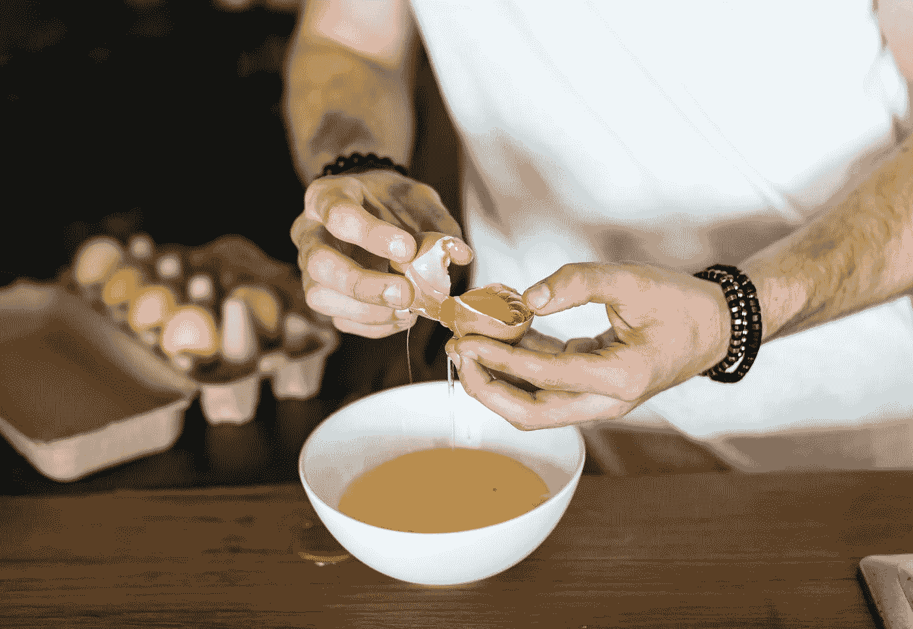

# 工作场所有毒工人的真相

> 原文：<https://medium.com/swlh/the-truth-about-toxic-workers-in-the-workplace-41d0d270f709>

Originally published on [**JOTFORM.COM**](http://jotform.com)

你在为一个特殊的场合烤蛋糕。你要确保所有的原料都是高质量的——从有机面粉到手工可可。

原来你的一个鸡蛋破了。你注意到它不太新鲜的味道，但还是决定使用它。

一个鸡蛋能有什么不同？