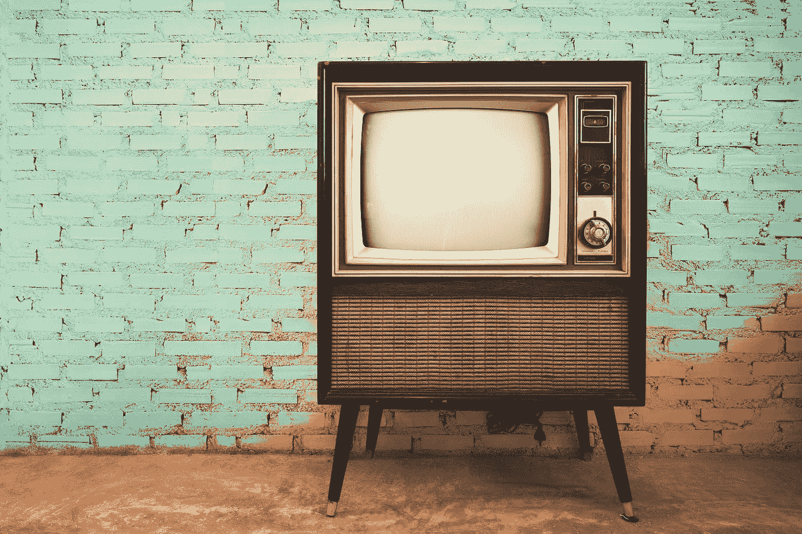

# 我真的讨厌电视的真相

> 原文：<https://medium.com/swlh/the-truth-why-i-really-hate-tv-c58b2584d942>

## 你需要关掉它来过一个快乐的、富有成效的生活。

Retro old television in front of vintage wall ©jakkapan

当人们知道我没有电视机时，常常会感到惊讶。

我不看电视的事实使我在成年生活的大部分时间里都不适应社会。

这不是我刻意选择的事情。电视是以我的家庭生活为背景播放的。