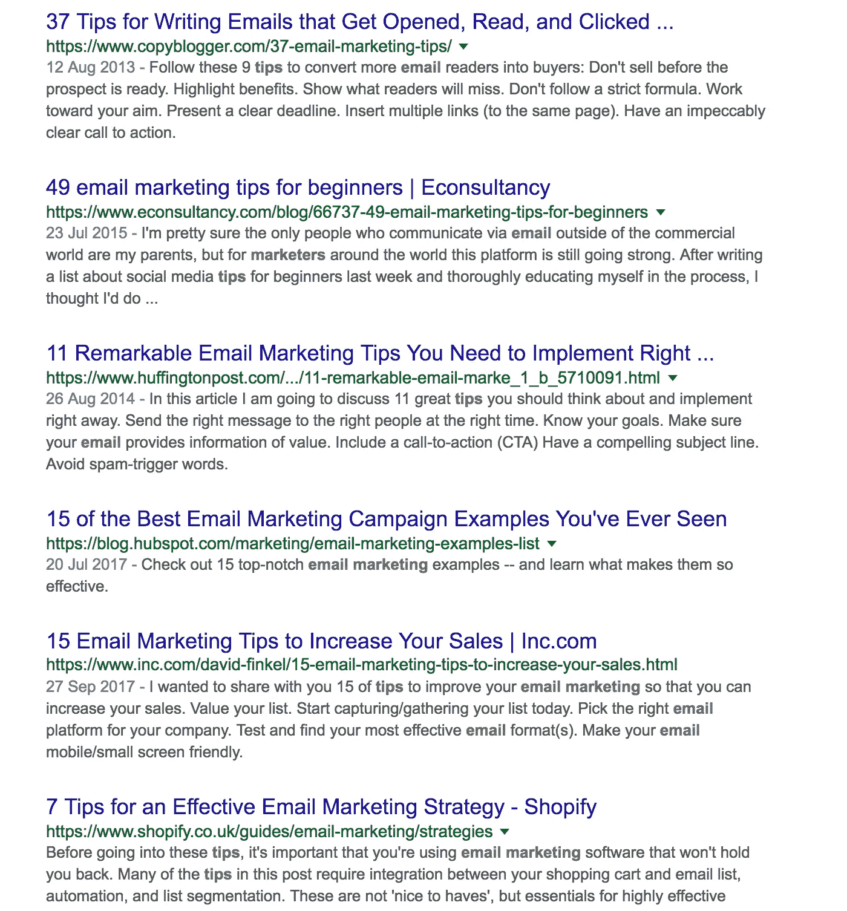
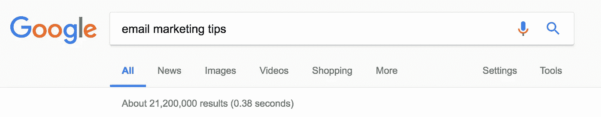
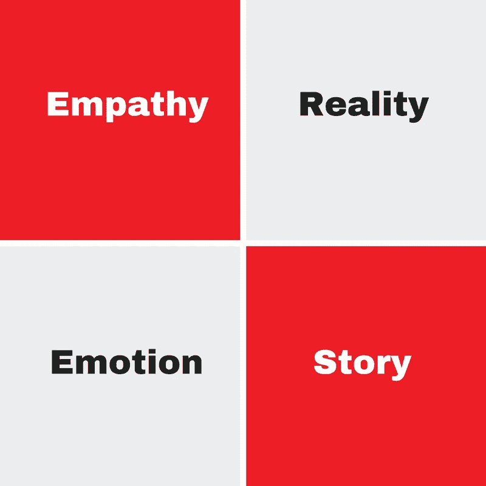

# 真相？你的 B2B 内容营销很无聊

> 原文：<https://medium.com/swlh/the-truth-your-b2b-content-marketing-is-boring-4aaae3a36586>

你有没有看过一篇博文，然后说“哦，我真希望我能写得像那样”？我知道我有。我定期阅读博客文章&我完全理解当你阅读一篇好文章时那种几乎无法抗拒的感觉。当你看到大部分内容时，我也会想:B2B 内容很无聊。

也许你就是写那些枯燥乏味的博文的人？如果你是，我在这里帮助你开始写博客，让你和其他人说:“是是是”。

# 不同种类的内容。

任何文体都有不同的内容。谈到 B2B 博客的营销内容，可以归结为两种类型。

# 填料含量

经常让人们说“是，是，是”的内容。

对许多人来说，也许对你也是如此，创造内容并不是你唯一的工作角色。你还有其他事情要做。由于这个原因，内容也许不是最重要的。在这种情况下，由于时间限制，您更有可能创建填充内容。

如果你的内容没有得到很高的评价，很有可能你正在写填充内容。填充内容无处不在。我保证如果你有一个博客帖子的想法，它已经被写好了。填充内容通常不会引起任何人的兴趣，因为它没有什么新意。

把填充内容想象成给你的姑姥姥买一张卡片。你并不真正喜欢或了解她，所以你像其他人一样买了一张普通的卡片，结果她在生日时收到了一系列几乎一模一样的卡片。

当然，填充内容很容易。你所要做的就是用谷歌搜索你提议的博客标题，阅读一些已经存在的博客文章，根据这些知识，写你的文章。简单吧？可能简单但不代表好。

看到填充内容成为“病毒”的可能性微乎其微。没人在乎，因为他们以前都读过。

这样想吧。当一个简单的谷歌搜索显示所有这些伟大的文章时，为什么会有人阅读你的通用“你必须知道的 3 个电子邮件技巧”的博客文章呢？

事实上，“电子邮件营销技巧”有超过 21，000，000 个结果。你脱颖而出的可能性并不高，除非你能创造出一流的内容。

像许多其他人一样，你可能面临的问题是，你认为填充内容是你所能创建的，因为创建其他类型的内容需要很长时间。你认为其他类型的内容需要几个月的时间来整理，尤其是你已经很忙了。但事实并非如此。

提示:如果你很难找到时间来创作高质量的内容，为什么不看看这个资源[免费内容营销工具](http://copyandcheck.com/free-content-marketing-tools-saas/)来帮助你更有效地创作内容。

# 有用的内容

第二种类型的内容是人们错过了创造的内容。它的内容经常让人们说“是，是，是”，并回到您的网站来查看未来的更新。

第二种类型的内容让人们说“是，是，是”，因为它表达了一些新的东西

让我们回到电子邮件营销的例子。好吧，你想写一些关于电子邮件营销的东西，因为你认为你的读者会喜欢。

即使你没有时间或能力写一本 7000 字的关于电子邮件营销技巧的电子书，你仍然可以说一些关于这个领域的新东西。

人们来你的博客是为了学习一些东西，因为他们认为你是权威，知道你在说什么。当他们到达那里时，不要让他们失望，重复他们已经读过的内容。

任何人都可以编制一份电子邮件技巧清单，但只有少数人会花时间去思考他们能给电子邮件营销领域带来哪些新的信息、数据或想法。

你想知道另一个关于“是是是”写作的秘密吗？

都在瞄准。好的“是是是”写作的目的不是写一篇只有讲师才能理解的学术文章；“是是是”写作的目的是帮助你的读者更清楚地理解一些事情。

看看一篇你认为不错的博客文章，你的反应是“是，是，是”。

*   他们的内容不好，因为他们使用了技术词汇。
*   他们的内容不好，因为他们很好地运用了拼写和语法。
*   他们的内容不好，因为他们每段使用了 10 个统计数据。

他们的内容是好的，因为他们通过新的视角来看待内容，并以你还没有考虑到的方式给你信息。因此，虽然你的 b2b 内容很无聊，但他们的却不无聊。但你似乎就是搞不清楚为什么会这样。

# 如何让自己不再写无聊的 B2B 内容？

要停止写无聊的帖子，有三个步骤:

1.  决定你想写什么样的内容
2.  用谷歌搜索一下，看看大多数人是如何呈现信息的。
3.  思考这个话题，试着用新的眼光去思考。你怎么能说一些新的东西呢？

现在你已经不写无聊的 B2B 内容了，怎么写有趣的内容呢？

我们经常给我们的代理商客户布置一个任务，看看他们当前的内容，看看他们如何通过用新的眼光来改进它，但是他们发现这很难。

看待内容有四种核心方式:

1.  神入
2.  现实
3.  情绪
4.  故事

同理心:同理心包括向读者展示你理解他们的问题。**例子**:你不确定一个科学事实，你愿意让一个哲学博士讲师对你说“这太简单了，你怎么能理解这个呢*不*？哇，你一定是真的很笨”还是你更希望有人坐下来，解释并让你知道不理解是完全正常的，从不理解到理解很容易？

通过同理心，你让那个人放心，他们的问题没问题，很容易解决，你将是解决问题的人。做到这一点，你就能在帖子结束时让对方回答“是，是，是”。

**现实**:展现问题影响现实中的人。写下类似“你有过……的问题吗？”，“感觉像……真的很常见”让他们知道他们的问题存在于现实世界中，他们更有可能听取你的解决方案。记住，一篇博客文章应该尝试解决一个问题。如果没有，你只是在毫无理由地把文字扔到互联网上。

**情感**:你需要诉诸人们的情感。这并不是说你要在每篇文章的开头写一个催人泪下的故事。但是，要让你的读者相信他们阅读的内容来自一个真实的有感觉的人。你看过多少次飞机起飞前给你的信息说:“是是是”？我的猜测是从来没有，因为它不是情绪化的，它没有任何意义(除了生命或死亡，如果你不正确地遵循指示)。但事实是，你并不在乎。

**故事**:围绕一个故事构思你的内容。“金发姑娘和三只熊会怎么看待这三个升级你网站的理由”。人天生爱说闲话。他们喜欢故事。事实是，故事比其他形式的内容更容易阅读和消化。我们迷失在故事中，故事背后的信息也随之而来。这是给你的内容添加“是，是，是”的完美方式。

# 你怎么把这些联系起来？

回到我们的电子邮件营销示例:

# 标题:

我们从电子邮件营销中学到的关于客户的可悲事实**(故事)**

我的电子邮件营销转化率很低，直到我发了这封邮件… **(故事)**

# 介绍内容

当我们第一次尝试电子邮件营销时，我们认为我们知道自己在做什么，但是像你一样，我们犯了一些严重的错误

在这篇博文中，我将向你展示我第一次尝试电子邮件营销时犯的错误，以及我用来改进它并使我的转化率提高 46%的确切框架。**(感同身受)。**

# 最后的想法

人们通常认为 B2B 和 B2C 内容的区别在于它需要有多无聊。当然，如果你写的是关于[咖啡](http://coffeeandcheck.com/)的文章，你可能会从你的内容中获得更多乐趣，但这并不意味着你的 B2B 内容一定很无聊。

*看，一点也不难是吗？为什么不为自己的公司写一篇博文呢？选择一个普通的、无聊的、以前做过的话题，把它变成真正吸引人的东西。当你看完之后，请在评论中随意链接。我很想看看你创造的东西。*

*原载于 2018 年 3 月 23 日*[*copyandcheck.com*](http://copyandcheck.com/b2b-content-is-boring/)*。*

## 这篇文章发表在 [The Startup](https://medium.com/swlh) 上，这是 Medium 最大的创业刊物，拥有 309，732+读者。

## 在此订阅接收[我们的头条新闻](http://growthsupply.com/the-startup-newsletter/)。

