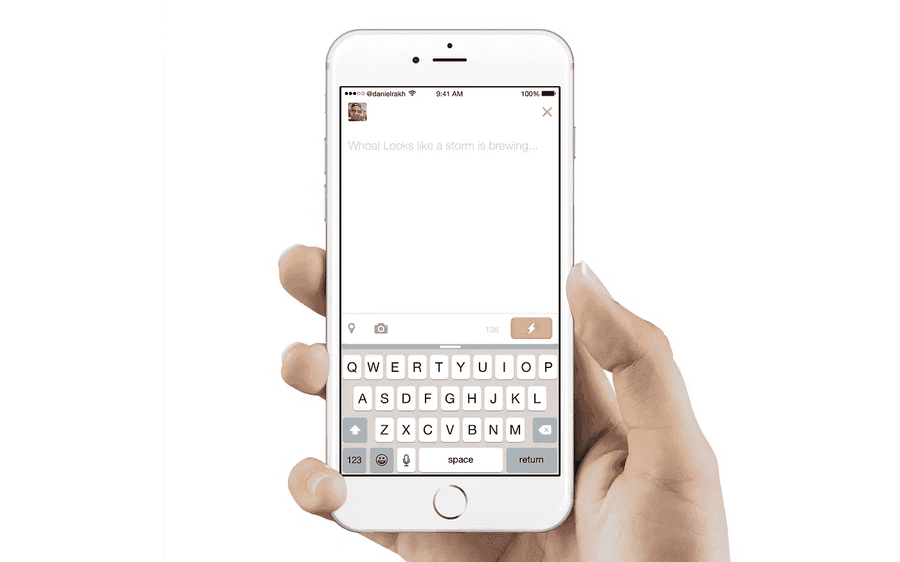
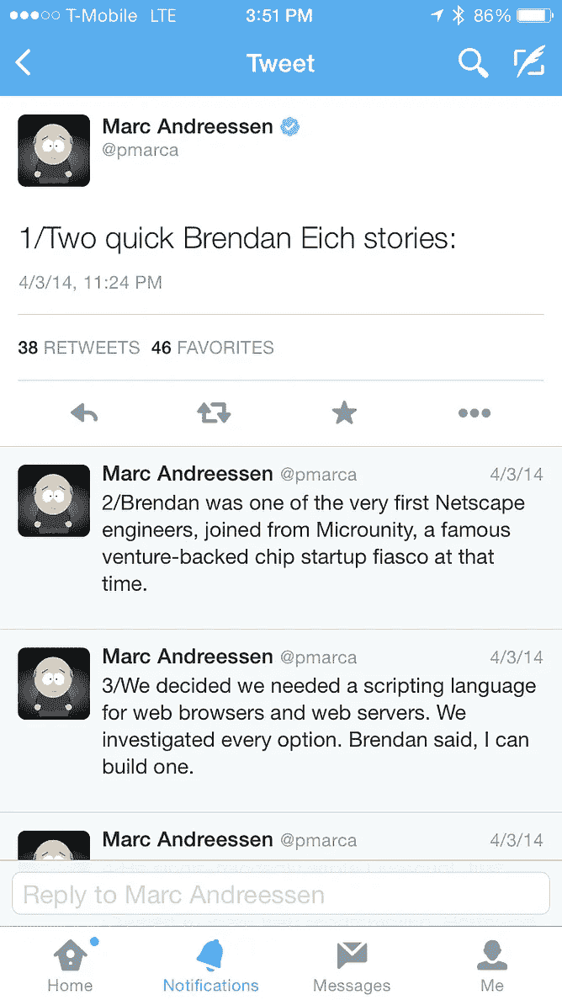
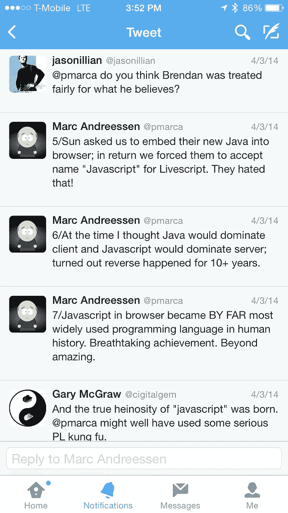
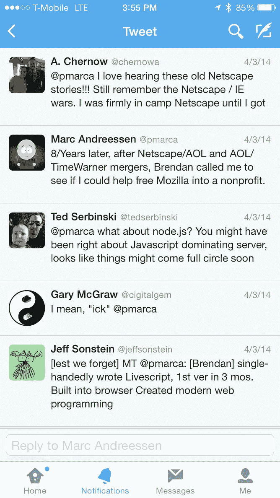
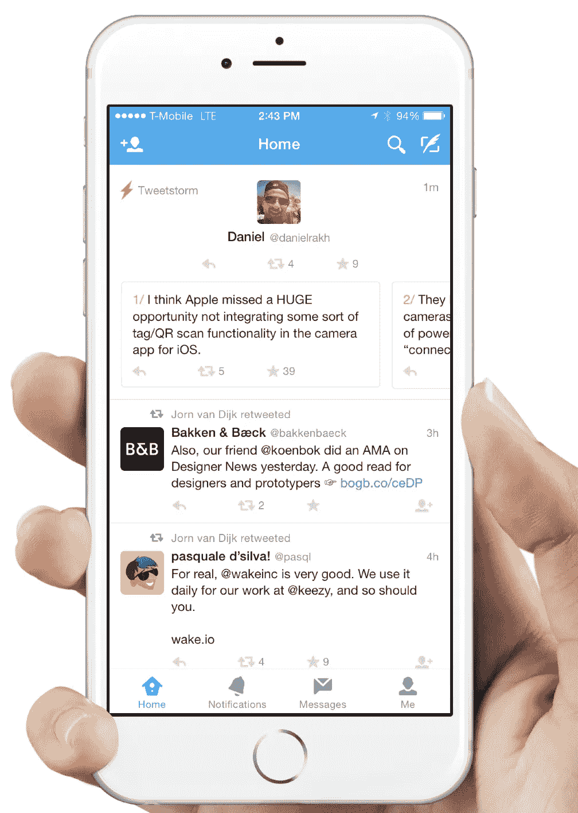

# Tweetstorm 简介

> 原文：<https://medium.com/swlh/the-tweetstorm-373bd7e5eb54>

# 将新兴的推文风格设计到 Twitter 中。

注意:这篇文章最好在桌面上看，尽管你也可以在手机或 iPad 上看。给它一点时间完全加载。谢谢！:)

# 暴风雨前的平静…

在这篇文章中，我将探索一个我已经原型化的新特性，我认为 Twitter 应该为这个平台上的一个新兴构造引入这个新特性。

为了理解*如何* Twitter 应该采用这种新的结构，我们首先需要理解*为什么*它应该…

最近在 Twitter，公司内部一直在大力吸引新用户加入这个平台。平台内新用户的增长是一个高度优先的事项，它绝对值得大量关注。Twitter 是我们这一代最卓越的网络之一，应该有更多的人能够体验它所提供的一切。

然而，与此同时，重要的是 Twitter 不要忘记倾听现有用户的声音，尤其是最狂热的用户或超级用户。

为什么？

首先，超级用户驱动平台内的大部分内容。他们是发微博最多的人。这反过来又让常规用户(主要阅读推文的用户)留在平台上，同时也为冰箱提供新鲜食物，吸引新用户。

但更重要的是，Twitter 的许多定义性功能实际上是从社区中的**出现的，并由超级用户推广，最终被构建到实际的产品中:**

## 第一个#标签:

## 第一个@回复:

## 第一条 RT:Retweet:

> 最近，平台中出现了一个新的构造…
> 
> 推特风暴。

# 一场风暴正在酝酿…

这种类型的推文可能已经存在多年了，但最近它因一个更著名的超级用户而流行起来，他的名字叫 [@pmarca](https://twitter.com/pmarca) 又名马克·安德森——更出名的是为我们带来了互联网上不太重要的进步，如第一个真正的网络浏览器，以及一些名为 Netscape 的公司。

## 第一个* @pmarca Tweetstorm:

不久之后，其他用户开始以这种方式快速发推，剩下的就成了历史。

那么推特的这种*风格*到底是什么呢？我们来分解一下…

> tweetstorm 是一系列相互关联的快速推文，但也是更大的潜在想法或观点的一部分。

推特风暴有三个关键的定义特征:

1.  **速度**:推文一条接一条快速传来。
2.  主题:推文彼此相关，但更重要的是与更宏大的想法或主题相关。
3.  **强度**:他们声音大。由于其泛滥的速度，有些人可能会认为这是垃圾邮件。

既然我们已经了解了推特风暴是如何形成的，那么让我们来看看今天的推特风暴。

# 进水警报生效了！

所以你现在可能在想:

“等一下……我以为 Twitter 是用来发送小信息的。是不是马上发很多推文有点像你知道的…垃圾邮件？我为什么要这么做？”

我会告诉你是和不是。是今天这样做的方式，而不是我提议 Twitter 应该实现它的方式。

所以，让我们看看今天是如何做到的:

嗯…我感觉一场推特风暴正在酝酿。我拿出闪亮的新 iPhone 6，打开 Twitter，进入撰写页面，写下我的第一条推文:

We finish up our first tweet only to have to be dumped into the tiimeline to find that tweet so we can continue it.

所以我们马上就有了糟糕的经历。首先，我牺牲了我宝贵的 140 个字符中的 3 个来开始我的数字标记。我为什么要这么做？嗯，这是因为我的风暴在我的追随者的反馈中显示方式的细微差别。

在我完成我的第一条推文后，我被扔进了 feed，我不得不快速向上滚动，点击我的推文，然后继续我的第二条推文。

那么为什么会有细微差别呢？

这是因为今天的 Twitter 不是为这些快速连续的推文而设计的。因此，人们最终围绕它进行修改，以使其易于被观众理解。

人们找到了一种绕过它的方法:

Using the @reply to myself to hack up a threaded feed-view for my storm.

当我在 feed 中找到我的推文后，我会回复自己并继续标记我的号码。我不得不删除我预先填充的句柄，在我开始第二条 tweet 之前，我又一次牺牲了一些字符。

当我看到我的第三条推文时，我想看看我离开的地方，所以我向上滚动并放下键盘。然后，我必须再次按下文本字段才能继续。

我知道这些只是小烦恼，但它们确实会积少成多。

所以我为什么要@回复自己？我就不能继续，从数字“2/”开始吗？

我可以，但我不会让 Twitter 创建这个漂亮的设计**来跟随对话**，但不会让你通过做这个黑客而与你自己有本质上的联系。

If I did everything correctly I’ll get this nice threaded view but it still requires people to click on a button to see more about my storm.

如果我幸运的话，我会得到这样的东西。还不算太差。我得到了一个很好的小线程链接我的推文在一起。这仍然有点麻烦，因为我的 Tweetstorm 的最后两条推文没有意义，除非我按下“两个以上回复按钮”来连续阅读它们。那么，我现在为什么要看到那些推文呢？

让我的头像和手柄一遍又一遍地显示也是多余的。你知道这是我的推特风暴。你不需要在每条推文中都被提醒是我发的。

然而，更多的时候…我会以这样的方式结束:

Most of the time this actually happens. My tweets are scattered throughout the feed.

看起来风暴变得相当大…我的推文最终分散在整个 feed 中，我的追随者真的不得不依靠我的编号。把一些其他人的回复扔进去，风暴就变得令人厌恶了。呸！

我可以继续深入到消费和创作推特风暴的更多细微差别。但是我认为在这一点上很明显…

> 今天的推特不是为推特风暴而设计的。

那我们要做什么？

# **完美风暴。**

这就是事情变得有趣的地方。让我们看看我们是否能设计出一条走出今天这种糟糕经历的路。当我们探索新的设计时，我们也将触及 Tweetstorm 的一些关键概念。

## 推特风暴是为超级用户准备的。

让我们搞清楚一些事情，tweetstorm 的构造不是为普通用户准备的。大多数用户甚至不发微博，但光是他们就有 5-12 条微博值得一说。每个人都应该有推特风暴的能力，但不应该被推特鼓励。

> 这给我们留下了一个有趣的设计挑战…
> 
> 我们如何将这种超级用户特性集成到当前的 Twitter 体验中，而不使普通用户的体验变得复杂？

在我们进入设计之前，我想指出，我真的希望这看起来和功能像 Twitter 明天可以发布的东西。我们的目标不是重新设计车轮，而是试图将它无缝地整合到现有的设计中。

不管怎样，我感觉一场风暴正在酝酿…

我们像往常一样打开撰写页面。只不过这次不是开始我们的第一条微博。我们输入一个小秘密组合:“☁️⚡️”，就这样我们被提示进入姑且称之为“风暴模式”。那么到底什么是“风暴模式”呢？

让我们点击⚡️按钮，看看它会把我们带到哪里…

## 一种新的约束类型:

Twitter 的魅力在于 140 个字符的简单约束如何塑造整个平台的体验。然而，我们今天所知的 tweetstorm 的想法与这一限制直接冲突。它的目的实际上是绕过 140 个字符，去野外。这种叛逆的自由也导致了对推特风暴的滥用和不当使用。

推特风暴的极限是多少？

是 10 条推特吗？

是 5 吗？

是 20 吗？

没有。

这就是问题所在。另一个问题是，tweetstorm 的真正目的是在某个时刻快速发布 tweet*,但也有人们断断续续地持续发布 tweet 一个小时的情况。*

> **我建议我们引入一种新的约束类型:“时间”**

一旦你进入“风暴模式”，你会被提醒“你有 5 分钟(300 秒)的时间来发微博！”

就是这样。

这个约束是为了让你的风暴保持在一个合适的大小。

我是怎么得出这个数字的？我算了一下，写一条普通的推文大约需要 30 秒。这意味着，在 300 秒内，你应该能够发出大约 10 条推文，我认为这对于一场风暴来说是一个可以消化的规模。

但更重要的是，这种约束为你的追随者增加了一些其他的体验。这种“别的东西”是让风暴激动人心的秘方。我们很快就会看到那到底是什么。

但是现在，让我们回去造雨吧！...urrrm 我是说 Tweet:)

我们再次点击⚡️按钮…

## 不间断的简化推文:

我们被扔进一个屏幕，在那里我们可以开始我们的第一条推文。一旦我们输入一个角色，倒计时就开始了。

这里有两件事需要注意:

1.  你的推文前面的“#/”仍然存在，但现在它有了真正的目的，而且不需要任何成本。“#/”将会把 ***而不是*** 计入你的字符限制，它还将服务于另一个目的，我将很快演示。
2.  完成后按下“tweet”按钮并不会关闭撰写屏幕，而是让你回到你的 feed 来找到 Tweet 并“@回复”它。你应该继续不间断地发微博。

## 失去了思路？只是向后滚动。

当你在暴跳如雷的时候，你要确保每一条连续的推文和你刚刚发布的其他推文是有意义的。风暴的意义在于它是源源不断的思想。有时你会被难倒。现在，你不必在风暴中人们对各种推文的回复中筛选你刚刚写的内容，你可以获得清晰的体验，及时回到过去，看看你刚刚发布的内容。你在这个演示中看不到它，但允许这个人编辑之前的推文可能是有意义的。

我们现在完成了强攻。让我们看看硬币的另一面。

我们的追随者如何经历我们的风暴？

## 清除进料:

你风暴的意图是让它大声。你想让它被看到。一种方法是接管你的追随者的饲料。我甚至称之为垃圾邮件，这绝对是人们对风暴最大的抱怨。

> 目前感觉你在欺骗我们都同意的系统。

另一种被看到的方式是从人群中脱颖而出…或者在我们的情况下，在你的 feed 中的其他推文中脱颖而出。事实上，这就是为什么带图片的推文比纯文本推文有更高的喜爱率和转发率的原因。当你浏览提要时，它们会吸引你的眼球。

我们打算这样做:

这里有几件事需要注意，所以让我们一步一步来:

你应该注意到的第一件事是，风暴现在本身就是一条推文。事实上，我们可以将这场风暴定义为“推特中的推特”。以这种方式将它们分组在一起可以减轻垃圾信息的问题，同时还能在其他推文中保持足够大的区别，以吸引你的注意力。每条推文仍然保留其回复、转发或收藏的基本属性，但现在你可以对整个风暴本身这样做。

这很关键，原因有三:

1.  这与风暴的定义特征是一组相互关联的推文的前提是一致的。
2.  如果你的目标是被尽可能多的人看到…这给了人们一个好的和干净的方式来分享你的风暴给他们的追随者，而不是仅仅转发它的一部分，让人们试图把事情拼凑起来。
3.  每条推文仍然保持其独立性，是一个独立的单元，可以有自己的回复线程，但仍然以简单干净的方式给出上下文。

接下来要注意的是风暴左上方的“⚡️”。现在事情变得有趣了。还记得我之前提到的秘制酱吗？这就是了。

当你赶上一场正在发展的风暴时，会有一种特殊的体验。

> 这是 Twitter 实时生活诱惑，但却是兴奋剂。

感觉就像你真的在那一刻，见证了一些独特的事情发生。

现在你实际上可以跟踪风暴的发展。事实上，你甚至可以看到风暴还剩下多少时间，这样你就可以判断你是想现在回复什么，还是等着看这个人还有什么要发。

接下来要注意的是在你开始一条推文之前的“#/”标签。我之前提到过这个，并说它现在可以有一个真正的目的了。目的是它作为一个标签，引导回到真正的风暴。假设你关注的一个人转发了他订阅的一场风暴的“6/”。现在，当你看到那条推文，并想真正了解其背景时，你不必筛选 stormer 的反馈来查看它来自哪里。你只需点击它，你就会看到整个风暴的主要推特。

# **余波…**

因此，如果这让你相信有更好的方式来发布推特风暴，你可能仍然会认为这与推特的前提是对立的。

**“推特是关于推文的！发微博是作弊！去开个博客什么的！”**

嗯，如果你从表面上看 Twitter，这是一个公平的观点，但让我们试着从不同的角度来看它。让我们透过细胞的透镜来看问题。

什么是细胞？细胞是生物体最小的结构和功能单位。当它们被组织在一起时，它们创造的东西要比其各个部分的总和更大。它们制造组织，组织制造器官，器官制造器官系统，器官系统组合在一起构成一个有机体。

现在，当我们把推特看作是以一条推文开始，以一条推文结束的东西时，我们实际上是在说，有机体的细胞*就是有机体的*。它是最终的功能和结构单位。

我不认为这是看待 Twitter 的正确方式。

> “推特”不是有机体，而是细胞。

就像一组独特的细胞组成器官一样，一组独特的推文可以创造出比几条推文更伟大的东西。我相信“推特风暴”的概念就是其中之一。事实上，我认为 Twitter 的有机体需要更多这样的概念，才能进化成比今天更伟大的东西。

但不要相信我的话，这里有一个现任 CEO 和 Twitter 的简短视频，解释了“140 个字符”的起源故事。请仔细听后半部分，他对推特究竟是什么的看法。

**也许是时候开始思考推文之外的事情了……**

## 如果你喜欢这篇文章，请点击推荐和分享按钮: )

GIF 降低了原型的质量。**如果你想玩你在这篇文章中看到的互动原型，你可以在这里****。仅记住台式机/笔记本电脑，不要忘记将“☁️⚡️”粘贴到字段中以开始使用。**

## **我是谁？**

**我是一名具有工程意识的产品设计师，也是一名来自纽约市的具有设计意识的 iOS 工程师。我也碰巧想加入一个充满激情的团队，开发一些伟大的产品。如果你感兴趣，让我们聊聊:danielrak@me.com 或[@丹尼尔拉克](http://twitter.com/danielrakh)**

**另外，你可能会喜欢我写的这些帖子:**

** [## 重新设计 Twitter 时刻

### 一项重新想象 Twitter 最新功能的概念设计研究。

medium.com](/p/f71658bbde68)  [## Twitter 房间

### Twitter 的产品设计提案。

medium.com](/p/e6f34e843e9a) 

# ⚡️

## 感谢您的阅读！

*发表于* **创业、旅游癖和生活黑客**

-**