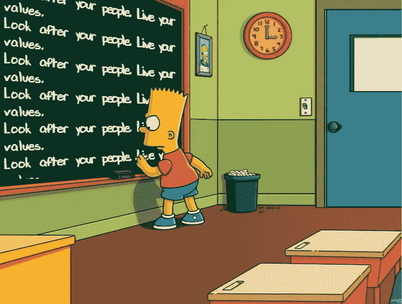

# 我的首席执行官教给我的最重要的两件事

> 原文：<https://medium.com/swlh/the-two-most-important-things-my-ceo-taught-me-8b427bb18df5>

我的上一任 CEO 教会了我很多东西，但是，如果要我记住最重要的两件事，那就是:

照顾好你的人。活出你的价值观。

我把这条建议草草记下，放在我的桌子上，作为每天，也许每小时的提醒。

上周很难熬。我们不得不与我们在纽约的两名员工分道扬镳，我们现在是一家小公司，两人是一个大数目，留下了很大的缺口。这是我们的决定。我们的野心战胜了我们，我们只是还没有准备好扮演他们的角色。

这个决定不是针对个人的，但是这个决定的影响是非常个人的。这是我很抱歉的事情。

经历这些步骤让我想起了美国雇主和雇员之间苛刻的，可以说是残酷的标准合同。你可以没有理由，没有通知就解雇某人。就是这样。

我们是一家初创公司，推出产品已经两年了，开始销售也已经一年了。每一美元都是宝贵的，犯财务错误会让人很痛苦。但我绝不会告诉某人他们失业了，让他们在不知道下一块钱从哪里来的情况下离开。

# 照顾好你的人。活出你的价值观。

我们的价值观之一是“善待他人”。这可能是我最喜欢的价值观，因为我认为它会引导我们的道德指南针，尤其是当狗屎击中风扇。对于我们的两个前队友，我们尽可能的慷慨，尽可能的支持。

让他们离开的过程让我想知道，在没有任何真正线索的情况下，有多少公司从初创公司到大型企业“随意”解雇员工，只是因为他们只知道这些？这让我想知道我可能习惯性地每天做些什么，因为这是我曾经做过的所有事情。

所以我又做了一张纸条放在我的桌子上，提醒我用不同的方式思考我所做的一些决定，看看它是否能激发出另一条道路，一个更好的答案。下一次我们雇佣队友时，我们一定会查看雄心气压计。

## 这篇文章发表在[《创业](https://medium.com/swlh)》上，这是 Medium 最大的创业刊物，有+366，567 人关注。

## 订阅接收[我们的头条新闻](http://growthsupply.com/the-startup-newsletter/)。

