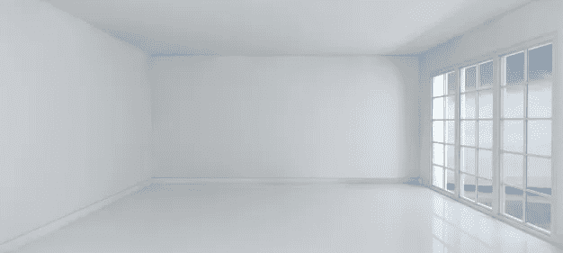
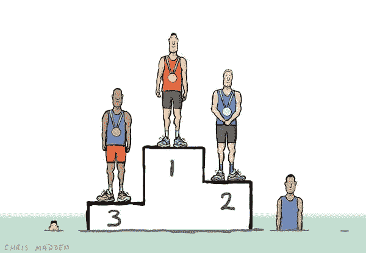

# 生产力的两个阶段

> 原文：<https://medium.com/swlh/the-two-stages-of-productivity-4b61727bae76>

Medium 是生产力文章的一个很好的来源，如果你像我一样，你会经常阅读不可思议的文章。

从那里你会得到灵感的爆发，全力以赴于所呈现的想法，然后在一个月后回到你之前所在的地方。

很多你读过他们文章的人，他们的生产力和组织水平都比你我高。

因此，尽管他们的文章鼓舞人心，但听从他们的建议可能没有帮助。

> 生产力有两个阶段；
> 1。富有成效的生活和
> 2 的最终目标。实现这一目标的第一步。

# 自知

关键是要有自知之明，并测试你在哪里。

这是一个私人练习，所以你可以对自己完全诚实。

一开始你越诚实，从长远来看，你的结果就越好。

如果你已经准备好接受一种会产生“非凡”结果的“非凡”生活方式，那就给你更多的力量。

但我知道我不是。

我不能在凌晨 2 点醒来，冥想 3 个小时，锻炼 4 个小时，读马可·奥勒留的《冥想》。

在采摘、加工、烘焙和酿造我自己的咖啡之前。

我是一个努力成为更好的自己的学生。

对我来说，我想比平时早一个小时起床，这样我可以更有效率，更有条理，并得到更多的锻炼。

一旦我开始，就有可能产生滚雪球效应。

但你必须经历早期的，不那么令人兴奋的阶段，才能到达不可思议的阶段。

让我从一些常见的生产力技巧中给你举几个例子。

## 早起

现在我们都同意早起是有益的。

这个世界通常是安静的，你没有分心的事情，在你的注意力被日常生活占据之前，你有能力做一些重要的事情。

但是我们大多数普通人不能从早上 7-8 点开始工作到 4-5 点，这是不可能的。

即使它只是暂时的，你也可以打赌它不会成为一个长期的习惯。

与其走极端，不如比平时早 30 分钟起床，做一些对自己有益的事情。

兼职，阅读，跑步，祈祷，吃一顿健康的早餐。

当你开始关注自己时，你会在一天中感受到好处。

一旦养成了 30 分钟的习惯，那 1 小时就不再是一件苦差事了。

这将是一个机会去做一些你喜欢的事情，或者提高你的生活质量。

## 极简主义浪潮

现在我承认，当我第一次读这些文章时，我 100%被吸引住了。

极简主义有一种神秘的东西，就像那些人对生活的理解一样。

他们已经摆脱了资本主义的陷阱，靠自己需要的东西生存。

所以你需要做的是雇一辆卡车，把你所有的东西都装进去，你的衣服……不见了，你的技术……不见了，你奶奶传下来的那个‘珍贵’的传家宝花瓶(可悲)……不见了。

如果你最终拥有不止一条内裤，你就不是一个真正的极简主义者。

如果是这样的话，希望我作为一个真正的极简主义者失败得很惨。

我毫不怀疑扔掉垃圾和杂物的好处。

不仅是为了空间，也是为了精神组织、清晰和节约成本。

但是让我们从第一阶段开始，从那里进步。

从每天整理 15 分钟开始。

这几乎没有时间，但将确保你留在任何混乱的顶部。

几个星期后，你会开始明白什么阻碍了一个干净的家/房间，什么需要搬走。

从那里你可以进入一个更大的清理空间，因为你已经处于整洁和巩固的思维框架中

# 本文的最后阶段

看金牌标准很重要。

看看如果你在个人发展的最高水平上运作，生活会是什么样子。

但是要认识到，当你离奖牌位置还很远的时候。

不要在第一次尝试中追求金牌，拉伤肌肉，一个赛季不能参加比赛。

让我们意识到我们的个人水平以及我们的下一个阶段是什么。

通过专注于可实现的目标，然后实现它，你就为自己的长期发展做好了准备。

#productivegang

关注我的一系列文章类型。

我不能证实，但我听说如果你拍我的文章一堆，一个信封的现金会在第二天到达你的门口。

## 这个故事发表在 [The Startup](https://medium.com/swlh) 上，这是 Medium 最大的创业刊物，有 290，182+人关注。

## 订阅接收[我们的头条](http://growthsupply.com/the-startup-newsletter/)。

☺