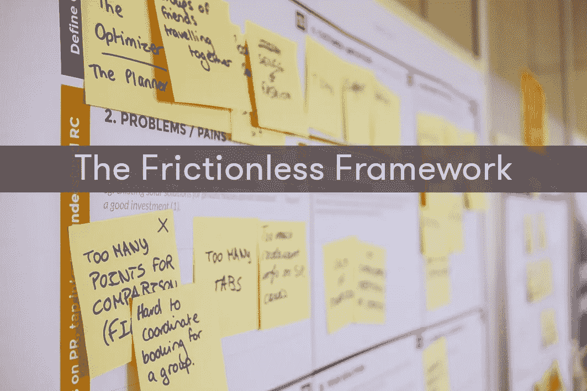
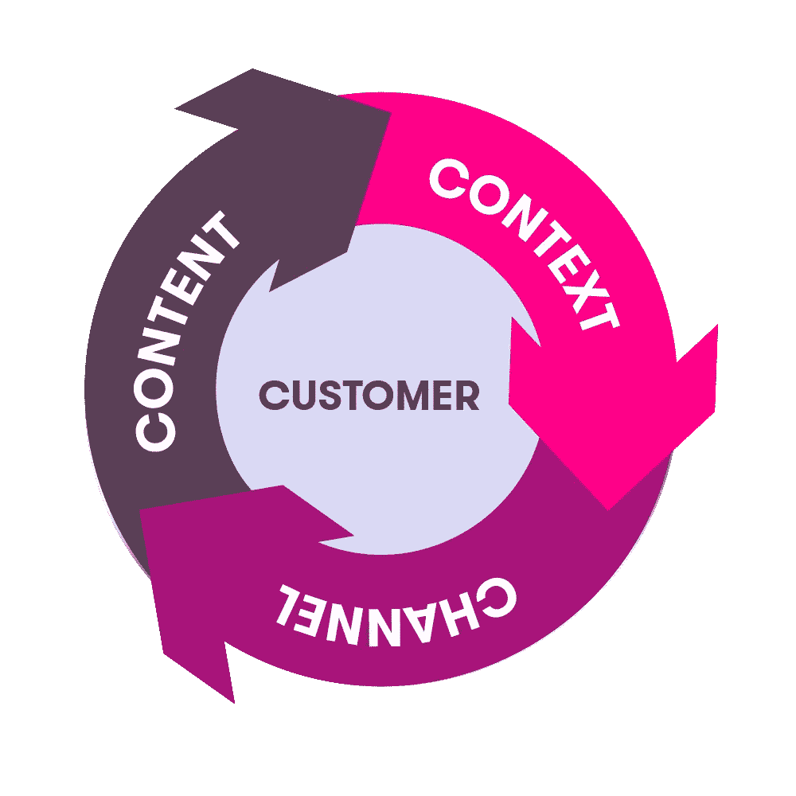
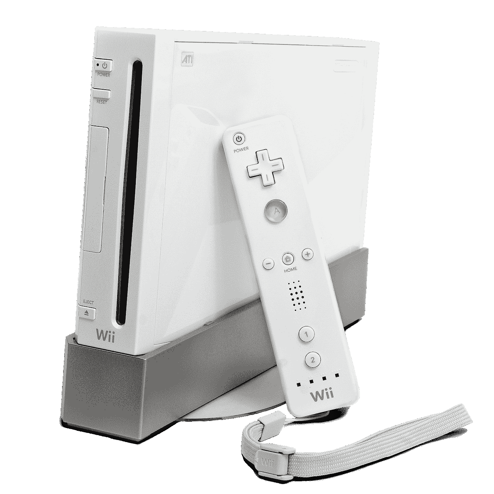
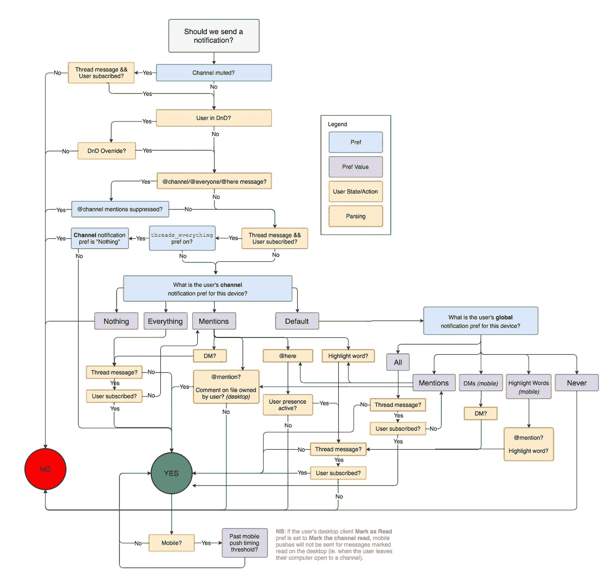
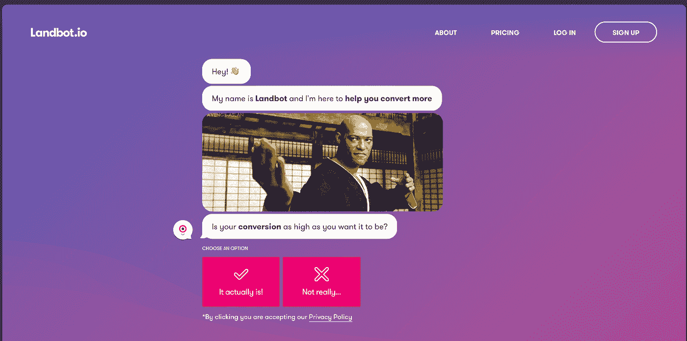
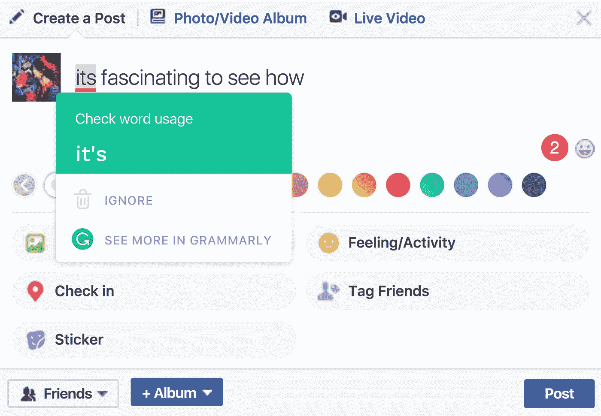

# 终极商业竞争优势:无摩擦框架

> 原文：<https://medium.com/swlh/the-ultimate-business-competitive-advantage-the-frictionless-framework-94a6f482116e>

几个月前，我第一次写了关于[无摩擦客户体验](/landbot-io/frictionless-customer-experience-the-new-business-competitive-advantage-e4381d74e0b1)的概念。我相信 FCX 最终的竞争优势应该是成为市场领导者并获得长期成功。

这篇文章引起了巨大的反响，许多人在社交媒体上分享它，或者在他们的个人博客上转载它。我真的受宠若惊，这么多人对这个概念感兴趣，这感觉就像一场运动。有些读者甚至来找我分享自己的经历。

在与一些真正聪明的人聊天后，我意识到我最初的无摩擦客户体验框架是不完整的。所以我做了一些更详细的研究来更好地理解这个话题。今天，我想和大家分享一下这个框架的更新，以及我从第一版开始学到的一些东西。

# 定义

让我们从无摩擦客户体验的基本定义开始:

> “在它的核心，FCX 是 4c 的结合，描述了一个公司的思维模式，该公司采用以客户为中心的方法，在正确的渠道和正确的背景下提供正确的内容。”

The Frictionless Framework

如果您将新定义与以前的定义进行比较，您会注意到一些变化:

首先，我将客户添加为框架的中心部分。在我之前的模型中，我省略了关于客户的部分，这可能非常危险，因为它可能导致模型的不同组件之间的不一致。

-其次，为了更好地记住框架的 4 个关键元素，我特意将它们重新命名，以 c 开头。我用内容替换了产品，用上下文替换了时刻。

-最后，在上一篇文章中，我将该模型描述为线性和简单的东西，您可以一个接一个地拟合元素:产品>时刻>渠道。但是，正如您在当前模型的图表中所看到的，所有 4 个元素必须相互对齐。

# 顾客

正如我之前提到的，客户是框架的中心，这反映了它的重要性。最基本的是**企业的所有战略都从客户开始**。

我们可以将客户理解为有问题或需求的人，我们作为一个企业正在积极努力解决这些问题或需求。

客户可以是内部的(在公司工作的员工)或外部的(向公司付款的客户)。定义客户时，我们应该考虑 3 个方面:

*   **客户统计**:谁是我们的客户？关于人口统计的一些关键因素:位置、年龄、性别、企业或消费者等。
*   **客户行为**:客户有什么需求/问题？仔细考虑所有与你的业务最相关并且你能最好地解决的需求。
*   **客户关系**:你将如何与客户互动？您将亲自与客户互动，还是通过软件平台进行更多的自助服务？

选择合适的客户是赢得竞争优势的基础。一个很好的例子就是**任天堂 Wii** 的案例。回到 2006 年，视频游戏机市场的领导者是索尼(PlayStation)和微软(Xbox)。两家公司都在为获得最好的图形和处理能力而激烈竞争。然而，当时的任天堂无力在技术规格上竞争。所以他们努力思考如何在其他领域创新。在做了一些研究后，他们意识到索尼和微软的主要目标都是铁杆游戏玩家。

Nintendo Wii

凭借这种洞察力，任天堂为休闲游戏玩家设计了一款新的游戏主机，他们不太关心游戏的图形和处理能力。作为交换，任天堂将提供一种新的体验，更好地满足目标客户的需求。结果，当任天堂推出 Wii 时，它一炮而红，销量超过了 PlayStation 和 Xbox。2009 年 12 月，这款游戏机在美国打破了单月销售记录

# 语境

一旦你考虑了谁是你的客户，下一步就是了解背景。对我来说，环境就是顾客每时每刻经历的所有周边事件。它可以是非常动态的，并且一直在变化。顾客正在工作、吃饭、与人交谈、阅读、玩游戏等吗？

微软研究院的首席研究员比尔·巴克斯顿介绍了一个非常有趣的概念，名为 **Place-ona** ，改编自人物角色，基本上描述了根据客户在每个时刻的位置进行交互的限制。

例如:如果用户正在开车，他的手和眼睛是有限的，因此与用户交互的唯一方式将是通过他的嘴和耳朵，这将是基于语音的系统的理想场景。

然而，如果用户在图书馆里，他的嘴会受到限制，但是他的手和眼睛是自由的。所以，在这种情况下，基于视觉界面的交互会更有意义。

另一个可以显著影响环境的因素是客户的活动。根据活动的不同，我们应该仔细设计体验以避免错位。例如，如果用户处于紧张的会议状态，你最不想做的事情就是打断他的日程安排。或者，如果用户正在度假，发送时事通讯来提高他们的工作效率并不是很有效。

了解客户的背景对于提供顺畅的体验至关重要。为了说明这个案例，我们可以看到 Slack 是如何设计其通知系统的。Slack 是一个非常受欢迎的内部团队通讯平台，被数百万家公司使用。他们以出色的设计和无缝的用户体验而闻名。他们做出的每一个产品决策都必须仔细研究，才能真正帮助客户在团队沟通中变得更高效。下面是“消息通知”功能的工作流程

Slack notification flow

您可以看到他们分析每个用户的不同背景的详细程度，以便他们只在用户最方便的时候发送通知。这是 Slack 成为有史以来发展最快的 SAAS 公司的关键原因。他们“仅”用了 2 年时间就实现了 1 亿美元的年收入。

# 内容

在形象化我们客户的背景后，我们应该开始处理正确的内容*。每个企业的使命是提供一个能够解决问题和满足客户需求的解决方案。

*请注意，我所说的内容指的是您可以提供给客户作为其问题解决方案的任何物质或数字产品:软件应用程序或咨询服务都可以被视为内容。

什么是正确的内容？作为人类，我们很容易受到自己对客户最好的偏见的影响。斯坦福大学进行了一项研究，一组学生被要求在额头上画大写字母“E”。下面你可以看到结果:

Different ways to write “E”

事实证明，我们可以用两种方式中的一种来画这个 E:一种是自我关注的“E ”,比如你是如何看待它的，另一种是从别人的角度来看的“E”。这种情况下，90%以上的人画的是一个自我聚焦的“E”。

这是我们设计解决方案时经常发生的情况。为了提供正确的内容，我们必须考虑两个方面:

**-前端:**它是内容的接口，用户必须与之交互。这里的关键是调整界面以最好地匹配客户的自然行为。正确前端的一个很好的例子是 Snapchat 如何设计他们的视频分享功能。以前，你在手机上看到的大多数视频都是横向模式。然而，Snapchat 意识到人们使用手机的自然位置是垂直的，所以他们围绕垂直视频设计了他们的整个用户体验，这证明是一个巨大的成功，使该公司发展到数百万用户。现在，许多与相机相关的应用都遵循这种新的设计模式。

**-后端:**它代表我们必须交付给用户的内容的信息。这里的关键是提供尽可能个性化的信息。以[对话网站](https://uxplanet.org/the-rise-of-conversational-website-cbf8edaddbf7)的崛起为例。

Landbot´s home page

今天市场上的大多数网站向每个客户提供相同的内容，这就是为什么平均转化率在 2.35%左右。为了解决这个问题，业界提出了对话式网站的概念。与静态网站不同，有了对话网站(*这里是一个* [*的例子*](https://landbot.io/homev2b.html) )，我们可以在每次客户互动中提供个性化信息。因此，公司可以获得 50%-100%的转化率和客户参与度的增长。

# 频道

如果我们在前面几点上做得很好，我们应该清楚地了解谁是我们的客户，背景是什么，我们应该提供什么内容。最后但同样重要的是，我们必须考虑的是我们与客户互动的渠道。

“客户在哪里，你就在哪里”这是每个企业成功的第一法则。历史告诉我们，每当一个新的“渠道”出现，一个全新的市场就会围绕它建立起来。那些知道如何充分利用新媒体的公司成为新市场的赢家。

如果我们将移动应用视为一种渠道，那么像 Whatsapp(移动即时通讯)、优步(按需交通)或 King(移动休闲游戏)这样的公司，如果不为新渠道从头开始设计产品，就永远不会成为类别领导者。

那么应该用什么渠道呢？要选择最佳渠道，我们需要记住一些重要因素:

*   **成本:**在您选择的渠道中，获取和服务客户的成本是多少？你应该对每个渠道获得的客户的 CAC 和 LTV 有一个清晰的概念。
*   **成熟度:**大多数渠道往往会达到一个饱和点，从这个饱和点开始，新的参与者将很难进入。例子:由于一些大公司的市场份额，现在创办一家新的移动应用公司将非常困难。如果你看看前十名应用的排名，大多数都来自脸书、谷歌、Snapchat 等公司。
*   **控制:**您应该寻找特定渠道的灵活性和可伸缩性。它是否为第三方开发者提供像 API 这样的工具；分析被渠道原生解决方案蚕食的可能风险。当 Twitter 禁止 Meerkat 出现在社交网络中时，你不会想尝试它发生了什么。

一个有趣的案例研究是 **Grammarly** ，这个星球上最好的语法检查工具。Hiten Shah 写了一篇关于 Grammarly 如何发展成数百万用户的深度评论。他们战略中的一个关键点是，他们设计的产品适合他们的客户。Grammarly 为 Microsoft Office 和后来的 Chrome 扩展构建插件，这样人们就可以在他们最需要的地方使用它:写帖子、填写工作表单、编辑文本文档等。

User using Grammarly inside of Facebook

# 最后的话

只是关于框架的一些最终想法。首先，确保 4c 之间的一致性非常重要。我们应该采取的方法是始终以客户为中心，并与 Cs 的其他部分保持一致。通过这种方式，我们可以发现我们的框架中很容易产生摩擦的不匹配。例如，企业 B2B 公司在 Snapchat 上工作没有多大意义，因为他们不会吸引正确的客户。其次，无摩擦框架可以(应该)应用于客户从获得到保留的任何阶段。我们提供的体验必须根据客户所处的阶段而变化。

*你对 FCX 有什么想法或例子吗？请在评论区告诉我。如果你喜欢这篇文章，并且想阅读更多关于无摩擦框架的内容，你可以鼓掌支持我👏(最多 50 次不到一分钟)。*

更多我的内容请订阅我的 [WhatsApp 简讯](https://bit.ly/DC_WA_newsletter)。