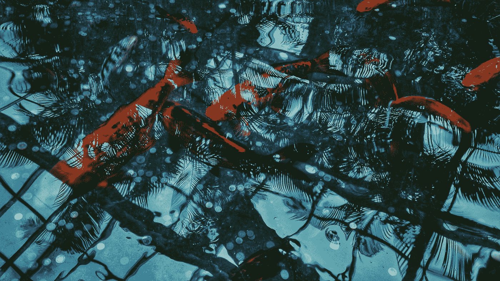

# 治愈你狂躁拖延症的终极方法

> 原文：<https://medium.com/swlh/the-ultimate-cure-to-your-manic-procrastination-26d195147b1d>

Photo by [Muhammed Kara](https://unsplash.com/@muhammedkr?utm_source=medium&utm_medium=referral) on [Unsplash](https://unsplash.com?utm_source=medium&utm_medium=referral)

## 鲶鱼效应

你是一个狂躁的拖延者吗？你为自己在压力下工作或在最后一分钟全力以赴而自豪。有些人甚至会在最后提交论文的前几天才开始写论文，并最终获得 a。

当我回到大学或者有一份白天的工作时，这很正常。有人给我施加压力，我所要做的就是服从。

现在不同了，我雇佣了我自己。我给自己设定了最后期限，但是我可以很容易地说服自己推迟到下一天。我总是给自己一些空间。我是个软蛋。我用蜂蜜而不是醋工作。

这是有代价的。我过着没有压力的生活，我屈服于拖延症。

现在是改变这种状况的时候了。

我在新加坡办完签证回来了。我有一周的休息时间，我可以尽情观看我一直想看的电视剧或电影。我去了咖啡店，并进行了一次美食之旅。我还结识了几个熟人，进行一些社交活动。

在我搜寻媒体的过程中，我偶然发现了这个模仿日本著名真人秀[的韩国综艺节目。](https://en.wikipedia.org/wiki/Terrace_House_(franchise))

在我继续之前，我想解释一下为什么我喜欢韩国节目。我有一个小妹妹，她年轻的时候很喜欢韩国流行音乐，所以我们会在网上看这些有趣的节目。所以你走吧。

韩国综艺节目名为[心脏信号](https://en.wikipedia.org/wiki/Heart_Signal)。把它想象成老大哥的驯服版，它是面向约会的。三个男人和三个女人成为室友一个月，每天晚上他们需要给他们感兴趣的人发匿名短信。

我觉得这类节目既有趣又有娱乐性。我对人类心理学有所了解。

六个小组成员对整个事情进行评论，并分解他们认为正在发生的事情。

在每场秀结束时，小组成员需要破译参与者将发送短信给谁。如果他们答对了，他们会得到一块宝石作为奖励。

第一季已经进行了三分之一。一旦室友们适应了他们感兴趣的人，并对他们产生了兴趣，制作人就会介绍另一个参与者。

问题是，这个参与者将比最初的男生和女生更有性感，更有资历，更有经验。

这件事让我忍俊不禁。你会看到人们一看到竞争就火冒三丈。

当他们介绍第四位赢得韩国小姐的女性时，女孩们紧张起来，而男孩们则被这位新参与者深深吸引。

这就是鲶鱼效应的由来。

我们把鲶鱼这个词与著名纪录片《T1》联系在一起，这部纪录片讲述了骗子在网上欺骗人们的身份。你可以在这里看到纪录片的细节。

但在韩国，我猜他们没有得到备忘录，他们背后有不同的含义。

他们在小组讨论中解释说，沙丁鱼是当年进口到他们国家的。他们遇到的问题是，当沙丁鱼到达时，大多数已经死了。他们试图弄清楚为什么沙丁鱼在水是干净的时候会死，而它们在被运送的时候有足够的食物吃。

最后，他们意识到沙丁鱼在去韩国的路上太舒服了，以至于他们最终因为无所作为而自杀。这就是鲶鱼出现的地方。他们在货物中包括鲶鱼，以使沙丁鱼保持警觉(鳍？).

掠食者迫使沙丁鱼四处移动，让它们活跃起来。

这是我看这个节目的一个收获——鲶鱼效应。

这可以采取任何形状或形式。可能是首席执行官来审计你的部门，或者是一个著名电影节的最后期限。或者是你想超越的同事。

作为企业家，我们面临的最大问题是我们在和自己竞争。虽然这很好，但有外部竞争让我们兴奋起来也很好。

就我而言，我看到我最大的竞争对手成为了我的妻子。我们都是 A 型，我们都是优等生。我们总是互相攀比。这是一个健康的竞争，让我们达到更高的高度。

为你的旅程找到一个值得的对手。找一个比你做得更好的同事，每次你觉得停滞不前的时候都保持联系。找到让你变得更强的捕食者。

回头见，我的朋友。

## 这个故事发表在[的创业](https://medium.com/swlh)上，这是 Medium 最大的创业刊物，有 327，829+人关注。

## 订阅接收[我们的头条新闻](http://growthsupply.com/the-startup-newsletter/)。

