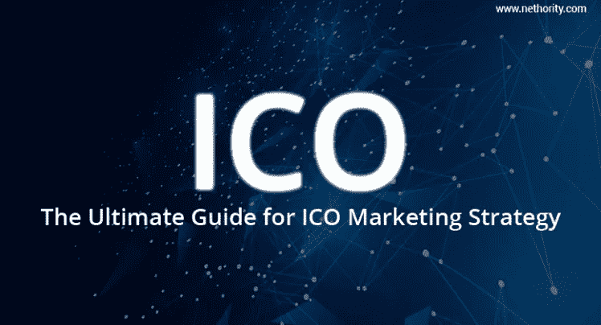
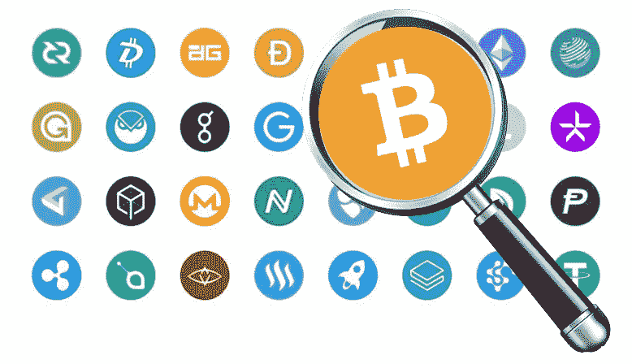
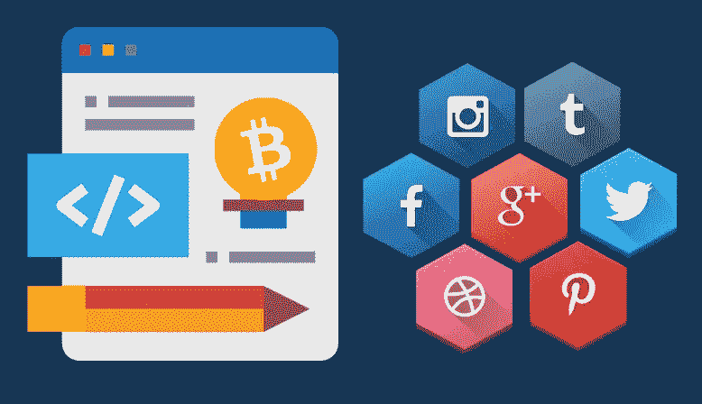

# ICO 营销策略终极指南

> 原文：<https://medium.com/swlh/the-ultimate-guide-for-ico-marketing-strategy-12ddd662e226>

[Nethority.com](http://www.nethority.com/)

去中心化市场正在成长，ICO 时代正在快速崛起。“初始硬币发行”是一种创业公司通过将自己的硬币交易为加密货币(即比特币或以太坊)来众筹资本的方法。投资者对 ICO 感兴趣，因为其回报远高于初始投资，但风险因素也是如此。因此，为了赢得投资者的信任，ICO 必须证明自己的真实性。如果你想让你的 ICO 成功，你必须一开始就努力。
这是一份 ICO 营销清单，你必须遵循它才能制定出完美的 ICO 营销策略。

# 1)通过白皮书赢得投资者的信任

[Nethority.com](http://www.nethority.com/)

创建 ICO 白皮书是第一步。你的白皮书应该提供你项目的每一个细节。提及你的想法，你的计划，法律方面，以及每一个必要但令人印象深刻的细节。
你的白皮书应该让你的投资者相信，为什么他们会从你的硬币中获得巨大回报。
以下是你在撰写 ICO 白皮书时应该关注的内容。

*   你的公司或想法如何从竞争对手中脱颖而出？
*   你的公司将如何使谁受益？
*   你打算怎么把它做大？
*   你需要多少资金？
*   代币额度是怎么分配的？
*   提及一些社会福利
*   也提及你的团队

**记住:**白皮书将决定你公司的命运。所以留下好印象是必须的。

# 2)创建网站，社交推广。

为你的公司创建一个有吸引力的网站。你的网站将是你的投资者的第一印象。确保第一印象完美。致力于网站的设计和架构。包括您的代币、投资回报计划、ICO 和、团队和条件的所有信息。你的网站应该有“关于我们”页面和“联系我们”页面，包括一个白皮书页面。
网站做好了，就该社交推广了。你可以雇佣数字营销人员在社交媒体上推广你的网站。在各种社交媒体平台上用有吸引力的信息图表和你的产品为你的网站做广告。

# 3)搜索引擎优化和竞价排名

[Nethority.com](http://www.nethority.com/)

一旦你的网站准备好了，是时候进行 SEO 了。当用户搜索一个图标时，你不希望你的网站出现在排名第一的位置吗？那么，搜索引擎优化是获得有机接触的唯一途径。SEO 或搜索引擎优化策略将决定你的搜索引擎受欢迎程度。[区块链 SEO](http://www.nethority.com/blockchain-seo/) 涉及页面内和页面外活动。你可以自己做这件事，也可以雇佣一个 SEO 代理来帮你。

**PPC 或点击付费:**

最近，脸书和推特上禁止了加密货币广告。但是，谷歌广告仍然为 ICOs 直播。你可以登录 Google Adwords，为你的 ICO 设计 Google 广告。

**注意:**有传言称谷歌禁止加密货币的 PPC。

如果谷歌禁止加密广告，那么你可以转向在各种加密货币和区块链网站上做广告，这允许你在他们的网站上放一个横幅。

# 4)社交媒体社区和影响者营销。

[Nethority.com](http://www.nethority.com/)

社交媒体上有各种各样的加密货币社区、群组、页面和网络。成为这些社区的一员，积极参与讨论和活动。这些社区将为你提供结识许多志同道合的人和投资者的机会。一定要在这些网络中留下极好的印象。谈谈你的 ICO，以及你的想法是如何的独特。
社交媒体会给你提供很多 ICO 营销渠道。以下是一些开始:

**Telegram:** Telegram 是 ICO 营销的绝佳平台。这是区块链和加密货币的主要网络。

Quora **:** Quora 是一个了不起的讨论平台，里面充满了非常理性的人。关于首次发行硬币的主题非常适合张贴问题，并为您的 ICO 获得良好的曝光率。

[Reddit](https://www.reddit.com/)**:**Reddit 有很多流行的加密渠道。加入他们并开始讨论。

**LinkedIn 群组:** LinkedIn 上满是职业平民，这些成员是你展示 ICO 的最佳受众。

您甚至可以在各种 ICO 日历中发布 ICO 公告。在 ICO 日历上宣布令牌发布，因为这是一种快速产生关于 ICO 的讨论的方法。

现在，我们来谈谈影响者营销。

有许多 Youtubers 和博客不断为密码爱好者提供内容。如果一些好的有影响力的人推广它，你的 ICO 将会受益。你所需要做的就是联系有影响力的人，他能在网上产生很好的内容，并且有很多追随者。请求他们推广你的 ICO。这将会给你的 ICO 一个广泛的曝光。记住明智地选择影响者。很少有 ICO 尝试过通过名人进行推广，但效果不太好。我们不建议你雇佣任何名人来推广你的 ICO，因为我们认为那些被你的 ICO 吸引的人可能不是你的正确受众。

# 5)电子邮件营销和时事通讯

[Nethority.com](http://www.nethority.com/)

电子邮件营销仍然活跃，并为 ICOs 工作。向订阅了您的人发送批量电子邮件和简讯将允许您营销您的代币产品。首先，你必须创建一个你想发送邮件的邮件列表。获得这份邮件列表的最好方法是让人们在你的网站上订阅你的邮件。一旦你有了电子邮件列表，创建一个有吸引力的时事通讯，并发送给你所有的订户。你的电子邮件甚至可能会送达一些投资者手中。

凭借我们的经验和专业知识，我们列出了 ICO 营销的终极清单。遵循这一策略会让你获得最好的投资者和潜在的市场影响力。遵循以上 ICO 营销策略，让你的 ICO 成功。

## 这篇文章发表在《初创企业》杂志上，这是 Medium 最大的创业刊物，有 333，253 人关注。

## 订阅接收[我们的头条](http://growthsupply.com/the-startup-newsletter/)。

