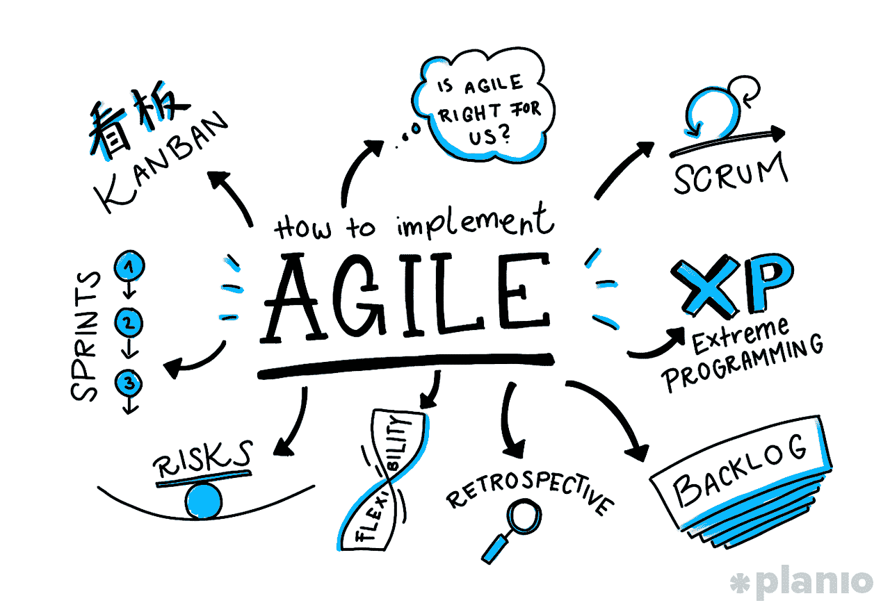
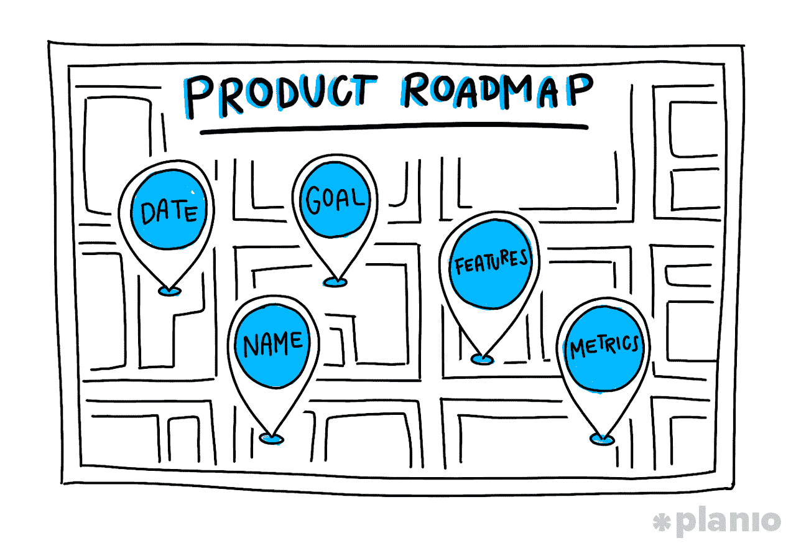
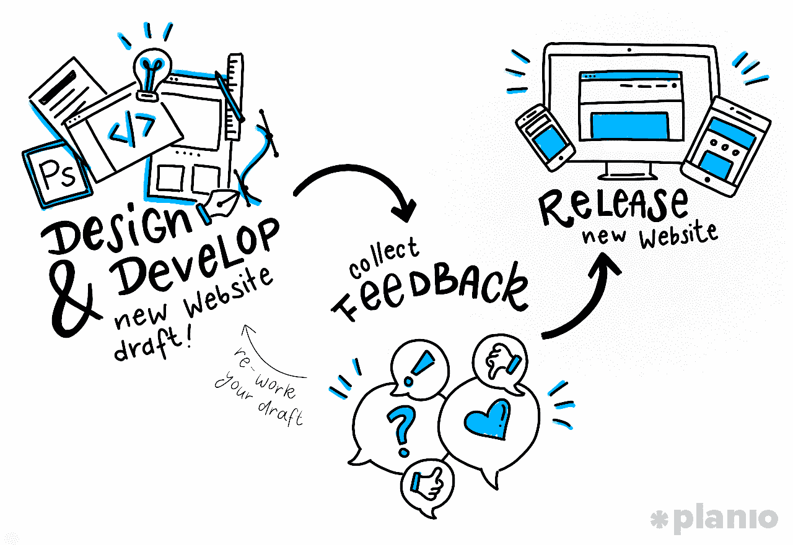
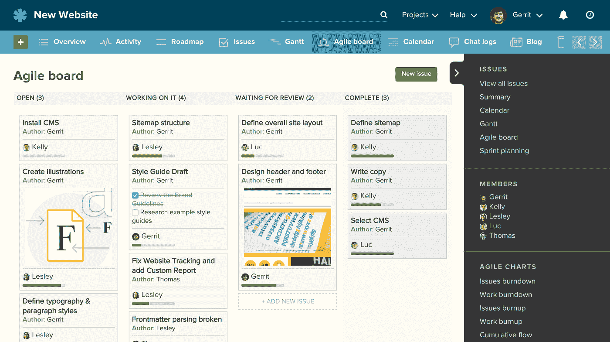
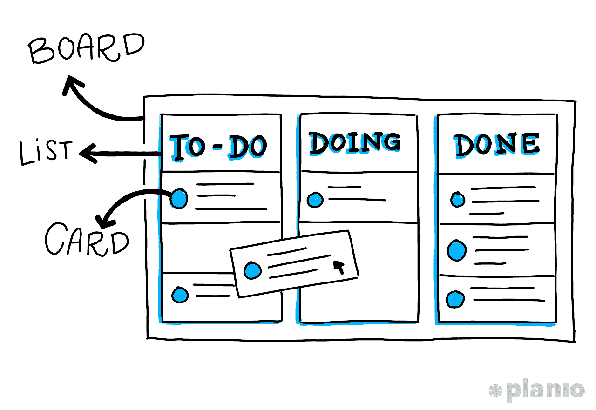
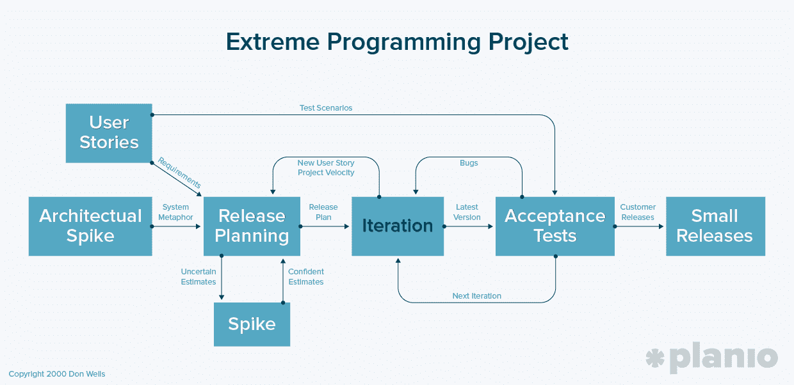

# 以敏捷方式构建产品的终极指南

> 原文：<https://medium.com/swlh/the-ultimate-guide-to-building-products-the-agile-way-8e376d4a4cd4>

## 如何让你的下一个应用、网站或产品更快、更好、更便宜

微软能每三周发布一次他们项目[的全新版本吗？或者为什么谷歌可以每一两周更新他们的桌面和移动应用程序，而其他公司需要几年时间？](https://labs.openviewpartners.com/agile-done-right-agile-gone-wrong/#.WgxYFhNSxE4)

诸如此类的故事是为什么对[敏捷项目管理](https://plan.io/agile-project-management/)的崇拜有这么多虔诚的追随者。

不像瀑布方法这样的传统软件开发，你可能在一个项目上花费几个月或几年的时间，却不向用户展示，敏捷是关于快速移动，经常发布，并对用户的真正需求做出反应。

敏捷开发将重点从你身上转移到你的客户身上。这是一个很小的变化，但可以产生巨大的结果。

根据来自[项目管理研究所](http://www.pmi.org/-/media/pmi/documents/public/pdf/learning/thought-leadership/pulse/pulse-of-the-profession-2015.pdf)的研究，敏捷组织在 65%的时间内按时完成项目，而非敏捷公司只有 40%。他们还完成了 75%的目标，而非敏捷团队只完成了 56%,他们的收入甚至增长了 37%!

发展更快。更多版本。更多收入。为什么你不想将敏捷项目管理引入你自己的团队？嗯，像任何工具或方法一样，敏捷也有自己的怪癖。虽然从谷歌到微软到 Spotify、苹果和脸书，每个人都在使用它，但在一头扎进去之前，你需要知道表面之下是什么。

本指南将带你从敏捷的起源，一直到它的核心价值和原则，如何知道敏捷是否适合你的组织，然后给你一个在你自己的团队中实施敏捷项目管理的 7 步计划。

让我们开始吧:

# 如何知道敏捷是否适合你的团队(以及为什么不适合)

这一切表面上听起来很棒，但是并不是每个项目都受益于敏捷项目管理。所以，在我们进入敏捷工作的细节之前，让我们更深入一点。

敏捷可能会与你的公司或你的队友习惯的工作方式大相径庭。这意味着快速行动，也就是说不是每件事都要事先说明或计划好。因此，您需要知道您的环境是否能够处理这种变化。

为此，你需要诚实地回答 5 个问题:

## 1.你愿意在不知道结果的情况下开始一个项目吗？

你知道那句谚语“失败得快吗？”它指的是敏捷项目管理。有了敏捷，你就可以快速地和真实的用户一起不断地测试。如果你是个控制狂的话，压力会非常大。

在你采用敏捷之前，问问你自己，把你的产品的一个未完成的版本拿出来给用户测试，你感觉如何？你对发布一个 [MVP](https://crew.co/how-to-build-an-online-business/mvp-minimum-viable-product-example/) (最小可行产品)感觉良好吗，或者你认为你的项目需要被充分烘烤才能见天日？

## 2.你有多厌恶风险？

就像我们之前说过的，敏捷就是不断地部署和从你的错误中学习。这意味着，与使用更传统的项目管理风格相比，您可能会承担更高的风险。

你的文化是一种凭直觉创业，风险是你的中间名吗？或者你正站在失败的边缘，需要确保一切马上变得完美(老实说，这永远不会发生)？如果你走的是敏捷之路，你最好准备好应对在这个过程中出现的任何未知问题。

## 3.你的团队有多灵活？

在敏捷中，你和你的客户一起*工作，让产品变得更好。但是这并不总是适用于所有有自我意识的设计师、开发者和制作者(也就是我们所有人)。问问你自己，你的关键人物是否能把自我放在一边，根据客户需求调整他们的努力和想法。*

## 4.你的公司等级制度有多严格？

敏捷的一个关键原则是不仅要和你的用户一起工作，而且开发者每天都要接触到关键的利益相关者。对一些公司来说，这是一种延伸。你的文化是什么样的？是否有一个固定的层次结构，或者那些人会乐意成为开发过程的一部分？

## 5.你如何衡量进步？而成功呢？

闪亮的新对象综合症和敏捷不能混为一谈。敏捷项目管理就是致力于不断完善你的过程和改进你的产品。因此，如果你更倾向于追逐下一个令人兴奋的想法，而把最后一个想法搁置一边，你就不会得到敏捷所能提供的最好结果。花点时间看看你和你的文化是如何定义进步和成功的。你能看到小而稳定的步骤让你更接近你的最终目标吗？

*如果你想开始(或继续)敏捷产品开发，你可以免费试用*[*Planio*](http://planio.com)*30 天，看看它是否适合你的团队。*

# 如何在你的技术团队中实施敏捷项目管理

如果我们在最后一节没有吓到你，那么恭喜你！您已经准备好并愿意改变您的团队进行项目管理的方式，并开始以敏捷的方式构建产品。

敏捷是关于节奏的。当你有多个相互依赖的计划和交付周期在进行时，你的团队比其他任何事情都更需要检查。作为项目经理或团队领导，你的职责是从 30，000 英尺的高空进行观察，以确保每个人都能顺利合作。

敏捷是持续的计划、执行、学习和迭代的混合，但是一个基本的敏捷项目可以分解成以下 7 个步骤:

# 第一步:召开战略会议，设定你的愿景

## 这是什么？

在一个新的敏捷项目的开始，你需要定义一个清晰的业务需求或者你的项目正在解决的远景。本质上，你需要回答为什么你要做你打算做的事情？这是大图的东西，但这是核心信念，你会参考你的建设。

对于产品公司来说，定义你的愿景的最佳方式之一是使用所谓的[电梯推销](https://slidebean.com/blog/startups/elevator-pitch-examples):

*   **针对:**(我们的目标客户)
*   **谁:**(需求声明)
*   **(产品名称)是一个(产品类别)**
*   ****即:**(关键产品优势，令人信服的购买和/或使用理由)**
*   ****不同于:**(主要竞争备选方案)**
*   ****我们的产品:**(初级差异化的最终陈述)**

**如果你没有在开发一个产品，你仍然可以看到如何快速地调整这个项目来匹配你的项目目标。**

## **谁应该在那里？**

**这是你在项目中获得认同的地方，因此许多关键的利益相关者都应该出席，包括相关的执行官、经理和董事，以及所有的产品所有者。**

## **什么时候发生？**

**你的战略会议应该在任何项目开始前召开，或者至少每年召开一次，以确保你的使命仍然有效，并定期召开会议进行更新。**

## **需要多长时间？**

**这完全是主观的，但是一个合适的战略会议可能需要 4-16 个小时(不要连续进行！)**

# **第二步:构建你的产品路线图**

## **这是什么？**

**一旦您的策略得到验证，产品负责人就该将愿景转化为产品路线图了。这是您的项目需求的一个高层次的视图，对于您何时开发每一个需求有一个宽松的时间框架。**

**这里的“松散”部分很重要。你不用花几天或几周的时间来计划每一步，而只是简单地识别、区分优先次序，并粗略地估计你的产品的每一部分在制造一个可用产品的过程中需要付出的努力。**

**那么，对于一个敏捷项目来说，这看起来像什么呢？产品管理专家[罗曼·皮克勒](http://www.romanpichler.com/blog/10-tips-creating-agile-product-roadmap/)建议使用*目标导向的*产品路线图，有时也被称为*主题导向的*:**

> **“以目标为导向的路线图侧重于目的、目标和成果，如获得客户、增加参与度和消除技术债务。特性仍然存在，但是它们是从目标中派生出来的，应该谨慎使用。根据经验，每个目标使用的功能不要超过三到五个。”**

**对于这些目标中的每一个，您需要包括 5 条关键信息:日期、名称、目标、特性和指标**

****

**这让你清楚地知道需要做什么，什么时候做，以及如何衡量成功。**

## **谁应该在那里？**

**产品路线图是由产品所有者完成的，但也应该包括来自项目中任何其他利益相关者的认可和输入，如市场营销、销售、支持和开发团队代表。**

## **什么时候发生？**

**在你开始计划冲刺之前，路线图需要准备好，所以最好在你的战略会议之后直接开始创建。**

## **需要多长时间？**

**像敏捷项目管理中的所有事情一样，您希望快速行动，而不是停留在早期阶段的计划上。然而，你的路线图是从你的使命到你的 MVP 的文字地图，应该花足够长的时间来确信你已经覆盖了所有适用的目标。**

# **第三步:制定发布计划**

## **这是什么？**

**既然我们已经有了战略和计划，是时候设定一些暂定的时间表了。**

**在这个阶段，产品负责人为工作软件的发布创建一个高级时间表。因为敏捷项目将会有多个版本，你将会想要优先考虑让你首先启动的特性。**

**例如，如果您的项目在 11 月开始，您可以将您的 MVP 发布定在 2 月初，在第二年 5 月发布一个高优先级的特性。这完全取决于你的项目的复杂性和你的“冲刺”的长度——致力于每个目标的工作周期(我们将在下一步讨论！).一个典型的版本包括 3-5 个这样的 sprints。**

## **谁应该在那里？**

**发布计划就像召集军队。产品负责人、项目经理和所有团队成员都应该在场。你也可以引入一些关键的利益相关者来增加额外的活力，让团队充满激情。**

## **什么时候发生？**

**至少，您的发布计划应该在任何新发布的第一天创建，并且至少每个季度评审一次。**

## **需要多长时间？**

**对发布需要多长时间持现实态度，但不要因此而放慢脚步。典型的发布计划会议大约需要 4-8 小时。**

# **第四步:是时候计划你的冲刺了**

## **这是什么？**

**当产品所有者和开发团队计划“冲刺”时，是时候从宏观视角转移到微观视角了，冲刺是指将执行特定任务和目标的[短开发周期](https://plan.io/agile-project-management/)。典型的 sprint 持续 1-4 周，在整个项目中应该保持相同的长度，因为这使团队能够根据他们过去的表现更准确地计划未来的工作。**

**在一个 sprint 周期的开始，你和你的团队将创建一个你认为你可以在那个时间框架内完成的待办事项列表，这将允许你创建功能软件。然后，就像使用一种敏捷方法来完成它们一样简单(我们将在下面更深入地讨论)。**

## **谁应该在那里？**

**Sprint 规划是一项团队工作，因此产品负责人、项目经理和所有团队成员都应该到场来表达他们的想法和关注。**

## **什么时候发生？**

**冲刺规划发生在每个冲刺周期的开始。例如，如果你正在进行每周短跑，你将在每周一(或者你选择的一周中的任何一天)进行一次计划会议。**

## **需要多长时间？**

**冲刺计划为周期定下了基调。因此，虽然你不想在这个阶段花太多时间，但实际上可能需要 2-4 个小时。但是一旦你计划好了你的冲刺，你就真的要去参加比赛了。**

# **第五步:每天站立，让你的团队走上正轨**

**在每一次冲刺中，你都需要机会来确保没有任何障碍爬上来，阻碍你按时完成目标。这就是每日例会，或者敏捷语言中的“站立”的由来。**

**站立会议是每天 15 分钟的会议，你的团队聚集在一起讨论三件事:**

*   **你昨天完成了什么？**
*   **你今天在忙什么？**
*   **有什么路障挡在路上吗？**

**虽然这可能对你的团队中的一些人来说是一种烦恼，但是这些会议对于促进驱动敏捷项目管理的那种交流是必不可少的。敏捷依赖于对问题的快速反应，在公共空间表达这些问题是促进跨团队协作的一种强有力的方式。**

# **第六步:Sprint 完成了？是时候回顾一下了**

## **这是什么？**

**如果一切都按计划进行，在你的 sprint 周期结束时，你应该有一个功能正常的软件。此时，是时候回顾所做的工作，并向团队成员和任何关键利益相关者展示。可以把它想象成敏捷展示和讲述。**

**这里的关键是检查你的初始计划，以确保所有的要求都得到满足。作为产品所有者，接受或拒绝某些功能是您的选择。如果出了问题，问为什么？你如何调整下一次冲刺，让你的团队达到目标？敏捷是关于持续的学习和迭代，这意味着你的过程和你的产品。**

## **谁应该在那里？**

**您的整个团队以及任何关键的利益相关者都应该在您的 sprint 回顾中检查进度并表达他们的支持。**

## **什么时候发生？**

**冲刺评审在每个冲刺阶段结束时进行。**

## **需要多长时间？**

**对幻灯片和专题论文说不。冲刺复习最多只需要一两个小时。**

# **第七步:下一步是什么？决定在你的冲刺回顾中关注什么**

## **这是什么？**

**为了让敏捷项目管理发挥作用，你需要在每一步之后都有一个清晰的下一步。这是在你的冲刺回顾中决定的。一旦完成了 sprint，展示了特性，就该决定下一步做什么了。你在冲刺阶段学到了什么，改变了你最初的时间表或项目愿景吗？**

**不要简单地做计划，也要花时间讨论前一次冲刺的进展如何，以及在下一次冲刺中如何改进。**

## **谁应该在那里？**

**回顾是回顾的自然延伸，所以当你的涉众可以离开时，团队的其他成员应该参与进来并给出他们的见解。**

## **什么时候发生？**

**在你的 sprint 回顾之后进行 sprint 回顾是最有意义的。**

## **需要多长时间？**

**再次，保持简短和甜蜜。最多一两个小时可能就是你听取汇报和计划下一次简报的全部时间。**

## **现在发生了什么？**

**在这一点上，你应该有一个功能性的软件，你可以发布，获得反馈，并计划新的功能或修复。这种持续的运输、学习和构建是敏捷如此强大的原因。你不是简单地处理你的积压工作，而是发布产品，看看人们如何与他们互动。这意味着，与其花一年时间开发一个产品，然后发布后发现缺少了一些核心功能，不如在冲刺后找出原因，并做出相应的调整。**

****

# **如何实施敏捷:三大敏捷方法解释**

**在这一点上，你可能觉得已经准备好投入敏捷并把它带给你的团队。然而，我们还需要完成一个步骤。正如我们之前所说的，敏捷更多的是一个项目管理和开发哲学的总称。为了充分利用这些想法，一些非常聪明的人已经开发出了你可以遵循的敏捷方法。**

**这些方法都非常相似，但是从实现的角度来看，每种方法都有自己的实践、术语和策略组合。**

**让我们来看看前 3 名，并分析它们的不同之处:**

# **混乱**

**Scrum 可能是最著名的敏捷方法，而且两者经常携手并进。它在软件开发领域特别受欢迎，这要归功于它的简单性、被证明的生产力，以及作为其他敏捷方法所提倡的各种实践的总括框架的能力。**

**它是这样工作的:**

**使用 Scrum,“产品所有者”与他们的团队密切合作，确定他们的目标或特性，并对其进行优先排序，然后将它们添加到所谓的“产品待办事项列表”中。backlog 可以包括特性、错误修复、非功能性需求——几乎是交付工作软件需要完成的任何事情。**

****

**有了这个 backlog，产品所有者决定优先级，团队在他们的冲刺阶段(通常持续 30 天)签署交付软件的“潜在可交付增量”。一旦团队提交了 Sprint 的待办事项列表，除了团队之外，没有什么可以添加的。在 30 天冲刺的最后，积压被分析和重新排序(如果必要的话),整个事情重新开始。**

***要更深入地了解 Scrum 的实现，请查看 Planio 客户 Alex Lemm 在 Software AG* *发表的这篇* [*帖子。*](https://plan.io/blog/how-software-ag-implements-scrum-using-planio/)**

# **看板法**

**像 Scrum 一样，[看板](https://plan.io/blog/kanban-boards-the-psychology-of-cards/)是一种围绕持续交付而构建的敏捷方法，同时保持事情简单，不会给开发团队带来过重的负担。看板基于 3 个基本原则:**

## **在“白板”上可视化您的工作流程**

**当项目变得复杂时，能够在彼此的上下文中看到你正在处理的所有项目可以提供令人难以置信的信息，并有助于保持事情的清晰和简单。看板工具(比如 Planio！)使用“白板”风格来查看你的所有项目，以及它们在待办事项到完成事项流程中的位置。**

****

## **限制你的在制品数量**

**就像在 Scrum 中，backlog 是在你冲刺之前定义的，什么都不能添加(除了团队)，看板依赖于团队知道他们在每个冲刺中实际能做多少。**

## **有清晰的后续步骤**

**为了保持看板的流动，你应该总是知道一个项目完成后接下来会发生什么。这意味着保持你的积压优先和更新。**

**(你可以在这里阅读所有关于使用[看板](https://plan.io/blog/kanban-boards-the-psychology-of-cards/)的内容)。**

# **极限编程(XP)**

**[极限编程](http://www.extremeprogramming.org/) (XP)在 Mountain Dew 意义上并不极端，但它与我们讨论过的其他方法有点不同。**

**XP 是一种更加严格的敏捷项目管理方法，它涉及到客户的高度参与、快速的反馈循环、持续的测试和计划，以及紧密的团队合作来快速交付工作软件。给你一个想法，一个典型的 XP Sprint 只持续 1-3 周。**

**软件工程师 Kent Beck 描述的最初的 XP“配方”基于 4 个价值观——简单、沟通、反馈和勇气——以及 12 个支持实践。它肯定比其他方法更复杂，在实践中看起来像这样:**

****

**在 XP 中，有一个紧密的反馈循环，在这个循环中“客户”与团队紧密合作，定义并优先考虑称为“用户故事”的粒度目标。然后，团队评估、区分优先级并计划这些故事的交付，从客户那里获得更多的反馈，直到准备好发布。**

# **实施敏捷项目管理的最后思考**

**恭喜你！您现在应该清楚地了解了敏捷项目管理是什么样子，以及您可以在自己的团队中使用它的一些有效方法。**

**然而，还有最后一块拼图。有了所有这些信息、组织和优先级排序，您需要一个合适的项目管理工具来保持您的敏捷项目在正确的轨道上。最好的软件解决了敏捷项目管理过程中常见的 3 个棘手问题:**

1.  ****报告和指标:**时间跟踪和预测、面向利益相关者的易于理解的进度报告、质量保证以及查看进度的大图**
2.  ****沟通:**通过本地和分布式团队的更新、共享的任务列表、反馈和任务，让每个人都跟上进度的能力**
3.  ****项目评估:**围绕识别和补救障碍或瓶颈、评估绩效以及确保财务处于控制之下的功能**

***虽然有很多工具可以帮助你运行敏捷项目，但是我们已经整理了一个* [*关于如何使用 Planio*](https://plan.io/set-up-agile-project-management/) *实现敏捷的深度指南。如果你的团队正在转向敏捷，你甚至可以免费开始 30 天，看看* [*计划*](http://planio.com) *是否适合你的团队。***

# **嘿，我是乔里！**

**我帮助公司和有趣的人通过巧妙而集中的写作讲述他们的故事。想一起工作吗？给我发邮件到 hello@jorymackay.com**

****

## **这个故事发表在 [The Startup](https://medium.com/swlh) 上，这是 Medium 最大的企业家出版物，拥有 287，184+人。**

## **在这里订阅接收[我们的头条新闻](http://growthsupply.com/the-startup-newsletter/)。**

****