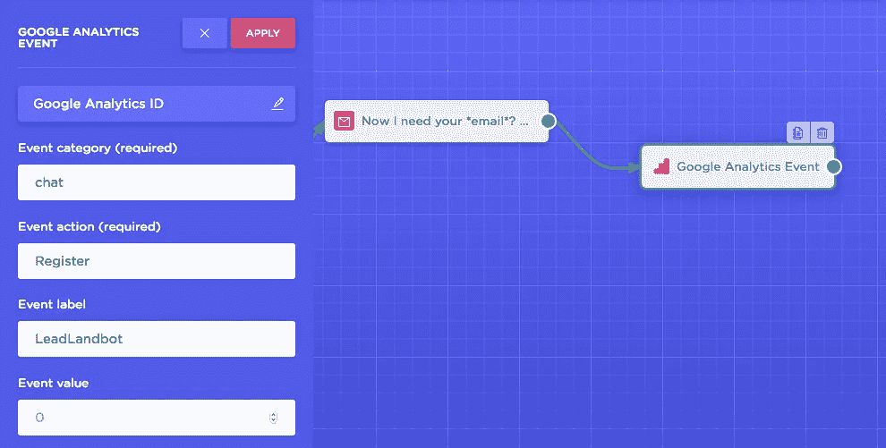
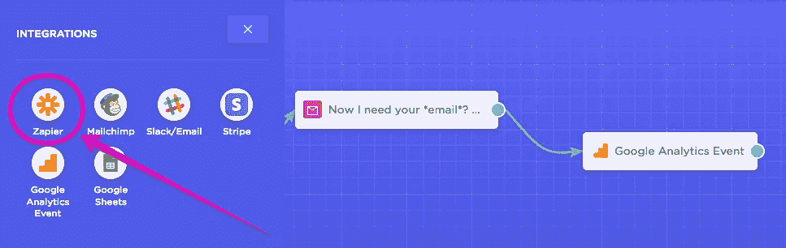

# 挖掘潜在客户的聊天机器人终极指南

> 原文：<https://medium.com/swlh/the-ultimate-guide-to-chatbots-for-lead-generation-7dac67f8296b>

## Facebook Messenger 之外还有生活。以下是如何充分利用它的方法。

即时消息和聊天机器人可能是发展最快的趋势，也是当今营销人员最有力的武器之一。

另一方面，脸书是吸引用户的最受欢迎的渠道之一，但在信使营销方面，并非所有渠道都是彩虹，这导致替代方案出现。

本指南提供了您需要知道的一切，以便为脸书以外的销售线索挖掘设计**对话体验。下面是我们将看到的细节:**

*   **第一部分**:为什么即时通讯和聊天机器人是营销的未来
*   第二部分:我们如何将我们的 SaaS 主页转换成聊天机器人，并将潜在客户转化率提高了 4 倍。
*   [**第 3 部分**](/@pakonekone/the-ultimate-guide-to-chatbots-for-lead-generation-7dac67f8296b/#451c) :如何用聊天机器人创建一个潜在客户生成机器，并将这些数据发送到 Google Sheet 或你的 CRM。

👉*学完本指南后，您将拥有自己的聊天机器人，并准备好大规模转化和创造销售线索。* [*跳转到本节*🏃🏻](/@pakonekone/the-ultimate-guide-to-chatbots-for-lead-generation-7dac67f8296b/#451c)

# 1.-为什么即时消息和聊天机器人是营销的未来

这是事实: [**即时通讯** **营销**](https://landbot.io/blog/advantages-of-instant-messaging-marketing/) 和**聊天机器人**将成为未来几年的主要沟通渠道。

每一个新的营销渠道都代表着一个巨大的机会让你利用并超越你的竞争对手，享受难以置信的低 CPCs，并尝试不同的方式去接触和联系你的客户。

在 2000 年，市场营销被 SEO 和 SEM 所主导。然后是**社交网络**和**社交广告**。在过去的几年里，我们都已经从台式机转向了移动设备，尽管我们下载的应用程序比以前少了，但我们还是会整天查看智能手机和聊天。

**Messenger** 、 **WhatsApp** 、 **Slack** 、**微信** … [消息应用拥有超过 50 亿的月活跃用户](https://research.hubspot.com/charts/messaging-apps-have-over-4b-monthly-active-users)，在不久的将来将成为转变商家与消费者关系的主要杠杆。

***不仅仅是营销的一个基本原则，它是促使企业与公众相遇的原因。***

******

***“Be Where Your Customers Are” Advertising Channels Evolution***

> ***"即时通讯是营销领域的下一个大热门."***

***然而，这种沟通渠道有一个大问题:**即时通讯没有规模**。到了一定的量，一对一的沟通就变得太贵了。***

***这就是聊天机器人在 T21 出现的原因。他们在完美的时间做到了:随着人工智能达到它的最佳点，扎克伯格迎合了他们的流行，以及呼吁替代表单和弹出窗口的*移动优先*趋势的成功。***

****

**Scale Instant Messaging with Chatbots**

**聊天机器人的潜力远远超出了客户服务，为销售和营销带来了巨大的机会。**

**他们如何帮助营销人员？聊天机器人可以提高用户参与度，转化更高比例的网络流量，并成为潜在客户的主要来源。**

**无论你处于哪个行业或垂直行业，你的大多数客户可能会花很多时间聊天(**)，而且他们通常比使用网络浏览器更擅长聊天！**)**

**所以，很有可能**聊天机器人已经是**——或者很快将会是**——你营销策略的重要组成部分**。你可能玩过一点脸书的广告，并创建了你的信使机器人。如果不是这样，我强烈建议你看一看。**

**任何一个营销人员都可以欣赏接触目标脸书的 22 亿用户，有各种各样的选择和保持非常明智的点击费，但是…**

*   **如果你不想在 Facebook Messenger 中创建你的机器人，该怎么办？**
*   ***如何利用竞争对手的 Twitter 关注者或 Google Display 的再营销功能，将流量从客户的 Google 搜索直接导向机器人？***

****📗我们将使用聊天机器人作为登录页面，将访问者转化为潜在客户。然后，我们将使用收集到的信息来更新 Google 工作表行或在您的 CRM 中创建一个新联系人，最终打开您的线索生成机器。****

# **2.-我们如何将我们的 SaaS 主页转变为聊天机器人，并将销售线索转化率提高了 4 倍**

**在我们的案例中，我们几乎是偶然发现的。我们希望在销售线索生成/销售场景中测试我们的实时聊天解决方案，以衡量它能够转化多少。**

**起初，我们很难突破 3%的转化率。但是一天早上，在回顾我们的活跃流量活动时，我们发现我们一直在运行我们的实时聊天，有一个巨大的意想不到的 *bug* : **每次有新的访问者进入，聊天就会全屏打开，完全阻塞了网站**。参观者只有一个选择:*到*聊天。**

****

**Our previous homepage with live chat solution**

****

**Our previous homepage with a “huge bug”**

**当我们在晚上检查我们的统计数据时，我们认为有一些错误。我们已经达到了 9.6%的访问者到试用者的转化率*。* **这是我们通常的实时聊天转化率的 3 到 4 倍！****

**这就是**land bot . io**[chatbot builder](https://landbot.io/)诞生的过程(一个用于创建*对话登陆页面*和生成销售线索的工具。)**

**如果你现在访问 landbot.io，你会看到*一个典型的 SaaS 产品登陆页面它不是！*你可能会立即问自己“通常的*功能*、*定价*和*团队*部分在哪里？连个联系页面都没有！😱**

****

**事实上，所有这些部分在对话的某个时刻都是可用的，但是只有当它们变得与用户相关时才是可见的。**

**你想猜猜没有 Landbot.io 传统网站的主要原因是什么？还是那句话，原因是**转换。****

> **“每次我们试图用更传统的网站取代我们的机器人，跳出率都会上升，页面上的访客时间会下降，我们的线索/访客比率也会受到影响。”**

**然而，正如在任何登录页面中一样，**在任何营销活动中，真正重要的是我们向受众提供的内容**。**

**如果你想让网站访问者自愿提供他们的电子邮件地址，你需要提供一些与他们相关的东西。如果不这样做，任何系统都无法转换该销售线索。**

**在 Landbot 的案例中，*和大多数 SaaS 产品一样*，我们为访问者提供创建聊天机器人的机会，并将其添加到他们的网站上，以提高他们的登录页面转化率。**

****

**Landbot.io “homepage” visitor-to-register conversion rate**

****近五分之一的访问者在 Landbot.io 上创建了一个帐户。**也就是说，我们的访问者与注册用户的比例接近 20%。而这是发生在我们目前的初级阶段，也就是说我们的流量来源和质量都有很大的提升空间。对于一个 B2B SaaS 主页来说，这还不算太坏，不是吗？**

****

**Landbot.io “homepage” visitor-to-register conversion rate**

**所有这一切，都要归功于聊天机器人技术收集用户信息的能力。**

**有了良好的设计实践，该工具将使您能够为用户提供完全独特的体验，访问相关内容，并创建一个比任何 web 表单摩擦都少得多的接触点。**

**最后来看**如何设计一个对话作为登陆页** ( *不要试图取代一整个网站*🙏).**

# **3.-如何使用聊天机器人作为登录页面来创建销售线索生成机器**

****3.0。准备工作****

**我们将使用这 3 种工具来创建我们的销售线索生成机器:**

*   **[**Landbot**](https://landbot.io/u/demobot.html)**
*   **[**扎皮尔**](https://zapier.com)**
*   **[**谷歌工作表**](https://www.google.com/sheets/about/)**

****

**但是首先，你必须考虑如何设计你的聊天机器人。**

**就像设计任何其他类型的营销活动一样，在开始实际实施之前，我们需要确保我们控制了你的“登陆机器人”的资产。**

> **试着专注于完成一个聊天机器人目标**

1.  **您的主要聊天机器人目标(产生潜在客户、宣布即将推出的产品或销售您的服务……)。**
2.  **目标定义和细分。**
3.  **必备“要素”或 VIA 的优先列表:非常重要的属性(*优势、特性、难点*)**
4.  **聊天机器人的个性和流程**
5.  **副本和媒体**
6.  **分析、测试和优化**

**如果你想更深入地了解这个领域，我推荐下面这篇文章，它来自我们关于*创造对话体验*或的系列文章，这是关于如何在 25 分钟内为一个网站创建聊天机器人的分步指南。**

** [## 创造对话体验(一):计划

### 这是一系列 3 篇文章中的第一篇，我们将介绍每个人为了…

medium.com](/landbot-io/building-conversational-experiences-i-planning-c3041e71387a) 

## 3.1.-注册一个免费的 Landbot 帐户，

就像和朋友聊天一样简单。你可以在这里[做](https://landbot.io/u/demobot.html)

## 3.2.-创建聊天机器人并构建流程

一旦进入你的账户，点击**创建一个新的陆地机器人**从头开始或者选择一个模板。

从**欢迎信息**开始，将越来越多的内容以信息、问题、按钮或任何类型的 gif 的形式添加到您的流程中:

您完成的流程可能看起来有点像这样:

## 3.3.-调整设计

放置图像、渐变或视频，以完全符合您的品牌需求。从头像到字体大小、背景或每个元素的颜色，随心所欲地改变一切。

*你也可以‘go pro’，从* ***高级*** *设计部分添加一些* ***CSS*** *(自定义样式表)。*

## 3.4.-添加谷歌分析跟踪代码(U-xxxxxx)

**设置**可能是营销人员最喜欢的部分，因为在这里他们不仅可以定制元标题、元图片或收藏夹图标，还可以添加**谷歌分析 ID** 。在这里做:

## 3.5.-当您的 Landbot capture 有线索时，向 Google Analytics 发送事件

你会想要**衡量你的聊天机器人**的有效性。你只需要从你的机器人发送一个事件到你的谷歌分析账户。

在您的项目中选择意味着“转换”的模块(*通常是您的电子邮件捕获模块)*并添加**集成>谷歌分析事件**

添加您的 GA 跟踪代码并保存:

假设你要发送一个带有这些参数的事件:
-事件类别:聊天
-事件动作:注册
-事件标签:LeadLandbot

用您自己的参数填写您需要的字段，然后单击“应用”:

## 3.6.-设置 Google Analytics 事件和转换

现在，回到谷歌分析方面，进入管理部分，选择**查看>所有数据**，点击**目标:**

转到**目标详情**，根据您在谷歌分析代码中的配置设置事件条件:

你将有一个新的目标，你将能够看到它也在实时跟踪工作。您将能够在转换部分和其他多个报告中看到结果:

## 3.7.-使用 Zapier 将 Landbot 销售线索保存到您的 CRM 中

如果你以前没有使用过 [Zapier](https://zapier.com) ，它是一个惊人的自动化工具，它连接了营销人员每天使用的应用程序。

你将使用 Zapier 将数据从你的 Landbot 发送到谷歌电子表格(*你也可以添加 Mailchimp、Autopilot 或你使用的 CRM*)。要连接 Zapier 和 Landbot，请访问**集成> Zapier** :

选择您需要的模板，在这种情况下，我们将使用:*根据新的 Landbot 响应向 Google Sheets 电子表格添加一行。*

点击弹出窗口中的**创建此 zap** :

如果您还没有 Zapier 帐户，请登录您的帐户或注册。

然后连接您的 Landbot 帐户并粘贴您的 Landbot 令牌:

**选择您的机器人**和您想要使用的积木(如果您想要使用多个 Zapier 积木):

现在，你的触发器已经设置好了，你可以**点击 Fetch +继续测试触发器** *也就是确保选择的帐户和 landbot 确实配置了 Zapier 集成块。*(我们建议您与您的 landbot 完成一次对话，这样一旦进入 Zapier，我们就可以轻松识别每个字段，因为我们的对话答案将作为示例) **:**

我们将使用 Google Sheets 作为 Zap 的动作，在那里我们将把发送的 landbot 变量映射到电子表格中的不同列。

您需要首先创建此电子表格，将您的 landbot 变量作为表格列:

然后回到 Zapier，选择你的电子表格文档，工作表，开始添加你的变量。

然后，点击“继续”并测试你的 zap。**您需要在您的 landbot 页面**中进行一次成功的对话，记录您的所有销售线索信息。

回到 Zapier，您应该会看到类似这样的内容:

完成此流程后，将在您的电子表格中创建一个新行，其中包含销售线索信息。

恭喜你！🎉

**您现在是您的聊天机器人登录页面**中新线索的所有者。** 

# **总之，**

**你已经拥有了建立销售线索生成机制所需的一切:创建一个会说话的网站，用分析来证明它，并自动化销售线索管理流程。**

**如果您正在运行一个会话式登录页面，并且在销售线索挖掘方面取得了一些成功，我很想听听您的经验。**

**想测试我为这个指南制作的聊天机器人吗？[点击此链接，**开始对话**](https://landbot.io/u/demobot.html) **。**💬⚡️**

****

## **这篇文章发表在 [The Startup](https://medium.com/swlh) 上，这是 Medium 最大的创业刊物，拥有 289，682+读者。**

## **在这里订阅接收[我们的头条新闻](http://growthsupply.com/the-startup-newsletter/)。**

****