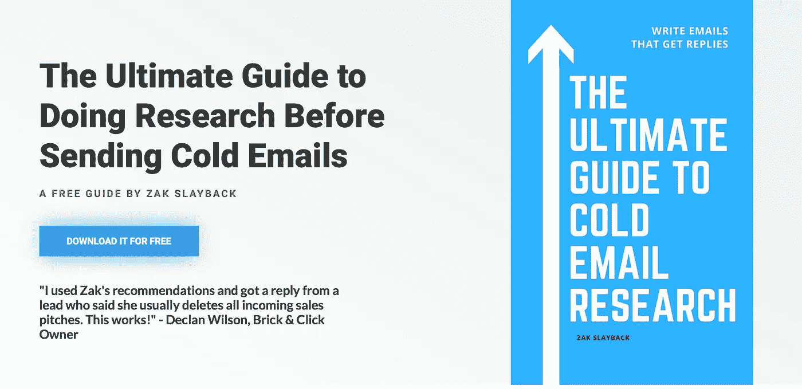

# 冷冰冰的邮件和电话前做研究的终极指南

> 原文：<https://medium.com/swlh/the-ultimate-guide-to-doing-research-before-cold-emails-and-calls-d57c45c77803>

## 做研究工作。你的研究越好，你的回答就越好

我最近在一次活动中遇到了一些年轻的专业人士，他们问我，在发送冷冰冰的电子邮件时，他们如何能每天多发送 1000 封。我问他们为什么要这么做。不可避免地，答案回到了“做更多的外联工作不是总是更好吗？”

号码

不是的。

不如多做*质量*外联。如果你发送的每封邮件都被非常忙碌的人忽略，发送冷冰冰的邮件对你的求职或销售周期没有帮助。看起来像垃圾邮件的电子邮件(例如，有人一天发送 1000 次的那种电子邮件)会被大多数你想与之交谈的大忙人忽略。

**做高质量的外联意味着在给你的目标发送电子邮件之前对他们进行调查。**这项研究做了几件事。

1.  **这可以防止你在给他们发邮件时说错话。**我让人们[为 ico](https://zakslayback.com/not-send-cold-email-ico/)给我发冷冰冰的电子邮件，告诉我他们认为这些 ico 与我在加密领域的工作[有关](https://zakslayback.com/not-cold-email-bs-sincerity/)。我在加密领域不做任何事情——如果我做了，我会希望他们参考我的做法，这样我就知道他们的电子邮件不仅仅是垃圾邮件。基础研究可以让你看起来不傻。
2.  它给你的相互融洽加分。相互融洽的要点通过向他人展示你与他们有共同的价值观，帮助你加快建立关系的过程。这些可能是基于品味的价值观，比如你们都喜欢同一个足球队。这些可能是更复杂的价值观，比如你们有共同的宗教信仰或者是基于价值观的兄弟会的成员。
3.  这表明你不是一个混蛋。如果你想让某人给你宝贵的时间，你应该在主动联系他们之前向他们表示你已经放弃了一些宝贵的时间。

我让我的[辅导客户](https://zakslayback.com/coaching/)做积极的拓展和业务发展——无论是为了他们的日常工作还是他们的咨询业务——并强调为他们做研究的重要性。这是值得的。

一位客户上周告诉我，这项研究奏效了。他收到了某人的回复，他发了一封冷冰冰的邮件，她明确告诉他，“我通常不回复销售邮件，但我想回复你的，因为很明显你对我做了研究。“那封冷冰冰的邮件，不到两天就翻译成了电话。下面我有一份互动的副本。

**研究作品。**做吧。把它看作是你和他人建立关系的前期投资。

## 你可以在 ProductHunt 上访问终极指南[。给它一个向上的投票和下载！](https://www.producthunt.com/posts/ultimate-cold-email-research)

## 这篇文章发表在《T4》杂志《创业》(The Startup)上，这是 Medium 最大的创业刊物，有 351，974 人关注。

## 在这里订阅接收[我们的头条新闻](http://growthsupply.com/the-startup-newsletter/)。

