# 2018/2019 年脸书广告活动目标终极指南

> 原文：<https://medium.com/swlh/the-ultimate-guide-to-facebook-ad-campaign-objectives-2018-2019-3d9cf9b5e135>

在营销史上，从来没有比这更具成本效益的时间来提高知名度，建立品牌，并直接从广告中转化…

……这都归功于脸书广告的力量(和成果)。

脸书的第三季度报告(2018)告诉我们，目前有**22.7 亿**月活跃用户，定期滚动他们的新闻订阅，等待一些东西来抓住他们的注意力。

这一巨大的参与观众并没有被忽视，在最近一个季度，超过**135 亿美元**花费在脸书广告上(是的，我确实说了三个月 135 亿美元！).

这些巨大的数字都很好，但是我们能从中学到什么呢？

1.  广告客户在每个脸书用户身上的花费大约为**5.94 美元**

但更重要的是…

2.它必须工作

事实是，如果脸书广告不起作用，广告商就不会花这么多他们的血汗钱在上面…

…不仅仅是数字时代的巨头能够从这个平台中获得最大收益。

不得不花费巨资来开展一场全国性或国际性的广告活动的日子已经一去不复返了。一个有效的脸书广告活动只需要一天 1 美元就可以建立起来！

任何人都可以从脸书广告中赚钱。包括**你！**

# 脸书广告活动目标

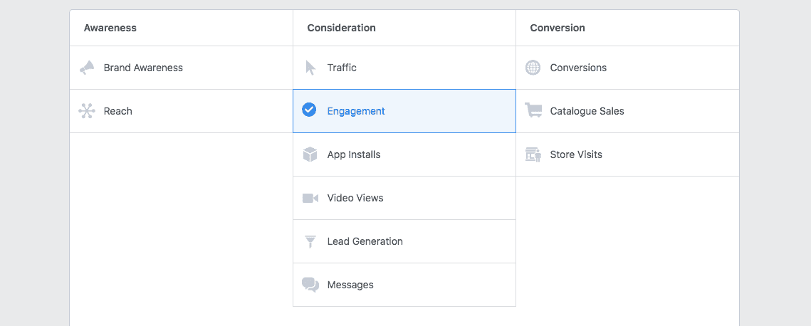

这是一个很大的数字。让我们用几个有意义的词来推动这个指南:

如果你知道如何使用脸书的广告活动目标，你只会从你的脸书广告活动中获得惊人的效果。

再读一遍。喝下去。

别担心，你来对地方了。作为一家代理公司， [*爱因斯坦营销商*](https://www.einsteinmarketer.com/) 目前每月在脸书广告上花费 25 万多英镑。

如果你试过脸书广告公司，但没有成功，那就留下来吧。如果你刚刚开始，不要去任何地方。如果你想升级，这里就是你要去的地方。

在这本脸书广告活动目标的终极指南中，我们将深入探讨。所有 11 个目标都将被分解，清楚地解释它们是什么，如何以及何时使用它们，并一如既往地提供大量示例。

激动吗？

可能没有我的指尖多。

让我们赚些钱。

# 脸书广告活动目标:知名度

认知类别专门用于漏斗顶端营销活动。

# #1:品牌知名度

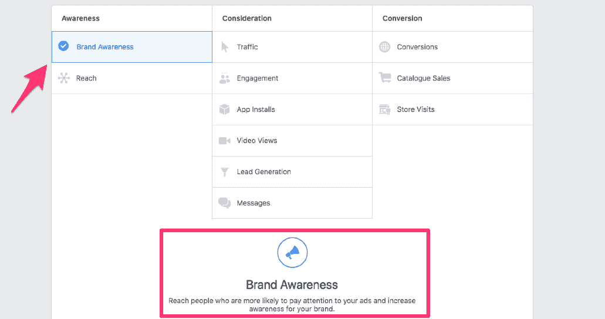

## 这是什么？

这个脸书广告活动的目标很容易解释，它用来增加目标受众对你的品牌的了解。

当你的受众对你所在行业感兴趣时，品牌意识将有助于你的品牌提升和你的企业回忆。

虽然这个目标听起来很神奇，但它可能不适合你。事实上，使用这个广告目标是我们看到的最大的新手错误之一！(稍后将详细介绍)

即使你的广告目标是品牌知名度，但这很可能不是你的目标。(别担心，还有 10 个其他的脸书广告活动目标！)

品牌意识会让更多人知道你的品牌，但不会增加点击率、购买量、选择加入量或参与度。

## 应该在什么时候使用？

即使你在一家令人惊叹的初创企业或中小型企业工作，并且真的想提高你的品牌知名度，**也不要**选择这个选项。

这是建立受众的一个很好的方法，但远不如我们将讨论的其他一些活动目标有效(稍后)。

这一广告目标在大型企业使用时效果最佳，这些企业希望促使用户重新参与他们的品牌。

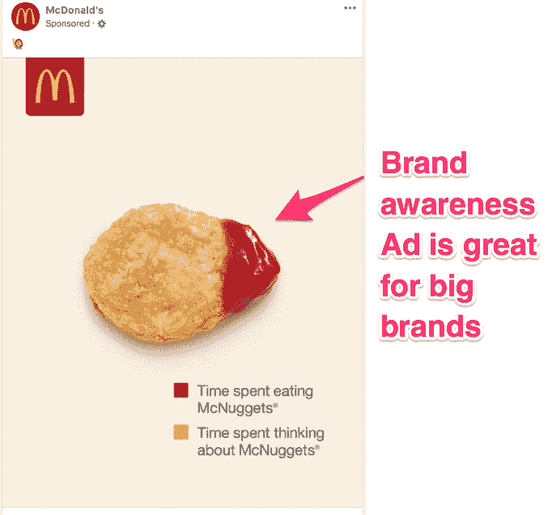

它的工作原理是向目标受众(由你选择)展示一个普通的品牌广告，然后向参与帖子的任何人重复展示这个品牌广告。

这对那些想在目标受众心目中留下深刻印象的大企业来说是一个奇迹，但是，除非你有巨额预算，否则这个脸书广告活动的目标只不过是一种奢望。

像 [*麦当劳*](http://mcdonalds.com/)[*耐克*](http://nike.com/) 和 [*可口可乐*](https://www.coca-cola.co.uk/) 这样的大品牌都使用这种类型的广告。除非你所在的企业有这么大的营销预算，否则就不要考虑品牌认知度这个选项。

## 非常适合

拥有大量预算的大品牌，试图主导他们的行业

## 广告格式

*   图像
*   录像
*   旋转木马
*   幻灯片

# #2:延伸

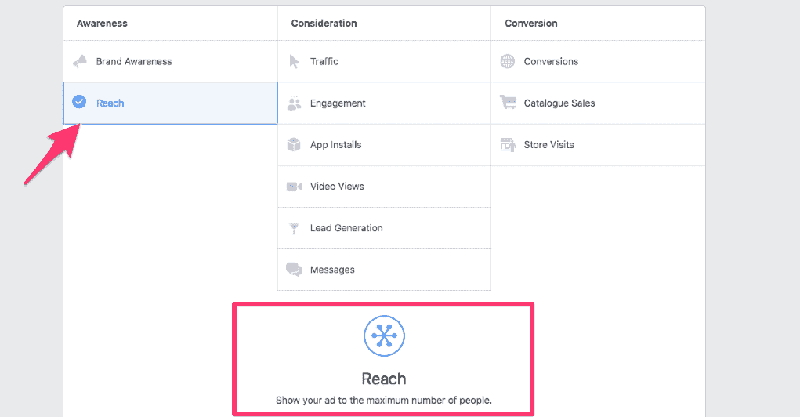

## 这是什么？

reach 目标是一个有趣的目标。正如 2018 年所记录的那样，**脸书从用户那里收集数据**，尤其是当他们与广告互动时。

所以，当你选择一个像*参与*这样的目标时，脸书的目标是你的目标受众中有*参与*(喜欢、分享或评论)历史的人。

除了 Reach，脸书的广告经理对他们所有的目标都这样做。

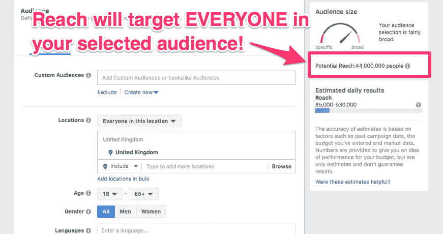

这个脸书广告活动的目标是针对你的目标市场中的每一个人，不管他们是否参与、点击、购买、注册…

…没有任何限制。

如果你想以最低的价格获得最大的浏览量，Reach 目标是很好的。

重要的是要记住，不管你的广告有多棒，有些人从来不会在任何看起来像广告的东西上花费超过一秒钟的注意力。无论如何，reach objective 活动会向这些人展示您的广告。

## 应该在什么时候使用？

当你想在一个小的、非常特定的受众群中提高你的品牌知名度时，Reach 是一个很好的目标。

这个脸书广告活动的目标将不会减少你的观众的规模依赖于他们的历史行动，使其成为利基行业和本地化的业务。

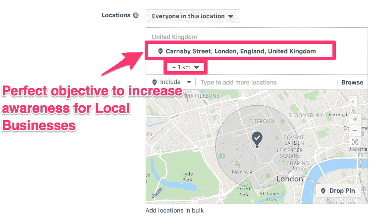

如果你参与了一个本地或实体企业，并希望你所在地区的每个人都能看到你企业的广告，那么 Reach 就是你的目标。

它保证比当地报纸或广播广告有更多的浏览量，它更便宜，你可以跟踪它的进展(更准确)。

使用 Reach 来提高超特定受众的认知度，不为别的！

## 非常适合

当地企业试图提高其地理区域的品牌知名度

## 广告格式

*   图像
*   录像
*   旋转木马
*   幻灯片

# 脸书广告活动目标:考虑

“考虑”类别促使目标受众采取期望的行动。

# #1:交通

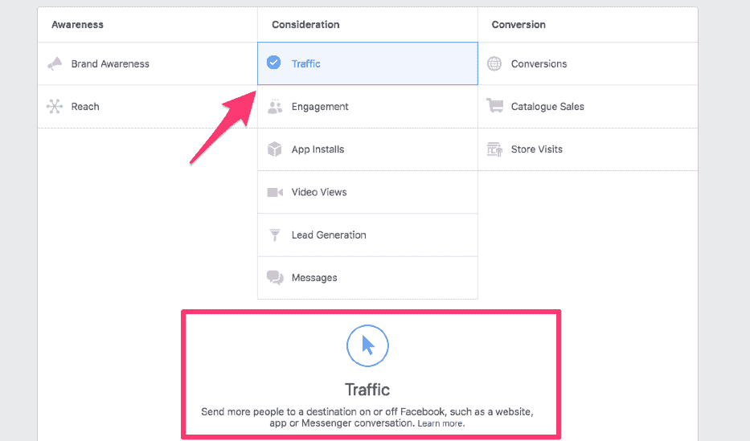

## 这是什么？

流量目标纯粹是用来驱动更多的访问者到你的广告/推广帖子中的链接。

脸书的目标用户是那些在你的目标受众中经常点击链接的用户，不管他们在那个页面上做了什么，或者没有做什么。

更多的流量对你的企业网站来说可能听起来是一件令人惊奇的事情，但是你必须意识到它并不能保证其他任何事情，包括销售、注册或页面参与。

流量目标正如它所说的那样，所以如果你的页面行为指标，如跳出率、会话持续时间、退出率和转换率，受到影响，不要感到惊讶。

收到大量的额外流量可能是一件好事，但也会阻碍你的成长。您可以在我们的指南中了解更多相关信息， [*流量多真的是一件好事吗？*](https://www.einsteinmarketer.com/more-traffic/)

## 应该在什么时候使用？

如果你在销售，把潜在客户吸引到一个杀手级的销售线索磁铁，或者追逐注册，流量不是你的脸书广告活动的目标。

交通可能属于脸书营销活动目标的“考虑”范畴，但它更适合于“认知”。是的，它的目标是广告点击者，但这并不能保证除了更高的数字意识之外的任何东西。

如果你在追逐运动和行动，不要追求这个目标。在考虑类别中有很多其他的方法，你最好使用它们。

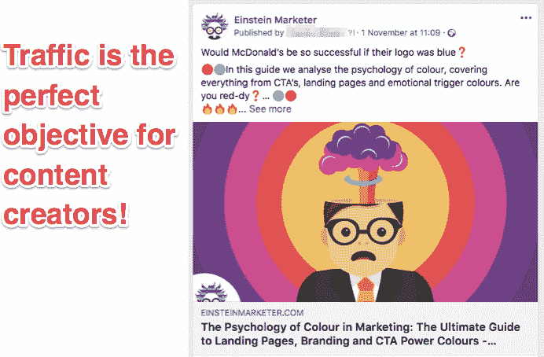

然而，对于内容创作者来说，流量是一个很好的活动目标。把人们带到一个有价值内容的页面(当你没有寻找其他内容的时候)，这是一个向新人们介绍你的品牌和把你自己定位为专家的好方法。

如果你正在写博客、分享视频、录制播客或展示惊人的视觉效果，并且你渴望更高的网站知名度，这就是你的目标。

## 非常适合

寻求更多读者、观众和听众的内容创作者。

## 广告格式

*   图像
*   录像
*   旋转木马
*   幻灯片
*   收藏品

# #2:参与

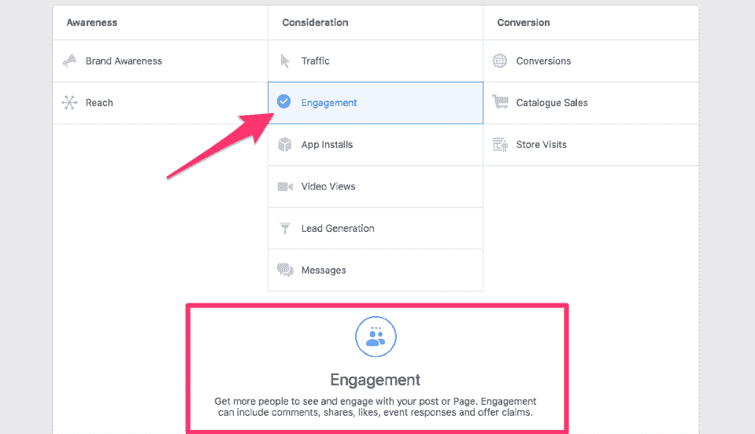

## 这是什么？

毫无疑问，**参与是脸书广告活动最有价值的目标之一**。任何对脸书广告认真的人都会同意。

脸书的广告活动目标分为三个不同的部分，“帖子参与度”、“页面参与度”和“活动响应”。

每一个都有其特定的应用程序(我将很快解释每一个)，但在我们进入这些子类别之前，让我们从整体上讨论一下项目目标。

**参与度驱使用户在脸书**采取行动，更具体地说，这与喜欢、分享和评论有关。

当此目标被选中时，脸书会向有广告接触史(喜欢、分享、评论)的人展示您的广告。

高参与度的广告做得非常好，因为它们包含了社会证明的力量。这种难以捉摸和令人感兴趣的因素，鼓励新用户在一篇帖子上花更多的时间。

例如，你认为你会花更多时间看什么:

1.  有 2 个赞、0 条评论和 0 条分享的视频广告
2.  有 425 个赞、104 条评论和 98 次分享的视频广告

如果你和其他人一样，答案是第二。

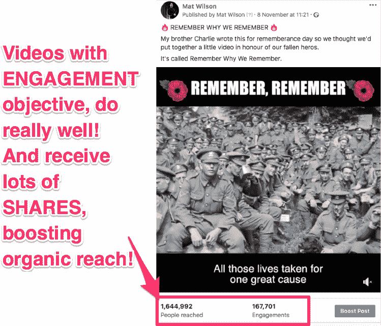

高参与度帖子的另一个惊人的超级有价值的加分点是重新定位。

使用脸书商业管理器，你可以重新定位(显示更多的广告给)那些曾经关注过你的帖子的人。这是一种非常强大的转化方式(尤其是当你使用转化活动目标时，我们将在后面介绍)。

而且，当你把这些“重新定位”的受众扩大时，你可以创造出长相相似的受众。这从你重新定位的观众(根据他们的兴趣和行为)中创造了一个全新的观众，有效地**将你的覆盖范围翻倍**(或者更多，取决于你决定创造多少长相相似的观众！).

## 应该在什么时候使用？

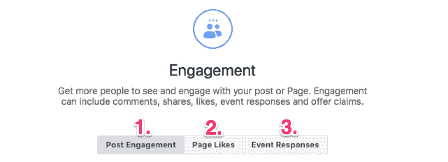

项目目标中的每个目的都有其特定的功能。让我们仔细看看每一种的用法。

## 什么时候应该使用预约后服务？

如果你想让你的广告获得社会证明，那么广告后互动就是你的目标。

实施参与后目标将针对经常参与广告的人群。这会给你的广告带来大量的赞、分享和评论。

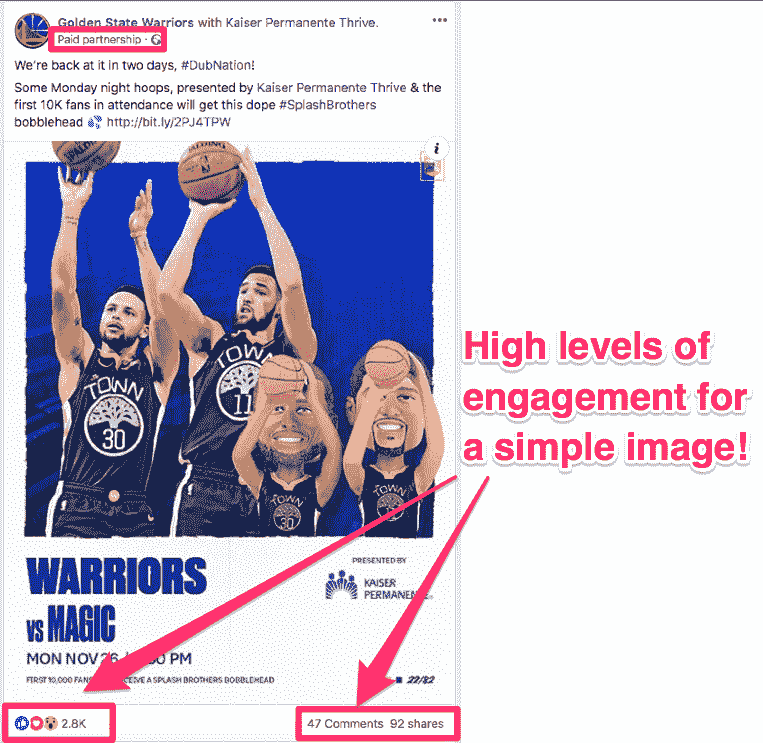

使用这种策略会产生好奇心(用户变得感兴趣是因为他们想知道为什么它会被如此多的人喜欢、评论和分享！)，建立一个重新定位列表，扩大你的广告的范围。

脸书的算法倾向于获得大量参与的帖子，所以当赞、评论和分享(显然)增加时，他们会把你的帖子展示给更多的人！

当参与度指标激增时，您也可以通过复制脸书广告 ID 将此参与度转移到另一个帖子(可能是转换)。这种策略在最有价值的时候创造了大量的社会证据，在你的漏斗底部。

## 非常适合

*   扩大影响和提高认识。
*   创建重定目标列表
*   社会证明
*   想要“病毒式传播”的创作者

## 什么时候应该使用页面参与？

页面参与类别是提高你的脸书关注度和你的帖子的有机覆盖率的一个很好的方法。

这个脸书广告活动的目标是通过锁定最有可能喜欢你的页面的人来增加页面的喜欢度。

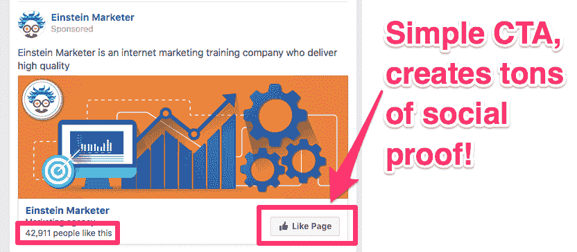

对新用户来说，高页面点赞率是一个至关重要的信任信号，页面参与活动是所有新企业都应该做的事情。

这是很好的社交证明，鼓励他人随大流，向潜在客户证明你是他们可以信任的品牌。

如果你的预算中有足够的空间，我会鼓励每一个认真对待社交媒体营销的企业开展持续的页面参与活动。**每天只需 5 美元就能给你的生意带来巨大的变化。**

一个拥有 127 个页面赞和 25000 个页面赞的潜在客户对一个企业的看法差异是巨大的。利用页面互动来增加你的可信度。

## 非常适合

*   品牌知名度
*   关注者和帖子覆盖范围的增加
*   社会证明

## 什么时候应该使用事件响应？

如果你在主持一个活动、研讨会或舞台销售，你可能会认为活动响应是脸书广告活动的目标…

…你就错了。

事件响应鼓励脸书内部的参与，本质上是要求你的目标受众中的某个人接受脸书页面上的事件邀请。

这项技术有很多问题。

首先，脸书的目标人群是经常接受活动邀请的人。这听起来可能很神奇，但当你那天来到一间空屋子时就不会了。

这是因为承诺因素。在脸书，让某人说“是”、“否”或“也许”并不需要你的潜在参与者做出足够的承诺。

如果你对举办活动很认真，有很高的出席率和满座率，不要使用这个目标。

## 非常适合

*   政党
*   产品发布会
*   不是商业事件(尤其是对冷漠或热情的观众)

# #3:应用安装

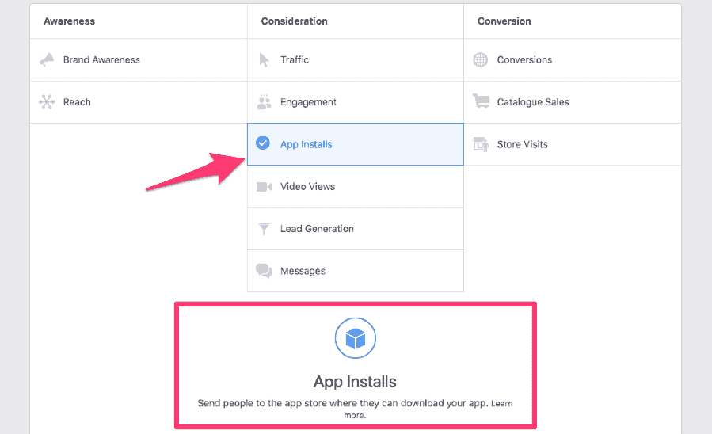

## 这是什么？

App Installs 是一个非常具体的脸书广告活动目标，所以我们将保持这个非常简短和甜蜜。

此目标用于增加移动应用的安装数量。

脸书通过锁定目标受众中有点击应用安装广告和安装广告应用历史的人来做到这一点(很明显)。

应用安装目标是独特的，因为它直接链接到应用商店(不同的链接取决于设备的操作系统)。

## 应该在什么时候使用？

应用程序安装目标应该只在一种情况下使用:如果你有一个应用程序，你想让更多的人安装。

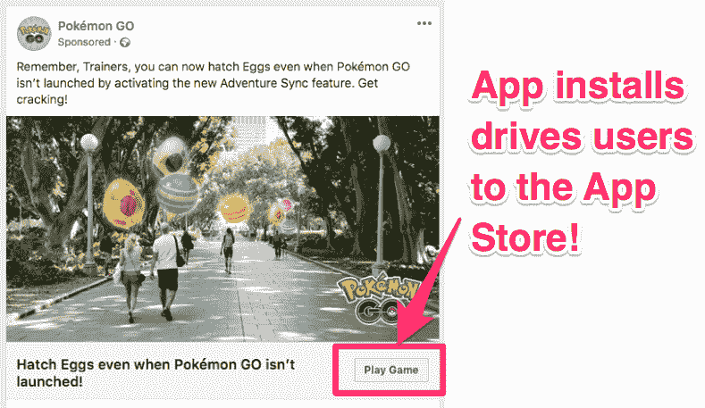

这个目标对其他任何事情都没有好处！

## 非常适合

应用开发者

## 广告格式

*   单一图像
*   单一视频
*   旋转木马
*   幻灯片

# #4:视频观看

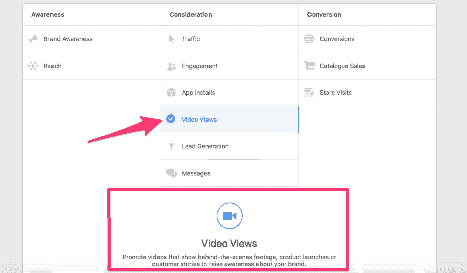

## 这是什么？

如果你有一个想要推广的视频，这个**可能就是你的目标。**

我之所以说可能，是因为视频浏览量目标确实如它在 tin 上所说的那样，它让你获得视频浏览量(但不保证其他任何东西)。

如果你使用视频来销售产品，产生线索或鼓励人们参与，视频浏览(可能)不会像其他一些更具体的目标那样成功。

然而，如果你试图通过使用视频来增加你的社交媒体存在并创造更多的品牌知名度，这可能是你的选择。

脸书针对的是看很多视频的人，这个活动目标和流量目标类似，**脸书并没有通过看完**后的行动来缩小受众范围……

…这意味着以最低的价格获得最大的浏览量(没有任何金钱回报或观看后行动的保证)。

这种描述可能会让很多人反感，但视频视图确实有另一个强大的效果:重定位。

通过使用此目标，您可以重新定位那些观看了您视频的特定百分比(例如 25%、50%、75%、100%)或超过特定时间(例如 3、10、30 秒)的人。

观看了 100%你的视频的人已经被介绍给你的品牌，并且更有可能转化为一个重新定向的广告。

当你建立起这些重新定位的观众群时(通过向更多人展示视频)，你可以创造出长相相似的观众群，这是一种扩大广告活动规模的绝佳方式。

## 应该在什么时候使用？

视频是最受欢迎的在线内容形式，并且越来越受欢迎。换句话说，您需要使用这种内容格式。

这个脸书广告活动目标非常适合那些希望通过寻求尽可能多的浏览量来提高知名度的品牌，但也就是说，你们大多数人最好在参与活动中运行视频广告(你可以用这个目标建立更大的目标列表)。

向尽可能多的相关人员展示你的视频是介绍你自己的好方法。你能够很容易地解释问题，并与听众建立信任。

视频浏览量是一个非常受欢迎的活动目标，但我建议你的视频广告使用参与活动。

## 非常适合

*   品牌认知度(针对冷漠受众)
*   介绍新产品/服务并重新定位
*   建立品牌信任

## 广告格式

*   单一视频
*   幻灯片
*   旋转木马

# #5:潜在客户生成

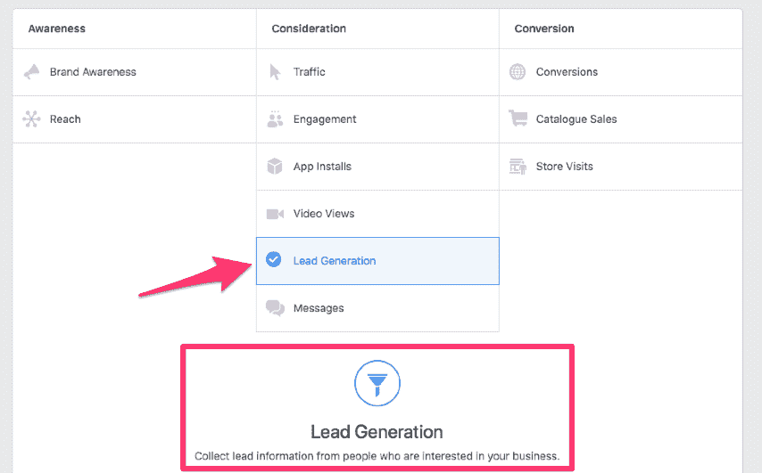

## 这是什么？

引导一代是另一个有趣的脸书广告活动目标。所有的一切都托管在脸书的平台上，而不是将潜在客户发送到一个线索捕获表单或一个带有线索磁铁的外部网页。

脸书把你的广告展示给可能接受你的提议的用户，在脸书的弹出窗口上交换他们的联系方式。

这种类型的潜在客户生成导致高转换率，因为它需要用户付出很少的努力。他们不必离开脸书平台，因为脸书已经有了他们所有的详细信息，表格会立即被预填充，例如他们的电子邮件地址已经在电子邮件框中，电话号码在电话号码框中，等等。

他们只需点击您的 CTA，销售线索就会立即收集起来。

## 应该在什么时候使用？

领先一代脸书广告活动的目标可能听起来很惊人(因为它的高转换率)，但它是有代价的。

这种类型的潜在客户生成需要很少的努力或承诺，这意味着他们不需要对你的产品非常感兴趣来交换他们的细节。

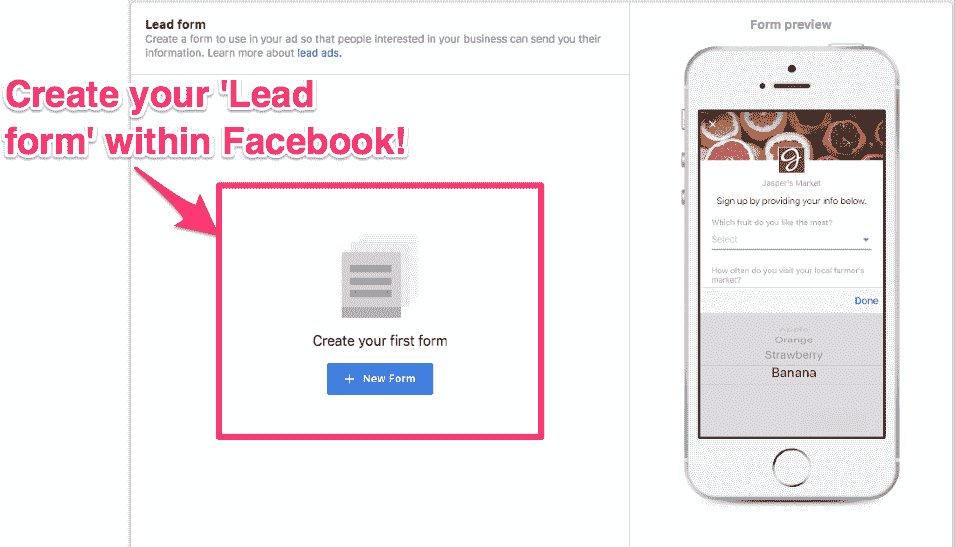

在接受了你的销售线索并交换了他们的详细信息后，这些销售线索就不太可能接受你向他们推销的任何东西。

然而，领导一代是一个惊人的方式，从零开始建立一个名单，或振兴一个垂死的营销名单。

只有当潜在客户已经知道你的品牌时(在考虑阶段，漏斗的中间)，才应该使用它，使它成为一个很好的重新定位广告目标。

## 非常适合

*   从头开始建立营销列表
*   提高销售线索转化率
*   重新定位
*   更新濒临死亡的名单

## 广告格式

*   单一图像
*   单一视频
*   旋转木马
*   幻灯片

# #6:消息

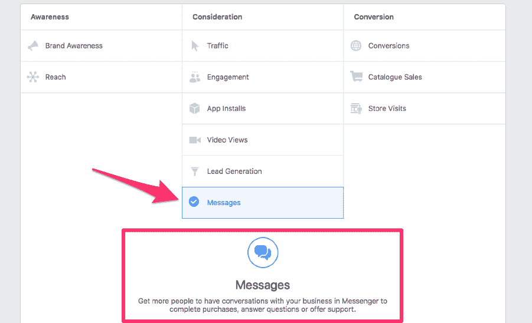

## 这是什么？

作为一家代理商，我们已经成功运用了脸书的广告活动目标。

Messages 让用户来到 Facebook Messenger 的*，在那里他们可以直接向你的商业页面发送消息。*

*这非常有用，因为 Facebook Messenger 正迅速成为最成功的潜在客户拓展形式。*

*为了充分利用这一广告目标，您需要 Messenger 托管软件。这将收集你的受众信息，允许你 [*创建一个机器人*](https://www.einsteinmarketer.com/chatbot-story-messenger/) (它可以与你的受众进行基本对话)并发送大量消息。我们选择的软件是 [*ManyChat*](http://manychat.com/) 。*

*Messenger 营销有一个主要规定:你不能在 Messenger 上(从商业页面)直接给任何人发送消息，除非他们先和你交谈。*

*在 messenger 上使用鼓励品牌参与的广告，完全跳过这个障碍，建立你的清单。*

*Messenger 也是用户与你的企业(通过你的机器人)进行对话的一个很好的方式，有效地加热冷流量。*

## *应该在什么时候使用？*

*当您想要建立一个信使列表时，应该使用信使目标。*

*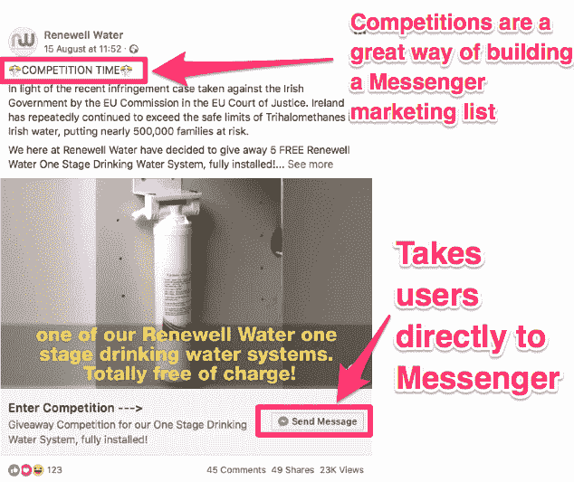*

*它们非常适合那些从现有营销列表中看到低回报的企业，或者那些希望产生潜在客户的企业(Messenger 也可用于收集电子邮件和电话号码等联系信息)。*

*使用 Messenger 平台可以建立一个完整的营销漏斗，平均打开率约为 **90%** ，点击率约为 **50%** ，很容易理解为什么这个渠道越来越受欢迎。*

*如果您想了解更多关于信使营销及其令人难以置信的投资回报率(并列出建设潜力)，请查看我们在 [*《终极信使营销指南》中的案例研究(带成功案例研究模板)*](https://www.einsteinmarketer.com/messenger-marketing/) 。*

## *非常适合*

*   *竞争*
*   *线索挖掘*
*   *建立品牌信任(通过互动)*

## *广告格式*

*   *图像*
*   *录像*
*   *旋转木马*
*   *幻灯片*

# *脸书广告活动目标:转换*

*转化类别是将潜在客户转化为客户的最佳方式。使用漏斗底部转换的目标。*

# *#1:转换*

*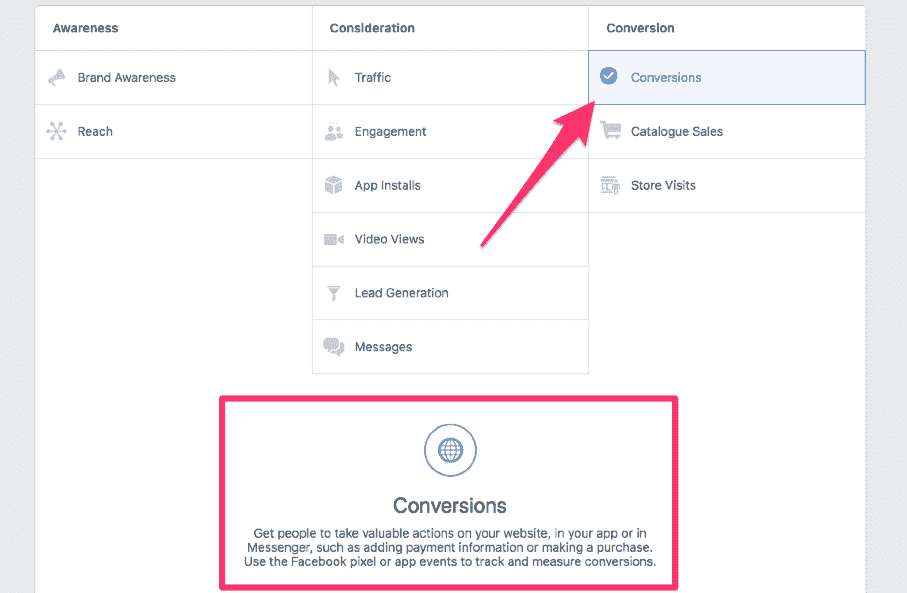*

## *这是什么？*

*任何营销人员的最终目标都是让潜在客户接受他们的报价。因此，在所有的品牌认知、引导产生和重新定位增长之后，转化是脸书广告活动目标的圣杯。*

*在这个阶段，我们实际上是在告诉脸书，只把你的广告展示给有可能改变信仰的人。*

*为了成功做到这一点，你必须在你的网站上安装一个脸书像素( [*了解更多关于脸书像素*](https://www.einsteinmarketer.com/must-have-facebook-pixel/) )。这个像素让脸书可以跟踪每个用户与你网站的互动，包括注册、签约和购买。*

*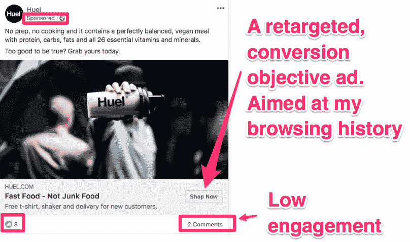*

*优化你的转化目标的第二步是开始转化(从你的广告)每周至少 15-25 人。*

*当你安装了 pixel 并转换了至少这个数字，脸书将自动显示你的广告给最有可能转换的人。*

*随着越来越多的人转化(通过你的转化活动广告)，脸书将更好地优化你的广告！如果你每周能获得 100+的转化率，你将处于一个非常有利的位置来降低你的 CPA(每次收购的成本)。*

*转化活动不一定与销售有关，它也与**注册**和**潜在客户生成**有关。如果你的页面上有一个报价，而你的脸书 pixel 正在火起来，那么你在使用这个营销目标时就处于有利地位。*

## *应该在什么时候使用？*

*转变是脸书最受欢迎的活动目标，原因有二:*

1.  ***太牛了***
2.  ***品牌犯的错误是忘记了其他一切，直接跳到这里！***

*把冷流量转化成顾客，比已经和你的品牌有过互动的人要难得多。*

*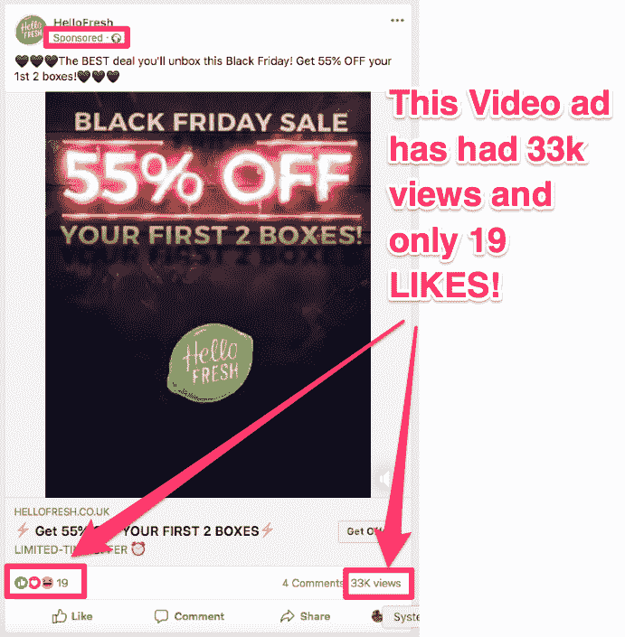*

*为了让您的像素和转化活动有最佳的优化机会，您应该建立品牌意识，并在考虑类别中使用目标(如参与度)。当你有足够的数据，脸书知道谁真正改变了你的提议，你就更有可能成功…*

*…当你开始取得成功时，你可以进一步优化你的转化广告，复制它们(横向扩展)，增加预算(纵向扩展)并创造类似的东西。*

## *非常适合*

*   *线索挖掘*
*   *销售*
*   *捐款*
*   *测试登录页面*

## *广告格式*

*   *图像*
*   *录像*
*   *旋转木马*
*   *幻灯片*
*   *收藏品*

# *#2:目录销售*

*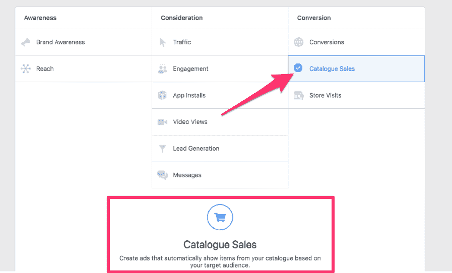*

## *这是什么？*

*《家居指南》的销售目标是从您的网站中引入**各种产品，并以动态广告形式(多幅动态图像)展示它们。***

*只有当你在脸书的平台上建立了产品目录，他们才能做到这一点。这使得他们可以不断地从你的网站上推出新产品，并展示给你的目标受众。*

*就像转换脸书广告活动的目标，目录销售是为了销售，但他们只能真正优化，如果你在你的网站上进行转换(你已经设置了你的脸书像素)。*

*这一目标自动保持您的广告与您的最新产品，价格和产品描述都是轮换的新鲜。*

## *应该在什么时候使用？*

*对于电子商务公司来说,《家居指南》的销售目标可能很不确定。*

*是的，它为你的最新产品做广告，但因为它使用动态广告自动轮换这些优惠，所以它经常会向错误的受众显示不相关的产品。*

*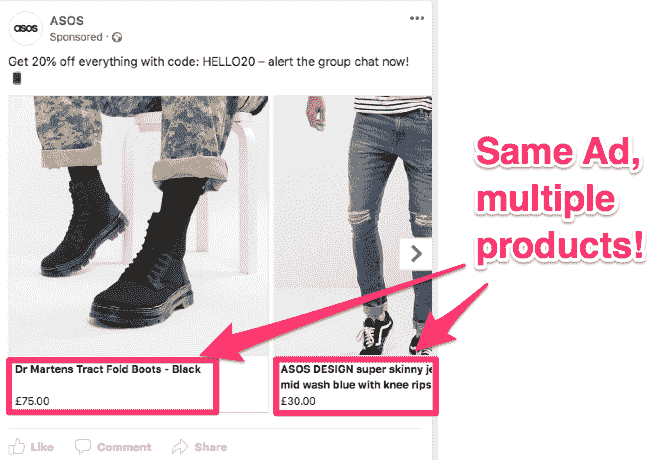*

*如果你有一个中小型商店和反映这一点的营销预算，你会更好地将特定的产品定位于特定的受众，以实现转化活动的目标。*

*然而，如果你有一个大型电子商务商店，有很多产品，大量的流量和相当不错的转化率，目录销售可以让你的脸书广告保持新鲜，吸引你的现有客户。*

*尽管这一目标出现在转换类别中，但除了实物产品之外，你不应该将它用于任何东西。如果你正试图创造新的销售线索，或者你正在销售“黑箱”产品(购买前看不到或摸不着的东西，如信息、订阅账户)，请远离目录销售。*

## *非常适合*

*   *旨在用新产品吸引现有客户的大型电子商务企业。*
*   *高流量得分的知名品牌。*

# *#3:商店访问*

*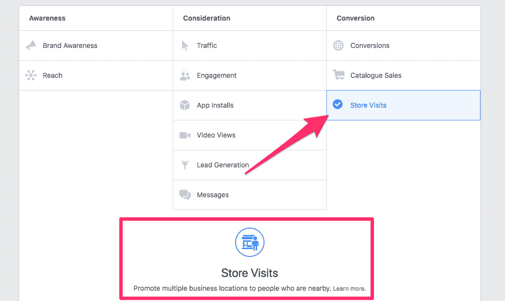*

## *这是什么？*

*这一脸书广告活动目标非常适合有实体位置的企业，其工作方式与 Reach 目标非常相似(在认知部分的第 3 条中解释)。*

*商店访问的目标是你的企业特定半径(由你选择)内的每个人。如果你有多个商店，脸书将针对每个地址在你设定的半径范围内的每个人。*

*只要你的广告在你选择的范围之内，并且(在他们的手机上)打开了地理定位，脸书对你的广告显示对象没有偏见。*

*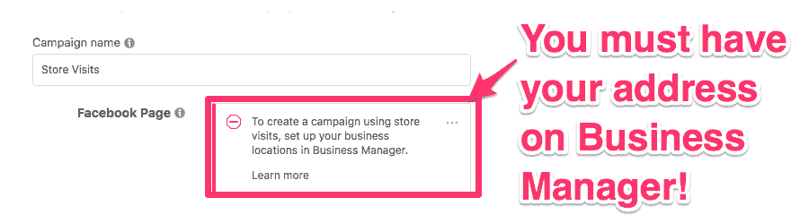*

*但请注意，只有在你的脸书个人资料中输入了你的公司地址(并且是最新的)，商店访问才会有效。*

*看看商店访问广告，就像当地报纸广告一样(好得多)。你可以把你的内容定位在特定的地方，真正接触到你所在地区的人们。*

## *应该在什么时候使用？*

*与这一类别中的其他两个脸书广告活动目标不同，光顾商店并不能保证销售。*

*这些广告并没有针对最有可能购买的人群进行优化，但是它们是针对地理位置的，这将为您节省大量时间来培养地理位置相关的受众(尤其是如果您的企业有多个位置！).*

*如果你有一家本地商店，或者一家需要顾客光顾的实体企业(例如一家餐馆)，这是提高知名度和鼓励更多顾客光顾商店的一个很好的目标。*

## *非常适合*

*   *当地企业*
*   *品牌知名度*

## *广告格式*

*   *图像*
*   *录像*
*   *旋转木马*
*   *幻灯片*
*   *收藏品*

# *脸书广告活动目标:测试*

*你可能认为你已经有了正确的目标，也许这个指南甚至支持它，但是如果它没有产生积极的回报，是时候进行测试了。*

*肯定有你应该远离的目标(取决于你的需要)，但是总有不止一个目标会产生结果。*

*我们已经看到参与度活动以惊人的水平转化，消息活动使流量水平飙升，转化广告产生难以置信的参与度。*

*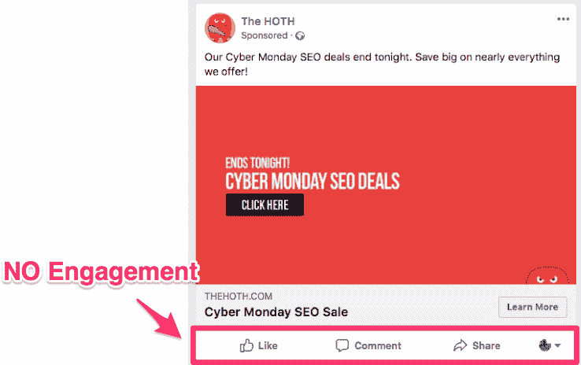*

*测试是非常重要的，尤其是当你没有获得投资回报的时候。*

*然而，如果你已经有回报，不要改变任何东西！从这里你可以扩大你的预算(纵向扩展)或者在同样的预算上复制你的观众(横向扩展)…*

*…但那是不同日子的不同指南。(别担心，我很快就会着手解决这个问题！)*

# *结论*

*脸书广告活动的目标可以成就或破坏你的营销。做对了，你会获得疯狂的投资回报，但做错了，你会不小心把钱扔掉。*

*使用本指南中的信息来优化您的活动，并确保您远离本文中列出的新手错误。相信我，改变你的目标会让世界变得不同。*

*您使用的是什么营销目标？你对我们的观众有什么额外的建议吗？在评论里让大家知道！*

*如果你喜欢这篇文章，并且你对脸书营销很认真，你绝对应该看看， [***《脸书广告更新》没人在谈论:反向工程你的广告！***](https://www.einsteinmarketer.com/facebook-ads-update/)*

**

## *这篇文章发表在 [The Startup](https://medium.com/swlh) 上，这是 Medium 最大的创业刊物，有+392，714 人关注。*

## *订阅接收[我们的头条新闻](http://growthsupply.com/the-startup-newsletter/)。*

**