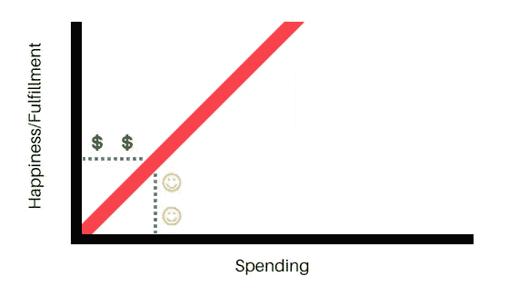
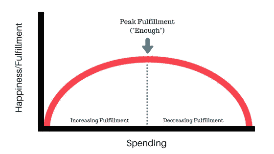
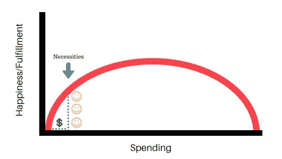
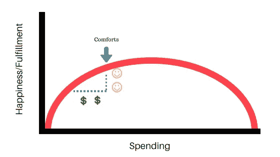
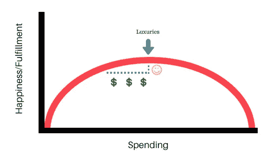
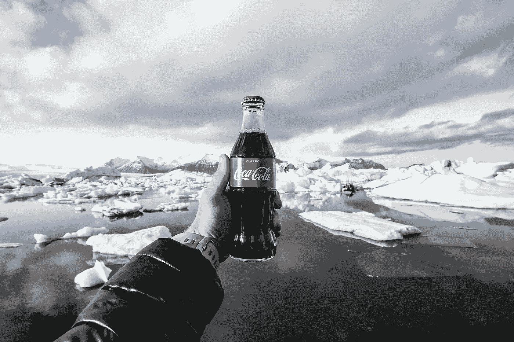
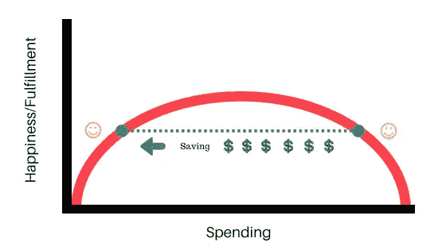
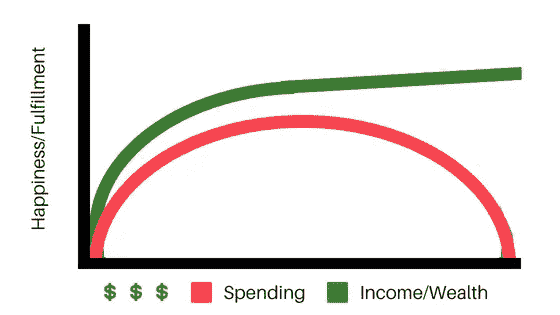

# 金钱和幸福的终极指南

> 原文：<https://medium.com/swlh/the-ultimate-guide-to-money-and-happiness-eaadeadda56a>

Photo by [Mahir Uysal](https://unsplash.com/photos/8WRtQAyJwHE?utm_source=unsplash&utm_medium=referral&utm_content=creditCopyText) on [Unsplash](https://unsplash.com/search/photos/smile?utm_source=unsplash&utm_medium=referral&utm_content=creditCopyText)

> 我们认为这些真理是不言而喻的:人人生而平等，造物主赋予他们某些不可剥夺的权利，其中包括生命权、自由权和追求幸福的权利—《独立宣言》

这些词是美国历史上最著名的词汇之一，直到今天，它们仍像 1776 年首次写作时一样引起强烈的共鸣。

如果你和我一样，你可能认为生命和自由是理所当然的，并且最专注于追求幸福。

你也可能已经意识到，金钱在某种程度上与追求幸福紧密相连。

见鬼，即使是威尔·史密斯的电影《追逐海蓓娜斯》(故意拼错)也主要是关于一个单身父亲的经济困境。

你可能认为如果你有更多的钱，你会更快乐。我也经常这么想，其他人也是。

有趣的是，我们都知道有大量的反例。名人赚的比我们想象的要多，他们非常不快乐，直到他们“意外”过量服用安眠药而早逝。

因此，显而易见的是，更多的钱并不总是意味着更多的幸福，然而，在你的情况下，你可能会相信会有更多的幸福。

你也许是对的。你可能大错特错。在这篇文章中，我将尽我所能解开如何知道在你的情况下哪个是真的。我将着眼于金钱、消费和幸福之间的关系，看看我们能从金钱与追求幸福的关系中学到什么。

# 实现曲线

乔·多明格斯和维基·罗宾的个人理财经典《T2:你的钱还是你的生活》中的一个关键观点是，支出和幸福之间的关系不是线性的。

不管他们是否知道，大多数人脑子里都有这样的想法，更多的钱=更多的消费=更多的幸福。有时候是这样，但不是一直都这样。

我们脑海中的模型看起来像这样:

随着支出的增加，幸福感也会增加。根据多明格斯和罗宾的说法，事实看起来更接近这张图表:

支出确实会带来幸福，但它会受到收益递减的影响。你花的越多，得到的快乐回报就越少。

事实上，最终你会到达一个转折点，更多的花费实际上会让你*更不快乐，并带走你已经建立起来的成就感。*

这个拐点就是“够了”这个强有力的概念。

## 当你在为基本生活而挣扎的时候，更多的钱=更多的消费=更多的快乐。

当你获取食物和住所的能力受到质疑时，生活会相当紧张。

如果你有需要照顾的人，尤其如此。想象一下，作为一个单亲家长，努力寻找工作。你的整个身份很容易被你供养孩子的能力所束缚，而无力这样做是毁灭性的。

当你家里没有人吃饱肚子的时候，你很难感觉良好。

如果你从一文不名变成有钱人，你可能会把钱花在必需品上。这将极大地提高你的生活质量，给你带来巨大的满足感。

这是它在实现曲线上的样子:

A little spending results in a lot of happiness.

一旦你有了基本的东西，你就可以开始增加一些现代生活的舒适。你可以买适合你遇到的各种情况的家具和衣柜，甚至买洗衣机洗衣服，这样你就不需要用手洗衣服了。

支出增加了，幸福感也增加了，但不如你第一次有能力填饱肚子时那么多:

More spending still = more happiness, but the exchange rate isn’t as good.

消费阶梯的最后一级是奢侈品。现在你可以买到真正漂亮的衣服，高档的电子产品，闪亮的汽车。

你可以度过一个愉快的假期，而不是廉价的居家度假。

你可以出去吃饭，让人们像对待国王一样给你上菜(补充说明:如果你对出去吃饭的能力没有深深的感激，并且看不到这是 99%的人都没有的奇迹，你需要锻炼你的感恩肌肉)。

奢侈品确实会给你带来快乐，尤其是当你心存感激的时候，但是你的钱在曲线的这一部分并没有延伸得那么远:

*Wait a minute, three dollar signs for one smiley face? Two charts ago I was getting three smiley faces for one dollar sign!*

## 达到顶峰后，更多的花费=更少的快乐…

这可能很难让你理解。更多的花费怎么会导致更少的快乐？

多明戈斯和罗宾提出的主要观点是，由于*杂乱*的引入，幸福感开始下降。

更多的花费通常意味着更多的东西，而更多的东西意味着需要更多的照顾和占据你的精神能量。

让我们做一个思维练习。首先，想象一个干净的装饰精美的房间。一旦你脑海中有了那个画面，想象一个丑陋、凌乱的房间。

哪个有更多的*东西*？

凌乱的房间让你感觉如何？

杂乱是一种无时不在的情感负担，即使我们没有意识到这一点。

我想举另一个减少快乐的例子。在这个例子中，我们将看看在单一项目上的花费:可口可乐。

现在，我告诉你一个秘密:我认为糖是邪恶的，但我对可乐情有独钟。我仍然在周六喝它——这是我的作弊日——但是我以前尽可能多的喝。

Behold: the glass bottle. Glorious king of the Coke-delivery vehicles. A worthy center of attention amid this majestic landscape. Photo by [Jeremy Bishop](https://unsplash.com/photos/9veG4bFKqNA?utm_source=unsplash&utm_medium=referral&utm_content=creditCopyText) on [Unsplash](https://unsplash.com/search/photos/coke?utm_source=unsplash&utm_medium=referral&utm_content=creditCopyText)

这东西就像神的甘露。这是液体黄金(旁注:我妻子在读那句话时的评论是“液体黄金是他们所说的母乳，但我会允许它”)。

可口可乐固然美味，但买得越多就越开心，对吗？

嗯，一开始是的。买一些可乐当然比不买要好。你会因为买得更多而不断获得快乐，但是每多买一瓶可乐都不会带来像可乐很少见时一样的满足感。

但是过了一段时间，可乐就变成了你日常生活的一部分。它不再给你带来任何独特的享受，它只是像水一样伴随着你的进餐。

然而与水不同的是，你开始注意到一些令人不安的趋势。你的牙齿变黄了。你的腰围在扩大。你的血液检查表明你正在出现慢性疾病的早期迹象。你似乎花的比你想要的多，而且在周末也没有你想象的那么多。

你的可乐消费太过分了。你已经过了满足感的高峰期，每多买一瓶可乐都会带来双重打击，让你花更多的钱，让你更不开心。

## 解决办法很简单:削减开支。

你不需要从生活中完全去除你真正喜欢的东西，但你应该仔细考虑减少是否会让你的生活(和财务)变得更好。

对我来说，试图完全放弃可口可乐听起来就像拔牙一样愉快。但是我知道在我的生活中，有些时候我已经超越了巅峰状态，需要削减开支。

令人惊奇的是，如果你在任何领域都超越了巅峰状态，你可以削减开支，实际上获得更多的快乐。或者，你可以继续削减开支，用*少得多的*开销获得*同样的*快乐:

Spending goes WAY down, happiness stays the same

可乐现在带给我的快乐可能接近我在它上面花费太多的时候。

## 这个概念适用于任何情况…

我在这里用了可口可乐作为例子，但是其中的原则几乎适用于你所做的任何消费。

关键是做一些小规模的个人实验，看看在某个特定领域削减开支会如何影响你的幸福感。

也许在杂货店买商店品牌而不是名牌对你的幸福没有影响。试试看就知道了。

也许一周出去吃三次和一周出去吃四次一样好。

也许你对 30 个频道和 200 个频道一样满意。或者也许你也很乐意切断脐带，转投网飞。或者，也许你也很乐意剪掉所有东西，买一份《我是如何遇见你妈妈的》的电子版，然后看一年。或者，也许你完全放弃看电视，从图书馆借书也一样快乐。

有了这些东西，你不试试就不知道了。

在某种程度上，削减开支开始让你觉得限制太多，会让你不开心。根据你的情况和目标，做一些痛苦的削减可能是有意义的，但不要从那里开始。

几乎每个人都有习惯性支出，他们可以减少支出而不会错过一点。永远先寻找那些机会。

这也意味着，虽然从别人的节俭建议中获得灵感是很好的，但应该只是为了获得灵感。你可以自己决定削减哪些开支，以及削减的原因(尽管如果你已经结婚并想维持婚姻，你可能应该让你的配偶参与所有涉及金钱的决策)。

# 增加你的收入

This man is clearly a titan of industry — I mean, just look at that magnificent beard!

到目前为止，我们一直在谈论金钱，好像它只适合于消费。

如果这是真的，那么我给你看的所有这些图表对支出和收入都是真的，这让我们得出了一个与直觉相反的结论:在某一点上，更高的工资会导致更少的幸福。

这个想法有点道理。有时收入的增加会带来过多的压力。

但这并不是唯一起作用的因素。

我想建议收入和幸福之间的关系应该是这样的:

Making more > spending more

早期，它与支出曲线密切相关。因为急需必需品。你的大部分收入都花掉了。

然而，随着收入的增加，你开始获得一些喘息的空间。你也有机会用你的钱做除了消费以外的其他事情，比如付出和储蓄。

实际上，我认为金钱的最佳用途是给予。给予让世界变得更美好，让你成为更好的人。

如果给予是你金钱的最佳用途，储蓄紧随其后。为自己留一些钱而不是花掉它的好处是，如果你投资，你的钱可以开始为你赚钱。

现实是，如果你想积累财富，你不想成为唯一一个为你的钱工作的人。有三样基本的东西你可以为自己工作:房地产、生意或你的钱。

这是退休所基于的关键:如果你想停止工作，你需要有人或其他东西代表你工作。传统上，这是你投资的钱。

> 金钱可以买到很多东西，但它能买到的最好的东西是自由。

大多数人是银行、汽车公司、工作等的契约仆人。当你的钱为你赚钱时，你就拥有了真正的财务自由。

在我即将出版的新书《为你工作的个人理财: *如何积累财富、设计未来、在睡觉的时候赚钱*(将于 6 月在亚马逊 Kindle 上出版)中，我讲述了如何以一种几乎设定好就忘记的方式投资，这种方式将击败绝大多数投资者。我也回顾了几乎毫不费力的省钱方法以及在网上建立被动收入的方法，这样你就有更多的投资。

当这本书出版时，我将免费赠送它五天，作为特别促销。如果您希望我通知您何时可以获得免费的副本，您可以在下面注册:

 [## 等候批准的申请人名单

### 我的新书《为你工作的个人理财:如何积累财富，设计你的未来，在你…

thematthewkent.com](http://thematthewkent.com/waiting-list/) 

# 金钱与幸福的间接联系

是的，消费、储蓄和给予都能给你带来幸福，但它们不是唯一能带来幸福的东西。事实上，它们甚至不是能做到这一点的主要东西。

考虑以下可能让你开心的事情:

*   投资于你最深层的关系
*   在户外大自然中度过时光
*   吃美食
*   致力于一项艰巨的任务
*   参与创新
*   朝着有价值的目标前进

所有这些事情当然都可以在没有钱的情况下完成，但在所有这些事情中，钱可能会以多种方式参与进来。想一想:

投资于你最深厚的关系通常意味着时间和注意力的投资。但这也可能涉及一些支出。我在情人节送给妻子的花不是免费的。

**在大自然中度过时光**通常是免费的，但有时你可能需要付费才能进入国家公园或去一个能激发你内心深处敬畏的地方。

**吃好的食物**显然是清单上最经常花钱的东西。当然，如果你喜欢的话，你还是可以去觅食，但我不建议你这么做。

投入到一项困难的任务中去和**参与创造性**是免费的，但是你想要使用的工具和资源可能不是。

朝着有价值的目标前进可能与金钱无关，但你的目标很可能与金钱有关。我有建立应急基金、付清房款和提前退休的目标(尽管我从未打算辞职)。

记住金钱和幸福之间的间接关系很重要，原因有二:

首先，它有助于提醒你，即使没有更多的钱，也有很多机会变得更快乐…

第二，这意味着幸福是你看待支出的一面镜子。分配给可靠地带来幸福的类别的资源得到了充分利用。

# 最后的想法

记住，快乐是最终目的，而不是金钱。

金钱只有在能支持你追求幸福的时候才有用。因为它有很大的潜力，所以正确处理是一个重要的话题。

如果你想提升你的个人理财水平，可以看看我的书: ***适合你的个人理财:*** *如何积累财富、设计未来、睡觉时赚钱*

拿到这里:[https://amzn.to/2JfESW8](https://amzn.to/2JfESW8)

## 这篇文章发表在《初创企业》杂志上，这是 Medium 最大的创业刊物，有 328，729 人关注。

## 订阅接收[我们的头条](http://growthsupply.com/the-startup-newsletter/)。

