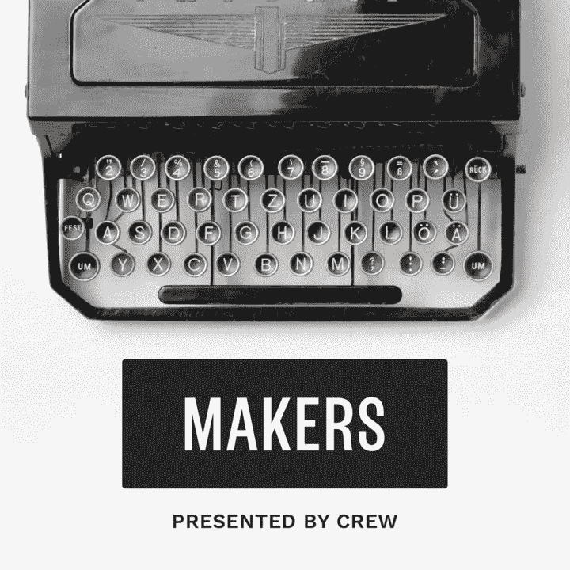
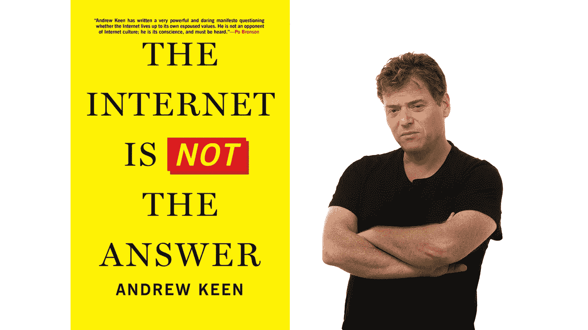
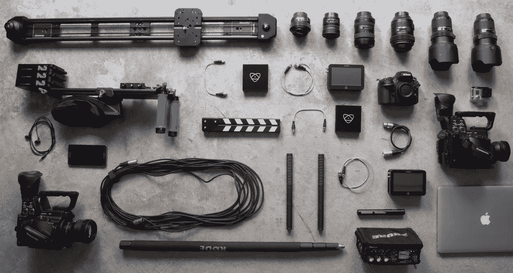

# 启动、制作和推广播客的终极指南

> 原文：<https://medium.com/swlh/the-ultimate-guide-to-starting-producing-and-promoting-a-podcast-5b598143e552>

关于制作播客，还有什么比阅读更好的呢？不如看看我最新的播客，新经济！

Subscribe on [iTunes](https://itunes.apple.com/us/podcast/this-new-economy/id1247086675) or [PublicRadio](https://play.radiopublic.com/rocketshipfm-GOoMVl)

毫无疑问，随着连续剧、Gimlet Media 的初创公司以及众多 NPR 播客的成功，播客的听众人数正在激增。

有声故事又回来了，它越来越受欢迎，给你这个项目制作人提供了一个不可思议的机会去接触新的观众，扩大你现有的观众，或者为你自己建立一个名字和品牌。

随着越来越多的公司寻求赞助播客，为你和你的观点建立一个观众群也是一个带来收入的好方法。

那么，你如何不仅找到观众，而且抓住他们呢？

当已经有超过 325，000 场演出时，你如何创造新的和令人兴奋的东西？

今天，我们将讲述创建、制作和推广您自己的播客的基础知识，从如何找到适合您的主题，如何确定适合您的播客的格式，如何找到要采访的人，一直到您需要什么样的录音设备，如何编辑，最后，如何分发和营销您的播客，以便人们可以找到它。

这听起来可能要涵盖很多内容，但不要担心，我们将带你一步一步地完成这个过程，最后，**你将拥有你今天开始自己的播客所需的一切。**

*附:这是我们的*[*Make This Years*](http://makethisyear.com/)*系列课程的一部分——这是一个为期一年的课程，致力于建立你的业务并带来收入的辅助项目。在这里* *加入 22000 名其他创客* [*！*](http://makethisyear.com/)

# 第一步:主题

大约两年半前，我和我的搭档马特和乔埃尔·戈德曼创办了 Rocketship.fm 播客。我们的想法是这样做几个月，学习如何播客，与我们正在阅读其文章的人取得联系，并向他们提出我们希望得到答案的问题，然后回去构建产品。

但实际情况是播客一直在缓慢增长，我们真的很难放弃。我们艰难地学到了很多东西。我们真的不知道建立一个正式的播客需要什么，也不知道它会有多大。

从那以后，我们为剧组推出了[创客播客](http://makers.crew.co)，并将很快推出工作室。所有这些的共同点是一个小众的话题和对受众的清晰认识。

因为现实是，有 25 万个播客，仅仅做一个普通的节目不再能帮助你脱颖而出。如果你在其他地方没有追随者，或者没有围绕你或你的观众建立的品牌，寻找和建立新的观众会非常困难。

但是你有锦囊妙计，如果你选择使用它。如果你能找到一个独特的工作空间——比如说，成为唯一一个关注针织客户支持成功的播客——你就赢了。

播客的美妙之处在于你的听众不一定是一大群人。有了非常小众的内容，你可以找到非常忠实的听众。这些听众很可能会成为你产品的忠实顾客。

播客带来了一种你在写作中找不到的亲密感。人们听的是你真实的声音——没有编辑，没有修改——你很容易就能和他们建立关系。

> 当你寻找你的话题时，重要的是找到你自己与*产生共鸣的东西*。你会经常谈论这个话题，所以如果你觉得无聊，你的观众也会觉得无聊。

# 举几个例子:

## Rocketship.fm

有了 [Rocketship.fm](http://rocketship.fm) ，我们开始对自举感兴趣，想要证明这是一种可行的商业模式，而不是融资。250 次采访后，我们的观点发生了巨大的变化，但那是因为采访了那些已经建立了自助并筹集了资金的人。但在开始时，我们的前 20 集左右是超级关注企业家，他们白手起家，学习如何在不筹集资金的情况下建立一个可行的企业的秘密。

## 制造商

对于[的制作者](http://makers.crew.co)，我们想要创造一些东西，不仅着眼于所有领域的艺术家、设计师和创作者的最终产品，还着眼于他们如何到达那里背后的故事。他们生活中是什么推动他们走向成功。作为创意人员，我们的生活和我们一生的工作是如此的相似，以至于听到其他成功艺术家的声音是非常鼓舞人心的。这是一个比 [Rocketship.fm](http://rocketship.fm) 更广泛的话题，但仍然足够找到一个专注的观众。

**所以，当你试图找到你要专攻的领域时，有三件事要注意**

A) **激情:**有没有什么事情是你无比热爱的，却又无法停止向全世界讲述的？

B) **你的专业领域:**你在某个特定领域的经验或专业知识方面有竞争优势，人们会想听听你的意见吗？

C) **信念:**打造你的节目是让你的观众产生共鸣的信念的前提。

如果你既没有激情也没有专业知识，那也没关系。你也可以围绕一种信仰或观点建立一个听众群。

*想想*[火箭](http://rocketship.fm) *。我们从自己对自举的信念开始，认为你可以在硅谷之外建立一个企业，而不需要筹集资金，我们出去证明了这个理论。*

这只是一个起点。我们有一个信念前提，它留下了很多开放的话题，但我们的听众对这个信念充满热情，我们围绕它建立了一个观众群。

在每一个行业，都有关于最佳实践、趋势以及两者之间一切事物的持续讨论。

> 选择篱笆的一边可以让你找到自己的位置。你不必太深入挖掘，但这是可以联系的事情，所以人们知道当他们来找你时，他们会来，因为你分享这种共性。

# 第二步:你的故事

你的故事是人们听你说话的原因。这是他们对还不是听众的人描述你的方式。

你需要在标题或标语中告诉他们这个故事，这样他们可以很快知道你在说什么。

问问自己为什么选择这个利基？为什么会有这种看法？你的背景或历史是什么让你现在想和更多的观众分享你的信仰？

也许你在某个领域度过了过去的 10 年，或者当你生活中的一切都改变了，你顿悟了，现在你无法停止思考这件事。或者它可能是对你有情感影响的事情，你需要深入挖掘并找到答案。

> 无论它是什么，这个故事对你找到你的观众真的很关键，因为当你知道这个故事，并能以可重复的方式快速讲述这个故事时，它是人们可以去和世界分享的东西。

有了 [Rocketship.fm](http://rocketship.fm) ，我是一个苦苦挣扎的创业者。我想知道如何在不筹集大量资金的情况下建立自己的企业，因为我所在的地方没有很多资金可以筹集。

现在，如果我们看看其他一些流行的商业播客，让我们看看你是否能从标题中猜出它们是关于什么的:

***双倍自由职业*。**

很明显，对吧？从标题上你就知道，这是为那些想把自由职业报酬翻倍的顾问准备的。我不仅从书名中了解了布伦南·邓恩，而且还确切地知道了故事的内容。

好吧，这里还有一个:

***我们这些人的创业*。**

对吗？罗布·沃林和迈克·泰伯为硅谷以外的人主持了一个关于创业的播客。我们其余的人。所以我很快就知道了他们对创业的看法。我知道它们是关于什么的，我也知道节目的内容。

我们再试一次。准备好了吗？

***宿舍大亨。***

这是威廉·钱纳，他有一个采访播客，从他的宿舍开始，他想知道如何成为大亨。所以他在采访商界的大人物，但你可以告诉你，主持人渴望学习与更有地位的人交谈。标题上写得很好。你可以从标题中看出他对此的看法以及他为播客所采取的角度。

所以在所有这些书里，他们都选择了一个商业领域，并且把他们的故事写进了书的标题里，这样你就能立刻知道会发生什么以及他们在讲什么。

这有助于听众自我识别这是我的播客，我想去看看。这增加了它们卡住的机会。

如果他们今天把它命名为商业，我们不知道它是石油、股票市场，还是爱荷华州得梅因的小企业。这可能就是人们发现你的播客并与之相关，然后放弃它以选择其他 325，000 个选项之一的区别。

# 第三步:风格

当实际制作播客时，有几种不同的风格可供选择。

1.  **社论:**想想 NPR 的*市场*，在那里你可以从今天开始了解时事，报道它们，并深入报道。
2.  **讲故事:**这种风格最受欢迎的播客无疑是*连续剧*，但这也是我们与*制作者*和 Gimlet 与*初创公司*所做的事情，在那里你每周都要讲一个故事。它可能是一个连续的故事，也可能是每一集的独特故事。不一定是现在的。只要有趣就好。
3.  **采访:**这可能是最受欢迎(也是最容易)的工作方式，这是我们在 Rocketship.fm 中使用的方式。这是最受欢迎的方式，因为你会把你想与之交谈或对你的空间感兴趣的人带进来，然后简单地问他们问题。所以剪辑比较低。但是相关度更高，因为你有他们的名字，而不仅仅是你的名字，让人们发现，被吸引，想听听你的客人要说什么，而不仅仅是你一周又一周要说什么。

虽然你可以自由地选择你喜欢的任何路线，但是今天我们要来看看面试风格。如果你刚刚开始，这是一个很好的形式，因为你可以扮演一个被动的角色，像你的观众一样提问，你依靠客人来提供内容。

另外，所需的编辑量非常少。大多数采访播客是对话本身的复制和粘贴。

# 第四步:怎么找客人？

好了，你已经准备好开始你的播客了，但是你如何找到那些最初的客人呢？

最简单的方法是找到那些已经开始尝试的人。大多数人在职业生涯中都会经历一些循环，所以如果他们目前没有推广什么东西，有时很难出名。留意谁在写最近的博客文章总是好的。他在媒体上发表文章。在社交媒体上非常活跃——在 Twitter 或 Snapchat 上。

当你接触这些人时，你总是想向他们推销你的价值。他们可能会收到很多请求，所以你需要想办法让自己与众不同。

**价值不在于他们能过来和你交谈，帮助提升你。价值在于你可以问他们关于这个话题的有见地的问题，你知道他们是这方面的专家。**你的读者会从他们的回应中获得很多价值，作为交换，你可以推广他们的书或他们的公司。

你想描述你的受众——即使你还没有，也没关系，只要说你的受众是谁，以及你打算如何分配。

> 人们喜欢谈论自己，他们喜欢谈论自己的平台。

另一个诀窍是关注你的领域内新出版的书籍。如今，似乎每个人都在写书，许多知名作家仍在与出版商合作。如果你联系他们的出版商，推销他们的出版商，作者有义务为他们的出版商做公关——这是他们合同的一部分。因此，如果出版商建议他们继续你的播客，他们很有可能会让它发挥作用。

# 第五步:问正确的问题

好的，我们已经找到了我们的定位，我们知道谁是我们的观众，我们已经找到了一些人同意来和我们在我们的播客上交谈。现在是时候讲述他们的故事了。作为播客主持人，你要做的最重要的事情之一就是问正确的问题。

这是一个双重过程。

**你需要对这个人做研究。你需要知道他们对什么感兴趣。他们感兴趣的话题。以及他们对特定主题的看法，然后能够提出这些主题。**

对于 20 分钟的谈话，我通常会有 3 个我想触及的话题，对于每个话题，我会有 3 个我可以深入探讨的问题。

所以如果有人想谈论播客，并且他们非常擅长讲故事。我可能会问他们在一个好故事中寻找什么。他们在那里寻找自己的故事。他们在哪里寻找素材和灵感，他们最近制作的最喜欢的故事是什么？对于这些话题中的任何一个，我们都可以将其提升到更高的水平，或者我们可以深入到您受到启发的程度。

你会想在他们的 Twitter 上阅读他们的博客，这样你就能更好地了解他们是谁。如果他们已经写了一本书，读一读这本书，或者至少读一两章，这样你就能很好地了解他们的想法和观点。

## 有时候你就是做不好

我记得[采访了 Andrew Keen](http://rocketship.fm/episodes/ep-108-andrew-keen/) ，他是一个非常固执己见的关于网络和互联网现状的作者。

他的出版商给我们寄来了这本书，但老实说，我在采访前并没有看。

所以我们进行了面试，我问了很多高层次的问题，然后他说*‘伙计，你们对我很宽容，我以为这会很难。’我本可以深入了解他所说的很多内容，但是我没有做好充分的准备。*

> 我没有做我的研究，我可以从一个好的采访到一个真正精彩的采访，一个对我们的观众更有吸引力的谈话。

## 面试中的错误

现在，我看到采访播客犯的最大错误之一是他们有一套准备好的问题，他们只是坚持这些问题。

所以他们有 5 个问题和 20 分钟，一个问题接着一个问题，不管客人在中间说了什么。但是一次好的面试最重要的一个方面是倾听。

> 你需要成为一个出色的倾听者，能够围绕某人正在谈论的话题发挥作用。

他们可能会以营销专家的身份来找你，但如果那天他们只是沉浸在登陆页面设计中，并且他们有各种各样的见解，那么没有理由让他们离开这个话题。如果这是他们那天的心声，作为面试官，你需要认识到这一点，并能够深入挖掘，尽可能从他们那里获取所有信息。

**但这只能来自良好的倾听和良好的后续提问。**

接下来的问题不一定是“请告诉我更多相关信息？”但应该是重复他们在回答你的第一个问题时提出的话题，并能够提出后续问题，以便他们继续深入。不是每个人都会在第一次回答第一个问题时说出所有的事情。

## 深入挖掘

人们经常需要一点点窥探来获取他们大脑中的所有信息。

他们可能认为一开始没人对他们要说的内容感兴趣，但当你表现出真正的兴趣时，客人会更加开放，你也能为你的听众得到更丰富、更令人愉快的回答。

## 设定期望

我通常会试着马上设定谈话的节奏。所以只要一通过 Skype、电话或谷歌视频聊天工具联系上他们，我就会问他们**“你们今天想聊些什么？”**

如果他们没有什么特别的问题，我会回到我想在 20 分钟内讨论的 3 个高级主题。如果他们说‘我真的不想触及 X、Y 和 Z’，那么我会做出相应的调整。

> 在我们开始之前，我总是重申我们将要谈论的内容。

所以我说，‘好吧，我们开始吧，我要了解一下你的背景。然后我们要谈谈你最喜欢的故事。然后我们要以你最近做的一个让你非常激动的故事来结束。"

**这样，对话就有了节奏。**如果对话有一点点变化，那很好，但现在我们都有了相同的路线图。

我们都知道我们想要的谈话走向，希望它保持在正确的轨道上。如果没有，也没关系。但是作为主持人，你现在已经为这次谈话的成功建立了良好的指导方针。

# 第六步:录制你的播客

现在，我们在这里得到更多的技术。

你显然需要一些设备来记录你的采访，其中最重要的一个部分是麦克风。

## 麦克风

现在我开始用一个[蓝色雪人麦克风](http://www.amazon.com/Blue-Microphones-Yeti-USB-Microphone/dp/B002VA464S)。它大约 100 美元，通过 USB 直接插入我的电脑。音质不是很好，如果你听早期的 [Rocketship](http://rocketship.fm) 。调频录音你肯定能分辨出来。

现在，我使用一个 [Heil PR 40](http://www.amazon.com/PR-40-Dynamic-Studio-Recording-Microphone/dp/B000SOYOTQ) 。这是一款非常棒的话筒，带有流行滤波器，价格无与伦比。

但是外面有很多选择。像亚历克斯·彭博这样的人，可能比我更了解这一点，推荐一款由 Audio Technica 制造的 AT835 猎枪麦克风。

每个话筒都有略微不同的个性。幸运的是，现在有了 YouTube，你可以继续听大量的演示，找到适合你的话筒。

我想说的是，第一个话筒的花费不要超过 100 或 200 美元。麦克风非常重要，但它并不能决定面试的成败。内容决定一切的成败。

## 前置放大器

录音需要的另一个基本部件是某种前置放大器。所以我用了[的焦距斯佳丽 2i2。](http://www.amazon.com/Focusrite-2i2-USB-Recording-Interface/dp/B005OZE9SA?ie=UTF8&*Version*=1&*entries*=0)它有两个输入口，所以我可以用立体声或单声道录音，它可以与我的 MacBook Pro 无缝配合。

现在，这不是一个你在采访中会用到的前奏。这个更多的是坐在办公桌上用，但是很便携。我曾经把它带到人们的办公室，在不到 5 分钟的时间里设置好我的小装置，并录制了一段专业的声音采访。所以，这是一种中间立场。

你也可以调查一下 [Tasacm DR100MK2](http://www.amazon.com/DR-100mkII-2-Channel-Portable-Digital-Recorder/dp/B006JVNTXO) 。这是用可充电电池供电的，所以更便于携带。如果你要做很多面对面的面试，而你又想变得更加灵活，那么这将是一个很好的选择。

## 记录通话

如果你是通过电话或网络进行播客，最后一个难题是如何记录通话。有一个很棒的套件可以和 Skype 一起使用，叫做 Mac 版 Ecamm[Call Recorder](http://www.ecamm.com/mac/callrecorder/)。

它的作用是允许你记录你的 Skype 通话，然后它实际上把双方的对话分成单独的 wav，所以你可以很容易地把这两个 wav 分开编辑，如果你想纠正一些声音差异，然后在你的音频编辑器里把它们放在一起。

这就把我们带到了最后一个方面:编辑。

# 步骤 7:编辑你的播客

如果编辑音频的想法很可怕，我可以告诉你，你不应该太担心。如果你做的是采访式的形式，除了可能增加介绍和结尾之外，应该有最少的编辑。只要你已经投入工作来正确地录制播客，编辑应该很容易。

我使用 [Adobe Audition](http://www.adobe.com/products/audition.html) ，仅仅是因为我已经订阅了带有 Photoshop 和 Illustrator 的 Creative Cloud 套件。

现在，如果你正在寻找一些更具体的播客编辑，你也可以看看[兴登堡](http://hindenburg.com/)。这是专门为音频新闻播客设计的软件。因此，它有许多你需要的基本功能，而没有许多你不需要的功能，比如说，如果你正在编辑一首音乐或一首配乐。

他们提供 30 天的试用期，所以[在这里查看一下](http://hindenburg.com/)。

# 第八步:发布和推广

最后，一旦你把你的播客放在一起，你必须把它放在某个地方，我最喜欢的是 [SimpleCast](http://simplecast.fm) 。

这就是我们为[制造商](http://makers.crew.co)所使用的，也是我们为[火箭](http://rocketship.fm)使用了大约 2 年的。这是一个干净、现代的界面。它让你很容易生成 RSS 源，并保持更新，它给你一些很棒的统计数据，不仅是 iTunes 上的听众，还有 Stitcher 或 Google Play 上的听众。

另外，如果你为你的播客制作一个网页，他们有一个简单的方法把它嵌入到你的网站上。

对于 Rocketship，我们转向了 Libsyn，因为他们与 Spotify 有独家合作关系。虽然界面很粗糙——很难使用，但更像是使用企业软件——发行版很棒。他们与 PodTrack 合作得很好，PodTrack 是一个很好的播客广告平台，但不能与 SimpleCast 合作。

所以现在，你有了你的播客，你有了它，听起来棒极了。你已经做了几次采访，现在你想让人们开始听。

营销你的播客是另一回事，但有两件小事要记住。

iTunes 仍然掌控着播客市场。这可能是你 50-70%的听众的来源。

> iTunes 想从你这里看到的是持续的下载和评论，所以每当你发布一个新的剧集，然后评论，你就会提升排名。

评论有助于保持你的节目的粘性。所以一开始感觉怪怪的，但是让你的观众帮忙复习是如此重要。问问你妈妈，你姐姐，你哥哥。任何你认识的人留下评论，因为它有助于保持你的节目的势头。

在 iTunes 之外，你需要像推销任何其他内容一样推销你的播客。最好的方法是找到你的听众经常去的地方，然后把你的播客发布到那里。

> 对于开发者来说，它可能是[黑客新闻](http://news.ycombinator.com)。
> 对于设计师来说，可能是 [DesignerNews](http://designernews.co) 。对于销售人员来说，可能是 closingcall.co。
> 对于初创公司来说，这可能是[产品搜寻](http://producthunt.com)。

找到那些地方，建立融洽的关系，推广你的最新剧集。如果你完成了你的工作，观众应该已经在那里了。

太多了。我知道。但这是我用来建立多个成功的播客的所有东西，这些播客已经建立了观众，帮助销售产品，并带来了赞助。

虽然我们在最后有一点技术性，但记住故事永远是你播客的核心是很重要的。如果你没有一个好的故事，你不能兴奋地说话，你的观众会知道。没有伪装。所以找到你热爱的东西。找到你想要答案的问题。并与世界分享。

This New Economy, available on iTunes

## 如果你还在寻找更多精彩的播客内容，我刚刚推出了一个新的节目名称“这种新经济”，可以在 iTunes 或任何你听播客的地方找到。

你可以在 ThisNewEconomy.com 找到更多关于这场演出的信息。

欢迎在推特上给我留言。