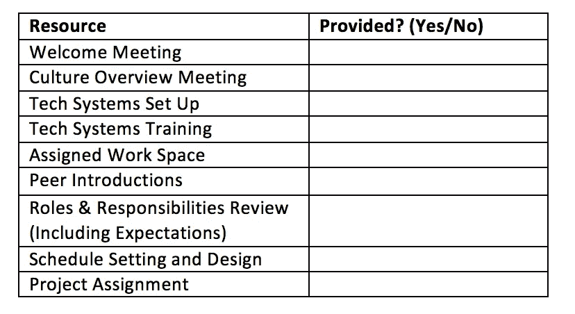

# 构建 90 天入职计划的终极指南

> 原文：<https://medium.com/swlh/the-ultimate-guide-to-structuring-a-90-day-onboarding-plan-c91af947376>

## [作者:艾丽达·米兰达-沃尔夫](http://www.alidamirandawolff.com/)

这是一个员工市场，尤其是在科技领域。

[全国失业率为 4.1%](https://www.bls.gov/news.release/pdf/empsit.pdf) ，在专业和商业服务、金融活动、医疗保健，当然还有技术领域，失业率甚至更低。

其结果是，科技领域的留任人数处于极低水平，包括一些最受尊敬的科技公司的平均任期为一到两年的。

换句话说，入职从未如此重要。

BambooHR 的一项研究发现，大约 17%的雇员会在新工作的头三个月离职，而近 30%的人会在头六个月离职。

# **入职神话**

入职问题并不新鲜。然而，它们今天仍然存在，原因从有限的时间和资源到误解达尔文的“沉或游”系统将自然选择胜利者而不是失败者。

但是让我们明确一点:为了节省时间和资源，入职培训是必要的。招聘既费时又费钱，向你的组织引进一批新人也是如此。对新员工的前期投资会延长他们的平均任期，并最终提高他们的工作效率。

> 提前离职最常见的原因都与入职不足或糟糕有关。离职的员工认为，更明确的职责指导、更有效的培训以及来自同事和领导的各种形式的社会认可是说服他们留下来的因素。

“沉或游”的方法在没有上下文的系统中不起作用。有才华的人在组织中没有学习资源的情况下往往会失败，而没有才华的人往往会在你的组织中采取寄生策略，这在达尔文系统中可能非常成功。

请这样想:文艺复兴时期佛罗伦萨的学徒制度造就了一批有史以来最伟大的艺术家。这些艺术家大多从普通男孩开始，没有明显的天赋。

然而，学徒制让这些男孩通过一系列循序渐进的训练成为大师。他们从磨颜色一直到发明自己的作品。

入职是将新员工转变为公司下一个米开朗基罗的必要环节。

# **构建易于执行且坚如磐石的入职系统**

建立一个预定义的、可重复的入职流程，将减少您在招聘新员工上花费的时间，并提高整体保留率。

在前 90 天，你的员工应该从学习进步到行动；在此期间，他们应该接受所有必要的介绍、培训和教育。

我建立了一个易于执行且经过验证的模型，我在自己的招聘中使用过，并在科技公司中实施，该模型分为四个简单的阶段:

> **0 天:定义目的**
> 
> **30 天:学习**
> 
> **60 天:建造**
> 
> **90 天:做**

每个新阶段都与其他阶段重叠并建立在其他阶段的基础上。虽然员工在前 30 天专注于学习，但学习不会在第 60 天或第 90 天停止。然而，当员工消耗能量时。在第 60 天，员工仍在学习，但花费更多的精力在建设上。

我提倡真正的 90 天入职期，因为在活动周围放置一个容器有助于新员工轻松进入角色，为他们的责任做好心理准备，并培养成功所需的理解和技能。

90 天也让新的工作环境更容易管理。

> 记住，对于加入团队的新人来说，他们不是只有一份全职工作，而是两份:做好工作，适应工作的文化和条件。

我将定义每个阶段，并举例说明员工在每个阶段应该做什么，但首先，给聪明人一句话:

不要在第一天就让你的人筋疲力尽。

# **0 天:定义目的**

入职过程中最重要的阶段之一往往是最容易被忽视的:定义新员工在组织中的目的。这超出了工作描述，从*设定期望*开始。

在《员工体验》**，*研究者Tracey Maylett 和 Matthew Wride 发现了一个关于员工满意度的改变游戏规则的发现。*

> *“敬业度、满意度和幸福感通常不太取决于一个人的工作环境，而更取决于期望是否一致并得到满足。”*

*换句话说，一家公司是努力工作、不宽容、要求苛刻还是友好、合作、以家庭为重并不重要。重要的是，当人们开始时，是否围绕这些因素设定了预期。*

*这么想吧。亚马逊的员工满意度很高，尽管媒体报道称工作条件很糟糕。为什么？*

*员工们在踏进他们新的开放式办公室之前就知道他们将面临什么。*

*特殊的入职培训在员工第一天上班前就开始了，事实上，通常是在候选人面试时开始的。无论你雇佣谁，都应该至少有一个大致的概念:*

> ***1。我在这里做什么？***
> 
> ***2。我有什么办法来做这件事呢？***
> 
> ***3。我需要知道什么才能成功？***
> 
> ***4。谁是我的主要利益相关者？***
> 
> ***5。如何衡量我？***
> 
> ***6。在这种文化中有哪些行为会得到奖励？***
> 
> ***7。在这种文化中有哪些行为是被看不起的？***

*诚然，前五个问题的答案可能会改变。尽管如此，当你设计新角色(这发生在你与候选人交谈之前)时，你应该在头脑中有这些问题的答案。您还应该对可能发生的变化及其原因保持透明，这将适当地设定对整体环境的期望。*

*要真正定义一个新员工的目标，就要制定四个关键的指导框架。*

## ****愿景声明****

*不要与*公司的*愿景声明相混淆，这是一个定义该角色愿景的简短段落。这一段应该清楚地说明这个人被雇佣来解决的首要问题或他们期望达到的目标，清楚地说明他们要做什么，他们将如何做，以及为什么这很重要。*

*这一陈述与职位描述中的概述不同之处在于，它考虑到了你雇佣的人以及他们所具备的独特技能。*

*例如，一份工作描述可能会要求一位创意总监通过出色的故事讲述来提升公司品牌，而一位专门从事设计的新员工的愿景陈述可能会指定出色的视觉故事讲述。*

## ****角色和职责概述文件****

*本文档以愿景声明为基础，明确定义新员工的角色以及如何实现该角色。*

*角色由他们将要解决的三到五个问题组成，而职责定义了他们将如何解决这些问题。*

*在我们的创意总监示例中，“角色”下的要点之一可能是“通过出色的视觉故事讲述提升品牌”，这可以解决市场中品牌知名度不足的问题。然而，在“责任”下，要点可能会说，“架构 Instagram 战略，强调原创视觉内容。”*

## ****【关键绩效指标】****

*KPI 是衡量员工和企业的标准。换句话说，你的新员工需要达到多少季度、年度和总体数字？*

*你可以在入职过程中与新员工一起更深入地发展这些，但你绝对必须知道如何衡量这个人，并提前沟通。请记住彼得·德鲁克的名言，“有度量的，就有管理的。”*

## ****里程碑****

***里程碑**更定性。这些是员工必须达到的目标，以证明他们的角色并为公司创造价值，但不一定能用数字来衡量。例如，一个里程碑可能是建立一个沟通战略计划，而一个 KPI 可能是建立一个拥有 100，000 名 Instagram 粉丝的基础。*

> *在你的雇员开始工作之前，他们应该知道他们在数量和质量方面应该创造什么样的总体价值。*

*然而，在将这些框架放在一起时，您不需要过于细化；在接下来的步骤中会有一个时间和地点。*

# ***30 天:学习***

**

*入职的前 30 天完全是为了学习。*

*对我来说，你的公司发展得有多快，你移动了多少块，或者你需要多少人，都无关紧要。员工需要学会做好工作。*

*也就是说，学习并不意味着让新员工参加全天讲座或培训研讨会。*

*70:20:10 领导力发展模型表明，学习来自 70%的挑战性项目，20%的辅导和指导，以及 10%的结构化学习。*

*换句话说，在最初的 30 天里，你的新员工可以花 70%的时间在公司需要解决的困难项目上。然而，要成功做到这一点，他们需要教练和指导，以及正式的培训。*

*为了创造最佳的学习条件，将准备和加速融入到入职培训中。*

## **准备**

*准备工作包含大量的入职流程，并为整体员工体验定下基调。在这里，你可以提供所有的工具、信息和人脉，让员工真正适应新环境。*

*这里有一个准备工作的清单样本，你可以用它来保持自己的条理性。*

**

*在准备阶段，确保新员工在第一天就知道他们应该在哪里，应该见谁，应该做什么是至关重要的。在他们第一天上班前至少 24 小时，把所有这些信息用欢迎邮件发送出去。*

*当他们走进办公室时，随身携带一份清单，以确保你得到了他们所需要的东西，从指定的工作场所到他们的同事和同事的热烈欢迎。*

****一对一*** 在第一个月召开小型的一对一会议，欢迎你的新员工加入公司，概述公司文化(哪些行为是值得称赞、容忍和禁止的)，围绕角色和职责设定比目标设定阶段更详细的期望，以及项目分配。*

*新员工从这些一对一的交流中获得的明晰度和背景意味着他们将知道该做什么，因此可以更快、更好地开始做。此外，正如苏珊·凯恩在 [*中指出的*](https://www.amazon.com/Quiet-Power-Introverts-World-Talking/dp/0307352153/ref=sr_1_1?s=books&ie=UTF8&qid=1522539785&sr=1-1&keywords=quiet) *:**

> *“面对面的接触很重要，因为它能建立信任，但群体动态包含不可避免的创造性思维障碍。安排人们进行一对一的互动，并在小型、随意的小组中进行互动。”*

*更多的个人会议环境在不妨碍新想法产生的情况下创造关系。有可能你带来了新人来促进创新，所以确保你没有把他们放在一个服从的压力超过贡献观点的自由的情况下。*

## ****加速度****

*在前 30 天，你想尽可能高效地加速学习。这通常意味着反对偏向行动。*

*正如迈克尔·d·沃特金斯在 [*第一个 90 天*](https://www.amazon.com/First-90-Days-Strategies-Expanded/dp/1422188612) 中所警告的那样，不要成为行动命令的牺牲品。定义角色的“是什么”和“为什么”,对于快速展示最好的“如何”是必要的*

*为了加快你的招聘学习，采用这些有针对性的方法:*

***发现会议**:安排与“可信的”专家会面，讨论新员工会接触的领域，以及一些他们不会接触的领域。这些信息会议将教育他们如何处理跨部门和学科的问题，让他们避免“空白页”问题。*

***商业培训**:不管你是重培训还是轻培训，有一个环节对加速学习绝对至关重要。这是一次业务战略概述会议，在会上，你要就业务本身、公司架构、战略和/或业务计划以及市场状况对员工进行培训。这种培训应该是互动的，并促使参与者提出问题和贡献新的想法，以表明理解。*

*基于学习的项目:这些项目包含了一系列广泛的类别，但通常包括工作跟踪、与有经验的员工合作，以及最重要的研究。*

***阅读**:阅读领导力和发展方面的书籍以及行业或职能方面的书籍绝对会增加新员工的知识基础，同时还会增加他们的学习结构。我为我带来的每一个新员工都制定了新的教学大纲，不管他们是全职分析师还是兼职实习生。我每周给我的新员工分配一本书，但是你可以决定你想要的节奏。*

*在这个阶段，不管你的新员工在做什么项目，决定他们成功的是他们学习的程度，而不是他们的成果有多惊人。你想给《T2》一书的作者丹尼尔·科伊尔(Daniel Coyle)所谓的“深度实践”以特权*

*深度实践是“在某些有针对性的方式中挣扎——在你能力的边缘运作，在那里你会犯错误。”让他们承担困难的项目，并推动自己找到超越过去角色的新解决方案。奖励他们对最终产品错误的分析和改进，最终产品将会比你想象的更好。*

# ***60 天:打造***

*学习不会在第一个 30 天之后停止，而是会随着建造的行动继续进行。*

*在某些方面，建设只是学习的延伸，你相信新员工会更深入地挖掘自己的职责，并从事更独立的工作。*

*在这个阶段，他们开始建立社会关系、框架和早期成功的集合，以推动他们在入职完成后成功执行。*

*在这 30 天的时间里，他们应该专注于战略、发展和实施。*

## **策略**

*一旦新员工获得了他们需要的信息，他们应该进行正式的编辑和审查。他们从发现会议、阅读和研究中得到的笔记应该成为他们开始基于更微妙的假设、假设、问题和想法的发现，这些假设、假设、问题和想法是关于他们被雇佣来解决的业务和挑战的。*

*对我来说，这通常看起来像是一次市场分析演示、营销审计或研究回顾会议。员工利用他们的信息来源，以及他们自己的原创想法，在 60 到 90 分钟的演示中展示他们所学到的东西，最后一部分是核心观察结果和对未来的建议。*

*根据这一分析，给他们指明方向，但也要给他们空间，让他们制定一项战略，将他们学到的知识转化为对组织的价值。这通常采取的形式是在他们受雇首先处理的核心职能领域制定战略计划。*

> *在这一点上，你还应该鼓励新员工利用他们对整个组织的了解，制定个人职业成功的战略，包括目标设定、技能培养要求和更有针对性的资源要求。*

*通常是一页纸，你每月与他们回顾和讨论，这个框架让员工专注于他们自己的个人成长，作为发展业务的一种手段。*

## ****发展****

*既然战略已经制定，新员工就要采取这一战略，并利用它来制定现实生活中的问题解决方案或发展机会。以我们的创意总监为例。*

*作为她的策略，她可能会设计一个提案，通过视觉故事来提高品牌知名度，包括建议和要采取的步骤，所有这些都基于她的各种发现。然后，她必须想办法实施这些建议。*

*她可以创建 Instagram 竞选模型，与新平台语言的撰稿人合作，探索其他高度可视化的平台，并编制一份可以讲述这些故事的影响者名单。*

*随着这些产品的开发，她必须测试它们的效果。这可能包括寻求内部利益相关者和外部影响者对她的活动模型的意见，在 Instagram 上创建一个小的测试活动来衡量绩效，以及在另一个以视觉为中心的平台上创建内容，从数量上关注初始参与。*

> *“发展”不仅指产品或解决方案，也指关系。在这一阶段，新员工应该充分了解他们的同事，以便合作和寻求帮助，利用发现会议建立入职后持续存在的真实关系，并清楚地了解他们最重要的利益相关者。*

*根据职位的不同，这可能意味着花更多的时间在公司内部网络之外。重要的是，他们融入了一个值得信任的团队，这个团队在物质上真正对他们的表现产生了积极的影响。*

## ****实现****

*实现从开发中提取那些测试，并扩展它们的范围。在这里，员工开始全力以赴，履行他们被雇佣来履行的职责。*

*值得注意的是，他们可能还没有履行所有的职责。目标是在入职期间深入而不是广泛，因为关于组织运作方式的经验教训将为所有未来工作奠定基础。首先是要把事情做好。*

*这就是为什么实施都是为了确保早期成功。*

*让我们回到我们的创意总监的例子。一个创意总监的角色比运行 Instagram 活动要大得多。但是在开始时，实施成功的活动*是否达到了传播品牌意识和提升公司市场地位的目的。**

*同样的逻辑也适用于前 60 天的任何其他快速成功，通常采取快速修复、初始试点、新项目、项目创意和系统更新的形式。所有这些都很重要，但它们通常集中在一个领域或一个需要解决的问题上。*

*观察新员工实施他们的发现和策略也是了解他们表现如何，并就他们需要扮演的角色以及如何前进达成一致的最佳方式。*

> *在实施过程中提供实时反馈是入职所必需的，这是确保期望一致的最佳方式，也是良好的管理。*

# ***90 天:做***

**

*在最后的 30 天里，新员工被授权并被期望比其他人“做”得更多。他们应该根据 KPI 和里程碑来衡量，并且他们应该明白他们将根据结果以及想法和过程来判断。*

*尽管如此，仅仅两个月，原谅错误。更好的是，原谅某些类型的错误。*

*如果新员工因为缺乏历史信息、对新系统或流程的技能不稳定，甚至缺乏某个领域的专业知识而犯错误，这没什么。*

*如果他们不遵守公司规则，不尊重利益相关者，草率或延迟提交工作，或者未能在截止日期前或与关键利益相关者进行适当沟通，这就不好了。*

*记住，这是蜜月期。态度和承诺应该*而不是*是个问题。员工有责任告知你任何可能导致不良行为的情有可原的情况。即便如此，也要严肃对待不良行为。*

*也就是说，“做”应该是这个过程中最简单、最不复杂的部分。在这里，员工专注于培养关系和团队，从速赢转向长期目标，参与更广泛的工作，并接受正式审查以确保他们走上正轨。*

## ****培养****

*在这一点上，员工所做的不仅仅是寻求帮助，他们反过来也会提供帮助。他们对团队建立真正的信任，并根据角色，甚至建立自己的团队来监督和管理。*

*如果该角色涉及外部利益相关者，如合作伙伴或客户，这是他们开始自己管理他们的时候。*

## ****展开****

*在这一点上，早期的胜利有了回报，员工可以开始走得更远，承担更多类型的责任，同时朝着更长期的目标努力。*

*还记得那个成功的 Instagram 系列活动吗？有了明确的验证，我们的创意总监现在可以围绕视觉传达展开一个完整的战略，触及更广泛的领域。我们的创意总监将不再仅仅开发 Instagram 模型，而是开始为整个公司范围内完全转变的图形标识设定愿景。*

*虽然这听起来有些雄心勃勃，但请记住“开始”这个词。通常，这个展开阶段是更大事情的开始。*

## ****评估****

> *无论你做季度、年度甚至实时绩效评估，入职的最后一步总是评估。*

*[如果你还没有记分卡，创建一个记分卡](https://blog.usejournal.com/this-is-how-to-reduce-employee-turnover-and-hire-top-performers-ff93202745fd)并完成过去 90 天的绩效评估。让员工完成自我评估。然后，在围绕绩效的坦诚对话中交换意见。*

*在这里，您可以看到优势和改进机会，并从员工那里获得反馈。*

*这也是您重新校准 KPI 和里程碑的地方，以确保您仍然保持一致。如果你们不再一致，重新设定期望值，并解释为什么要重新设定。*

# ***临别赠言***

*我将留给你们我从雷伊·达里奥的 [*原则*](https://www.amazon.com/Principles-Life-Work-Ray-Dalio/dp/1501124021/ref=sr_1_3?ie=UTF8&qid=1522543063&sr=8-3&keywords=principles) 中提取的最后一条指令:*

> *"围绕目标而不是任务建立组织."*

*这一入职流程的每个阶段都侧重于支持和提升您的组织的目标，以及您如何最好地定位您的员工来实现这些目标。提炼它，调整它，替换它的一部分，或者完全使用它。请记住:这一切都是为了成长和目标。*

***了解你的工作目标及其重要性，了解你的员工的工作目标及其重要性。成功会随之而来。***

**Alida Miranda-Wolff 是 Ethos 的创始人兼首席执行官，Ethos 是一家为科技公司提供人才战略的公司，致力于通过塑造人才和发展文化来推动公司业绩。跟随她一起工作的还有* [*推特*](https://twitter.com/AlidaMW) *和* [*文创者*](https://venturebeat.com/author/alida-miranda-wolff-hyde-park-angels/) *。**

*我的精神气质:一个成长的故事*

**

## *这篇文章发表在 [The Startup](https://medium.com/swlh) 上，这是 Medium 最大的创业刊物，有 312，043+人关注。*

## *订阅接收[我们的头条新闻](http://growthsupply.com/the-startup-newsletter/)。*

**