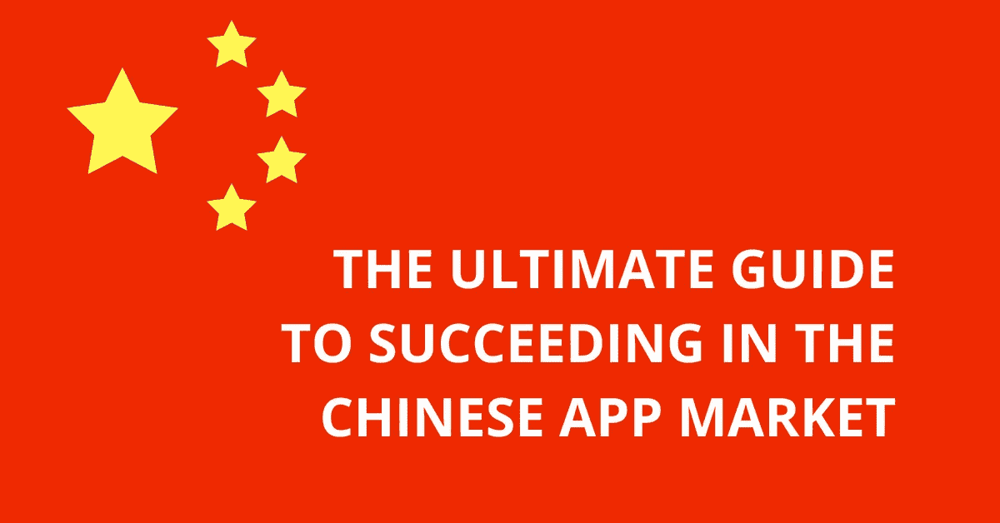
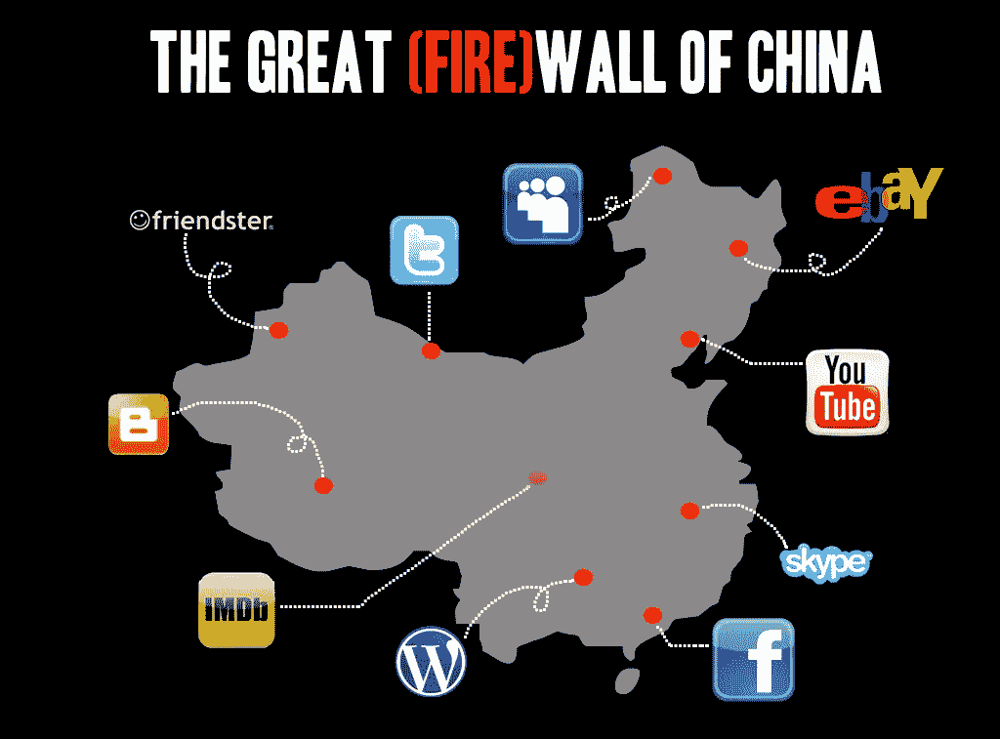
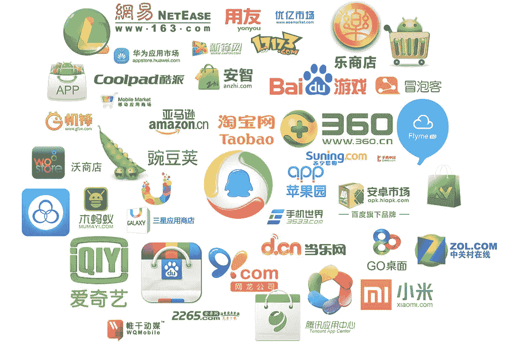
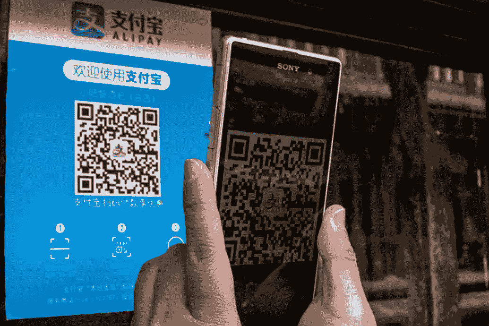
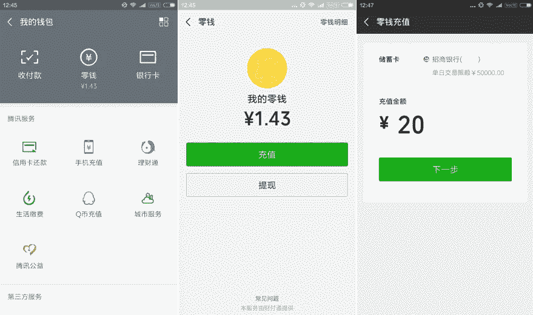
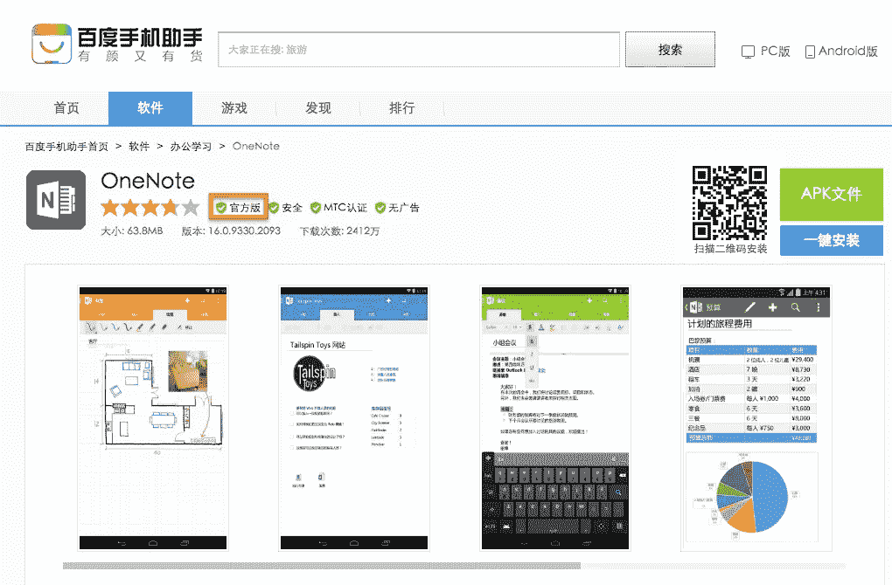
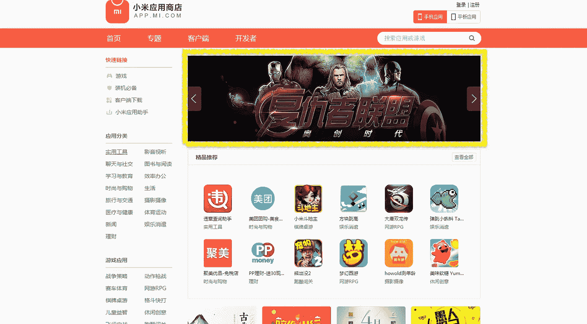
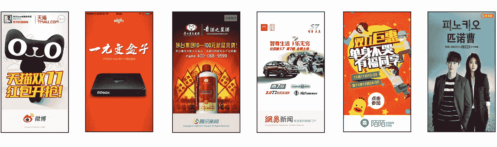

# 在中国应用市场取得成功的终极指南

> 原文：<https://medium.com/swlh/the-ultimate-guide-to-succeeding-in-the-chinese-app-market-8c20ef4b2b8d>

对于外国应用公司来说，向中国应用市场扩张是一个两极分化的话题。人们落在极端光谱的两个相反的一边。一方指出中国巨大的市场潜力，并推断进入中国将使你无需付出太多努力就能自动产生收入，而另一方则强调中国和西方的所有差异，并完全排除在中国取得成功的可能性。

事实是，在中国应用市场取得成功肯定是可能的，但远非易事。本指南将分解从进入前研究到进入后货币化的整个扩张过程，突出所有的关键因素。

**1。** **研究:中国进入战略**

中国互联网生态系统是世界上最复杂的，移动市场也不例外，因此在开始应用程序本地化之前进行广泛的研究至关重要。

**市场潜力**

根据中国互联网络信息中心(CNNIC)发布的一份报告，中国的互联网用户数量目前约为 7.72 亿，其中 97%是智能手机用户。

与此同时， [AppAnnie 的 insights](https://www.appannie.com/en/insights/market-data/app-annie-2017-retrospective/) 测算出 2017 年中国应用创造的收入为 350 亿美元，他们估计，随着较小的二三线城市从台式机/笔记本电脑向移动设备的转移，中国安卓商店的应用下载量将在今年年底达到 869.5 亿。

(Image from [https://anonymster.com/great-firewall-china-bypass/](https://anonymster.com/great-firewall-china-bypass/))

**防火长城**

就像脸书、Twitter 和 YouTube 等其他知名外国网站和应用一样，谷歌在 2010 年就被“中国防火长城”屏蔽了包括 Google Play 在内的大部分服务。虽然中国智能手机用户仍然可以通过 VPN 访问 Play Store，但只有很少一部分用户会这样做。

(Image from [https://technode.com/2015/09/22/ten-best-android-app-stores-china/](https://technode.com/2015/09/22/ten-best-android-app-stores-china/))

**分散的市场**

由于 Google Play 被屏蔽，中国最大的科技公司创建了自己的商店，以填补市场空白。中国目前有 400 多家第三方应用商店，本土科技巨头(腾讯、阿里巴巴、奇虎、百度)、智能手机供应商(华为、小米、Oppo/Vivo)和移动网络提供商(中国移动、中国联通、中国电信)占据了中国 80%以上的安卓应用市场份额。

**商场规定**

目前，所有外国应用程序公司要么必须有一个中国实体，要么使用授权的本地分销商来发布应用程序。此外，所有主要的应用程序商店都需要中文软件版权证书，如果应用程序的数据托管在中国服务器上，那么商店将请求 ICP 备案许可证(用于公共内容)或完整的 ICP 许可证(用于电子商务和其他商业活动)。根据应用程序类型(旅游、金融、健康等),还需要特定行业的文档来完成分发。).

**2。** **本地化:针对中国的修改**

在中国，文化、语言，更重要的是，移动用户习惯与世界其他地方完全不同。这种独特的气候意味着简单的翻译是不够的，通常需要更复杂的重新设计。

**性能测试**

由于 Firebase Storage、脸书分析和谷歌服务等受欢迎的服务在中国尚未完全投入使用，测试外国应用的性能至关重要，可以为应用公司节省大量的重新开发时间和资源。为了确保应用程序具有完整的功能，建议跨多个设备、网络和位置进行测试。

**内容适配**

为了增加在 app store 类别中排名靠前的机会以及被中国用户通过搜索找到的可能性，所有应用程序内容都必须本地化以适应中国市场，这一点至关重要。这意味着不仅要将应用名称、应用描述和应用内内容翻译成简体中文，还要调整用词，并融入互联网语言和俚语。

(Image from [https://www.ibtimes.co.uk/beggars-china-now-accepting-donations-via-mobile-payments-qr-codes-1618396](https://www.ibtimes.co.uk/beggars-china-now-accepting-donations-via-mobile-payments-qr-codes-1618396))

**二维码实施**

二维码在中国非常受欢迎，部分原因是它们被用于多种用途。从登录认证和支付确认等日常流程，到各种不同类型应用程序上的专业使用，如社交媒体推广。因此，外国应用程序应该考虑实现内置的 QR 阅读器，以连接最突出的本地应用程序。

**登录 SDK**

在中国，有 4 种流行的登录授权类型:短信确认；二维码授权；第三方认证；和电子邮件/密码登录。和西方类似，大部分 app 都实现第三方登录认证。然而，由于脸书和 Twitter 在中国被屏蔽，社交账户登录授权通过微信、QQ 和新浪微博来实现，因此外国 app 应考虑集成这些本地登录 SDK。

**支付整合**

与西方不同，中国移动用户已经完全接受使用电子钱包进行移动交易，只有很少一部分人使用信用卡或借记卡进行数字支付，因此第三方支付解决方案被集成到大多数中国应用程序中。任何依赖应用内购买或订阅的外国应用都应该在 APK 中实现两个领先的支付解决方案，微信支付和支付宝。

**地理定位服务**

地理定位服务非常普遍，被一系列不同的本地应用程序使用，例如允许用户结识他人并参加附近活动的社交网络，以及允许用户与附近的人分享消费习惯的娱乐流媒体应用程序。根据应用类型，基于地理位置数据的功能可以为进入中国市场的外国应用带来额外的社会价值。

**补充建议**

- **语音集成:**允许用户使用语音消息和语音搜索功能，作为单独使用文本的替代方案。

- **聊天界面:**为用户提供通过应用内聊天直接交流的机会，而不是使用独立的 messenger 应用。

- **可下载内容:**帮助用户在没有 WiFi 连接的情况下访问应用内内容，因为中国的数据包通常不是无限的。

**3。** **配送:多店管理**

苹果的应用程序商店在中国是可用的，然而由于 Google Play 被屏蔽，公司有必要在中国主要的 Android 应用程序商店上发布和推广他们的应用程序。

**App 回收**

In China, the competition between app stores has become so fierce that it’s common for foreign companies to find that their app has already been unofficially distributed on some of the local stores. This means that before an officially stamped version (“官方版”) of an app can be published, proof of ownership will need to be provided to get the unofficial versions taken down.

**应用发布**

根据应用商店的类型和目标商店的数量，上传应用程序的难度会有所不同，因此首要任务是确定要在哪些应用商店上发布。这一决定通常受到商场市场覆盖范围的影响:

-前五名商店:60%的市场覆盖率

-10 大商店:80%的市场覆盖率

-前 15 家商店:90%的市场覆盖率

一旦选择了想要的商店，剩下的就是建立个人应用商店帐户，并在每个平台上上传所需的创意材料。中国用户可以从这些平台下载这款应用。

**App 推广**

与西方不同，在中国推广一款应用最有效的方式是通过用户获取来购买用户，付费 ASO(人工用户评论和下载)和付费应用商店推广(特色景点)是获得市场份额最快最简单的方法。一旦外国应用程序似乎拥有足够大的用户群，就可以有效地利用不同类型的推广组合，通常是社交媒体营销和影响者营销，来推动应用程序的流量。

**4。** **货币化:中国创收**

在中国，大多数付费和基于订阅的应用程序并不产生收入，因为免费的非官方版本很容易获得。这导致大多数公司通过广告和应用内购买将应用货币化。

(Image from [http://dangrover.com/blog/2014/12/01/chinese-mobile-app-ui-trends.html](http://dangrover.com/blog/2014/12/01/chinese-mobile-app-ui-trends.html))

**广告**

传统上来说，splash 广告(在到达应用程序主页之前显示的广告)和 interstitial 广告(在两个内容页面之间显示的广告)一直是中国最受欢迎的应用程序广告方式，几乎所有最知名的本地应用程序都采用它们来推广应用内购买和其他相关产品。最近，横幅广告和视频广告变得越来越常见，它们现在是有效的可选广告方法，尤其是在社交网络应用程序上。根据应用程序的类型，利用本地(AdView)或国际(AdMob)广告平台来展示这些广告，可以为在中国的外国应用程序带来最稳定的收入流。

**应用内购买**

根据 [AppsFlyer](https://www.appsflyer.com/pr/new-report-global-app-spending-habits-finds-asian-consumers-spend-40-apps-rest-world/) 发布的报告，亚洲移动用户的应用内支出比世界其他地区的消费者多 40%。无论是产品、服务还是活动，外国 app 在中国市场都有很大的机会从应用内购买获得收入。与西方类似，应用程序公司将为应用程序内的每笔交易收取一小部分费用(2-3%)。然而，这不是由商店收取的，而是由第三方支付解决方案收取的，需要集成这些解决方案才能收到付款。

遵循这些步骤并密切关注中国市场的特质，将让外国应用公司有机会加入 LinkedIn、Evernote 和 Coursera 的行列，成为在中国成功扩张的越来越多的国际公司。

— — —

我希望这篇文章对你有用。如果您想了解上述任何一点的更多信息，请访问我们的网站:[www.appinchina.co](http://www.appinchina.co)了解更多详情。

## 这个故事发表在 [The Startup](https://medium.com/swlh) 上，这是 Medium 最大的企业家出版物，拥有 356，974+人。

## 在此订阅接收[我们的头条新闻](http://growthsupply.com/the-startup-newsletter/)。

