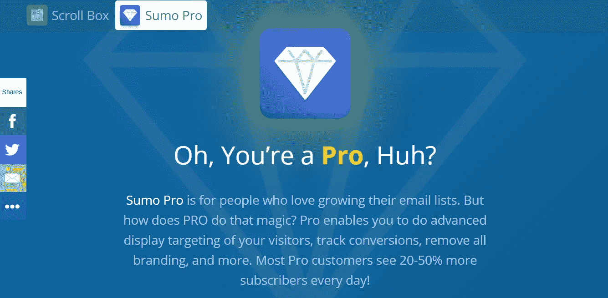
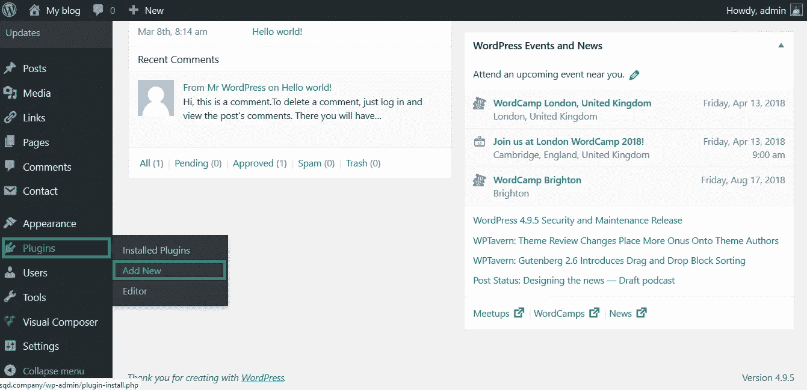

# 终极相扑指南

> 原文：<https://medium.com/swlh/the-ultimate-sumo-wordpress-guide-428e4395865c>

你需要知道的关于相扑 **的一切都汇集成一个很棒的指南。**

在这个**综合指南**到 **Sumo WordPress** (Sumo 的 WordPress 插件集成)中找出以下内容:

1.  什么是相扑
2.  为什么要用相扑
3.  相扑能做什么？
4.  如何用 WordPress 使用相扑
5.  如何设置相扑
6.  相扑定价

# 相扑和相扑

关于 SumoMe 的名字的一个简短说明。去年，相扑协会决定将他们的名字改为相扑。很多人可能仍然知道**相扑就是相扑，**所以我想我应该加上这段引文，以防你想知道**相扑是谁！**

# 相扑是什么？

尽管它可能像某种相扑运动员意识运动， [**相扑**](https://go.sumo.com/27983.html) 实际上是一套让你的业务增长自动化的**工具。**

**Sumo WordPress** 插入你的网站，为你做**繁重的工作**，为你提供一套简单的**工具**到**获得更多的流量，获得更多的客户，跟踪你的成功。**

Sumo

# 为什么要用相扑？

相扑之所以如此成功，是因为它允许企业在不需要编码的情况下加速增长。

人们使用 **WordPress** 的一个主要原因是你可以**建立网站**而不需要**接触任何代码。**

使用相扑也意味着你不需要为定制解决方案付费，比如列表建设和交通。

如果你能为**驾驶交通**、**转换销售线索**、**以如此实惠的**价格获得更多客户**、**为什么你会去别处寻找呢？

Sumo for growth

# 相扑能做什么？

准备好。这就是我们的导游的主要内容。

相扑专注于**在三个方面帮助你成长。**

1.  **获得更多流量**
2.  **获得更多客户**
3.  **追踪你的成功**

# 获得更多流量

当谈到在线营销时，获得更多的流量是最难做的事情之一。

互联网上充斥着网上营销指南、教程、视频和解决方案，它们都声称能解决你的问题。

**在网上发展你的业务**实际上是一个相当**简单**和**有条不紊**的过程，它只需要大量的努力工作和**渐进式改进**。

# 相扑份额

[**分享**](https://affiliate.sumo.com/idevaffiliate.php?id=27983&url=418) 是 Sumo 为**给你的网站带来更多流量**的解决方案之一。

**分享帮你:**

> 分享让它变得愚蠢——通过网站内置的社交媒体按钮，访问者可以很容易地将你的内容分享给他们的朋友、家人和其他人。越多人分享你的网站和内容，你得到的病毒式流量就越多。

Sumo share

# 相扑分享示例

下面你可以看到**分享**在行动。

**通过分享获得 20%以上的访客。**

# 相扑荧光笔

相扑荧光笔可以让你从你的网站上突出显示和分享与 T21 相关的有用信息片段。

这对 Twitter 来说尤其棒。

> 使用 Highlighter，您的访问者可以突出显示您文章的部分内容，以便与他们的朋友、同事等分享。这做了两件非常有价值的事情:1 .驱动你的社交流量 2。为你的读者突出受欢迎的部分。

你可以使用 **Higlighter** 通过分享**有用的、有趣的片段**来增加流量，这将使社交媒体**上的用户想要了解更多**并点击进入你的网站。

Sumo Highlighter

# 相扑图像共享者

**图片分享器**的功能与**荧光笔类似，**允许你点击**按钮，在社交媒体上分享来自**网站**的**有用的**图片。**

这里的**好处**是这些图片是直接从你的网站上分享的**，所以当它们被点击的时候，** **用户会被引导回你的网站。**

正如相扑所言:

> 现在，访问者很难在你的网站上分享图片。这意味着你错过了大量简单的病毒传播。图片分享者让你的读者非常简单地自动分享你网站上的图片，并链接回你，给你带来病毒式的流量！

Sumo Image Sharer

# 获得更多客户

你打算怎么处理你驾驶的那些新交通工具？

你要**把它变成新客户。**

这就是相扑的“获得更多顾客工具”发挥作用的地方。

# 相扑列表生成器

**相扑描述列表构建器为:**

> List Builder 将一次性访问者转化为终身读者和客户。创建专业外观的弹出窗口，出现在点击、计时器和人们离开之前！凭借先进的拖放功能，这是互联网上最先进的(也是最容易使用的)电子邮件捕获工具。

一旦你开始**为你的网站带来流量**，你需要**将流量转化为你可以**培育**和**转化为客户的线索**。**

这一切都从一个**列表开始。**

Sumo List Builder

# 为什么你需要列表生成器专业版

免费版的**列表构建器**是一个很好的起点，但是**列表构建器专业版**非常酷。

List Builder Pro 附带了**点击触发器**，它被证明可以带来**更高的转化率。点击触发器**在某些事件上触发，如**点击按钮**或**采取某种动作**并生成**动态注册表单。**

在这个世界上，每个人都在试图竞争相同的电子邮件注册，你可以获得的任何竞争优势都值得利用。

List Builder Pro

List Builder Click Triggers

[尝试列表生成器点击触发器](https://affiliate.sumo.com/idevaffiliate.php?id=27983&url=422)

# 门口的擦鞋垫

迎宾垫可让您:

> 使用 Welcome Mat 将任何页面变成转化率最高的页面。当访问者登陆你的网站时，欢迎垫会全屏显示行动号召。鼓励你的访问者加入你的电子邮件列表，查看你的热门博客文章…可能性是无穷的！

这是一个**伟大的工具**来驱动**访问者到一个登陆页面。**

给你的访客一个**优惠或者激励**让他们一登陆就订阅，看着你的**列表爆炸。**

Sumo Welcome Mat

# 专业迎宾垫

那么为什么要用**付费相扑计划**做**欢迎垫 Pro 呢？**

**欢迎垫 CTA 和欢迎垫视频**将让你**在竞争激烈的网络营销战场上脱颖而出**并产生**转化**。

**欢迎垫视频**特别是不是你每天都能看到的东西。正是这些**渐进的改进**将让你获得超越竞争对手的优势。

Sumo Welcome Mat Video

[试用迎宾垫视频](https://affiliate.sumo.com/idevaffiliate.php?id=27983&url=424)

# 相扑卷轴盒

如果说**迎宾垫**是产生销售线索的**散弹枪方法**，那么**滚动框**就是**绅士方法**。

相扑将滚动框描述为:

> 好吧，你想扩大你的邮件列表，对吗？但我们明白，你不想太急于求成。Scroll Box 提供了解决方案:一种礼貌的方式，当你的访问者读完你最新的博客文章或了解你的产品时，你可以向他们索要电子邮件地址。

Sumo Scroll Box

# pro 里有什么？

Pro **滚动框**用户看到**20–40%**的转化率，这是由于**高级定位功能**(可能还缺少 SumoMe 品牌)。

Scroll Box Pro

# 相扑智能吧

**智能栏**是一个巧妙的提醒，提醒**加入你的列表**，它整齐地位于你网站的顶部。

这个工具非常有用，因为它相当**微妙**，可以在你的**博客页面**上启用，这样当你**向读者传递了足够的价值**时，如果**订阅**对他们来说足够简单，他们可能会决定订阅。

> 智能栏漂亮地位于你网站的顶部，提醒你的访问者加入你的电子邮件列表，查看你的新博客文章，或者你想让他们做的任何事情。你会惊讶于一个简单的提醒能做什么:-)。

Sumo Smart Bar

这是一个**非常酷的工具**，你可以用 **pro 版本**轻松证明每月的价格是合理的。

同样，使用 **pro 版本**的用户看到转化率平均提高了**20-50%**。

使用**高级显示规则**你可以显示**不同的智能条**给**不同的访客**。

例如，如果你从 Twitter 获得大量流量，你可以**为来自这些频道的访问者显示一个特定的智能栏**。

**对你的**智能条**(见我在那里做的)的使用要聪明**会帮助你从这个漂亮的工具中获得最大的转化率。

Smart Bar Pro

# 追踪你的成功

除了这些产生超能力的**线索外，相扑**还可以用一套分析工具帮助你**追踪你的成功**。

# 相扑热图

Sumo 将热图描述为:

> 热图告诉你人们点击你网站的确切位置。有了这些信息，你就可以改进你的网页，向你的访问者展示他们想看的东西。

漂亮的**有用的信息**。如果你能通过访问者的点击了解他们想要什么，你就可以通过**数据驱动**改进 UX 和网站内容，通过**在这个过程中推动更多的注册**。

Sumo Heatmap

# 相扑热图专业版

驾驶相当大的交通流量？你会想要注册一个**相扑职业的付费计划**来访问**热图职业，**允许无限流量的**热图度量**。免费版最多可容纳 1000 名访客。

Sumo Heatmap Pro

[获取相扑热图专业版](https://affiliate.sumo.com/idevaffiliate.php?id=27983&url=429)

# 谷歌分析

**相扑**有一个方便的**谷歌分析**集成，允许你从你的**相扑仪表板上查看你的谷歌分析**统计数据**。**

这进一步支持了我的观点，即对于自由职业者、小企业主和营销人员来说，相扑是一个非常有用的工具，他们希望简化他们的数字营销，而不需要接触任何代码。

Sumo Google Analytics

我采访过的许多小企业并不了解谷歌分析，他们只想知道底线。

让**所有的东西都在一个简单的仪表板**中设置是帮助这些所有者**掌握他们的数字营销指标的一个很好的步骤。**

# 相扑联系方式

相扑还提供了一种**无代码**联系形式的解决方案，供你的**线索**准备好直接联系你**时使用。**

把这些都放在一个屋檐下让事情变得简单，这意味着你不需要去其他地方寻找插件来完成这些。当你把所有的功能加起来时，可能会节省你 8 个单独的插件安装。

Sumo Contact

# Sumo WordPress

既然我们已经介绍了**厉害的相扑是如何**的，我们如何在 WordPress 上**使用它？**

相扑让他们的**插件变得简单。**

你可以从你的 WordPress 仪表盘免费下载 Sumo WordPress 插件。别担心，我现在告诉你怎么做。

# 通过/wp-admin 登录你的 WordPress 仪表盘

WP Admin

# 单击插件>添加新项并搜索相扑

Plugins

# 安装相扑

SumoMe Install

# 点击蓝框来设置相扑

Setup SUumo

# 登录或创建一个帐户

Create account

[报名相扑](https://affiliate.sumo.com/idevaffiliate.php?id=27983&url=431)

# **报名相扑职业**

Click Go Pro

# 定价

那么，各种各样的相扑**计划是如何进行的呢？**

首先，我认为值得注意的是，相扑提供 30 天退款保证。因此，如果你决定以年度折扣购买相扑，并认为相扑不适合你，那么风险是很低的。

# 免费相扑

相扑免费计划为您提供**相扑**产品套件的**基本功能**，并且**包括相扑品牌。**包括**基本支持和基本定位。**足以开始，但可能不足以在今天的**竞争激烈的在线营销格局中产生重大影响。**

Sumo Free

# 相扑职业选手

对于自由职业者、顾问和博客写手来说，专业套餐非常棒。

它给你带来了**功能和特性**的显著增加，包括**专业支持、专业定位、点击触发器、浏览器推送通知**(你在网站上看到的很酷的新弹出框，询问他们是否可以通知你新内容)和多达 **750 名订户。**

Sumo Professional

# 客户反馈

Sumo Professional Testimonial

# 每月支付 30 美元/每年支付 24 美元(节省 72 美元)

**登录升级，获得相扑职业。**

# 相扑小企业

相扑**小企业套餐**提供你发展小企业所需的一切(以及一些额外的工作)。

除了**专业套装**之外，它还包括多达 **5 个席位**，因此所有的**团队**都可以**使用相扑、** **2 网站会员资格、** **内容升级**(因此你可以自动上传内容并通过电子邮件发送给所有订户)、**实时聊天和无限订户。**

这个**包**是为那些认真对待增长**大单子的企业准备的。**

Sumo Small Business

# 客户反馈

Sumo Small Business Testimonial

# 每月支付 73 美元/每年支付 59 美元(节省 168 美元)

# 相扑电子商务

努力让你的**电子商务商店更上一层楼？试用 SumoMe 的电子商务套装。**

凭借**小型企业包中包含的所有功能，**电子商务**包将**与 Shopify 直接集成。****

将两者结合起来，你就拥有了网上销售所需的一切。

Sumo Ecommerce

# 客户反馈

Sumo Ecommerce

# 每月支付 248 美元/每年支付 199 美元(节省 588 美元)

# 去相扑吧

这就结束了最终的相扑指南。

希望你发现这是有用的，它打开了你的眼睛，看看相扑能为你和你的生意做些什么。

如果你有任何问题或者想要**帮助建立相扑**，让我知道。

*免责声明*除了是相扑客户，我还是相扑附属机构，这意味着每当有新企业决定使用相扑时，我都会赚取一小笔佣金。

## 你可能也喜欢这个:

## [为什么 WordPress 是在](/swlh/why-wordpress-is-the-best-platform-to-build-your-business-or-startup-website-on-df3fe932fad7)上建立业务或创业网站的最佳平台

## 如果你喜欢这个故事，请点击👏按钮并分享，帮助其他人找到它！欢迎在下方留言评论。

*原载于*[*www.squareinternet.co*](https://www.squareinternet.co/ultimate-sumo-wordpress-guide/)*。*

## 这个故事发表在 [The Startup](https://medium.com/swlh) 上，这是 Medium 最大的创业刊物，拥有 317，238+人关注。

## 在这里订阅接收[我们的头条新闻](http://growthsupply.com/the-startup-newsletter/)。

