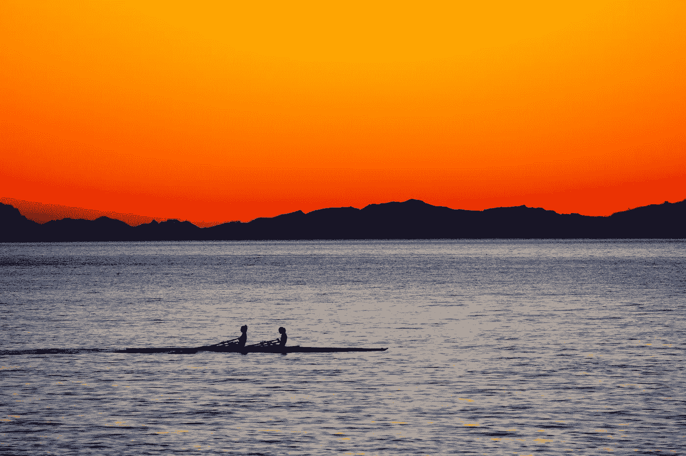

# 检验你的生活是否步入正轨的终极测试可以归结为这个问题

> 原文：<https://medium.com/swlh/the-ultimate-test-to-determine-if-youre-on-track-in-your-life-boils-down-to-one-question-d1d2dac342a8>

Photo by [Chris Barbalis](https://unsplash.com/photos/nXx307kUhAo?utm_source=unsplash&utm_medium=referral&utm_content=creditCopyText) on [Unsplash](https://unsplash.com/?utm_source=unsplash&utm_medium=referral&utm_content=creditCopyText)

## 早上保护好你的注意力，就像你的生活依赖于它一样——因为它确实如此。

今早起床后，你关注的第一件事是什么？

告诉我你今天早上起床后做的第一件事，我会告诉你你要去哪里——如果你在你想要的道路上或者偏离了它。

是花在你认为神圣的事情上的时间还是你不考虑的事情？

这是一个测试，用来确定你的行动是否与你想成为的人一致，以及你是否正在实现你的个人和职业发展目标(两者是联系在一起的)。

# 介绍

> “这山望着那山高。你浇水的地方草更绿。”—山姆·奥文斯

两年来，甚至在从一个世界知名的实验室启动一个风投支持的初创企业的时候(我认为这是一个史诗般的机会)，我每天早上做的第一件事就是阅读和写作人类工程学。

我会做我现在做的事情，早上 4:30 醒来，开始阅读几本书，直到我有灵感写点什么——有时花 2-4 个小时。

*   不要沉迷于我们的产品。
*   没有仔细阅读成长或我的一些日常弱点，这些本可以用来磨砺自己。

我欺骗自己，认为个人发展和成为人际关系大师并写下来会帮助我在公司的表现，在某些方面确实如此，但这不是我需要关注的主要事情。

不足为奇的是，我浇灌最多的东西是我最终成为的人，也是我现在全职写作和指导《巅峰表现》的原因。

现在我全职写作和指导，我必须平衡我的写作时间表和我的商业创造活动。

鉴于我热爱写作甚于销售，我知道如果我想粉碎我的商业创造目标，这绝对是我每天早上做的第一件事。

*像布莱恩·特雷西多年来说的那样吃青蛙。*

现在这是我每天早上做的第一件事，因为我每天都在“浇灌”这项活动，我很喜欢它——尤其是当我看到结果出来的时候。

我们都在谈论“为什么我们要做我们所做的事”以及“服务他人”和改变世界是如何照亮我们起床的。

最重要的是，没有比擅长某件事和做一件能建立自信的活动更好的动力了。

在最近的 FB live 中，畅销书作家和 Medium.com 排名第一的作家 [Benjamin P. Hardy](https://medium.com/u/5153880ce2ee?source=post_page-----d1d2dac342a8--------------------------------) 被问及是什么驱动了他，他简单而深刻的回答是:“擅长某事很有趣”。

# 你今天早上做的第一件事是什么？

> “告诉我你如何度过早上 5-7 点，我就能告诉你你如何度过你的一生。”本杰明·哈代

如果根本没有考虑清楚，你的人生就根本没有考虑清楚。

如果它是经过深思熟虑的，但你事先分散了自己的注意力(手机/电子邮件/随机新闻标题“看看发生了什么”)，它不够有意——它对你来说不够有意义。

为什么？两件事:

我们的时间和注意力是我们最宝贵和最稀缺的两种资源。

如果你不能控制它们，这两者都是在和你赛跑。

从你醒来的那一刻起，你的时间和注意力就很容易被你的物理环境和设备所支配。

那吸走了宝贵的资源一，让你不知不觉占用了宝贵的资源二。

然而，那些正在向他们知道的目标前进的顶级表演者，最终会付出他们所拥有的一切，来拥有他们的时间和注意力。

这在当今世界很难。

在当今这个拥有无限选择的世界里，移动设备的存在使得深度的有意识的工作变得更加有价值。

在当今这个有无限选择的世界里，移动设备的存在使得深入的有意识的工作变得更加困难。

在当今世界，当我们打开电子邮件时，很容易陷入反应模式，这进一步使我们很难重新集中注意力，这使得在起床后有意识地做你花时间做的第一件事变得更加重要。

利用这些新鲜的时间和注意力，做一件能让你去你想去的地方的事情。

**利用这段新鲜的时间和注意力，做一件能让你成为你想成为的人的事情。**

告诉我你今天早上起床后做的第一件事，我会告诉你你的标准是什么。

告诉我你今天早上起床后做的第一件事，我会告诉你你是否是一个顶级的表演者。

告诉我你今天早上起床后做的第一件事是什么，我会告诉你你是否有恢复能力。

你今天早上做的第一件事是什么？

明天你打算做的第一件事是什么？

有意识地对待它，把它当作神圣的东西。

你会到达你想去的地方，成为你想成为的人。

Art by Emily May Rose

## [每周一次点击接收我承诺的改变游戏规则的文章，这是你在互联网上其他地方找不到的。你还会收到我的指导，告诉你如何在你所做的事情上成为世界上最好的。你不会后悔的。](https://betreatedhowyouwanttobetreated.com/optin-main)

## 这篇文章发表在 [The Startup](https://medium.com/swlh) 上，这是 Medium 最大的创业刊物，有 307，871+人关注。

## 订阅接收[我们的头条新闻](http://growthsupply.com/the-startup-newsletter/)。

