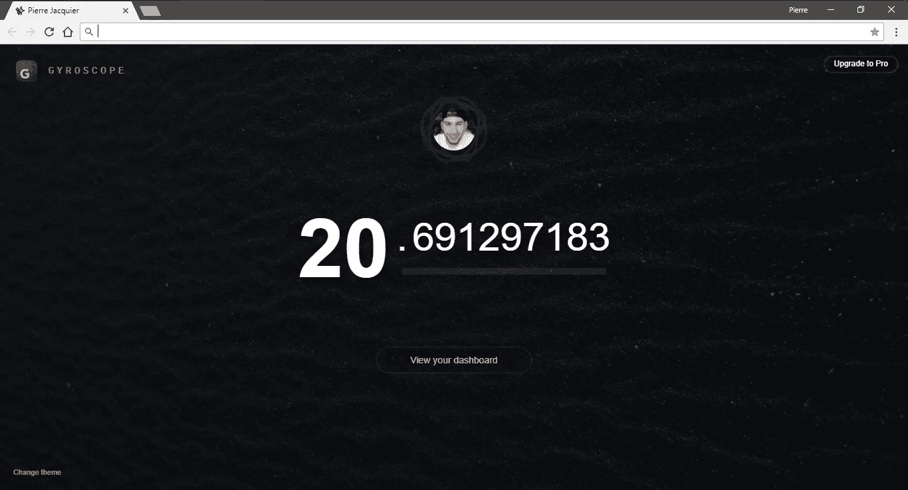

# 全天候保持专注的终极诀窍

> 原文：<https://medium.com/swlh/the-ultimate-trick-to-stay-focused-24-7-551cb3a684c1>

## 在每一个新的浏览器标签下，这是一个踢自己痛处的好方法。

Photo by [Benjamin Davies](https://unsplash.com/photos/Xhj88MexoG4?utm_source=unsplash&utm_medium=referral&utm_content=creditCopyText) on [Unsplash](https://unsplash.com/?utm_source=unsplash&utm_medium=referral&utm_content=creditCopyText)

*专注。*

*我真的必须专注于此。好吧，我们开始吧。*

*糟糕，我忘记给我妹妹找圣诞礼物了。*

*** * CTRL+T | Amazon.com * ***

整整一个小时后:
*— 911，您有什么紧急情况？
—* ***我又一次失去了注意力，你能帮我吗？***

一周前我也遇到过这种情况。

不是 911 那部分，但还是。我计划在我的编程项目上做一些工作。**我没有**。幸运的是，我找到了一份礼物。但是现在还不是处理这件事的时候。

> 我输掉了焦点游戏。再一次。

# 形势

如今，互联网几乎是各种干扰的根源。越来越多的工具是基于网络的。即使我们仍然在专门的原生应用上做一些工作，网络浏览器也总是在一旁打开，等待合适的时机吸引我们的全部注意力。

基本上，我们可以做三件事来防止这种邪恶伤害我们的注意力:

*   使用没有 web 浏览器的工具
*   拥有难以置信的专注和承诺
*   当我们打开危险的新标签时，我们伤害了自己，以至于我们立即回去工作

第一个是显而易见的，因为总会有这样的情况，你需要浏览器来帮助你的工作。

难以置信的专注和投入。这肯定会对你的工作场所产生影响。但是对于像副业这样的东西，可能就不行了。

这给了我们最后一个选择。在保持网络浏览器打开和被某些事情吓到之间找到一个折中的办法。一些会让你感到非常内疚的事情，让你无法集中注意力。

既然计算机还不能读懂我们的思想，它就必须是在任何情况下都能工作的东西。

我们最怕失去什么？我们的钱，我们的工作，我们的技能？

我们的时代。不是我们白天的时间，也不是我们一周的时间。我们出生时就被赋予的有限且不可挽回的“时间”。

# 诀窍是

我正在浏览 Medium，这时我发现了一个令人难以置信的应用程序，它就是[陀螺仪](http://gyrosco.pe/)。*一个人体操作系统*，就像他们宣传的那样。Gyroscope 正在合并来自您可以链接的各种服务的数据。这款应用是我迄今为止见过的设计最精美、最[精致的](https://gyrosco.pe/store/)。然而，我觉得它对我来说还不够有用，不足以交易和集中我所有的个人数据。

回到我们的话题，我确实使用了一个独特的免费功能: [**网页浏览器新标签替换**](https://chrome.google.com/webstore/detail/gyroscope-for-chrome/ifakdojghbjeahenejfpgdfhhcmjgfle?hl=en) **。**

有许多可用的主题，但我们在这里寻找的主题被称为*动机*，原因不明。

Don’t worry, it’s even crazier at a real framerate.

它唯一显示的是我的年龄。但肯定**不是以普通的方式**。

第 9 位数变化太快，你跟不上。
事实上，**后三位数正以非常引人注目的速度递增。**

很可怕，不是吗？

你能想象你的宝贵时间飞快地溜走，让你惊恐万分吗？

嗯，**试着把这个设置成一个新的浏览器标签。**

> 下次你按 CTRL+T 时，我保证你会睁大眼睛盯着屏幕。
> 
> 伤得很重，你会听到自己说“去他妈的”，然后尽快回去工作。

**加上我只有 20 岁😟。**

*目前只有一个* [*Chrome 扩展*](https://chrome.google.com/webstore/detail/gyroscope-for-chrome/ifakdojghbjeahenejfpgdfhhcmjgfle?hl=en) *可用，不知道他们以后会不会扩展到更多平台。我本来可以为这个故事编写一个代码，但我认为给这个想法的* [*陀螺仪*](https://gyrosco.pe) *添加字幕会更好。如果你对这个想法的跨浏览器用户免费实现感兴趣，请在评论中告诉我。*

# 外卖

不管我们有多努力，多投入，多努力，我们总会有人性的一部分，这是我们与机器的不同之处。同样的人性也将迫使我们利用这不稳定的 5 分钟休息时间去购物或阅读。或者处理与我们的工作无关的假紧急事件。

> 假装事情紧急是最浪费时间的。

必须找到一种方法来踢我们自己受伤的地方，并把我们带回地球。这一整周我都在玩这个把戏。也许我会习惯于看着我的时间融化掉，它最终会停止工作。但我不这么认为。我相信我不是唯一一个。

My age when I finished writing this story.

当我写完这个故事时，这是我的新标签屏幕。我花了大约 0.0004 年。几小时、几天或几周的推理并不能真正抓住我们的注意力。但是多年来确实如此，尤其是当我们看到它们在决定性的时刻实时堆积起来的时候。

## 这篇文章发表在[《创业](https://medium.com/swlh)》上，这是 Medium 最大的创业刊物，有 273，103+人关注。

## 订阅接收[我们的头条新闻](http://growthsupply.com/the-startup-newsletter/)。

