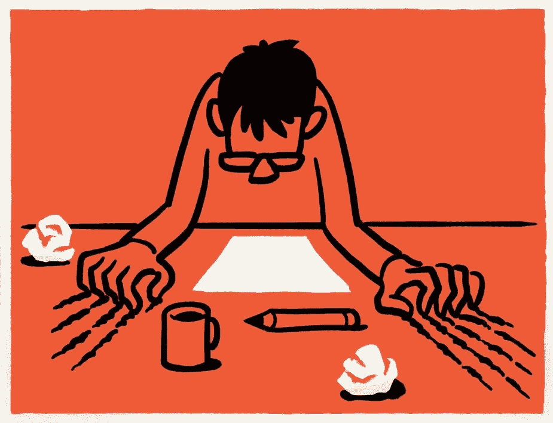
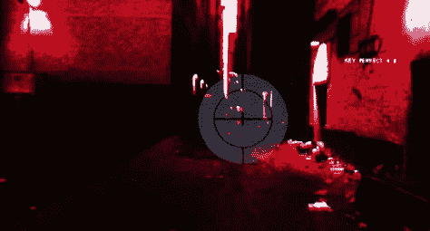

# 作为设计专业学生不能承受之轻

> 原文：<https://medium.com/swlh/the-unbearable-lightness-of-being-a-design-student-c90cf3de5a>

Illustration by Christoph Niemann

一天早上，当我从不安的梦中醒来时，我发现自己在床上变成了一个睡眠不足、焦虑不安的设计专业学生。我躺在酸痛的背上，稍稍抬起头，看到我的整个生活被分成了严格要求的几个部分:在日常工作中，我努力不辜负旧的期望，而作为一名设计专业的学生，我正从一个大胆而激动人心的新角度来看待这个世界。上帝帮我度过这个蜕变！

回顾过去的一年，我意识到有这么多小的，有时令人沮丧，但很多时候具有讽刺意味的有趣的时刻，如果我没有参加设计学校，这些都是不可能遇到的。我改变了很多，但我拼命想让自己振作起来。有时所有这些都是一种诅咒，但大多数时候是一种祝福，但总是令人放心的是，我并不孤独，我的同学们也经历了或多或少的相同(或者他们只是好心地支持我)。以下是我确实正在经历转变的迹象汇编。

## 他们并不总是明白，但是编码对每个人来说都很性感(？)

与外人谈论学校正成为一个巨大的挑战，因为设计似乎仍然是一个时髦的词。闲聊可能会变得非常尴尬:

“那你是学什么的？”

“网页设计。”我急忙说。

“哇，我一直想知道怎么编码！”

“我没有编码。是 UX 和 UI 设计。”尴尬的沉默袭来，我可以看到失望，直到最后我只是得到这个悲伤和困惑的回应:

“哦…”

*(自我提醒:编码也很性感。给未来自己的提示:学会编码。直到那时，E-D-U-C-A-T-E.)*

## 终结者-视觉

尤其是在一堂印刷课上，我有了 T-800 的视力。我开发了一个高灵敏度的雷达:我发现字距错误，我的传感器在定位流浪汉或漫画人物时立即宣布紧急情况，我的反应只是想开始审判日。相反，我最终会头痛欲裂。*(自我提示:添加* [*你可能是我的*](https://www.youtube.com/watch?v=_U5IhEAFGwQ) *到播放列表。)*

Hasta la vista, baby

## 时间管理等于忘记化妆的技巧

时间是一种稀缺资源，如此稀缺以至于一些东西开始从我的生活中消失，为新事物提供空间和时间。比如化妆的能力。令人难过的是，我发现这个城市的其他人都开始比我好看了。这是一个巨大的矛盾，但设计学校让我看起来很可怕！(自我提醒:我应该破解“为你想要的工作而穿，而不是你现有的工作而穿”的含义。并尝试实现一些(实际上是任何)能让我摆脱这种痛苦的东西。)

## 罪恶的快乐

这是我并不引以为傲的事情，但我正在通过公开承认来慢慢战胜自己的势利(反正很多人都知道)。唯一能让我持续并立即进入无意识、无忧无虑状态的事情(甚至比《行尸走肉》更有效)就是跟上卡戴珊姐妹的步伐。非常荒谬。你的学校作业有很大的滞后吗？你的利益相关者让你在工作中感到紧张？去看看 KKW 和部落里其他人的屁股吧！随时随地，它有助于杀死我的脑细胞。(自我提醒:也许我应该试试瑜伽。)

## 寻找逝去的时光

我不再像正常人一样跟踪月份和季节，因为我经常呆在室内的笔记本电脑前。通常我的脸书 feed 会告诉我时间(和生命)的流逝。例如，今年我真的没有意识到已经是春天了，当一位脸书朋友在一次远足中上传了一张雪花莲的照片时，我真的很惊讶。我甚至不知道*徒步*这个词是什么意思了，这让我…

## 健康和姿势问题

我已经像巴黎圣母院的驼背了。2018 年，我真的撑不下去了。就是难过。*(自我提醒:如果对英年早逝的恐惧在某个时候会减轻，只要想想不适合你的夏装。出去走走。)*

## 味道略有变化

当然，我正在慢慢地进化成一个超级复杂的非凡设计，但我现在不想暗示这一点。每个学期我都被一首歌卡住，由于我获得格莱美奖的表演，我亲爱的同学们可以欣赏这首歌。在某种程度上，这很像巴甫洛夫，因为这首歌只有在我上学的时候才会想起，通常我不会听它。这也让我很恼火，但我就是停不下来。我去年的头号热门歌曲是[*‘我不想错过任何事情’*](https://www.youtube.com/watch?v=JkK8g6FMEXE)。仅仅是因为我试图用它的歌词让自己保持清醒:*‘不想闭上眼睛/我不想睡着’*。至少我可以把这和我适度的睡眠不足联系起来。但是我真的不能解释为什么我们开始用唱 [*黄金眼*](https://www.youtube.com/watch?v=4hGQ97tCTOs) 混日子。*(给自己的提示:找个心理医生把这个提出来，说不定还有一些被埋没的童年记忆要揭开。)*

## 圣诞节愿望清单从未如此简单

字体包，订阅，访问在线工具和设计书籍。真的不需要别的了。但是这些我想大量购买。抱歉，我刚刚撒谎了。我还想拥有一台 MS Surface Studio、一台大 Wacom Cintiq、一台 iPad Pro 和一台 iMac Pro……所有的一切。(自我提醒:需要中彩票或者找个甜爹。声明:只是穷人的笑话，不是淘金者，只是认真对待彩票部分。)

## 共同的痛苦让人们走到一起

这里面有血，有汗，有泪，所以真正需要团队合作才能坚持到底。在这一点上…所有与我一起工作和学习的优秀人才都令人难以置信。在工作之余上学可能是一种吸血的凶猛动物，所以我很感激所有的爱、支持和令人印象深刻的才华，我可以见证、参与和享受。*(自我提醒:不要拿这个支持系统冒险，不停地唱同一首歌，装疯卖傻。参考上面关于口味变化的警告段落。)*

## 这篇文章发表在[《创业](https://medium.com/swlh)》上，这是 Medium 最大的创业刊物，有 277，678+人关注。

## 在这里订阅接收[我们的头条新闻](http://growthsupply.com/the-startup-newsletter/)。

