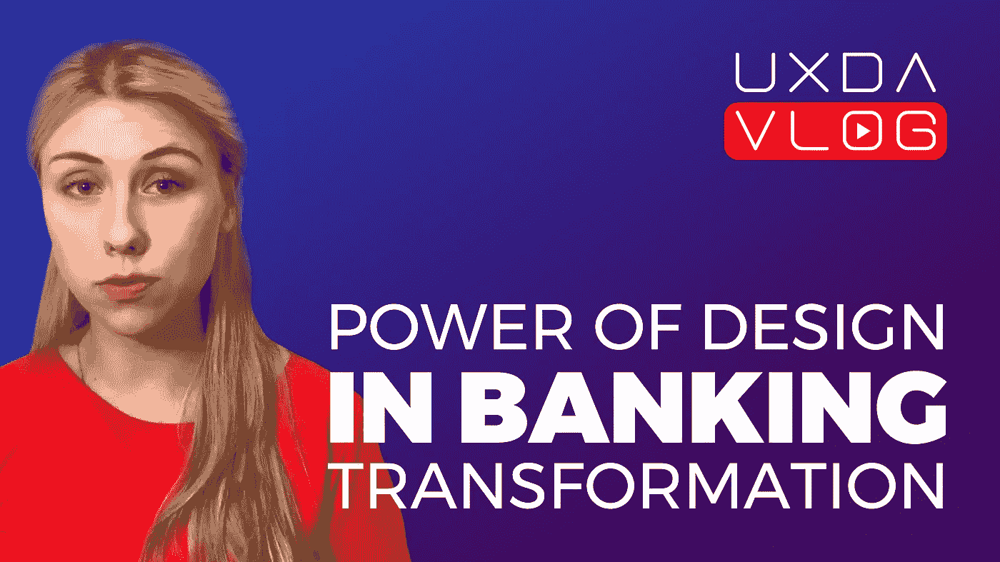
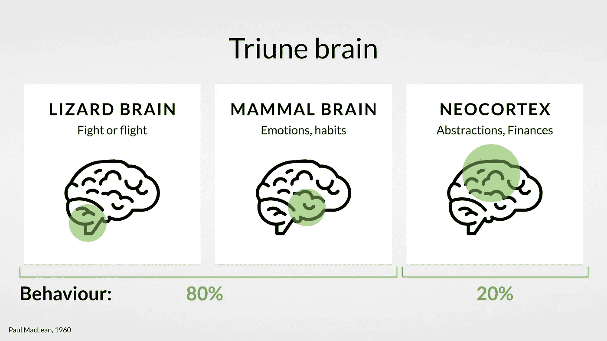
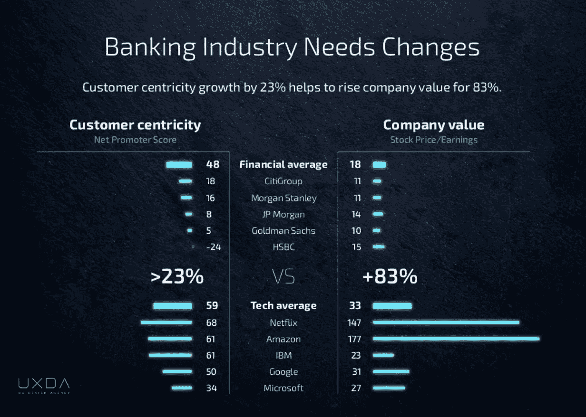

# 设计在银行业转型中被低估的力量

> 原文：<https://medium.com/swlh/the-underestimated-power-of-design-in-banking-transformation-2c42e73b1d47>

## 谈论设计在数字产品开发中的应用是一种时尚。但是对于数字产品有一个很大的误解，没有多少人意识到…

> 设计不是你的产品看起来怎么样的问题。设计关乎顾客的感受。

许多决策者认为，金融就是理性。但事实并非如此。人类在经济上是非理性的。这是诺贝尔奖获得者丹尼尔·卡内曼的[研究证明的事实。](https://www.uxdesignagency.com/blog/TOP10_Misconceptions_of_Financial_UX_Design_that_threatens_the_future_of_Banks_and_Fintech)

我们的大脑不喜欢计算和记忆数字。你知道吗？这是完全正常和自然的，因为经济学不是人类的天性。我们是有感情的生物！[我们非理性的、无意识的情绪驱动着我们 80%的行为。](https://www.uxdesignagency.com/blog/Why-People-Are-Stuck-With-Finances-And-How-Technology-Can-Change-It)

许多人认为数字意味着编码、技术、创新和其他技术性的东西。但是如果用户不能

*   了解你的产品；
*   从中获取一些价值；
*   感受与它的情感联系

看似高明的营销策略或巨额广告预算都救不了你。

> 我们已经认识到，理解金融设计中的错误会导致数百万美元的损失是极其重要的。

为了防止这种情况，并确保你的数字产品长期成功——给它注入情感。确保你的金融服务好用！正如认知工程之父唐·诺曼所说:

> “没有必要为了可用性而牺牲美观，或者为了美观而牺牲可用性”。

创造用户喜欢的产品的唯一方法是使用[用户体验方法论](https://www.uxdesignagency.com/ux-design-agency-ui-working-process)和[设计思维方法](https://www.uxdesignagency.com/ux-design-agency-ui-working-process)开发数字解决方案。这为交付解决方案提供了所需的“神奇”成分，不仅能根据客户的需求提供服务，还能建立情感联系，满足他们的期望。

如果你看看那些将设计思维融入核心、融入 DNA 的非常成功的公司，你会发现它们的市盈率是平均水平的 30 倍。

> 让数字说话，做你的数学，但是请不要忘记情绪。

你对金融设计、设计思维、用户体验方法论有什么疑问吗？

请随意发送评论或直接留言，我们将在下一个 [UXDA Vlog](https://www.youtube.com/channel/UCQ3Df4vt9yaOj5Eu08MtRxg?view_as=subscriber) 视频中讨论这个话题！

***由 UXDA*T5 的财务 UX 灵感官 Monika Calite 发布**

***本帖首发于*** [***UX 设计机构博客***](https://www.uxdesignagency.com/blog/the-power-of-design-in-banking-transformation) ***。***

## 这篇文章发表在 [The Startup](https://medium.com/swlh) 上，这是 Medium 最大的创业刊物，拥有+395，714 人关注。

## 在这里订阅接收[我们的头条新闻](http://growthsupply.com/the-startup-newsletter/)。

