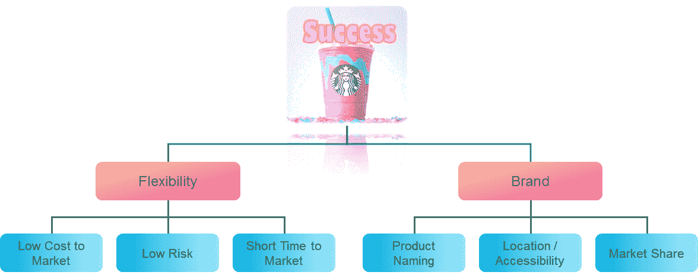
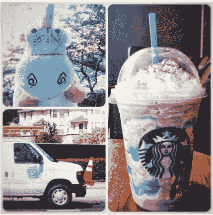
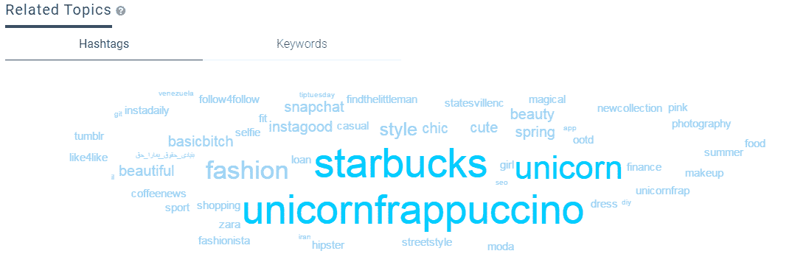
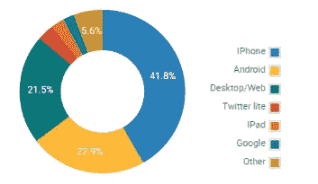
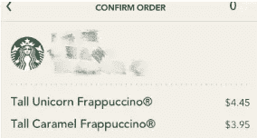
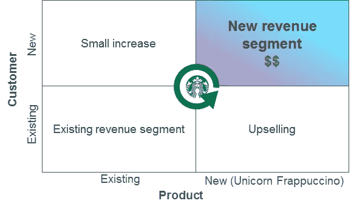
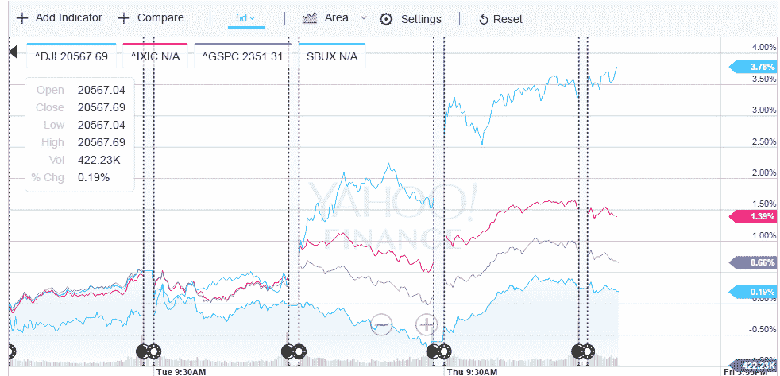
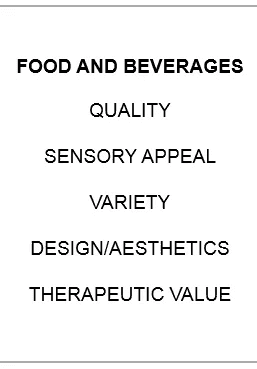
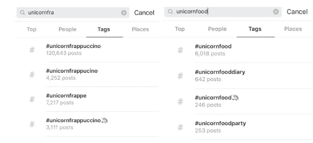
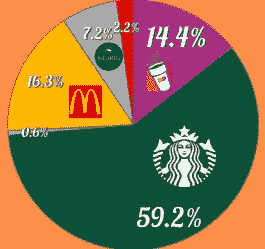

# 独角兽星冰乐的成功秘诀

> 原文：<https://medium.com/swlh/the-unicorn-frappuccino-through-a-consultants-eyes-2721a60229aa>

在这个联系日益紧密的世界中，**保持相关性**并拥有**灵活性**以保持创新和发展是成功企业的关键，无论你处于哪个行业，你的商业模式是什么。星巴克刚刚证明，它不必推出一种会说话的饮料或击败一位顾客来抢走聚光灯。

Starbucks has created a new version of unicorn in this world with its Unicorn Frappuccino

我第一次看到“[被植入](http://www.businessinsider.com/starbucks-unicorn-frappuccino-review-2017-4)”独角兽星冰乐是通过朋友在社交平台上的帖子。可能是受其神奇力量的启发，我想作为一名顾问在去拿饮料的路上分析这种狂热(我的导师非常鼓励这种做法)。

今天，我想分享为什么我认为独角兽星冰乐非常成功，以及我从它身上学到的最大的东西。在深入细节之前，这里有一些我在研究中发现的有趣事实。

1.  #独角兽星冰乐标签在发布的第一天，每小时都会成为 Twitter 上的十大热门话题。
2.  标签 **#basic** 与独角兽饮料密切相关。从[锁孔](http://keyhole.com)看下面。

Related topics for #basic

3.iPhone 用户似乎比 Android 用户对这种饮料更感兴趣。尽管事实上 Android 占据了智能手机 80%的市场份额。我的假设是，星巴克的新饮料与 iPhone 的客户群非常相似。

Origin of the hashtag #unicornfrappuccino

# 为什么我认为独角兽星冰乐是成功的？

## 社交媒体的力量

这款产品已经登上了从《福布斯》到《华盛顿邮报》的各大新闻媒体。除了一篇特别的评论描述这种饮料尝起来像“[酸的生日蛋糕和耻辱](https://www.washingtonpost.com/news/food/wp/2017/04/19/starbucks-unicorn-frappuccino-tastes-like-sour-birthday-cake-and-shame/?utm_term=.28624c8ef571)”之外，大多数关于这种产品及其味道的文章都相当中性。我不是专家，但上一次一件带有中性情绪的事情引起巨大的互联网浪潮是什么时候？自从独角兽星冰乐发布以来，**新的标签#独角兽星冰乐在 2 天内**在[**insta gram**](https://www.instagram.com/explore/tags/unicornfrappuccino/?hl=en)**上产生了超过 80000 条帖子(看图片，人们在分享他们买了独角兽饮料，而不是它的味道有多棒或多糟糕)。和许多人一样，我是通过星巴克的顾客，而不是官方广告了解到这款产品的。**

## 5 天的收入激增

参考下面的图片。除了保持常规顾客常规购买的现有销售额，星巴克还将从购买更昂贵的独角兽星冰乐的常规顾客和因品牌推广而来访的新顾客那里获得少量销售增长。销售额的主要增长将来自像我这样的人，他们不经常去商店，但去那里只是为了尝试新的饮料。因为到目前为止还没有关于这种饮料或公司的负面报道，我假设销售没有损失，只有增加。(事后看来，这的确是一个巨大的成功，许多顾客报告说，在促销结束之前，饮料就已经卖完了。

A slightly higher price of the Unicorn Frappuccino

## 相对低成本

谈到收入，让我们来看看成本。我没有看到任何固定成本的增加，因为商店数量和开销等因素都是一样的。在可变成本方面，除了作为所有产品标准的 COGS 之外，由于营销和劳动力成本保持在较低水平，该产品没有显著的额外成本。大部分广告是由媒体和互联网用户进行的，而不是大规模的星巴克活动。当我参观商店时，我没有看到员工增加。他们甚至告诉我，与其他星冰乐相比，这种饮料真的没有那么复杂，制作时间也不长。

最后，星巴克的股票也获得了提振，在过去 3 天里跑赢了美国所有行业指数。

独角兽星冰乐是一个巨大的成功，因为星巴克能够以尽可能少的成本创造收入并推广其品牌。

# 成功秘诀

Source: Harvard Business Review

根据 [HBR 的*价值要素*](https://hbr.org/2016/09/the-elements-of-value) ，消费者认为列出的五个要素(左)对食品和饮料产品最重要。虽然我认为这些因素促成了独角兽星冰乐的成功，但在这个独特的案例中，我发现**的灵活性**和**品牌**是使其成功成为可能的关键因素。

Success Recipe of the Unicorn Frappuccino

**灵活性**是星巴克能够**创新并以**低风险快速转向**的关键。**

## 低市场成本

如前所述，从发布前到发布后阶段，饮料的成本都很低。星巴克不需要投资新的设施或技术来创造这种饮料，也不需要支持服务。

## 低风险

[*回收期*](https://www.bcgperspectives.com/content/articles/innovation_growth_payback_reaping_the_rewards_of_innovation_excerpt/) 的作者认为，风险有三种:技术型、运营型和市场型。从技术上讲，确保饮料可以安全饮用是最基本的。推出这种饮料的低成本和投资使得商业化的操作风险较低。**通过在产品上加上** [**退出日期**](http://people.com/food/starbucks-unicorn-frappuccino-taste/) **进一步降低市场风险。即使顾客不太接受，成本也会包括一些浪费的供应品和 5 天的库存空间，因为饮料只按订单生产，所以供应链中不会出现明显的波动。**

## 上市时间短

影响灵活性的第三个因素是从创建产品到推出产品的时间相对较短。据星巴克的商店员工称，商店只是在产品推出前几天才收到独角兽星冰乐的说明。反过来，短时间的上市让星巴克有快速的现金流进行投资和创新新产品。

所有这些因素使得星巴克能够灵活地在一个月内****推出少量新产品。****

****品牌/名称**是**强大市场地位**的驱动资产，**需要持续努力。****

## **卖了自己的名字**

**如果它不叫独角兽星冰乐，我可能就不会喝了。我认为，如果它被叫做像棉花糖星冰乐那样的东西，互联网就不会被“T6”吓坏了。我不需要了解产品的功能、质量和配方就可以购买。与其说星巴克利用了独角兽食品的创意，我倒不如说它利用了人类实现自己幻想的欲望，这些幻想在现实生活中并不存在。创造飞机、宇宙火箭、电脑、哈利波特主题公园、自动驾驶汽车等。都是这种欲望的证明。**

## **位置/可达性**

**一个热门的名字是不够的，独角兽食品的想法不是星巴克发明的。根据互联网，独角兽食品已经成为一种增长趋势。然而，看看 Instagram 上的标签对比，**独角兽星冰乐在问世后的几天内就远远超过了独角兽食品**。星巴克的知名品牌和实体网络让人们很容易接触到这种饮料。大多数顾客愿意花大约 5 美元成为这一新趋势的一部分。这让我想起了沃尔玛利用现有资产参与电子商务竞争的战略。**

****

## **市场占有率**

****

**Source: Forbes**

**星巴克品牌也意味着市场主导地位。我想知道，在相似的品牌认知度、资源和地理位置的情况下，如果麦当劳或邓肯甜甜圈推出独角兽星冰乐，会不会同样成功？我不能绝对地说，但是我有根据的猜测是没有。**

**我学到了什么？一种趋势有可能在没有时间和空间限制的情况下影响到更多的受众。利用你的优势，保持灵活性，坚持数字营销。**

**捕捉、编辑、过滤、标签和发布。**

**当我在网上发布我的独角兽星冰乐照片时，我想，**独角兽星冰乐不仅创造了千禧一代的销售，还成为了一个平台，欢迎人们留下来的愿望******。******

****如果你喜欢这篇文章，请点击下面的❤以示支持，这样其他人也能看到。:)****