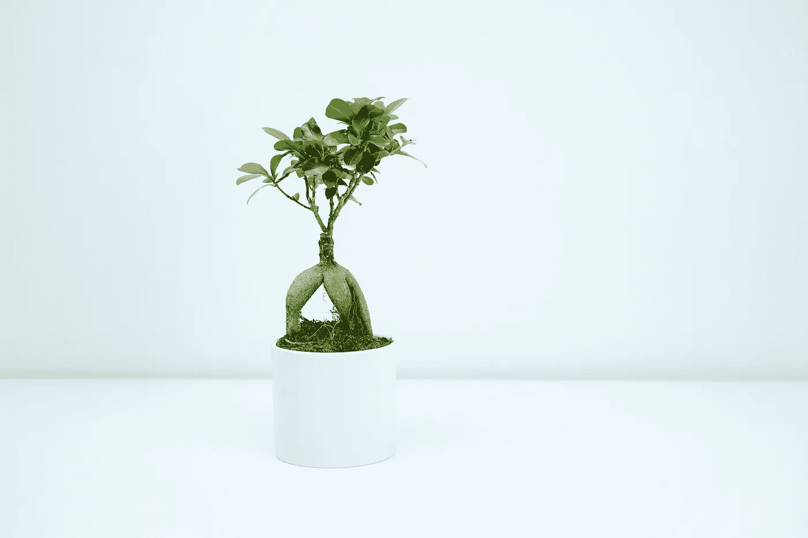

# 几乎所有事情都不重要

> 原文：<https://medium.com/swlh/the-unimportance-of-practically-everything-9ddb2e251486>

尽量减少你的生活是选择按计划生活，[而不是默认](http://www.dansilvestre.com/make-smarter-decisions/)。你决定如何分配你的时间、精力和努力。

几个月前我读了《T2》中的本质主义。但书中的一句话留在了我的脑海里:

> "你不能高估几乎所有事情的重要性."―约翰·麦克斯韦