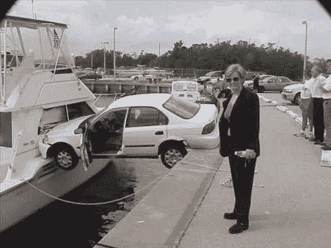
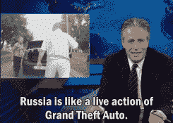
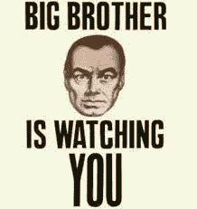
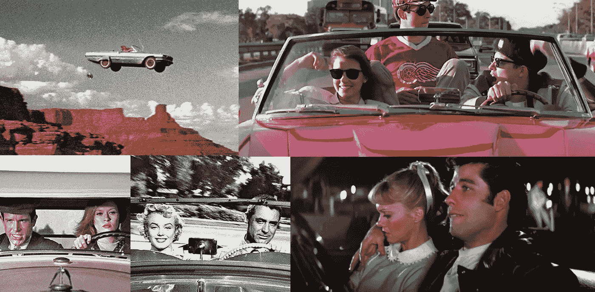
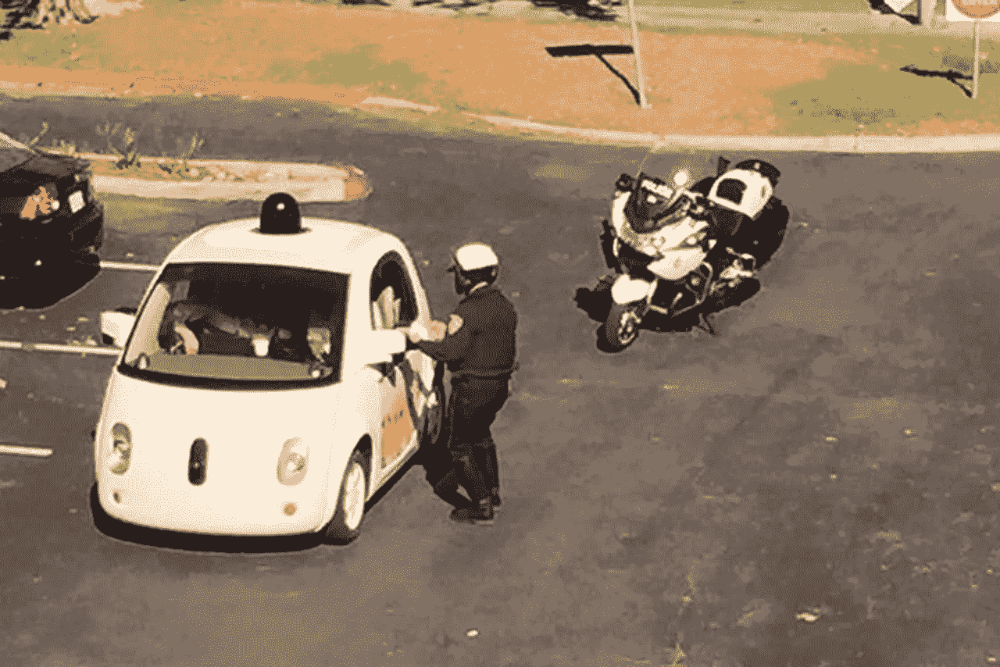
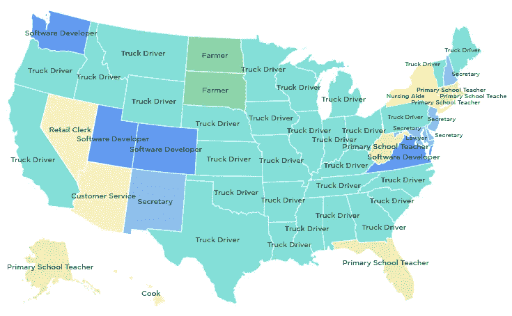
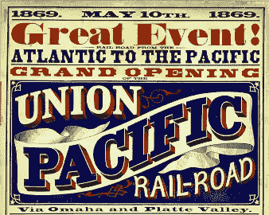

# 无人驾驶汽车将以意想不到的方式改变我们的世界

> 原文：<https://medium.com/swlh/the-unintended-ways-self-driving-cars-will-change-our-world-3b15d1db9026>

无人驾驶技术是未来几代人的道德责任。

2016 年 10 月 31 日 9 分钟阅读

六年前，当谷歌宣布它正在开发一辆[无人驾驶汽车](https://googleblog.blogspot.com/2010/10/what-were-driving-at.html)时，引起了很多人的惊讶。当时，很少有人认真对待这项技术。然而，事情已经准备就绪，现在自动驾驶汽车即将成为我们日常生活的一部分。就在去年 8 月，优步在匹兹堡推出了第一批 [100 辆无人驾驶出租车。](https://newsroom.uber.com/pittsburgh-self-driving-uber/)

我相信这是即将到来的对我们社会最具变革性的技术之一。在这篇文章中，我们将探索这些汽车会以意想不到的方式影响你的日常生活，从潜在的失去驾驶权利到完全失去工作，以及为什么所有这些实际上是一件伟大的事情。

# 驾驶可能成为非法行为

让我们直截了当地说:人类是低劣的司机。给每个成年人驾驶两吨重的死亡机器的权利的想法是非常愚蠢的。在世界各地，汽车每年杀死 130 多万人。仅在美国，自二战以来，没有一年汽车事故没有导致 3 万多人死亡。

And over [94% of those are caused by human error](https://crashstats.nhtsa.dot.gov/Api/Public/ViewPublication/812115).

另一方面，电脑是更好的司机。首先，他们开车时不会发短信、喝醉或分心。此外，它们还配备了一系列赋予它们超人能力的传感器:360°雷达、激光、相机、网络地图和做出光速决策的智能。最近的一项研究估计，自动驾驶汽车的大规模采用可以减少超过 90%的交通事故，在这个过程中挽救成千上万人的生命。到目前为止，事实似乎支持这项研究。自问世以来，谷歌自动驾驶汽车已经在[行驶了近 200 万英里](https://static.googleusercontent.com/media/www.google.com/en//selfdrivingcar/files/reports/report-0816.pdf)，这大约是[普通美国人一生中驾驶里程的三倍](https://www.fhwa.dot.gov/ohim/onh00/bar8.htm)，并且只在一次事故[中涉及到电脑故障](https://google-self-driving-car-incidents.silk.co/)。

当自动驾驶汽车成为主流，当局意识到它们在驾驶方面有多么出色时，会发生什么？他们[亡命驾驶](https://techcrunch.com/2015/08/11/driving-your-car-will-soon-be-illegal/)。当埃隆·马斯克说他相信这最终会发生时，他让很多人很生气。他的批评者不明白的是，他们愤怒的观点是毫无意义的。安全带和安全气囊刚出来的时候，也没人要。然而，现在每辆车里都有这些东西的事实表明，当涉及到公共安全时，个人观点是多么的无关紧要。归根结底，安全是钱的问题，车祸花费了一大笔钱。在美国，大约是每年 8710 亿美元。考虑到自动驾驶汽车的大规模采用可以减少大约 1900 亿美元的物质损失，有理由相信它们在未来可以得到实施。

# 这项技术将导致大规模的公共监控

在 YouTube 上搜索“俄罗斯仪表盘摄像头崩溃”，你会发现成千上万的视频显示疯狂的车祸和千钧一发。

Russian dash cam videos have become an Internet running gag.

这并不意味着俄罗斯的道路比其他地方更危险。简而言之，这是因为俄罗斯腐败的执法和法律体系使得司机有必要使用仪表盘摄像头来保护他们的权利。事实证明，随时记录一切让日常驾驶的混乱成为焦点，而这在以前是被忽视的

同样，带摄像头的智能手机的普及也揭示了另一个重要问题:警察暴力。最近，捕捉警察暴力的视频引起了媒体对这一先前被忽视的现象的广泛关注，导致了全国性的抗议和黑人的命也是命运动的形成。但归根结底，**暴力并不新鲜；** [**是摄像头**](http://www.democracynow.org/2015/9/7/between_the_world_and_me_ta) **。虽然黑人社区几十年来一直谴责这个问题，但我们一直等到摄像机把暴力推到我们面前，才开始公开讨论。**

自动驾驶汽车就像打了类固醇的相机。为了驾驶，他们需要不断地记录和理解周围的世界。鉴于相机的激增迄今为止如何改变了我们的生活，考虑一下当街上的每辆车都在随时记录一切时会发生什么是很有趣的。

一方面，收集到的惊人数量的信息可以极大地改善公共安全。无人驾驶汽车将能够识别路障、事故或潜在危险，并立即联系正确的服务。此外，犯罪预防软件可以通过算法检测攻击，并向当局发出警告。另一方面，这种持续的监视会让我们更接近一个奥威尔式的社会。例如，联网的自动驾驶汽车将随时跟踪我们的位置。在面部识别技术的配合下，自动驾驶汽车网络可以识别和跟踪视野中的任何行人。斯诺登爆料后，自动驾驶汽车的激增可能会重新点燃关于安全和隐私的辩论。

# 对你的孩子来说，拥有一辆汽车将是一个陌生的概念

在撰写本文时，几乎所有的科技巨头，包括谷歌、苹果、百度和优步，都在制造自己版本的无人驾驶汽车。这些公司正在寻求的主流商业模式似乎是一种自主拼车服务。想象一下:没有人类司机的优步。只需在智能手机上提出请求，该公司的一辆自动驾驶汽车就会来接你，带你到目的地，送你下车，然后开车去为另一位客户服务。

除了极其方便之外，这种服务的主要优势是降低了成本。这也是这些公司大多在打造*电动*自动驾驶汽车的原因。通过剔除人的工资和汽油，乘坐汽车的成本可以低至每英里 0 . 35 美元，这比现在的公共交通更便宜。最终，你得到了拥有一辆车的所有好处，支付更少，而且你永远不用担心维护或寻找停车位。在自动驾驶汽车如此便宜和方便的未来，拥有一辆汽车的想法将是愚蠢的。

This will be a huge cultural change for western societies, where car ownership has long been a status symbol and a rite of passage into adulthood.

然而，考虑到汽车可能是[世界上最未被充分利用的资产](http://orfe.princeton.edu/~alaink/SmartDrivingCars/PDFs/MorganStanley%20040715ReportJonas.pdf)，这是一个受欢迎的变化。事实上，普通车主仅在 4%的时间里使用他的车，考虑到每辆车的平均成本约为 9000 美元/年，这是一个惊人的浪费。最终，无人驾驶技术将让我们提高运输效率，同时减少道路上 90%的汽车。对于像美国这样的国家来说，研究估计其汽车数量可能高达 2 . 4 亿辆。这就引出了下一点:

# 交通将几乎不存在

除了对环境的明显好处之外，减少路上的汽车是消除交通堵塞的第一步。事实证明，自动驾驶汽车可以完全消除交通堵塞。为了理解这是如何可能的，我们首先需要理解流量是如何工作的。

2008 年，一组研究人员做了一个实验，展示交通是如何从看似不存在的地方出现的。他们将 22 辆车放在 750 英尺长的单车道上，并指导每个人以大约 30 英里/小时的速度行驶。不一会儿，汽车就挤满了。

This phenomenon is called a [traffic shockwave](https://en.wikipedia.org/wiki/Traffic_wave). It appears when someone drives slower than the average, causing every driver behind to break slightly harder than needed. The delay between every car breaking and accelerating starts a chain reaction that ends up creating a traffic jam out of seemingly nowhere.

如果在自动驾驶汽车上做同样的实验，就不会出现拥堵。这是因为计算机保持完全恒定的速度没有问题。事实上，在驾驶方面，计算机在许多事情上都要好得多。

A world without terrible drivers is a world without human drivers.

这段经过巧妙剪辑的视频展示了无数辆汽车在十字路口不可思议地相互穿越。像这样的壮举对于人类司机来说是不可想象的。但是在一个汽车可以以光速相互交流的系统中，[一个总体交通管理系统](https://www.youtube.com/watch?v=4pbAI40dK0A)可以使这成为现实，将交通流量减少到最佳最小值。

这样的系统也会让[的交通灯过时](http://smart.mit.edu/news-a-events/press-room/article/56-the-death-of-the-traffic-light-.html)。考虑到交通灯是一项有 150 年历史的技术，其唯一目的是帮助人类司机粗略地相互协调，这是另一个受欢迎的变化。摆脱他们也将有助于减少交通流量。

减少交通对环境的好处是巨大的。目前，美国通勤者每年在交通上总共浪费了[55 亿小时](http://www.theatlantic.com/business/archive/2013/02/the-american-commuter-spends-38-hours-a-year-stuck-in-traffic/272905/)，向大气中释放了不必要的 560 亿磅二氧化碳，并在此过程中浪费了大约[1240 亿美元](http://www.newsweek.com/2014/10/31/cost-getting-stuck-traffic-278936.html)。交通造成的巨大浪费是最终强制推行无人驾驶汽车的另一个理由。

# 无人驾驶汽车将消灭数百万个工作岗位…

这是一个目瞪口呆的警察的照片，他因为一辆谷歌汽车开得太慢而让其靠边停车。

The car ultimately wasn’t issued a ticket.

这幅图是对我们自动化未来的一个很好的比喻。在一个没有司机、停车位和红绿灯的世界里，街头警察没有多少工作可做。虽然再也不会收到超速罚单的想法听起来很神奇，但对于那些将失去工作的人来说，这可不是什么好事。这不仅仅是警察的事。想想:出租车、公共汽车和卡车司机。

金钱是我们社会变革的一个重要因素。事实证明，自动驾驶汽车不需要钱。他们也可以 24 小时不间断工作。雇佣他们的时候，你也不需要担心雇佣、管理或给予福利。所有这些都意味着运输企业将节省大量资金，你可以打赌他们会寻求这些。

Scott Santers 用下面的地图完美地展示了[这种变化会带来多大的破坏性](/basic-income/self-driving-trucks-are-going-to-hit-us-like-a-human-driven-truck-b8507d9c5961):

Source: [NPR](http://www.npr.org/sections/money/2015/02/05/382664837/map-the-most-common-job-in-every-state)

正如你所看到的，驾驶是美国最受欢迎的工作之一。平均年薪为[大约 4 万美元](http://www.bls.gov/ooh/Transportation-and-Material-Moving/Heavy-and-tractor-trailer-truck-drivers.htm)，这也是为数不多的不需要学位就能提供不错的中产阶级收入的职业之一。在美国，[有 350 万职业卡车司机](http://www.alltrucking.com/faq/truck-drivers-in-the-usa/)，此外还有[66.5 万公交车司机](http://www.bls.gov/ooh/transportation-and-material-moving/bus-drivers.htm)， [24 万出租车司机](http://www.statisticbrain.com/taxi-cab-statistics/)，以及众多的优步和 Lyft 司机。所有这些工作最终都将被自动驾驶汽车取代。

# …并改变我们所知的经济

无人驾驶汽车是被称为自动化的更广泛现象的一部分，机器人和人工智能的进步慢慢取代了工作场所的人类。运输行业是第一个受害者，但还会有更多的受害者。事实上，牛津大学的研究人员估计，自动化有望在未来 20 年内消灭大约一半的美国工作岗位。

自动化本身并不坏。这个过程已经持续了几个世纪。历史上充满了因技术而消失的工作。你想带多少回来？未来几代人对人类司机的看法将与我们现在对城镇传令员或电梯操作员 T21 的看法一样。

技术正把我们带到一个工作岗位比人少的世界。虽然这一开始看起来很可怕，但在某种意义上，这是社会一直想要的。这就是我们最初建造东西的原因。从某种意义上说，无人驾驶技术是我们这个时代的[横贯大陆铁路](https://en.wikipedia.org/wiki/First_Transcontinental_Railroad)或[州际公路](https://en.wikipedia.org/wiki/Interstate_Highway_System)项目。这是一代企业家和工程师共同努力让子孙后代的生活更轻松。

Omaha — San Francisco in less than 4 days!

从历史上看，工作一直是为了解决问题，但在这个过程中，我们把它混淆成了让自己忙碌的一种方式。我认为这是根本错误的。我相信人类的潜力，我相信首先是通过将我们从卑微的、自动化的工作中解放出来，我们才能最终摆脱束缚，达到更高层次的自我实现。

今天，自动驾驶汽车仍然面临着重大挑战。它们还没有在[极端天气](http://qz.com/637509/driverless-cars-have-a-new-way-to-navigate-in-rain-or-snow/)中发挥作用，容易受到[黑客攻击](https://www.wired.com/2016/03/fbi-warns-car-hacking-real-risk/)，面临[道德困境](https://www.technologyreview.com/s/542626/why-self-driving-cars-must-be-programmed-to-kill/)，并且它们遵守法律如此精确，以至于人类驾驶员目前更有可能[撞上它们](http://www.bloomberg.com/news/articles/2015-12-18/humans-are-slamming-into-driverless-cars-and-exposing-a-key-flaw)。然而，我相信这项技术的好处远远超过它的挑战和潜在的缺点。最终，如果这项技术能够实现其承诺的十分之一，无论是拯救生命、降低成本还是减少污染，我相信我们都有道德义务推动它向前发展。

💚**如果您喜欢这篇文章或从中受益，请点击“推荐”。**

*此文曾被* [*也于 2016 年 11 月 7 日在 Tech Crunch 上以幻灯片形式发布*](https://techcrunch.com/gallery/the-unintended-ways-self-driving-cars-will-change-our-lives/) *。*

*巨大的感谢* [*博比 a .奥布*](https://medium.com/u/ce1efc09997?source=post_page-----3b15d1db9026--------------------------------)*[*卡伦奥戴尔*](https://medium.com/u/a5db36348af2?source=post_page-----3b15d1db9026--------------------------------)*[*弗朗索瓦兰蒂耶 n .*](https://medium.com/u/d6c1e76d5cac?source=post_page-----3b15d1db9026--------------------------------)*[*扬苏吉拉尔*](https://medium.com/u/c52e0e2d1426?source=post_page-----3b15d1db9026--------------------------------) *和雨果萨瓦为反馈。****