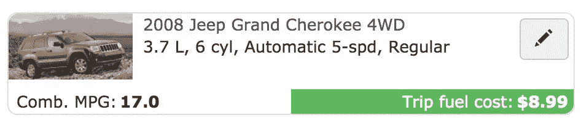

# Upcycling Challenge $0-$1，000: Move 4，$776

> 原文：<https://medium.com/swlh/the-upcycling-challenge-0-1-000-move-4-776-494db20fc89b>

Shot by: [Michael Prewett](https://unsplash.com/@catvideo?utm_source=medium&utm_medium=referral)

*升级挑战创意前奏* [*这里*](/@justinbenfaida/upcycling-the-experimental-journey-to-reach-1000-12ae9b9b53bd) *&下面:*

一个非紧急系列，从 0 美元开始，通过商品升级赚取 1000 美元。要达到这个目标需要多少步骤？**我能以多快的速度**卖掉一件不是全新的*物品？这是一个向上循环的实验，一个人的垃圾是纯粹的财富。*

**从我的升级名**的绝对 0 美元开始，我一直在寻找[craigslist.org](http://craigslist.org)的免费内容部分，并在业余时间每小时创造超过 100 美元。一旦我产生了投资资本，我就可以购买被低估的资产，然后以更高的价格卖出。我还发现材料部分很有趣，有大理石板、厨柜和大量的瓷砖。在这次测试中，我也不打算把我的公寓变成储物者的天堂,所以可以肯定地说，未来我不会有太多的重叠销售。

# 起始利润:601 美元

**The Find:**craigslist.org/free stuff 区，**“免费餐桌今天必须去”**在纽约免费。在威彻斯特公平假定的转售价格:140 美元。

我知道。这是一张可怕的照片，我通过电子邮件进一步追问了几个问题，在雨中跳上车，很快就到了那里。人们讨厌在雨中四处走动，所以这是在任何竞争中领先的最佳条件。给阿尔贝托发了一条短信，我向他保证我在路上，40 分钟后到。请记住，你越早行动起来，朝着你看到的目标前进，你就越有可能成为那个赢得目标的人。

# 距离+购买成本:14.27 美元

**距离:** 55.6 英里往返
**路费:** $2.64 x2 = $5.28
**时间:** 2 小时

55.6 Miles Round Trip

**太棒了，桌子和桌面都不适合我的吉普拉雷多。在尽了最大努力把它放进行李箱后，我决定把桌子底座(它有一个非常坚固的金属框架)倒过来绑在我的车顶行李架上。我用绳子固定住每个角落，这样如果我们突然停下来，它就不会左右滑动或前后滑动。你应该总是在车里放一根聚酯绳，谢谢你，莱克斯，你给我的这根绳子肯定有回报。**

# 重新列表:“现代木制书桌或桌子”

在清理背景和扫地之后，我拍了几张新的桌子的漂亮照片，这样它就可以被想象成某人自己的了。我已经把这个贴到了当地的威彻斯特社区销售页面，以及 craigslist 和正常的 FB 市场。**白色地毯真的有助于这件物品流行起来。**我们先把这个腌起来，看看是否有咬痕。

# 售出:175 美元

[**更新:咖啡屋长钢化玻璃书桌#2**](/swlh/the-upcycling-challenge-0-1000-move-3-601-f74c7f3f9327)

这些桌子都卖得相当快。质量永远是卖点。大卫在晚上早些时候给我发了一条信息，让我知道他在这个地区工作，他想看看桌子。我做了任何试图达到 1000 美元目标的人都会做的事情，我答应了。

在看到我如何拆卸桌子，看到桌子的强度和质量后，我帮他把它装到他的福特探索者里，带回城里作为新的工作空间。他不知道我为什么要卖它。说实话，我真的很喜欢这张桌子，想留着它。然而— **我们要达到**的目标。我不小心把其中一件落在了厨房的桌子上。我立刻给大卫打了个电话，看看他是否在高速公路上，但我还是跳进车里，用桌子的一块重要的碎片碰到了他！

**本次升级实验的所有收益将捐赠给非营利组织**[**court land ' s Connection。**](http://www.courtlandsconnection.org/vision) Courtland 的关系为寻求康复之路的个人提供经济支持，并帮助他们实现梦想。在美国，药物过量是意外死亡的主要原因，阿片类药物推动了这一流行病。在基层支持恢复+戒毒。考特兰是我年轻时最亲密的朋友。

## 这个故事发表在 [The Startup](https://medium.com/swlh) 上，这是 Medium 最大的创业刊物，有 320，131+人关注。

## 在这里订阅接收[我们的头条新闻](http://growthsupply.com/the-startup-newsletter/)。

