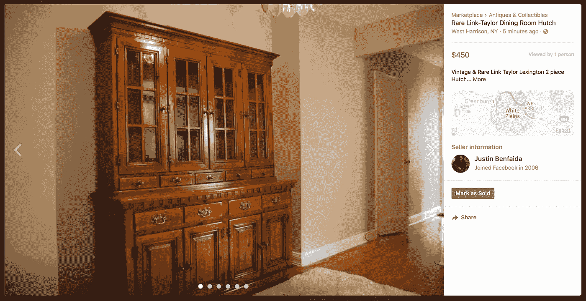

# 升级自行车挑战赛$ 0 –$ 1000，Move 3，$601

> 原文：<https://medium.com/swlh/the-upcycling-challenge-0-1000-move-3-601-f74c7f3f9327>

Photo by [Nikita Kachanovsky](https://unsplash.com/@nkachanovskyyy?utm_source=medium&utm_medium=referral)

*升级挑战创意前奏* [*这里*](/@justinbenfaida/upcycling-the-experimental-journey-to-reach-1000-12ae9b9b53bd) *&下面:*

一个非紧急系列，从 0 美元开始，通过商品升级赚取 1000 美元。要达到这个目标需要多少步骤？**我能以多快的速度**卖掉一件不是全新的*物品？这是一个向上循环的实验，一个人的垃圾是纯粹的财富。*

**从我的升级名**的绝对 0 美元开始，我一直在寻找[craigslist.org](http://craigslist.org)的免费内容部分。一旦我产生了投资资本，我就可以购买被低估的资产，然后以更高的价格卖出。我还发现材料部分很有趣，有大理石板、厨柜和大量的瓷砖。在这次测试中，我也不打算把我的公寓变成储物者的天堂,所以可以肯定地说，未来我不会有太多的重叠销售。

# 起始利润:211 美元

**寻找:**craigslist.org/免费区，**“两张带金属框架的玻璃桌面桌”**在纽约下城免费。在威彻斯特公平假定的转售价格:每桌 150 美元。

考虑到桌子的尺寸和我的吉普车的尺寸不足，我已经开始研究一个地区的存储设施，如果你愿意，可以提供一辆移动卡车作为你“会员”的一部分。在发现他们的卡车晚上已经被租走后，我选择不扣动仓库的扳机，以拖延一段时间，把我们的现金留在口袋里。在把吉普车的座椅放下 6 次后，我们决定掷骰子上路。

我很快就看到了这个广告，本很高兴地回应说，有人在同一天把他们俩从那里拉了出来。回到可用性概念:不惜一切代价让自己变得可用，这样你就不会错过任何机会。本真的很好心，帮我把桌子拆了，让装货更快。我敢肯定，那天他的公司酿造的欧文农场烘焙咖啡在他的血管里流动得很强烈！再次感谢本。

# 距离+采购成本:

**距离:**往返 60 英里，9 美元(基于我们之前 58 英里的旅程)
**时间:** 2 小时

# 重新列表:“优质办公桌——厚重的不透明钢化玻璃宽办公桌”

我发现，不浪费时间，在周末来临之前再次把它列出来是相当重要的。使用本的照片，我使用**关键词**和**价值主张**重新发布。

在标题**中，我们需要被搜索到**。如果有人搜索一张桌子，我希望其中一个关键词击中他们的脸，让他们点击进入。本的照片在推销方面并不出众，但这不是他的目标。他需要办公室里更多的空间。我需要卖掉它，所以我们必须使用强有力的销售语言来创造价值。该价值主张是为可能需要多张桌子的办公空间而设计的。**拜托！把它们都拿走，我给你打折！**

我把两张桌子都标价为 175 美元，或者两个都要 300 美元。这样，如果有人想买多张桌子，我就*“帮他们省钱”*。如果他们想跟我讨价还价，我也给自己留了余地，到 150 美元。我赢了。

同一天晚些时候，劳伦联系了我，问我如果她想要的话，是否可以把它们放进一辆 SUV 里。我向她保证不要担心，因为它们可以装进我的中型 SUV 的后座。我们很快安排了一个时间让她来看看桌子，看看是不是给她的。

考虑到她也需要我帮她保管一段时间，**我在短信中进一步建议，我们可以商定一笔小额定金或诚信付款，让我知道我已经把它们拿下来了，因为她实际上会回来拿的**，不会在我浪费时间不再接受更多销售报价的时候消失在风中。

劳伦失踪了。然而，认识一下萨拉。如上所述，人们喜欢达成交易。总是把你的初始成本推得更高，以留出回旋的余地。我知道，谈判很烦人，但是现在就开始练习吧，你会在下一份工作中有很好的表现。

我同意了萨拉 150 美元的条件，果然，星期五早上她开着她的 SUV 来拿走了其中一张桌子。在这个项目中，我们现在真的在前进！她很乐意拿走我车上已经拆开的桌子，这样就很容易成交了。

但是这里还有一个教训需要学习:当场数好你的钱。萨拉留给我 140 美元。提斯克提斯克提斯克。

# 售出:140 美元

**更新:中厨获得利益！** [**看到这里这个皮卡。**](/swlh/upcycling-challenge-towards-1000-move-2-211-168253cfcd73)

# 我想我们找到买家了！

下面我们可以看到一个线程通过 Letgo 与丹津。我对这个笼子没什么兴趣。考虑到这件作品*(固执己见)*真的很棒，这简直是疯了。

当我与一位先生**谈判时，丹津毫不留情**地试图改变我已经大幅降低的 250 美元的价格，并试图在另一位对这个厨柜感兴趣的先生之前先把它买下来。

在没有收到另一位先生的回复后，我让丹津保持联系，作为一个以防万一的紧急买家。果然这很重要，否则我就没有买家了。

当丹津开着一辆租来的超大小型货车到达我的住处时，他撞上了我邻居的车，当时她正在倒车，他正在倒车。我们不会试图找出是谁的错。然而，他的哥哥，他和我都能够在 30 分钟内把这个东西放进他的卡车。**通过 go，领取 250 美元。**

# 售出:250 美元

两天的提货总额:390 美元
我们目前对整个项目的报价是每小时 80 美元——下一桌售出时，我们将达到每小时 100 美元！

**查看下面我们行动手册的其余部分:**

[搬家 1:哈林的小餐桌](/swlh/the-upcycling-challenge-towards-1000-move-1-56-86-f3b3c0c96547)
[搬家 2:扬克斯的优质松木餐桌和厨柜](/swlh/upcycling-challenge-towards-1000-move-2-211-168253cfcd73)

这项升级实验的所有收益将捐赠给非营利组织 [**考特兰连接。Courtland 的关系为寻求康复之路的个人提供经济支持，并帮助他们实现梦想。在美国，药物过量是意外死亡的主要原因，阿片类药物推动了这一流行病。**](http://www.courtlandsconnection.org/vision)在基层支持恢复+戒毒。考特兰是我年轻时最亲密的朋友。

## 这篇文章发表在 [The Startup](https://medium.com/swlh) 上，这是 Medium 最大的创业刊物，拥有 318，120 多名读者。

## 在这里订阅接收[我们的头条新闻](http://growthsupply.com/the-startup-newsletter/)。

