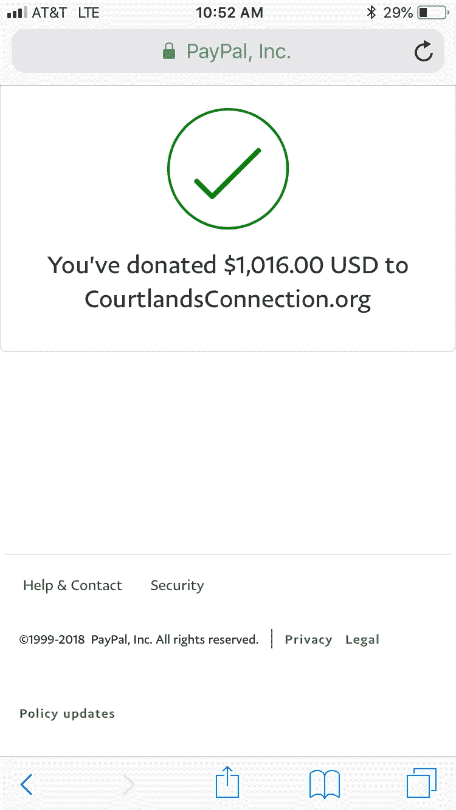

# 迈向$1，000 的升级挑战:移动 5，$1，016

> 原文：<https://medium.com/swlh/the-upcycling-challenge-towards-1-000-move-5-1-016-78b68195fb38>

We’ve done it! Please Note: I don’t think I’ve ever taken a photo with money in hand as such, and this is not a pitch for a pyramid scheme.

*升级挑战创意前奏* [*这里*](/@justinbenfaida/upcycling-the-experimental-journey-to-reach-1000-12ae9b9b53bd) *&下面:*

一个非紧急系列，从 0 美元开始，通过商品升级赚取 1000 美元。要达到这个目标需要多少步骤？**我能以多快的速度**卖掉一件不是全新的*物品？这是一个向上循环的实验，一个人的垃圾是纯粹的财富。*

**从我的升级名**的绝对 0 美元开始，我一直在寻找[craigslist.org](http://craigslist.org)的免费内容部分。一旦我产生了投资资本，我就可以购买被低估的资产，然后以更高的价格卖出。我还发现材料部分很有趣，有大理石板、厨柜和大量的瓷砖。在这次测试中，我也不打算把我的公寓变成储物者的天堂,所以可以肯定地说，未来我不会有太多的重叠销售。

# **起始利润:776 美元**

**寻找:** facebook，当地社区标签销售小组，**“办公椅”**在纽约怀特普莱恩斯，售价 50 美元。在威彻斯特合理假设的转售价格:每把椅子 90-100 美元。然而，我们以每把椅子 40 美元的价格买下了所有 6 把椅子。

There was a deal to get all 6 of them for $240, which we gracefully took considering we now had extra cash on hand and were able to gauge the desire for the chairs from responses on facebook.

This is a 5 minute drive from my apartment. Undervalued Chairs are a no brainer!

考虑到这些漂亮的设计师复制椅被低估的程度，时间在这次购买中非常重要。在我发布了对脸书接机的回复后，第二天早上公司开门的时候，我特意腾出时间去接他们。我回复后不久，就有很多人试图拿起这 6 把椅子。这正是利用 [TME 车型](/@justinbenfaida/boosting-sales-by-30-in-a-failed-bar-by-not-accepting-mediocrity-using-time-movement-426df24849b2)的完美选择。用最少的时间、动作和效率创造高投资回报。

# 距离+购买成本:1.29 美元

距离:往返 1.5 英里，1.50 美元(**我在加油站用了我的杂货店会员卡，每加仑优惠 0.10 美分！)*
**时间:**四十五分钟

# 重新刊登:“6 张胡桃木旋转办公椅——埃姆斯风格(原价 360 美元)”

在以 240 美元买了 6 把椅子后，我知道任何超过 41 美元的东西都会给我带来利润——所以让我们把目标定得更高。我打算把这些东西列在 100 美元的门槛之下，在那里贴上了 95 美元的标签，并加上了这些椅子 360 美元的原价。 ***怎么会有人抗拒交易！？*** 我还确保在文章标题中加入尽可能多的搜索词，这样任何搜索不同词的人都能找到这篇文章。

当我收到脸书的信息时，我们立刻对椅子产生了兴趣。老实说，跟进并不完全到位，**但我们在 2 周的时间里慢慢地将其中 3 把椅子搬出了我的公寓(没有双关语的意思)。我还有 3 把椅子，但我已经赚了钱，没必要急于卖掉最后几把椅子——坦率地说，它们很漂亮，我很想留着它们。 [*他们把我楼下的邻居里克逼疯了。*](/@justinbenfaida/dear-rick-im-your-new-neighbor-and-i-live-here-now-also-e0b38a9b3de0)**

## **售出:3 把椅子——285 美元
售出:野口桌——195 美元**

为了做成野口餐桌的销售，我不得不开车去布鲁克林送货。我一定要这么做吗？*没有*但是我的资金增加的快吗？*是的。如果坚持下去，我本可以在谈判桌上获得更多利益——但是等待并不总是能让你跨过终点线。*

# CourtlandsConnection.org[总计](http://courtlandsconnection.org):1016 美元

## 总时薪约为每小时 100 美元！

在这个时候完成我们的使命再合适不过了，因为科特兰在 5 月 25 日就 32 岁了。Courtland's Connection 是由 Darrel 和 Chris Smethie 创建的，他们帮助候选人在离开康复机构后重返生活轨道。

我后来在和他父亲谈过之后发现，1000 美元可以帮助那些他们认为正在努力改善生活的人在中途之家呆上 5 周。这可以让人们有时间专注于保持清醒和找工作，而不必为下周去哪里筹钱而感到压力。

## 我鼓励你敞开心扉，为下个月牺牲掉 2 杯星巴克咖啡，前往 Courtlandsconnection.org，帮助我捐款，帮助另一个处于危险中的年轻人有机会戒毒。

Woohoo! We did it!

## 在接下来的几个月里，我们将继续升级商品，并试图通过这样做创造更适宜居住的收入。我已经升级到一个 10x10 的存储单元，每月 250 美元。我们已经证明，一次做一件家具可以在一个月内创造 1，000 美元的收入，但是如果我们有一个储物单元可以一次装满多件家具，会发生什么呢？

## 订阅下面的邮件列表，我会让你了解创造额外收入的有用技巧和诀窍。我们有房地产销售要做，有书要拿，有桌子要翻，还有更多！

Want to find new legit ways to make money? Join me on the ride of high Return on Investment items and strategies.

本次升级实验的所有收益都捐赠给了非营利组织 [**考特兰连接。**](http://www.courtlandsconnection.org/vision) 科特兰的关系为寻求康复之路的个人提供经济支持，帮助他们实现梦想。[在美国，药物过量是意外死亡的主要原因，阿片类药物推动了这一流行病。](https://www.asam.org/docs/default-source/advocacy/opioid-addiction-disease-facts-figures.pdf)在基层支持恢复+清醒。考特兰是我年轻时最亲密的朋友。

## 这篇文章发表在 [The Startup](https://medium.com/swlh) 上，这是 Medium 最大的创业刊物，有 333，253+人关注。

## 在此订阅接收[我们的头条新闻](http://growthsupply.com/the-startup-newsletter/)。

