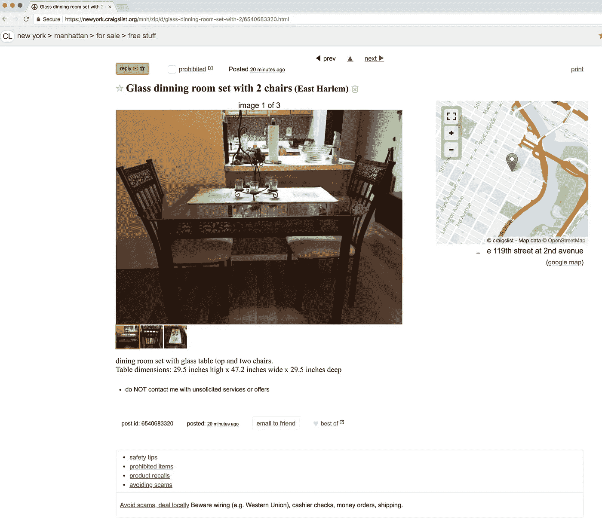
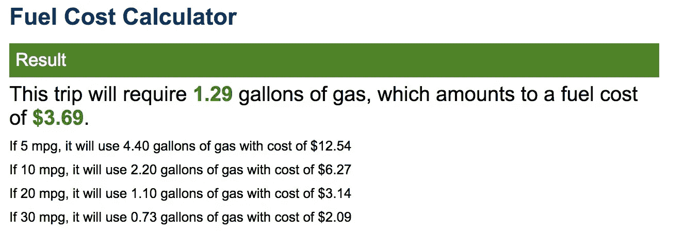
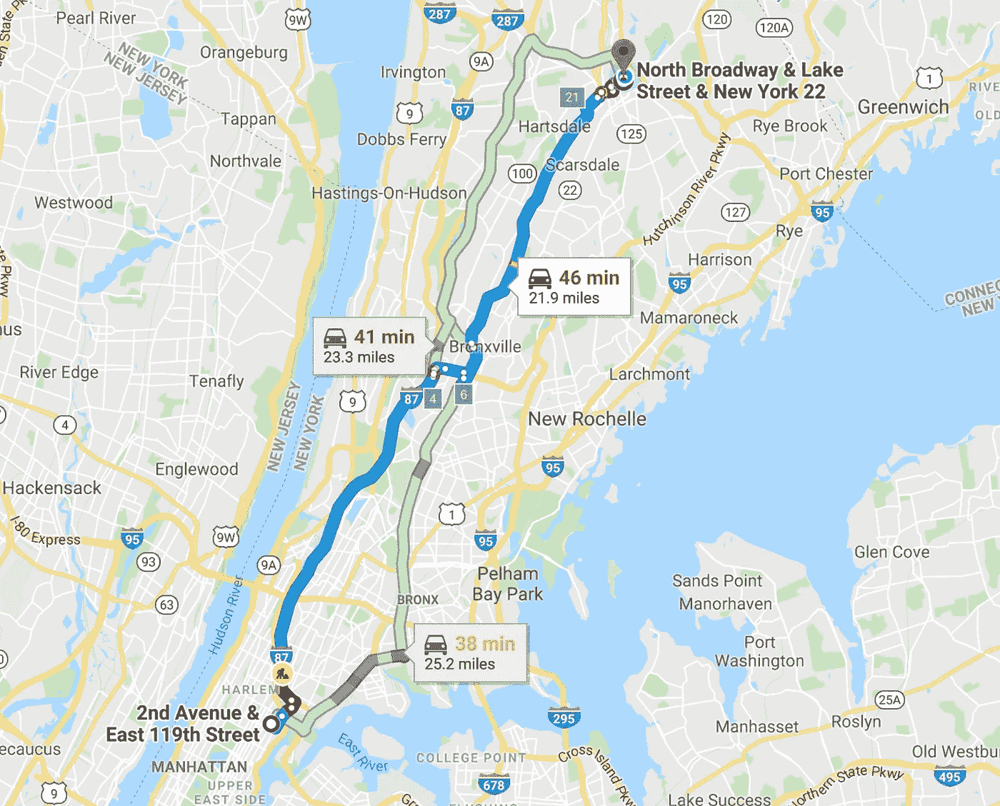
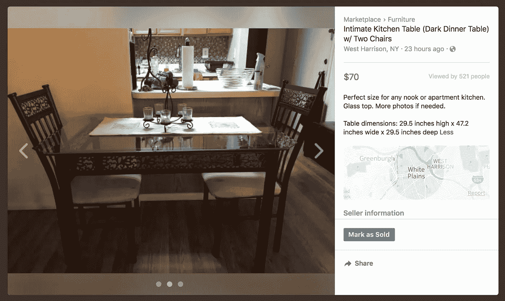
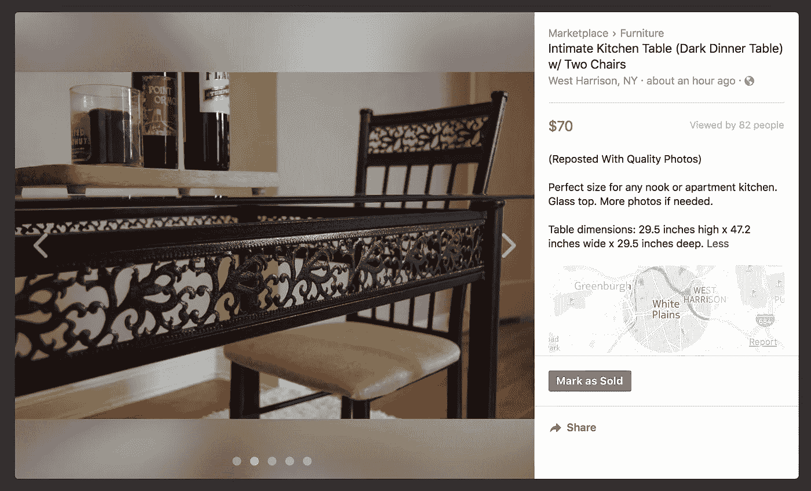

# 迈向 1000 美元的升级挑战:移动 1，$56.86

> 原文：<https://medium.com/swlh/the-upcycling-challenge-towards-1000-move-1-56-86-f3b3c0c96547>

Photo by [Matthew Henry](https://unsplash.com/@matthewhenry?utm_source=medium&utm_medium=referral)

*升级挑战创意的前奏原帖* [*此处*](/@justinbenfaida/upcycling-the-experimental-journey-to-reach-1000-12ae9b9b53bd) *&汇总如下:*

一个非紧急系列，从 0 美元开始，通过商品升级赚取 1000 美元。要达到这个目标需要多少步骤？**我能以多快的速度**卖掉一件不是全新的*物品？这是一个向上循环的实验，一个人的垃圾是纯粹的财富。*

**从我的升级名**的绝对 0 美元开始，我一直在寻找[craigslist.org](http://craigslist.org)的免费内容部分。一旦我产生了投资资本，我就可以购买被低估的资产，然后以更高的价格卖出。我还发现材料部分很有趣，有大理石板、厨柜和大量的瓷砖。在这次测试中，我也不打算把我的公寓变成储物者的天堂,所以可以肯定地说，我不应该在未来有太多的重叠销售。

# 起始利润:0 美元

**寻找:**craigslist.org/免费区，**“配有两把椅子的玻璃餐厅(东哈莱姆)”**在纽约东哈莱姆免费。在威彻斯特合理假设的转售价格:50-70 美元。

Screenshot from Craigslist find of Free Table.

# 距离+购买成本:13.14 美元

**通行费:** $5.76 带 EZ 通行证
**距离:** 22 英里 x2 = 44 英里

# 重新列表:“私密餐桌(深色餐桌)带两把椅子

在匆忙中，我立即重新列出了我的收购，上面有与最初 craiglist.org 房源完全相同的照片，计划稍后用专业照片和一个色调模糊、背景平淡但非常干净的舞台区重新展示房源。一夜之间，我收到了 4 份不同的询问，询问那张有着原始邋遢照片列表的桌子。其中一个请求是希望以 35 美元的低价出售，而且住得离我很远。另一个询问者不会开车，但住在隔壁的镇上。回应 3+4 从地球上消失了。

当机遇敲开门的时候。在我们生活的这个即时满足的世界里，销售中的利息贬值对你不利。你对某人的要求做出回应的时间越长，你完成交易的可能性就越小。

在自然光下，我和我的 DSLR 在明亮的白色地毯上拍了照片后，我重新摆放了桌子，以形成对比，并展示桌子和派对的生活。在一个小时内，我收到了旧列表 1/5 的浏览量和两个询问。我的回答基本上是，谁巩固了他们正在捡起它的方式，谁就拥有了桌子。

大约**在 facebook 的 marketplace 上发布这个列表**6 个小时后，几个城镇之外的汤米联系我拿起桌子。尽管他希望以 50 美元的提价进行交易，**考虑到浏览量和联系我的人的数量，我坚持 70 美元的价格目标**，他答应了。你的第一步是什么？

将你的电子邮件扔进我的个人列表，找出下一个翻转，它的利润/损失！喜欢我们这个项目的想法吗？—点击分享按钮，帮助它成长。

# 一步棋的当前利润:56.86 美元

本次升级实验的所有收益将捐赠给非营利组织 Courtland's Connection。 Courtland 的关系为寻求康复之路的个人提供经济支持，并帮助他们实现梦想。[药物过量是美国意外死亡的主要原因，阿片类药物推动了这一流行病。](https://www.asam.org/docs/default-source/advocacy/opioid-addiction-disease-facts-figures.pdf)在基层支持恢复+戒毒。考特兰是我年轻时最亲密的朋友。

## 这个故事发表在 [The Startup](https://medium.com/swlh) 上，这是 Medium 最大的创业刊物，拥有 310，538+人关注。

## 在这里订阅接收[我们的头条新闻](http://growthsupply.com/the-startup-newsletter/)。

