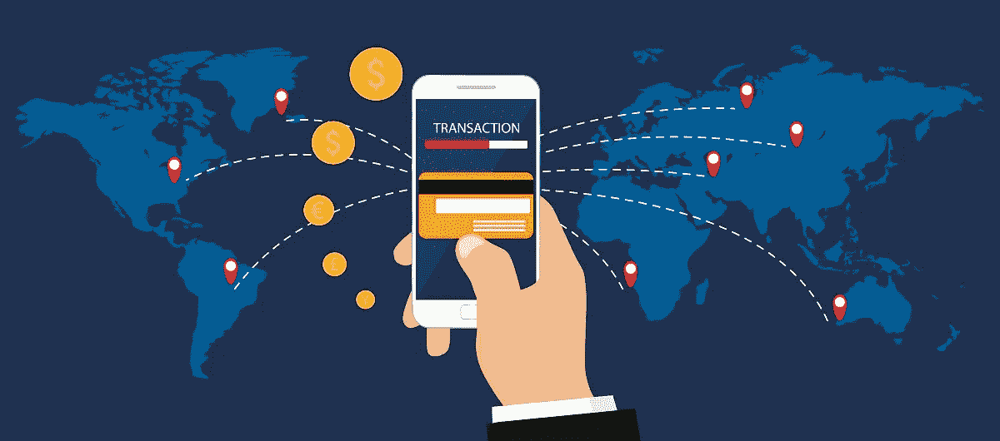
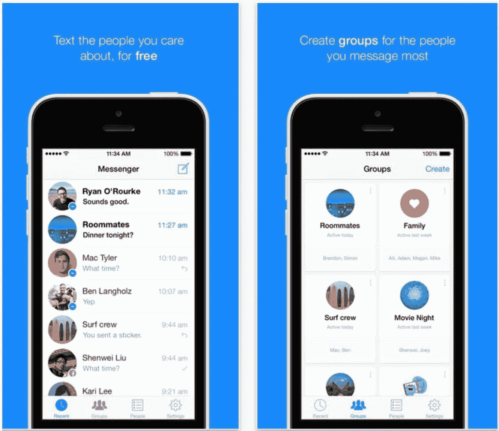
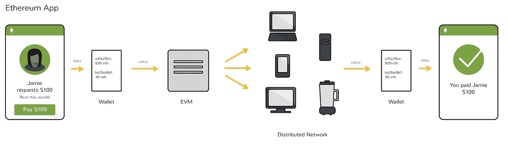
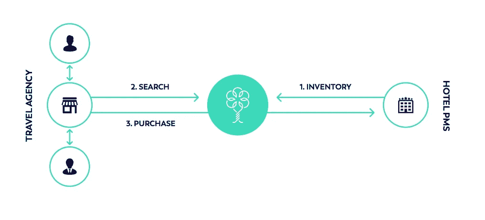
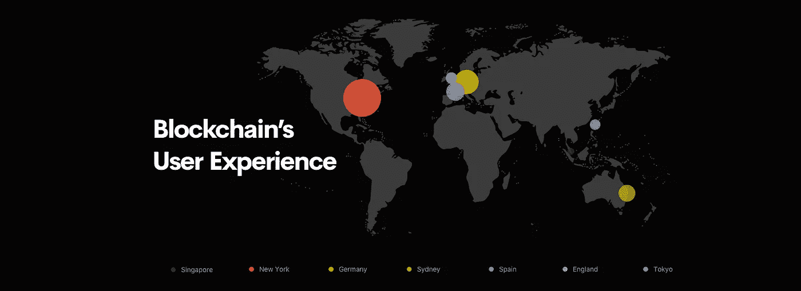

# 区块链应用的用户体验

> 原文：<https://medium.com/swlh/the-user-experience-of-blockchain-applications-ea7defc388df>

想象一下，你的朋友在脸书上给你发了一条信息……你点击这个小聊天框，直觉地，一个漂亮的键盘出现了，你甚至不需要考虑如何搜索 GIF，然后点击发送。

花一分钟想想这种可用性的力量…当你发送消息时，你有没有想过 TCP/IP 网络和 Websockets？你是否必须考虑数据库、API，确保脸书用你的凭证取回正确的用户帐户？

大公司投入了大量的资金，以确保即使是婴儿也不会在 iOS 应用程序中遇到困难。事实上，可用性已经到了如此地步，甚至连猫都在 iPads 上取得了高分。

> *“用户体验设计是在给定任何给定界面的目的和约束的情况下，塑造最令人满意的体验的工艺”*

当谈到区块链和分散应用程序的现状时，这是一个完全不同的故事。一个人必须相当精通技术才能开始使用以太坊，更不用说在网上交易和使用自己的以太了。

**区块链用户体验**

要使用大多数基于以太坊的去中心化应用，你必须通过谷歌 Chrome 安装 [Metamask](https://metamask.io) ，通过交易所购买以太，了解如何管理你的密钥以访问你的资金，挑选一个好的钱包，等等。

在网络开发中，UX 也是让我们的用户有希望以我们想要的方式使用我们的应用，而不需要太多的指导。在高级技术之上构建抽象时，这种控制粒度至关重要。

UX 设计的目标之一是在最大化最终用户可用性的同时，达到所需的抽象层次。目前，我们的工具还不够成熟，不足以构建跨越抽象层的应用程序，因此我们让用户来解决许多完全隐藏在传统应用程序中的技术细节。

当然，我们可以抽象出这些细节，把这个负担从用户身上拿走，但是这个负担落在我们工具的安全性和健壮性上，这还有很长的路要走。为了达到使用 Facebook Messenger 等应用程序感觉像是第二天性的地步，设计师和网站架构师需要对底层技术的最佳实践有足够的信心，以便将负担放回自己身上。

那么什么是短期解决方案呢？人们有哪些方法可以构建复杂的 dApps，使用他们自己的令牌和复杂的协议，同时允许外行人与之交互？

**一个解决方案:将区块链技术隐藏在抽象背后**

各种即将上市的区块链公司处理用户体验的一种方式是从客户那里尽可能多地抽象出他们的区块链的技术细节。有些人选择以 B2B 的方式使用他们的技术，很少向用户公开他们的内部信息。例如，Winding Tree 是一家使用区块链作为旅行预订公共分类账的公司，这将消除人们在网上预订行程时通常会抬高价格的中介。

Winding Tree 的模式相当简单:公司在区块链上预订和发布，客户前往旅行社，然后搜索该区块链上的可用预订，并使用专用于该分类账的唯一令牌向发布该预订的航空公司/酒店付款。客户以美元支付给代理，代理根据美元/代币汇率使用他/她自己的代币数量预订旅程。

从客户的角度来看，这种用户流与人们习惯的当前系统完全相同，在当前系统中，他们只需找到一家旅行社，用美元支付就可以获得一个好的预订，但在代理商和航空公司之间，幕后发生的事情要多得多。

在这种情况下，区块链正在解决通常需要第三方的销售流程中的一个非常关键的部分。区块链用作共享分类账，保证交易的不变性和透明性。最终用户不需要意识到这使得事情变得像以前一样简单。

**但是如果我们真的想让区块链成为我们应用程序的前端和中心呢？**

所有这些现在听起来都很棒，但是向前发展，能够将区块链技术的额外优势传递给我们的最终用户也是至关重要的。考虑到这一点，我们如何设计应用程序呢？在接下来的几年里，我们将会看到设计师为更广泛的公众采用而构建区块链系统的方式发生转变。

> *在短期内=尽可能抽象出区块链去测试分散化应用的水域*
> 
> *从长远来看=整个 UX 以区块链价值观为基础的应用。这是我们的工具有史以来第一次先进到足以让公众使用区块链应用程序来实现其固有的价值。*

从长远来看，我们希望用户清楚地了解区块链技术为他们了解和喜爱的应用提供支持的好处和安全性。分散式网络将成为如此多产品的核心，以至于无法忽视。

**构建&传递用户体验，牢记区块链的关键价值**

我这么说是什么意思？例如，如果我正在建立一个分散的赌场或赌博网站，关键是要将*公平*和*透明*的理念作为使用区块链解决这个问题的关键价值道具。我想让我的用户明白，这个赌场是公平的，这个系统绝不是针对他们的。

这将是一个主要的驱动力，让外行人对使用分散化的替代方案变得非常舒服。我们希望我们的应用程序给我们的用户足够的理由**而不是**去使用集中的互联网，并且有足够多的聪明人来解决这个问题，我们可能会比我们想象的更早到达那里。

我对 UX 在区块链应用的未来感到非常兴奋，所以请在下面留下评论，让我知道你的想法！

## 这个故事发表在 [The Startup](https://medium.com/swlh) 上，这是 Medium 最大的企业家出版物，拥有 275，365+人。

## 在这里订阅接收[我们的头条新闻](http://growthsupply.com/the-startup-newsletter/)。

