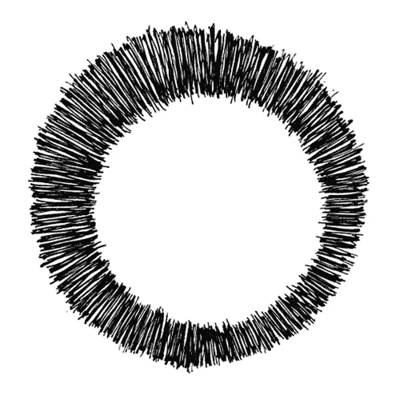
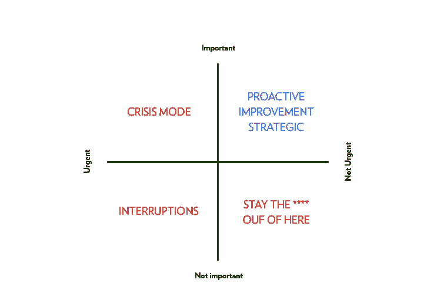
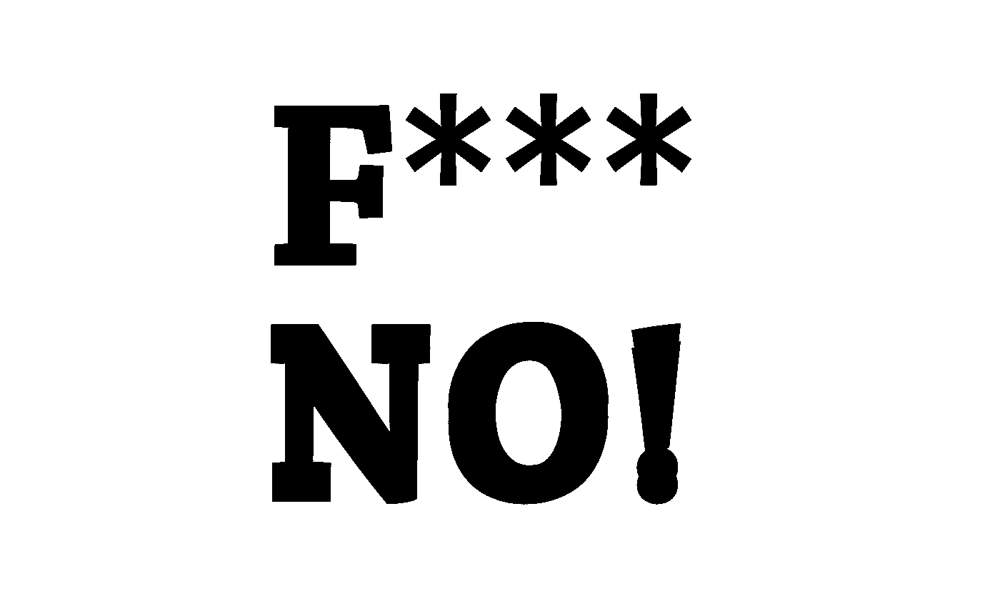

# 平庸工作的恶性循环

> 原文：<https://medium.com/swlh/the-vicious-circle-of-mediocre-work-c15e98a30798>

## 以及如何打破它

为什么有些人、有些团队、有些公司创造出杰出的工作，而有些人却似乎停留在平庸之中？为什么我们中的一些人在创造力方面出类拔萃，有更好的想法，并找到让想法实现的方法，而另一些人却没有？

这个问题在我脑海里已经有一段时间了。

对此我想得越多，我越来越相信这与个人或团队的能力关系不大，而与专注的能力关系更大。

在当今这个注意力分散的社会，专注和注意力已经成为一种罕见的货币。然而，从根本上说，注意力决定了我们的成功、失败、幸福，或许更重要的是:*我们是谁。*

## 你如何度过你的时间？

如果你起床后开始一天的工作，回复邮件或做对别人重要但对自己不重要的事情，很可能你已经开始了平庸的一天。你只是限制了你创造伟大事物的能力。

很容易承担太多的项目，写一堆电子邮件，每当别人征求你的意见时就帮助他们。它让你忙碌，感觉你被需要，你有一种完成事情的感觉。但是有多少工作时间花在了**创造** 你真正关心的事情上呢？

# 1.确定你如何花费时间的象限

斯蒂芬·柯维著名的繁忙象限就说明了这个问题。

我们大多数人认为我们在做紧急和重要的事情。具有讽刺意味的是，紧急并不等同于重要。当务之急是要做，但重要的是你能在哪些方面产生影响。毫不奇怪…

> 对别人来说很重要的事情，往往对你来说却很紧急。

我认为紧迫感是热情的人陷入平庸的首要原因。但这取决于紧急情况的类型。有限的紧迫感可以成为灵感的巨大源泉。它可以帮助我们分清轻重缓急，集中注意力，完成任务。但是一旦紧迫性成为你、你的团队或你的公司运作的默认状态，它就会无意中成为平庸工作的催化剂。

> 太多平庸的工作，太多的牺牲，以及持续缺乏自豪感，不仅会扼杀激情，还会创造出平庸的文化。它会让人放弃。

所以…

# 你兴奋什么？

你兴奋什么？很可能这不是你花了大部分时间去做的事情。我们都有责任，即使你正在创业——梦想成真——并且对提出改变世界的想法非常兴奋，你可能仍然需要不时地写那该死的投资者报告。

那可能没问题。100%专注于一个单一的任务不仅仅是一种错觉，它实际上会严重限制你保持灵活性和不断改进想法的能力。

但是有大量的研究表明，找到方法做自己喜欢的事情的人，在贡献、成长和最终成功方面表现出色。

那个故事我们已经听过好几次了，不是吗？

但是，尽管*做你爱做的事情的口号*最近获得了如此多的关注，但实现这一目标的必要牺牲却没有。

# 2.重新聚焦

保持专注并不容易。我在这方面很糟糕，不仅因为我有严重的多动症，还因为我很容易对新想法感到兴奋。

*激情的斗争，是专注的斗争。*

我们关注的核心是我们说不的能力。打破持续的紧迫感只会发生，一旦我们学会了如何说不，并开始与我们深切关注的价值观重新联系起来。我相信，这是我们脱离平庸的门票。

说不就像站在停车场试图认出你的车。那是什么颜色？红色？太好了。你的大脑会自动调整你的感知，让红色的汽车流行起来，而蓝色、灰色和黑色的汽车慢慢消失在背景中。这叫做[选择性注意](https://www.ncbi.nlm.nih.gov/pmc/articles/PMC2681259/)。这很神奇，很有效，我们应该学会如何在停车场之外让它发挥作用。

毕竟，这不是你找到你的车，而是你决定如何度过你的时间。如果不愿意让其他优先事项退居次要地位，专注就不会发生，我们就有可能重新陷入平庸的恶性循环。

# 3.继续说不

你已经熬到这里了。你一直说不，你能够抵制干扰，并开始看到你的第一个结果。恭喜你。让我们拍拍自己的背，庆祝一下那一刻。

太棒了。现在怎么办？

成功的问题在于，不管成功是大是小，它们都会让你更加难以集中注意力。我认识一些人，他们被邀请去参加会议，做了一个又一个的演讲，而同时却忽略了最初让他们登上舞台的东西。

专注需要刻意的练习和关注。我们需要培育它。我们需要集中精力。

让我们继续这样做，希望它能让我们远离可怕的循环。

# 结论

即使我们可能认为平庸的工作是可以避免的，但事实上并非如此。我们创造伟大事物的能力也依赖于我们愿意一直平庸下去。

重要的是给我们自己确保增长的工具。我认为实现这一目标的步骤非常简单。

它始于在一种持续的紧迫感中停下来工作，记住你为什么签约做你所做的事情，并把你的注意力放在你个人认为你能做出最大贡献的事情上。

你对我们这些很难集中注意力的人有什么建议吗？请分享。

希望这能引起你的共鸣。如果是的话，有些人会拍手叫好👏如果你觉得它能帮助别人打破这个循环，那就太好了。

**我们可以在** [**中**](/@azumbrunnen) **或者在** [**推特**](https://twitter.com/@azumbrunnen_) **上保持联系。**

特别感谢马特·斯托克斯对慢下来的重要性的思考。

## 这个故事发表在 [The Startup](https://medium.com/swlh) 上，这是 Medium 最大的创业刊物，拥有 273，384+人关注。

## 在这里订阅接收[我们的头条新闻](http://growthsupply.com/the-startup-newsletter/)。

