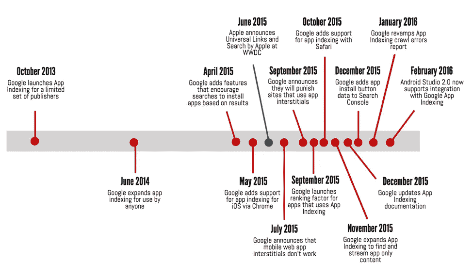

# 移动搜索之战

> 原文：<https://medium.com/swlh/the-war-for-mobile-search-a118f0e31c37>

莫比尔正在进行一场战争。一场控制最终利润边界的战争，这场战争将决定移动设备的盈利方式。这场战争是为了移动搜索，其结果还不确定。今天，移动搜索是一个充满竞争和矛盾的技术，未兑现的承诺，以及 800 磅重的大猩猩在没有任何集中监管或治理的情况下战略性地定位自己的野生景观。

随着人们在手机上花费越来越多的时间，搜索大战已经移动化，这并不奇怪。2015 年 5 月，[谷歌证实](http://searchengineland.com/its-official-google-says-more-searches-now-on-mobile-than-on-desktop-220369)移动搜索查询超过桌面查询。所有迹象表明，这一趋势将会继续— [comScore 最近发布了一份报告](https://www.comscore.com/Insights/Presentations-and-Whitepapers/2015/2015-US-Digital-Future-in-Focus),表明移动搜索查询将会以每年大约 20%的速度增长。

## *苹果控制搜索价值*

显然，搜索的未来存在于移动设备上。然而，移动并不是一个单一的平台。它被两大巨头瓜分:谷歌的 Android OS 和苹果的 iOS。这条分界线就是战争的分界线。Android 显然在全球用户群中占据主导地位，与 iOS 相比，Android 的安装设备数量大约是 iOS 的 4 倍:Android 有近 20 亿部智能手机在流通，而 iOS 大约有 4.5 亿部。但这并不是故事的结尾，因为不是所有的用户都值同样的钱。

据报道，谷歌移动搜索收入的 75%来自 iOS。鉴于 Android 拥有 4 倍于 iOS 的用户群，我们可以计算出，就广告支出而言，iOS 用户的价值是 Android 用户的 10 倍。到目前为止，谷歌吸引更多有价值用户使用安卓系统的尝试都失败了。如果谷歌失去了通过搜索服务向苹果用户做广告的能力，他们将失去最有价值的移动收入来源。

谷歌意识到了这一点，并付费拥有了 iOS 生态系统中最重要的搜索栏:Safari 默认搜索。根据*甲骨文诉谷歌*一案中[泄露的文件](http://www.bloomberg.com/news/articles/2016-01-22/google-paid-apple-1-billion-to-keep-search-bar-on-iphone)显示，仅在 2014 年，这对谷歌来说就价值 1B 美元。谷歌目前签约向苹果提供移动搜索服务。最终，苹果保留了控制权，无论是通过选择退出条款还是年度续约谈判。

## *苹果决定拥有搜索引擎*

苹果有在自己的平台上复制成功商业模式的历史。他们把 App Store 当做培养皿，让他们观察有效的业务和模式。当他们看到一个成功的应用程序产品时，他们会推出一个功能(通常在 iOS 更新中)，将该功能纳入更广泛的 iOS 平台。

自首次推出 iOS 以来，苹果一直在重复这种模式:

1.  谷歌地图。RIP iOS 6(算是吧)。
2.  手电筒应用程序。RIP iOS 7。
3.  健身追踪应用。RIP iOS 8。
4.  新闻读者。RIP iOS 9。
5.  Evernote。RIP iOS 9。
6.  *谷歌搜索。RIP iOS 10(最有可能)。*

在 iOS 9 中，苹果正式宣布他们正在全力推进网络和应用搜索。他们的搜索产品范围目前完全局限于 Spotlight 搜索，甚至更狭隘地局限于应用实体搜索:手机应用中已经存在的特定内容。然而，有线索表明了苹果搜索路线图的范围。他们的[开发者文档](https://developer.apple.com/library/ios/documentation/General/Conceptual/AppSearch/WebContent.html#//apple_ref/doc/uid/TP40016308-CH8-SW1)描述了如何为 Applebot 标记一个网站，并通过[公共索引](https://developer.apple.com/library/ios/documentation/Foundation/Reference/NSUserActivity_Class/index.html#//apple_ref/occ/instp/NSUserActivity/eligibleForPublicIndexing)引用未来的“云搜索”，苹果将在那里维护一个用于搜索的网络和应用内容的中央索引。

很明显，苹果正在建立自己的网络和应用内容搜索引擎，为 Spotlight 提供动力。一旦做到这一点，就没有什么可以阻止他们将这一功能直接移植到 Safari 中，并控制 iOS 中的主要搜索输入。如果谷歌不这么认为，那就太天真了。

## *来自前线的更新*

由于我们非常接近这一领域，与移动搜索提供商建立集成以吸引应用程序进入[分支平台](https://branch.io?utm_campaign=Q116-WarOnMobileSearch-Blog&utm_source=Medium)，我们已经观察这些动态发展了一段时间。在过去的 6 个月里，我们已经看到苹果和谷歌围绕搜索，尤其是应用搜索展开了激烈的竞争。观察起来很神奇。

这一切都始于苹果在 WWDC 发布 iOS 9 测试版，他们在那里公布了他们的搜索计划。这显然将谷歌从舒适的睡眠中唤醒，因为山景城很快就出现了一系列围绕移动搜索、间隙、应用索引和应用流媒体的活动。在下面的图表中，你可以看到在苹果发布 WWDC 公告后，谷歌的营销活动有所增加。

Google races to outmaneuver Apple ahead of future mobile search product launches.

苹果一表示要进军搜索领域，谷歌就加倍投资其移动搜索产品。除了对公司进行部分重组，以使核心搜索业务的[优势能够明显地展现给投资者，谷歌还推出了一系列与移动搜索相关的产品:](http://www.nytimes.com/2015/08/11/technology/google-alphabet-restructuring.html?_r=0)

*   应用链接(安卓版的苹果通用链接)
*   应用流(已宣布并刚刚上线)
*   一个改进和重建的应用程序索引计划，在搜索中显示应用程序
*   为谷歌应用程序索引抓取苹果通用链接
*   显著改进的搜索控制台和应用索引报告
*   改进的 Android Studio(开发软件)可帮助开发人员整合应用程序索引

为了让谷歌在 iOS 上竞争，他们需要能够提供与苹果同等水平的应用程序*和*网页索引。不幸的是，苹果在应用程序索引方面有明显的优势，因为他们控制着更有价值的操作系统和核心应用程序框架。这意味着谷歌将需要做更多的工作，以确保应用程序数据以相关的方式被索引和呈现，以保持平等。在这种情况下，他们处于劣势。

## *我们对未来有什么期待*

有这么多的利害关系，双方都在不断试图智胜对方。无论苹果和谷歌计划了什么样的长期路线图，都将成为他们赢得空间所需的游击战术的次要角色。对于开发人员来说，这意味着不断的特性发布、不经宣布的发布和不断变化的需求。因此，试图利用搜索来推动移动应用的企业不得不面对后果。

最终的战场将是 Safari 搜索栏。在可预见的未来，谁拥有这块地产，谁就将控制移动搜索及其收入机会。2016 年是谷歌证明它仍然与移动搜索的未来相关的一年，它可以从保持对 Safari 搜索栏的控制开始。

这是一个关键时刻。

*特别感谢 Adena Hefets* *对本文的贡献。*