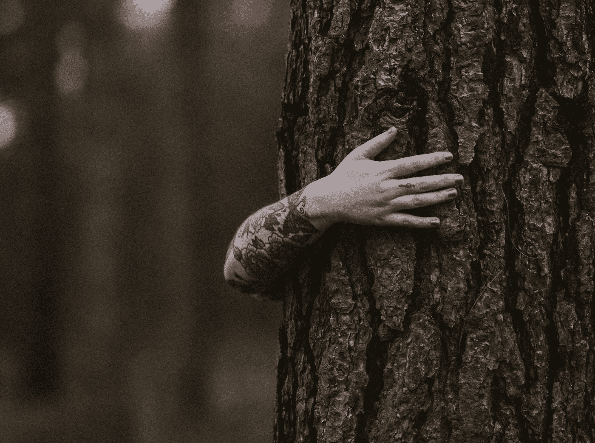

# 衰老的怪异之处

> 原文：<https://medium.com/swlh/the-weirdness-of-aging-7e636ee975d6>

[Source](https://unsplash.com/photos/6uYZHJoXrn8)

随着白天越来越短，我们每个人似乎都有反思的冲动。

在这种年终魔咒的影响下，我突然意识到我已经进入了 20 多岁的后半期，并且第一次赚了一点钱。事实上，我觉得我——等着瞧——正在变成一个‘成年人’,不管那意味着什么。

这种感觉对我来说是全新的体验。因为现在是一年中的这个时候，我…