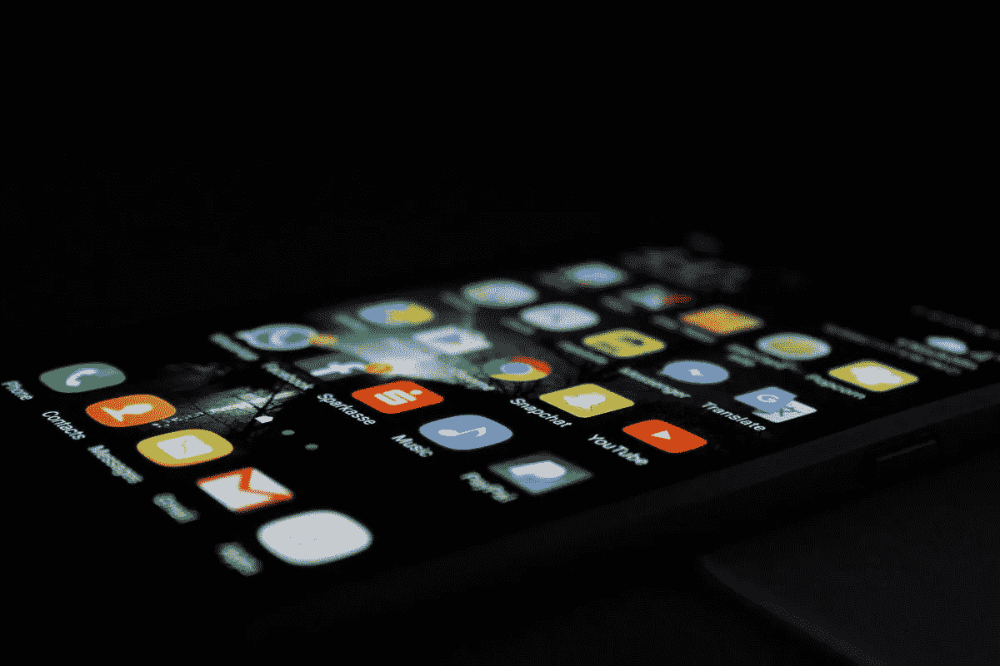
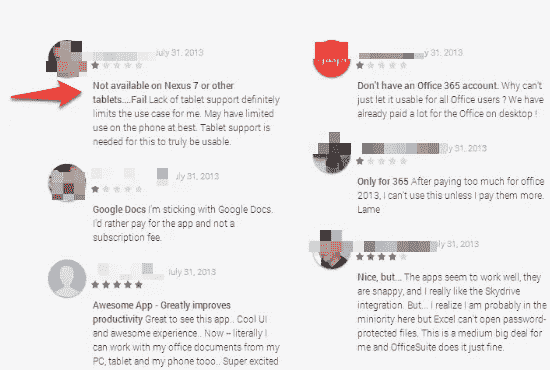
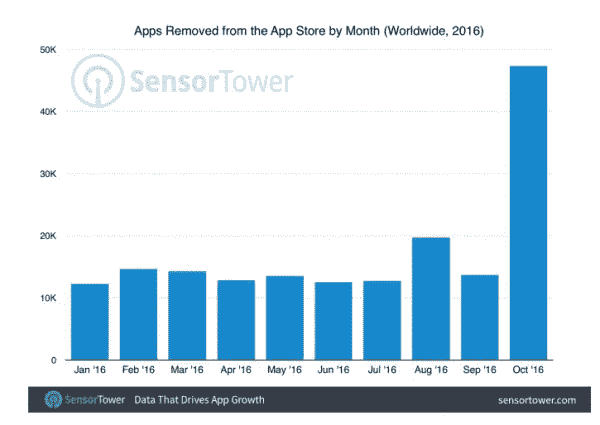
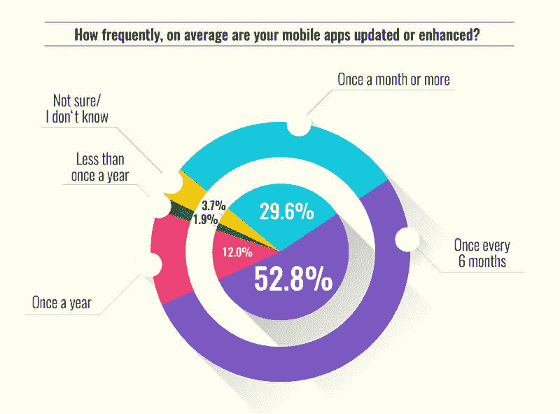

# 移动应用程序维护的内容、原因和方式

> 原文：<https://medium.com/swlh/the-what-why-and-how-of-mobile-app-maintenance-89ae20ff4890>

Originally published on [http://www.appsterhq.com](http://www.appsterhq.com/?utm_source=CP&utm_medium=Medium)/

在经历了几个月的应用开发生命周期后，你的应用现在已经在应用商店上线了。

你还通过[优化你的应用商店](http://www.appsterhq.com/blog/app-store-optimization)列表，让你的应用出现在搜索结果的顶部，获得更多下载，从而对你有利。

但是一个应用程序并不是按照“设置并忘记”的原则运行的。就像汽车一样，你的应用程序需要不断的维护和保养，以满足人们的期望。如果你没有持续的维护，你的应用会开始失去用户，排名也会下降。

## 为什么要关心 app 维护？

如果您的应用程序是为外部用户设计的，那么在应用程序发布后的几个月内会发生变化并影响应用程序性能的一些变量包括:

*   **硬件:**随着新的移动设备的发布，过时的应用程序可能无法像预期的那样工作。
*   **操作系统:**每年都会看到 iOS 和 Android 版本的更新，应用程序也需要更新，以便与新版本兼容。
*   **编程语言:**应用程序也必须根据编程语言的变化进行更新(Objective C 到 Swift，Java 到 HTML5)。
*   **风格和设计:**在苹果和安卓都采用材质设计之前，移动 UI 曾经遵循 skeuomorphic 设计原则。这意味着所有的应用程序也必须更新它们的界面。
*   **库:**大多数应用程序使用第三方库和经常变化的依赖项。除非更新，否则这些应用程序将被破坏。
*   **使用模式:**随着你的应用成熟，你的用户群也将成熟，用户界面可能需要刷新以反映这些变化。
*   **基础设施:**如果应用托管的基础设施发生变化(自托管至 AWS)，您必须更新应用。
*   **安全漏洞:**app 随时可能受到安全漏洞的影响，你必须更新 app 才能修复漏洞。

虽然没有关于更新频率的固定规则，但用户会注意到一个应用程序超过 6 个月没有更新，这将反映在糟糕的评级和评论中。

除了用户投诉，如果你想让你的应用程序在应用程序商店中保持上市，你应该经常更新你的应用程序。去年九月，苹果关闭了近 50000 个过时或废弃的应用程序。

## 应用程序维护的成本

既然你知道了忽视应用程序更新过程的影响，你需要评估你的成本。

大多数应用程序维护合同都是按年签订的。虽然应用程序的维护成本取决于应用程序的类型和复杂性，但有一些硬数字可以用作基线。

根据 Forrester 的一项调查，在两年的时间里，50000-150000 美元的平均应用程序开发成本仅占总成本的 35%。

更新的数量也偏高:[另一项调查](http://www.anypresence.com/blog/2013/07/11/state-enterprise-mobile-readiness-2013/)发现，几乎 30%的应用开发者每个月都会更新他们的应用。

您可以将应用维护成本细分为以下几项:

**1)托管成本:**你的应用程序的后端可能会托管在第三方云服务器上，比如 AWS 或微软 Azure。根据用户数量或媒体消费的不同，你的托管费用很容易达到每月几千甚至几万美元。

这些成本不包括创建和维护后端的人力成本，随着应用的扩展，这一成本可能会很高。

**2)监控和崩溃分析:**你将需要应用分析工具来监控使用模式，这将有助于你改善应用内体验。你还需要投资购买能够实时向你发送事故报告的工具。

这些工具有些是免费的，有些是付费的。虽然该工具的成本不会让你倾家荡产，但你必须投资于分析师和其他专家，他们将负责建立用户渠道并分析原始数据以获得商业见解。

**3) App store 优化:**和 SEO 一样，App store 优化是一个持续不断的努力。在搜索正确的关键词、A/B 测试标题和描述、回答评论、记录反馈、随着功能变化上传新的截图/视频、运行搜索广告、添加变更日志等过程中，你必须花费大量时间来更新你的应用商店列表。

**4)许可证:**许多应用程序将使用授权技术构建，虽然一些许可证可以终身购买，但其他许可证需要每年更新。

在设置应用维护预算时，您应该考虑许可成本。这样做的一个好处是，它是可预测的，如果你在应用程序开发阶段做了尽职调查，你就不会受到高额账单的打击。

这些成本虽然很高，但远远低于应用上线后你需要投入的营销和推广费用。

您应该考虑其成本的一些活动包括:

*   内容营销
*   应用内内容创建
*   脸书广告
*   Adwords 广告
*   一对
*   微型网站/登录页面
*   电子邮件
*   客座博客
*   产品或演示视频
*   竞赛和赠品
*   社交媒体营销
*   应用内广告
*   应用商店广告

由于免费工具的激增，你的营销预算将主要花在雇佣自由职业者或制作工资单上，以及广告支出上。

在广告支出方面，Fiksu [在 2015 年 12 月计算了一些数字](http://www.mobyaffiliates.com/blog/how-much-does-it-really-cost-to-promote-your-app/)，发现将一款 iOS 应用推入前 25 名所需的金额是:

*   **美国 20 万美元**
*   **加拿大 15，000 美元**
*   **$65，000** 德国
*   **:英国为 45，000 美元**
*   **法国的 3 万美元**

## 授予应用维护合同的标准

因为你需要在应用维护阶段投入大量资金，所以在签约之前花些时间审查服务提供商是很重要的。

包括 Appster 在内的大多数应用程序开发机构都提供应用程序维护合同。如果你已经将你的应用程序开发外包给了一家代理公司，你应该坚持使用他们，而不是去找第三方，即使前期成本更高。

这是因为对于有许多活动部件的复杂应用程序，第三方开发者将花费大量时间来理解应用程序的架构。这个发现阶段需要花费金钱，如果同一个开发人员也负责维护，您可以节省这笔钱。

除此之外，在选择应用维护开发商时，您应该考虑的其他因素包括:

*   平均响应时间
*   维护计划的类型:基于事件或基于时间
*   保留和管理备份以防数据丢失的能力
*   内部维护，或分包给第三方
*   电话或聊天支持(最好是专门的客户经理)

选择一个响应时间短的开发人员，他提供基于时间的维护计划，并且具有管理关键数据备份的经验。

应用程序越复杂，从事该项目的开发人员熟悉技术和业务逻辑就越重要，这在外包开发人员中通常是看不到的。

最后，实时电话或聊天支持是必须的，即使你必须支付额外费用:当营销活动开始发送大量流量时，你不希望你的应用程序离线几个小时。

如果恶意黑客控制了您的资产或发起了 DoS 攻击，您也不希望措手不及。

## 结论

应用程序维护在很大程度上是为了让你的应用程序保持更新。当你获得用户和反馈时，你需要将这些整合到 bug 修复和特色广告中。

定期维护你的应用程序也能让你获得苹果和谷歌的青睐，因为这表明你对用户的响应和承诺。应用程序商店奖励频繁更新的应用程序，排名越高，应用程序下载量越高，每次安装的成本越低，收入越高。

尽管应用程序维护听起来前期成本很高，但这是确保你在应用程序开发阶段的投资得到回报的唯一方法。

> *原载于*【http://www.appsterhq.com/】

******