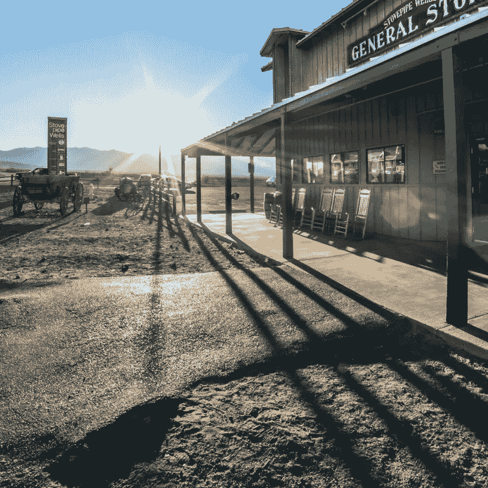

# 写作的狂野西部和成功的先锋心态

> 原文：<https://medium.com/swlh/the-wild-west-of-writing-and-the-pioneer-mindset-to-succeed-b2f7ceb3d46f>

对于那些决定写作的人来说，写作平台和写作世界就像现在一样，感觉就像是蛮荒的西部。

传统出版的看门人不再是将我们的书推向世界的唯一途径。有无数的机会，自助出版和社会媒体营销策略，一个作家可以利用或不需要大量的财务投资。这也是越来越多的作家准备直言不讳，写他们的书，并把它们推向世界的原因。

以前，数百万人因为看门人的原因而无法发表他们的作品。今天，这个决定取决于作者:是继续努力还是放弃。每个作家站在他们写作的欲望和天赋的燃烧的灌木丛前，做出选择。

当今写作界的狂野西部的问题在于，虽然有免费的机会，但还是要做出牺牲。就像定居者告别他们的大家庭，登上船只，驶向未知世界一样，作家们面临着同样的决定。

**要成为一名成功的作家，我们不能继续我们旧的生活方式。优先事项需要重新安排，写作空间需要创造并保持神圣，学习曲线需要拥抱。如果我们不小心的话，我们会把更容易出版的承诺理解为不需要牺牲或大量的努力。**

当我们步入写作世界时，我们被邀请有意识地投资我们的资源，推销我们自己和我们的书，并建立一个企业来维持和增加我们创造更多艺术的能力。**写作成功有许多因素，但不要让这些因素使你泄气或气馁。**

不要把我们自己和那些更远的人比较，庆祝他们的成功，并且知道你也有可能成功。

在写作世界的蛮荒西部:深呼吸，然后拥抱机遇和风险的冒险。

有一个选择:

*   你会如何看待时间、精力和金钱的牺牲？
*   值得吗？
*   在这个未知的领域，你会是谁？
*   作为一名作家，你想成为谁？

每一个作家都决定他们是否会被荒野压垮，或者他们是否会拥抱它，以及成本，战略性地创造一个成功的计划。

当我们把写作视为一次冒险时，我们看到了邀请和机遇，而以前我们只看到了牺牲和负担。

## 这个故事发表在 [The Startup](https://medium.com/swlh) 上，这是 Medium 最大的创业刊物，拥有 327，829+人关注。

## 在此订阅接收[我们的头条新闻](http://growthsupply.com/the-startup-newsletter/)。

