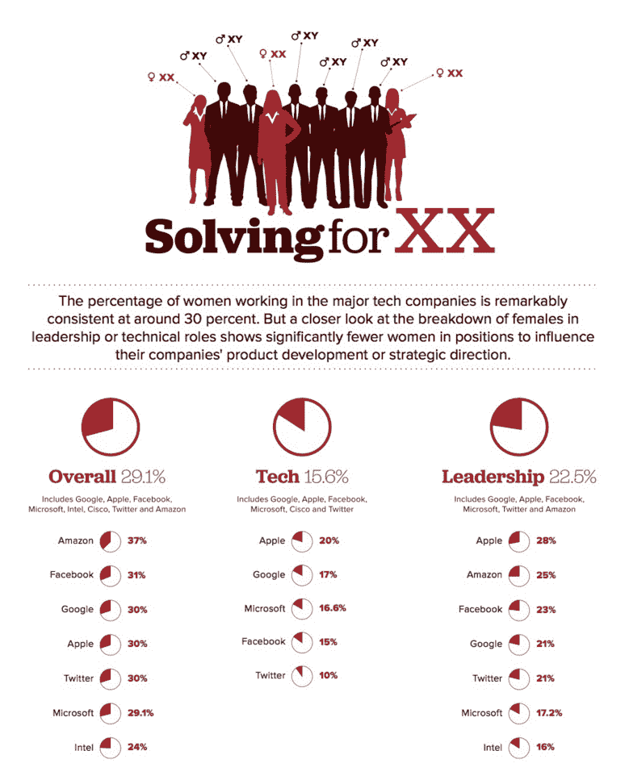

# “科技女性”会议需要更多男性

> 原文：<https://medium.com/swlh/the-women-in-tech-convo-needs-more-men-2be34495d0d1>

呃。那个标题！我写了它，它让我愤怒。就像我们是危难中的少女，等待我们穿着闪亮盔甲的骑士来拯救我们。

唉，是真的。

事情是这样的:事情变化得不够快。简而言之，高层没有足够多的女性来创造有意义的变化。我们还没有突破 30%的大关。甚至有迹象表明我们在退步。对话无处不在，变化却不在。

[http://www.cnet.com/news/women-in-tech-the-numbers-dont-add-up/](http://www.cnet.com/news/women-in-tech-the-numbers-dont-add-up/)

我清楚地记得有一次和一位刚参加完女性科技活动的 CEO 开会，他坐下来说“你知道女性科技的问题是什么吗？对话中没有任何男性。我去参加了这个活动，100 名女性中有 3 名男性。”

我的外部反应是礼貌地点头，这样我就不会丢了工作。

我的内心反应是这样的:

他妈的，他是对的。

男人:我们需要你的帮助。我们需要你理解。我们需要你的关心。我们需要你采取行动，创造我们无法做到的改变；够快了。

我参加过很多活动。马萨诸塞州妇女大会是非凡的，我在[发表了演讲，在](http://www.launchsquad.com/blog/women-tech-story-slam-hosted-launchsquad-boston/)[举办了创造家庭友好型技术的研讨会，我为](/@JessIandiorio/how-to-build-a-family-friendly-startup-c0917079503c#.mwo2rain2) [VentureBeat](http://venturebeat.com/2016/01/03/its-time-for-family-friendly-tech-what-zuckerberg-got-right-and-mayer-got-wrong/) 撰稿，我正在撰写关于[媒体的政策](/swlh/oh-sh-t-your-top-female-talent-is-pregnant-7625cbc0a755#.kd10lk43c)，我正在指导三个女子团队参加[技术创新挑战](http://www.technovationchallenge.org/?page=2)。

兄弟们，我需要你们站出来。我有幸在一家科技公司工作，公司的创始人都非常关注这一点，但大多数女性没有。

我努力让自己保持对困扰女性晋升和留在科技行业的问题的关注。这开始让人觉得徒劳无功。

## 我对女士们的请求

我参加过不允许男性参加的女性团体。女士们——这没用。你可能有一个安全的空间谈论事情，而不用担心被打断，但这只是一个发泄的地方。这不是一个创造变化的地方。出去聚餐发泄，把男人拉进有组织的团体。

尽可能多的让男人加入进来。请他们大声说出来——因为你知道吗？当他们走进满是女性的房间，成为少数时，他们会变得害羞。让他们安全地提出问题和贡献想法。我知道很多男人很想帮忙，但不知道如何进入对话，或者害怕女人不希望他们在场。

我遇到了一个悲伤的故事，一个男人将他职业生涯的很大一部分奉献给了帮助科技领域的女性。Vivek Wadhwa 是斯坦福大学 Rock 公司治理中心的研究员，杜克大学创业和研究商业化中心的研究主任，以及奇点大学的杰出研究员。

Vivek 为支持科技领域的女性做出了巨大贡献——早在 2006 年就通过研究和公开演讲提高了这个问题的知名度，这使他在很多男性中相当不受欢迎。他继续研究、写作和演讲。

直到他在 2016 年初的一次播客中被女性毫不客气地拆穿。

现在，他出来了。他为 VentureBeat 撰写了“[为什么我要退出关于科技领域女性的辩论](http://venturebeat.com/2015/02/23/why-i-am-stepping-out-of-the-debate-on-women-in-technology/)”。他不再是谈话的一部分。我联系他，请他重新考虑。他不会的，我明白。

我们可以和男人们一起主导这场对话。我们不需要把它们切掉。事实上，如果我们把男人排除在外，我们会保持在 30%。

## 我给男人们的建议

我知道你可能想帮忙，但不知道怎么帮。这里有一些想法:

1.  **要明白这不仅仅是政策问题。花些时间教育自己。不缺乏可用的文章(我把我最喜欢的放在帖子的底部)。这些解释了从公然的性别歧视到性别偏见和许多其他微妙的问题。如果你提高了对微妙之处和偏见的认识，你的操作就会不同。**
2.  如果你的妻子也工作，那就多在家帮忙。如果你有孩子，分开接送。拆分 dr 的预约。谁挣得更多并不重要——分担养育子女的责任。如果你把她从 100%的儿童管理工作中解放出来，她就能更多地参与工作。你将成为社会变革的一部分，我们需要看到更多的男性参与其中，抽出时间来养育子女。
3.  和你公司的女性交往。呃。不是那边。丢人！我的意思是不要仅仅和男人建立友谊。你可以和女人一起去喝咖啡，或者吃午餐，建立友谊。问他们是否奋斗，为什么奋斗，如何奋斗。从个人层面去了解它，这比阅读一篇文章更有影响力。它会击中要害，你会感觉到更多的个人投入帮助。
4.  **告诉你的(男性)朋友。**当你发现自己处于许多男性专属的场景中时——无论是打高尔夫球、喝啤酒、开会，还是其他——谈论它。你认为你的公司面临挑战吗？你认为你应该做些什么？

我敦促你进入对话，努力理解，并提出改变。你的妻子、姐妹和女儿需要你。

感谢阅读。想聊天吗？给我发邮件。【jess@drift.com 

PS。如果你喜欢这篇文章，你应该看看我们在[漂移](http://drift.com/?utm_source=medium&utm_source=blog&utm_campaign=women-in-tech)做了什么。

## 以下是我对女性与工作研究和新闻的“最大收获”:

**商界女性:**

雪莉·桑德伯格/亚当·格兰特纽约时报系列:

*   [当谈论工作中的偏见适得其反时:](http://www.nytimes.com/2014/12/07/opinion/sunday/adam-grant-and-sheryl-sandberg-on-discrimination-at-work.html)讨论性别偏见的存在，以及为必要的改变而斗争和处处被视为犯规的走钢丝有多紧张。
*   [女上司说话](http://www.nytimes.com/2015/01/11/opinion/sunday/speaking-while-female.html):解决不说话和说话太咄咄逼人以及拒绝男性上司的双重困境。
*   [首席执行官夫人，给我一杯咖啡](http://www.nytimes.com/2015/02/08/opinion/sunday/sheryl-sandberg-and-adam-grant-on-women-doing-office-housework.html):谈论女性如何总是被期待去做非战略性的必要任务——喝咖啡、办公室聚会策划等。(他们称之为“办公室家务”)

**领导层中的女性:**

*   [一个由女性经营的更美好的世界](http://www.wsj.com/articles/a-better-world-run-by-women-1425657910):打破了女性在文化、教养和生理上的差异，这些差异让我们拥有越来越有价值的不同技能和方法。

怀孕/母亲+工作:

*   美国的产假政策正在伤害职业女性:展示了美国平均产假政策的糟糕现实——88%的女性根本没有得到任何补偿。我很幸运能为一家公司工作，这家公司有非常可靠的政策和福利，比如专门的哺乳室。
*   [一项不同寻常的新产假政策](http://www.washingtonpost.com/blogs/on-leadership/wp/2015/03/06/an-unusual-new-policy-for-working-mothers/):我会称之为“革命性的”——4 个月带薪，2 个月转为兼职，挣全职工资。美国生育政策不可能实现的梦想。
*   [女公司总裁:对不起所有和我一起工作过的母亲](http://fortune.com/2015/03/03/female-company-president-im-sorry-to-all-the-mothers-i-used-to-work-with/):谈论一种普遍的误解，即职业母亲没有那么敬业，也没有强烈的职业道德，这反过来造成了不公平的待遇，以及基于这种误解对非母亲的偏见。

**改变行为的实用建议:**

*   代替抱歉要说的 5 件事:让我们面对现实吧，女人总是说“抱歉”……而男人很少说。它延续了我们屈从的信念。
*   [如何在会议中不被“打断”](http://time.com/3666135/sheryl-sandberg-talking-while-female-manterruptions/)。信心差距很大，当许多女性试图表达自己的想法时，她们会遭到男性同行的打断，或者通常被解雇。虽然我经历过很多次，我的自然反应是生气，重新挖掘，下次带着我的想法更强大地回来，但许多女性无法从被解雇中恢复过来，无法再次尝试。