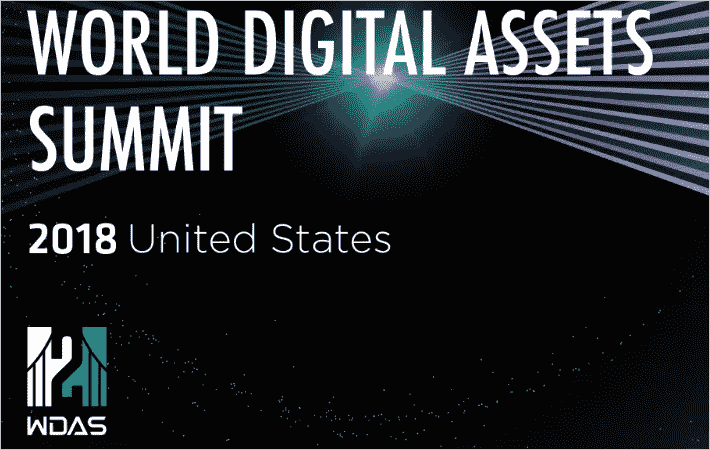
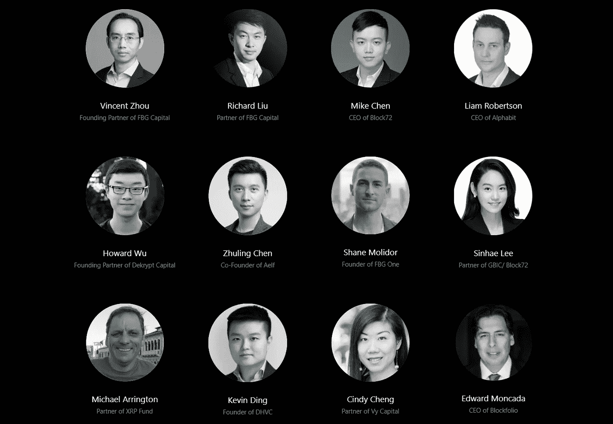

# 世界数字资产峰会(WDAS)将于 12 月 9 日至 11 日在三藩市举行

> 原文：<https://medium.com/swlh/the-world-digital-assets-summit-wdas-will-take-place-in-san-francisco-on-9th-11th-december-5e9551584fff>

今年12 月 9 日-11 日，三藩市凯悦酒店将成为 2018 年世界数字资产峰会(WDAS)的举办地。在为期 3 天的活动中，重点将是展示区块链空间内最前沿和最具前瞻性的趋势、技术和项目。

WDAS 的使命是通过汇集思想领袖、教育家、立法者和爱好者，以及将创新世界与现实生活应用相结合，探索区块链产业的潜力。因此，如果您在旧金山附近，并且希望与行业领袖、投资者、开发商和区块链爱好者交流，请务必参加此次活动。

旧金山 WDAS 2018 将包括各种活动，例如:

-欢迎招待会

-10 多次主题演讲和炉边谈话

-与全球行业领袖进行超过 15 场小组讨论

-网络和教育讲习班

# **演讲者**

WDAS 2018 将有许多来自区块链行业的知名演讲者。 [WDAS 网站](https://wdas.world/speaker.html)上的名单会定期更新，但以下发言人已经确定。

突出一些演讲者。

*   周知方是 FBG 资本的首席执行官。他是区块链业界备受尊敬的成员。FBG 资本投资了各种高调的区块链和加密货币项目，如 Aelf、Aergo、Mainframe 和 Zilliqa。
*   Mike Chen 是咨询公司 Block72 的首席执行官，该公司已经与一些最知名的加密货币项目合作，如 Aelf、Bitmax、EximChain 和 WePower。
*   **利亚姆·罗伯逊**是 Alphabit 数字货币基金的 CEO。
*   **陈祝岭**，是区块链项目 Aelf 的联合创始人，该项目是一个分散式云计算区块链网络。
*   **迈克尔·阿灵顿**为 XRP 基金合伙人
*   **爱德华·蒙卡达**是比特币和加密货币投资组合管理应用 Blockfolio 的首席执行官。

# **现已售票**

要加入 WDAS 并成为这一独家活动的一部分，请立即购买您的门票。你可以在网上购买普通票或贵宾票。接受比特币或以太坊支付，也可以用万事达卡、Visa Amex 或支付宝支付。

该活动将于 2018 年 12 月 9 日至 11 日在旧金山凯悦酒店举行。

## **WDAS 活动官方渠道:**

*   网址: [https://wdas.world](https://wdas.world)
*   推特:【https://twitter.com/wdas2018 

如果您喜欢我的文章并希望了解区块链和加密货币项目，请订阅我的频道: [Medium](/@cultcrypto) 、 [Twitter](https://twitter.com/CryptoShowdown) 和 [Steemit](https://steemit.com/@cryptoshowdown) 。也可以看我在 [LinkedIn](https://www.linkedin.com/in/donjohanson/) 上的文章。

如果你对本文有任何疑问，请在下方评论区评论。谢谢大家！

**密码摊牌**

## 这篇文章发表在 [The Startup](https://medium.com/swlh) 上，这是 Medium 最大的创业刊物，拥有+ 380，756 名读者。

## 在这里订阅接收[我们的头条新闻](http://growthsupply.com/the-startup-newsletter/)。

