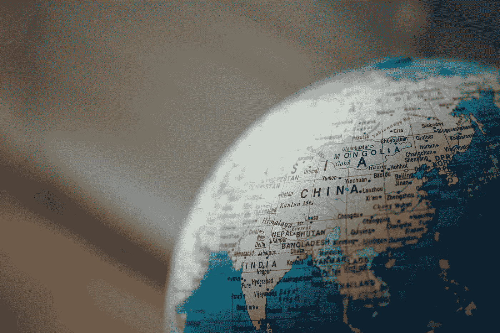

# 世界不是硅谷

> 原文：<https://medium.com/swlh/the-world-is-not-silicon-valley-e1fc4eceac9e>

## 在这里起作用的并不总是在其他地方起作用

Photo by [chuttersnap](https://unsplash.com/photos/aku7Zlj_x_o?utm_source=unsplash&utm_medium=referral&utm_content=creditCopyText) on [Unsplash](https://unsplash.com/?utm_source=unsplash&utm_medium=referral&utm_content=creditCopyText)

“硅谷方式”在国外市场的适应性如何？

嗯，这些方法适应性很强。真正的问题是——使用它的人适应性如何？

在硅谷发展起来的商业实践是革命性的，但它们不是银…